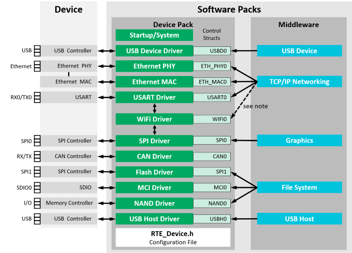
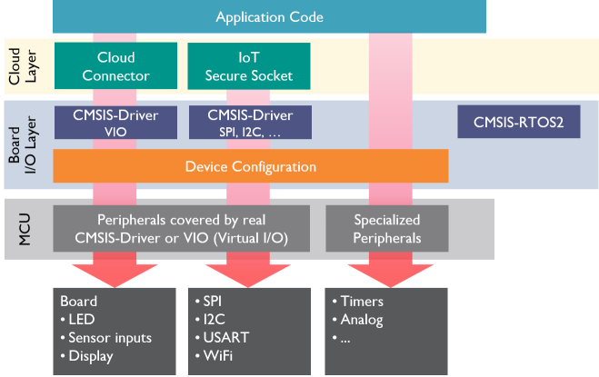
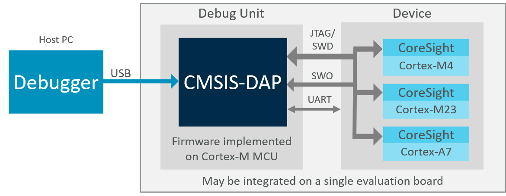
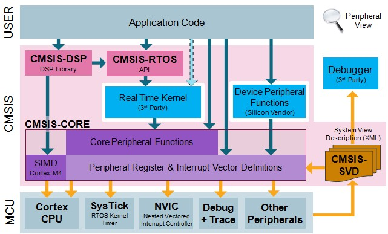

# CMSIS

**CMSIS**是ARM制定的一套**Cortex微控制器软件接口标准**（Cortex Microcontroller Software Interface Standard），ARM和MCU厂商为了统一搭载Cortex-M系列内核的MCU的软件开发API，推出了这样一套标准，于是不同厂商生产的Cortex-M芯片就能在**底层CPU控制API和外设控制API**上达到兼容。

这套标准包括函数命名、芯片初始化流程、启动文件等面向底层硬件寄存器的API规定

说人话就是厂商只要加入了CMSIS联盟，他家的芯片就需要根据这个标准推出整套标准外设库。比如ST家的STM32，它的标准库就是根据CMSIS标准编写的，而HAL库建立在LL库的基础上，LL库也是根据CMSIS标准编写的

> 可以在GitHub上获得CMSIS的最新标准[CMSIS Version 5.8.0](https://github.com/ARM-software/CMSIS_5)
>
> 详细资料也可以在[官网](https://arm-software.github.io/CMSIS_5/General/html/index.html)或者GitHub页面找到

目前，CMSIS标准包括了以下实现：

* CMSIS-Core(M)

  所有Cortex-M内核MCU的外设库标准API

* CMSIS-Core(A)

  部分Cortex-A（A5、A7、A9）的SoC外设库标准API和**系统运行时库**标准API

* CMSIS-Driver

  所有Cortex器件通用驱动中间层，支持文件系统、图形界面等

  

  提供了常见[以太网MAC/PHY驱动程序和Flash驱动程序](https://github.com/arm-software/CMSIS-Driver)

* CMSIS-DSP（Digital Signal Process）

  兼容SIMD的32位DSP协处理器标准API

* CMSIS-NN（Neutral Net）

  能在Cortex-M设备上运行的神经网络库（暂不支持Cortex-A系列）

  

* CMSIS-RTOSv1

  基于RTX实时操作系统的Cortex-M处理器RTOS库

  还提供了一个基于FreeRTOS的[CMSIS-FreeRTOS移植](https://github.com/arm-software/CMSIS-FreeRTOS)

* CMSIS-RTOSv2

  支持Armv8-M指令集、动态对象创建、多核处理器系统、应用二进制接口ABI的CMSIS-RTOSv1升级版

* CMSIS-Pack

  ARM Cortex-M器件和部分A器件的芯片支持包、板级支持包（也就是Keil里面要安装的那些支持包）标准，可以理解成CMSIS标准面向某厂商器件的具体实现

  提供了[面向开源IDE Eclipse的CMSIS-Pack实现](https://github.com/ARM-software/cmsis-pack-eclipse)与[验证工具](https://github.com/ARM-software/CMSIS-Driver_Validation)

  还有一套[基于NXP-PLC微控制器设备的实现](https://github.com/ARM-software/NXP_LPC)

* CMSIS-Build

  开发ARM Cortex-M器件和部分A器件的工具链标准

  

* CMSIS-SVD（System View Description）

  以基于格式化的XML提供了CMSIS标准设备的外设信息和其他设备参数，相当于为IDE、辅助开发工具等提供的芯片datasheet，定义了所有外设寄存器、数据值和说明信息，辅助开发工具可以直接根据CMSIS-SVD生成芯片外设寄存器的头文件定义 

* CMSIS-DAP（Debug Access Port）

  一套针对CMSIS器件的调试器软件和硬件实现

  

  目前应用最广泛的是[DAP-Link](https://github.com/ARMmbed/DAPLink)，提供基于STM32和NXP设备的软硬件实现

* CMSIS-Zone

  包括一套基于硬件分区管理思想的开发流程和一套开发工具的标准，将Cortex-M设备中不同的系统资源根据是否有MPU、MMU等硬件管理器分成不同的区域，并使用专用工具进行管理

  

## CMSIS-Core整体架构

一个不完整的CMSIS家族框架图如下所示

中间的**CMSIS-Core**标准是最关键的，它向下直接控制内核和外设寄存器硬件，向上提供RTOS或裸机应用程序的API

总体上可以分成三个功能层：

* **内核外设访问层**：由ARM提供的Cortex-M/A控制寄存器地址和控制函数
* **中间件访问层**：ARM规定，生产商负责实现的用于中间件（HAL库）进行硬件访问的通用API
* **外设访问层**：生产商自行定义的硬件外设寄存器地址和控制函数

> 举例来讲，STM32F4里面路径`CMSIS\Device\ST\STM32F4xx`下，可以找到Include和Source两个目录，里面就是CMSIS的头文件和启动代码
>
> * stm32f4xx.h和stm32f407xx.h（这是具体的芯片型号）
>
>   stm32f407xx.h根据不同的芯片定义了其中所有外设的寄存器地址和封装好的内存操作，使用哪个型号的stm32就要包含对应的头文件，之后stm32f4xx.h会根据芯片型号*宏*选择对应的头文件
>   
> * system_stm32f4xx.c
>
>   启动文件，在这里进行堆栈初始化、定义中断向量表、定义并export中断服务函数名等。在执行完主要部分后会直接调用SystemInit函数进行系统初始化，并引导进入main函数
>
>   SystemInit函数对系统时钟进行初始化并设置中断向量表偏移量
>
> 于是在移植过程中主要添加Include目录的包含，添加system_stm32f4xx.c、startup_stm32f407xx.c到工程目录，并修改全局宏`STM32F407xx`即可完成对芯片底层和启动流程的配置，无需再手动编写bootloader甚至根据datasheet配置寄存器偏移量

## CMSIS-RTOS整体架构

## CMSIS-NN整体架构
