# IC产业链简介

集成电路制造产业链包含如下几个主要部分：**加工环境**、**单晶硅片制造**、**材料**、**集成电路制造**、**设计**、**封测**。基本拓扑关系如上图所示，下面分模块介绍

# 集成电路加工环境

集成电路的加工环境说来很简单——恒温恒湿没有尘埃杂质的区域，也就是**超净间**

为什么需要超净间？

* 灰尘颗粒：如果沾到光刻掩膜板上，对应电路掩模将会残缺，导致后续工艺中不需要的图形出现；如果污染到离子注入工艺，则会导致设备中的PN结断开
* 温湿度：掩模板受温度影响较大，如果温度变化较大，掩模板上的图形就会变形，导致后续光刻出来的图形也会变形；光刻胶的变形则更加直接，不管是图像缩短了还是变宽了都会对后面的蚀刻、离子注入等造成巨大影响

不过实现一个超净间需要用到很多不同种类的设备，可以说超净间本身就是一个复杂的集成电路制造设备，其具有三个主要特点：

* 密闭无尘
* 结构复杂
* 投入巨大

## 超净间系统

超净间是将特定空间内空气中的微粒、有害空气、细菌等污染物排除，并将室内温湿度、洁净度、室内压力、气流速度与分布、噪音振动、照明、静电等控制在某一要求范围内而特别建设的厂房。不论外部空气条件如何变化，室内总能维持设定的洁净度、温湿度、压力等性能指标。

超净间在医疗、电子、精密仪器等领域均有广泛应用。近年来随着厂房建设成本下降，中低端超净间也正在普及

> 医院的手术室就是一个低成本、要求相对较低（仅仅不让细菌存在）的超净间。而机械硬盘维修、精密仪器维修（甚至包括比较高级的手表维修）也往往是在洁净度等级较低的超净间完成的。很多要求严格的现代食品企业也都在超净间中完成食品流水线制造
>
> 这个东西虽然高端但并不是只有集成电路产业才能用到

### 超净间的标准与测定

超净间的规格由**洁净度等级**描述，一般使用**激光粒子计数器**来测量洁净度

> 仪器利用散射光强度判断空气中粒子的直径：光传播过程中若照射到粒子，在粒子大于入射光波长很多倍时会发生反射；如果粒子小于入射光波长则发送散射，激光粒子计数器中安装有散射光透镜，变换激光波长，再通过检测透镜中接收到的散射光来识别粒子直径
>
> 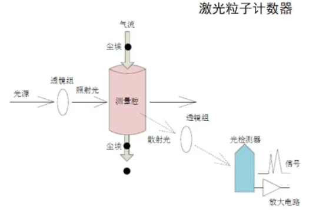

美标超净间标准如下

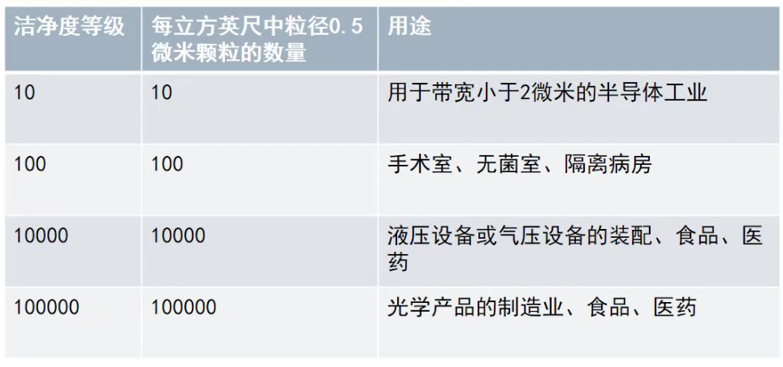

国标超净间标准如下

两种标准的对应该关系：国标的5和国际标准的100相当，此后加的数字序号多少就表示后面0的多少，比如国标7就对应了国际标准100后面加两个0也就是10000

### 超净间的分类

目前实际生产中用到的往往是混合式超净间，局部层流，主体乱流。需要明确一点：超净间的目的是**净化**为不是**维持**——超净间中的人员、机器甚至墙壁地板无时不刻不在产生微小颗粒，维持超净间洁净度是不可能的，因此超净间工作的根本思路就是**快速排除颗粒**——*超净间通过空调系统送入的空气是洁净无颗粒的（使用了高效过滤器），要用这部分空气快速混合甚至替换掉超净间中产生混有颗粒的空气*

* 乱流式

    洁净空气由上方进入，由超净间两侧墙板或高架地板回风，气流非直线运动，呈乱流或涡流状态，适用于千级到十万级的超净间。建设成本低，扩充较容易。自净时间会更长一些

    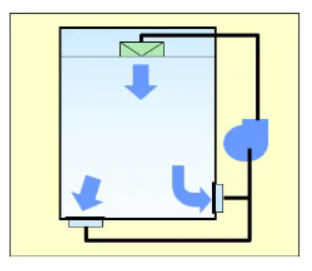

* 层流式

    空气气流运动成直线形，洁净空气进入室内后由两侧墙板或高架地板回风，适应于1到100级的超净间

    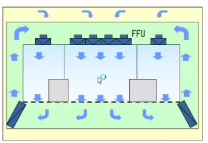

    * 垂直层流

        空气由上向下吹，洁净度较高，灰尘可快速排出室外。管理容易、自净时间短，但构造费用较高，不易扩充，维修更换过滤器较麻烦

    * 水平层流

        空气自侧面墙吹出，由对边墙壁回风系统回风，气流呈水平状态。构造简单、运转稳定且自净时间短。建造费用很高且空间不易扩充

* 混合式

    混合乱流式和层流式构造，平衡二者优缺点
    
    

### 穿戴洁净服的流程

进入超净间一定要穿戴洁净服，下图描述了穿戴洁净服的关键步骤

## 场务系统

要维护一个超净间就需要一系列复杂的**场务系统**，包括中央空调、制冷机组、真空机组、空压机组、化学品供应、气体供应、纯水供应、废水废气处理和其他环保、消防、蒸汽电力能源系统等

### 洁净空调系统

洁净空调系统用于向室内送入经过处理的空气以消除室内各种热湿干扰和灰尘污染，同时从室内排出部分废气

超净间的洁净空调系统与一般的空调具有本质区别：需要**控制输送空气中的粒子浓度**

因此洁净空调系统的控温控湿方法比较特殊：先加入粗过滤的空气，再利用冷冻水降温除湿，使用高效过滤器获得符合超净间洁净度的空气，最后经过纯水加湿得到符合超净间温湿度的空气

### 纯水系统

超净间的纯水系统负责向室内仪器设备提供各种专用水源，包括纯水/超纯水和冷冻水等特殊水

可以提供

* PCW制程冷却水：供给制程机台冷却
* UPW/DIW超纯水：用于补水、清洗、稀释等
* Chill Water冰水（冷冻水）：冷却用冷源、空调用冰水
* RW回收水：超纯水回收/冷凝回收/再生得到的回收水
* CW自来水：一般用水

### 大宗气体系统

大宗气体包括：

* CDA压缩干燥空气：用于搬运、气压缸、冲吹
* General N2一般氮气：用于清洁冲吹
* Pure N2纯化氮气：用于空间填充或超洁净冲吹
* B-GAS大宗气体：用于制程需求/空间填充/超洁净冲吹的气体
* S-GAS特殊气体：用于制程需求/空间填充的特殊气体

一般来说氮气从液氮储备中获取，经过特殊处理后成为*超纯氮气*，在各种仪器中作为保护、冲吹颗粒的主要气体储备。大宗气体则包括各种高纯/超纯气体的制造，目前我国能生产高纯的SiH4、PH3、GeH4、CH4、NH3、N2O、HCl、Cl2等，但是像砷烷、叔丁基锂、三乙基砷、叔丁基磷、六氟乙烯等产品都很难达到高纯水平

### 化学品供应系统

超净间中往往要使用高纯化学品来进行清洗和进行光刻刻蚀等制程。针对场务需求，化学品供应系统主要提供超纯氢氟酸和光刻胶，也会提供一些其他需要用到的大宗化学品

### 真空系统

**真空**即低于一个标准大气压的状态。半导体工业中一般使用**Torr**来描述真空气压

> 1Torr=133.3Pa
>
> 如果容器内的气体压强小于14.7psi（磅每平方英寸），则存在真空。通过抽出密闭容器中的气体分子（空气、水汽和气体杂质）来获得低于大气压的压强。真空最通用的计量单位是**托Torr**。一托等于气压计中1毫米汞柱

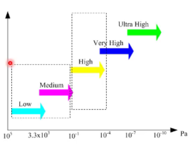

半导体加工中一般用到上图中框选范围的真空，即低真空（接近一个标准大气压）到超高真空（10^(-4)大气压）。在*离子注入*、*薄膜沉积*（尤其是PVD物理气相沉积工艺）、热氧化、*干法刻蚀*工艺中真空度都有着较高要求

超净间中需要使用真空环境：

* PV制程真空：用于吸引搬移晶圆或小型设备
* HV清洁真空：用于尘屑吸引清洁
* Pump Line制程高真空：用于制程转换中的高真空环境

在半导体制造设备中，晶圆一定要处于真空环境来保证最高的良品率

一般使用**真空泵**来获得真空，一般有四种分类：

* **干式机械泵**：生产5次方Pa到0.1Pa的中低真空

    干式真空泵包括螺杆真空泵、无油往复真空泵、无油涡旋真空泵、爪式真空泵等，基本原理都是利用机械进行吸气排气获得真空

* 罗茨泵：产生指数-3的高真空环境

* **涡轮分子泵**：可用于产生-1到-9指数的高真空

    主要由泵体、动叶轮、静叶轮、驱动系统构成，动叶轮和静叶轮交替排列，其尺寸基本相同但叶片倾斜角相反。在叶轮转动过程中，气体分子与高速运动的叶片碰撞而得到加速，这样就能让气体分子与动叶轮相碰撞后改变随机散射的特性而作定向运动，从而让气体分子按一个方向排出

    需要注意：**涡轮分子泵必须在分子流状态下工作，如果开启状态不正确会导致泵损坏**

* **低温泵**：利用低温液化空气来获得-2到-9指数的高真空

    其内表面极低温，可以令空气液化，这样气体就没有啦；同时里面装有的液氦会让凝结物的蒸汽压低于泵的极限压力，这样就能够维持里面的真空，从而起到抽气作用

    低温泵可以获得抽气速率最大、极限压力最低的清洁真空

使用过程中，每种泵都有其自身的测量范围，这是由其达到真空的原理决定的，实际使用中需要先使用低真空泵得到低真空环境再开启高真空泵获取更高的真空环境

而真空度一般使用传感器来测量，最基础的真空传感器是**薄膜式真空传感器**，一般利用薄膜电阻、电容、振动频率等方式运行，外界安装一个高精度电桥来测量阻值或容值变化就可以测出真空度了。还有**皮拉尼真空计**是利用皮拉尼效应来检测气压的真空度（皮拉尼效应：随气压降低，气体散热减少）。**微热电离真空传感器**采用电离真空中的剩余气体来产生电子和粒子，使用一个离子收集电极来得到真空电离电流（真空度越高，剩余气体就越少，得到的电子电流就越小）从而测定真空度。

需要注意：在使用真空计中千万不能开错顺序——薄膜式和皮拉尼式真空计适用于5到-1指数的中低真空，电离式真空计只适用于-1指数以下的高真空环境，如果在低真空环境中开启了电离式真空计抑或是在高真空环境中开启了薄膜式真空计都会损坏设备

### 废水废气处理系统

废水废气系统包括两部分：废水处理和废气处理，这两部分设备将有害气体液体进行无害化处理成满足环保要求的气体液体再排放出厂房

### 自动控制系统

超净间也是厂房，因此也与其他工控领域一样使用到了自控系统，一般来说分为三级：管理层ZK、过程控制层DDC、终端设备控制层TEC。TEC通过电缆或信号线连接到具体的设备和传感器；DDC通过总线网络构建，往往一个工作区有一套DDC集中在被控设备附近；ZK则位于中控机房，包括了主机服务器和操作终端，能够具体管理每个设备

常见的配置为多个DDC等级子系统管理整套超净间设备：包括百级自净系统、万级自净系统、排风系统、FFU群控系统、工艺冷却水系统、温湿度/压力控制系统、冷源自控系统、热源自控系统、大宗气体监视系统等

# 基础材料（化学试剂）

下面首先来介绍半导体工艺中用到的各种基础化学试剂，这些试剂一般有下面几种用途：

* 用**湿法**化学溶液和超纯水**清洗**或准备硅片表面
* 用高能**离子**对硅片进行**掺杂**得到p型或n型硅材料
* **沉积**不同的金属导体层（薄膜）以及导体层之间必要的介质层（薄膜）
* 用**热氧化**法生长薄的二氧化硅层作为MOS器件主要的栅极介质材料
* 用等离子体增强**刻蚀**或湿法试剂有选择地去除材料并在薄膜上形成所需要的图形

### 基本概念

了解化学试剂前，需要先强调一些基本概念，这些概念在后面的工艺介绍中还会用到。

物质的**密度**被定义为它的质量除以它的体积。比重是与密度相关联的概念。**比重**（SG)是指在4℃时的液体和气体的密度，它是物质的密度与水的密度相比的比值

**温度**是比较一个物质相对于另外一个物质是热还是冷的量度标准，因此它也是物质的分子或原子的平均动能或热能的量度标准。不同温度的物体之间传递的能量叫热。存在三种温标：华氏温标（℉）、摄氏温标（℃）和绝对温标或开氏温标（K）。在科学研究中最常用的温标是摄氏温标

华氏度和摄氏度之间的转换公式为：
$$
T_F=\frac95 T_C +32
$$
开氏温度和摄氏温度之间的转换公式为：
$$
T_K=T_C +273
$$
气体变成液体的过程被称做**冷凝**，当水蒸气温度降低时，出现了由微粒组成的薄雾，形成微小的液滴，然后聚集成有单独表面的颗粒。从液体变成气体的相反过程叫**汽化**。固体通过**升华**过程能够直接变成气体。与升华相反的过程叫**凝华**，就是气体变固体的过程

液体和气体与材料相互作用的途径多种多样。**吸收**是气体或液体进入其他材料的主要方式。**吸附**是气体或液体被束缚在固体表面，被吸附的分子通过化学束缚或者物理吸引这样的弱束缚粘在物体表面

**蒸气压**是在密闭容器中气体分子施加的压力，这时汽化和冷凝的速率处于动态平衡

当一滴液体在一个平面上，液滴存在着一个**接触表面积**。液滴的**表面张力**是增加接触表面积所需的能量。表面张力的概念用在半导体制造中来衡量液体均匀涂在硅圆片表面的黏附能力

当一个物体被加热时，由于原子的振动加剧，它的体积就会发生膨胀。随着物体的**热膨胀**，它的尺寸也相应的变大。相反当物体被冷却时，它的尺寸会变小。衡量材料热膨胀大小的参数是**热膨胀系数**（或**CTE**）。非晶材料的热
膨胀是**各向同性**；而所有的晶体材料，比如单晶硅，热膨胀是**各向异性**的

当一个物体受到外力的作用时，就会产生**应力**。应力的大小取决于两个因素：*外力的大小*和*外力作用的面积*。在硅圆片中有多种原因可以导致应力的产生，包括：硅表面的物理损伤；位错、多余的空隙和杂质产生的内力；外界材料生长等

如果两个膨胀系数相差很大的物体结合在一起，然后加热，由于两种材料以不同速率膨胀导致它们彼此推拉，因而产生应力。由于CTE不匹配产生的应力会使硅片弯曲。沉积的薄膜通常会产生两种应力：**拉伸应力**和**压缩应力**

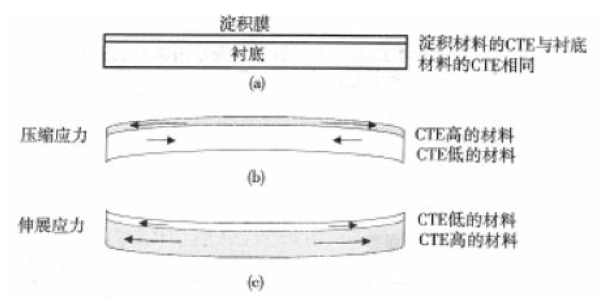

### 半导体工艺中的常用化学品

为了制造半导体，需要大量的高质量、**超纯去离子（DI）水**（有时称UPW）。去离子水是半导体制造中用得最多的化学品，主要用在硅片的化学清洗溶液和后清洗中

1. 酸

    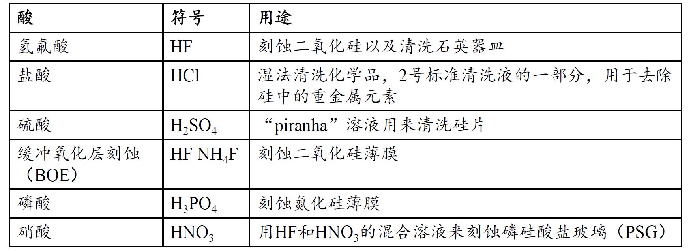

2. 碱

    

3. 有机溶剂

    

4. 大宗气体

    

### 光刻中的危险化学品

光刻中需要使用到很多危险化学品，主要有以下几种：

* 前处理：HMDS，易燃易爆
* 湿法清洗：硫酸、双氧水
* 负胶溶剂和显影液：二甲苯，易燃易爆
* 正胶显影溶剂：TMAH，有毒有腐蚀性
* 光源：汞蒸气，剧毒；氯气，腐蚀性；氟，剧毒，强腐蚀性

# 单晶硅片制造

单晶硅片是半导体制造中的重要原料，其制造工艺一般由上游vendor厂保有。从沙子里提取硅很容易，但从很多杂质的硅中提取高纯硅却不是一件简单的事

# 集成电路设计

集成电路设计产业更贴近计算机，有着工具链、前后端的区分。具体来讲，集成电路设计分为**EDA**工具、**前端**、**后端**三大部分。整个设计流程都依赖于EDA电子设计自动化软件，EDA工具是整个集成电路设计的核心；前端主要负责芯片的功能规划、逻辑仿真，使用HDL硬件描述语言从抽象的功能实现大规模的晶体管；后端则负责版图规划和仿真，根据前端给出的电路进行布局布线，并使用Foundry给出的**PDK**制程设计工具包制作**光罩**供后续Foundry使用

# 集成电路制造

**集成电路**：将电阻、电容、晶体管等元件制作在一个芯片上，并具有一定功能的电路。

**特征尺寸**：芯片上的最小物理尺寸，是集成电路工艺水平的标志，包括**最小线宽**和**物理栅长**。最小线宽是光刻和刻蚀能达到的最小图形线宽；物理栅长是器件栅极所决定的沟道几何长度。一般在CMOS技术中特征尺寸指多晶硅栅的线宽；而在双极技术中，特征尺寸通常指接触孔的尺寸

**摩尔定律**：集成电路上可容纳的晶体管数目，约每隔18个月便会增加一倍，性能提升一倍，价格下降一半。

**登纳德缩放定律**：晶体管在满足内电场恒定（即每代芯片的供电电压降低30%）条件下，晶体管尺寸每代（约两年）减少30%。

由于以上两个定律，*建立一个芯片厂的成本每一年半会翻倍*，这就造成了“芯片滚雪球效益”——芯片性能不断提高，可靠性不断提高，制造成本不断降低，但投资总成本逐年升高，造成赢家通吃的局面

**ITRS**（International Technology Roadmap for Semiconductors）是集成电路制造领域的领航灯塔，由**ITWGs**（International Technology Working Groups）组成的**IRC**（International Roadmap Committee）编写制定

IC制造中用到的基本工艺包括以下几种：

* **衬底制备**：一般使用高纯单晶硅片作为衬底，**单晶硅棒**一般由上游vendor提供。经过切削得到的硅片要经过倒角、研磨、腐蚀、抛光、清洗等步骤，得到原始硅片（bare **wafer**）

* **绝缘层氧化**：一般使用二氧化硅作为绝缘层材料，因此硅片首先要进入**氧化炉**，在其表面生长一层具有良好化学稳定性和绝缘性的二氧化硅，这层SiO2可以作为MOSFET的栅极氧化层、器件保护层、电容器介质膜的基底。

* **光刻**：上游设计厂商提供的光罩文件会被制作成对应层的**掩模版**，掩模版上涂有**光刻胶**，之后要使用**光刻机**进行曝光和显影，让光敏的光刻胶在衬底上形成三维浮雕图形

    光刻完毕后晶圆表面会覆盖一层光刻胶，在下面的工艺中会起到掩蔽下方半导体的作用，工艺最后还需要将光刻胶洗去

    

* **刻蚀**：在光刻胶的掩蔽下，根据需要形成微图形的膜层不同，会采用不同种类的*刻蚀剂*和对应的刻蚀方法在膜层上进行刻蚀，也就是剥离掉没有没光刻胶掩蔽的当前层物质。这一步是为了让光刻胶的图形以实体化的材料形式转移到膜层上

    

* **薄膜沉积**：在光刻胶的掩蔽下，以物理或化学的方式（PVD、CVD）在晶圆表面制造一层由特定材料构成的薄膜。

    

* **扩散**或**离子注入**：将需要的杂质以一定方式（扩散法或离子注入法）加入晶圆上某一层，从而将表面的本征半导体改为掺杂半导体，改变其电学特征。

    **光刻-蚀刻-薄膜沉积-掺杂-去胶工艺综合使用，就可以在硅片表面制造需要的半导体器件了**

    

* **金属化**：采用化学或物理方法在芯片上沉积一层导电金属薄膜，再配合光刻和蚀刻即可形成布线。

    

* 裸die**测试**：硅片上每个芯片都要进行测试，挑选出有缺陷的芯片剔除出去。

* **封装**：芯片需要按照功能不同进行对应封装，裸die在这一步工艺中被bonding——用金线连接芯片上引出的绑定点和封装外的金属引脚，并使用聚合树脂材料进行封装

* 封装**测试**：完成封装后芯片会再进行依次测试以确保功能正常

工艺流程也可以分为前后端，*最后三个测试-封装-测试过程一般被归类为后端，而前面的工艺流程一般会组合使用来制造一枚完整的芯片，被归类为前端*。

下面来分工艺进行介绍

## 光刻

光刻就是通过光学手段在晶圆上印制layout的过程，占据了芯片制造中40%-50%的工艺流程，因此Foundry加工时都会按照光刻步骤来收取工艺手续费。

光刻中的关键参数如下：

**关键尺寸**：光刻中的关键尺寸常用做描述器件工艺技术的节点或称为某一代。0.25μm以下的工艺技术的节点是0.18μm、0.15μm、0.1μm。减小关键尺寸可在单个硅片上布局更多芯片，这样将大大降低制造成本，提高利润。

**分辨率**：将硅片上两个邻近的特征图形区分开来的能力

硅片上形成的图形的实际尺寸就是特征尺寸，最小的特征尺寸就是关键尺寸。对于关键尺寸来说，分辨率很重要

**套准精度**：光刻要求硅片表面上存在的图案与掩膜版上的图形准确对准，这种特性指标就是套准精度

**套准容差**：多次用到掩膜版时，任何套准误差都会影响硅片表面上不同图案间总的布局宽容度，这种情况就是套准容差

**工艺宽容度**：光刻始终如一地处理符合特定要求产品的能力

### 光刻工艺精度

光刻技术的精度（**分辨率**）到目前为止已经从早期的um级光刻演变到5nm等级，这都是围绕**Rayleigh公式**进行的
$$
Resolution=k_1 \frac{\lambda}{NA}
$$
其中λ表示照射光波长，NA表示透镜的数值孔径（Numerical Aperture），k1表示系数
$$
NA=n \times sin(\alpha)
$$
其中n表示介质折射率，α表示焦点和透镜边缘连线与主光轴的夹角，如下图所示

α反映了透镜的大小。**因此透镜越大，介质折射率越高，NA就越大**

光刻技术提高分辨率的手段有以下三种：

* **减小波长λ**

    从前期的193nmDUV发展到13nm**EUV**光刻，采用的光波长一路推进到极紫外光等级

* **提高NA**

    一般使用水为介质实现**浸没式光刻**，从而获得最大的透镜和较高的介质折射率

* **提高k1**

    使用**double patterning**、**光学修正**等手段

### 光刻工艺流程

光刻工艺具体来讲包含以下复杂的物理、化学过程：

* **HMDS表面处理**

    HMDS即六甲基二硅胺。使用其在200℃下作用60s，可以让Si表面的Si-OH键变成Si-O-Si(CH3)3键，有机聚合物与甲基的附着性更好，因此可以让光刻胶更容易附着在硅片上

* **涂胶**

    光刻胶是液态的，这一步就是要将胶滴在晶圆表面，下方转台缓慢加速5s后持续匀速转动，利用离心作用让光刻胶在晶圆表面均匀分布

* **去边**

    在涂胶后，光刻胶会在硅片边缘形成较厚的边，会影响光刻图形的精度，而且在传送硅片时容易污染设备，因此在这一步要先将边缘的光刻胶去除掉

    光刻胶厚度计算公式如下：
    $$
    T=KS^\alpha (\frac{\eta^\beta}{\omega^\gamma R^2})^{-\frac{1}{3}}
    $$
    其中T：光刻胶厚度；S：固体溶质百分比；η：粘度；ω：旋转角速度；R：硅片半径；S和η会随着溶剂蒸发而改变，粘度越大，产生光刻胶厚度就越厚

* **前烘**

    涂胶后，硅片表面容易产生涂胶不均匀的情况，主要情况有以下几种

    

    因此要引入前烘干，这步可以实现以下功能：

    * 去除80%到90%溶剂
    * 释放光刻胶表面应力
    * 提高光刻胶粘附性

    但是这步的作用时间很关键，如果过度烘干，会降低光刻胶敏感性，后面的曝光步骤会受到影响；如果烘干不足，显影时的分辨率也会出现降低

* **曝光**

    这是光刻机的核心操作。根据曝光模式不同，光刻机可以被分为：**接触式**、**接近式**、**投影式**、**直接写入式**；光刻机使用的光源及其对应光波长也有区分：g-line（436nm）、i-line（365nm）、KrF（248nm）、ArF（193nm）、F2（157nm）。在这一步要根据光刻胶敏感度确定曝光剂量在何时区间，否则会影响图形

    实验室中一般采用简单的接触式和接近式光刻，而在工业生产中则采用投影式光刻

    使用到光刻胶分两种：**正胶**和**负胶**，**正胶经过光刻后会被破坏掉曝光部分的化学键，留下被光刻板掩盖住的部分，起到“正刻”作用；负胶则在经过光刻后让对应位置原子成键，也就是留下曝光部分，被光刻板掩盖的部分会被破坏掉**。需要注意：在曝光这一步完成后光刻胶只是产生光化学反应让对应位置的化学键破坏或交叉生成中间物，需要等到后面显影步骤洗去与显影液互溶的部分才能让光刻图像保留下来

    

* **显影**

    这一步一般使用**TMAH**溶剂在20℃下作用1min，完成光刻胶中化学成分的转换。正胶曝光后会产生酸性物质，使用碱性显影液显影后就可以将曝过光的部分光刻胶图形腐蚀掉；负胶曝光后会生成碱性的掩膜层，这样就保护曝光过的部分不被腐蚀。除了腐蚀以外光刻胶还可能基于溶解度原理实现显影，但总的来说都是让被掩蔽没有接受的曝光的部分或接受过曝光的部分被洗去。显影步骤中可能出现的严重问题是*显影不足造成光刻胶的不规则残留*

* **坚膜（后烘）**

    完成显影后的晶圆还需要在120℃热环境中进行10min左右的后烘干，这一步是为了提高阻挡层的强度和粘附性，并防止其发生膨胀。

* **检测**

    最后一步就是对光刻完成的晶圆进行检查，如果出现不合格的产品要及时标记并在之后的步骤中清除出去。这一步被称为*显影后检测*（ADI，After Development Inspection），将一个无缺陷的标准图形与每个芯片的图形比较，出现不同点就在硅片defect map中显示（顺带提一下，这个算法一般使用模板匹配），从而及时将硅片表面缺陷检测出来

### 光刻胶

光刻胶是一种成分复杂的化学试剂，其中主要含有**聚合物**、**溶剂**、**感光剂**和**染色添加剂**。聚合物是胶膜的肢体材料，一般是固体有机材料，具有光敏特性，能够在UV曝光后发生光化学反应改变其溶解性，从溶剂中析出转移到硅片上，从而让图形能够转移到硅片。溶剂起到溶解聚合物的作用，能够让光刻胶维持粘稠液态，经过旋转后得到薄光刻胶膜。感光剂负责控制光化学反应，还可以辅助决定曝光的时间和强度。还会为了达到不同工艺效果而额外加入不同添加剂s

**主流使用的光刻胶为正胶**

光刻胶一般具有如下工艺要求：

* **高分辨率**：光刻胶在硅片上形成的胶膜必须薄，以此来提高分辨率，
* **高抗刻蚀性**：光刻胶薄可以提高分辨率，但是相对应抗刻蚀和离子注入的能力会降低，因此需要尽可能提高光刻胶单位厚度下的抗刻蚀性，防止后续工序中因为光刻胶抗刻蚀能力低导致刻蚀出现问题
* **高粘附性**：光刻胶必须能够良好附着在硅片表面
* **注入屏蔽能力强、针孔少**：光刻胶需要尽可能提高屏蔽离子注入的能力，这就要让光刻胶变厚，因此需要找到一个合适的区间，既能让光刻胶有高分辨率又不会因为过薄而降低其屏蔽性能
* **宽工艺窗口**：一种好光刻胶需要能适应工艺的变更

光刻胶的常见材料包括以下几种：

* **二元正性光刻胶**

    由敏化剂和酚醛树脂胶共同构成，使用其他有机溶剂溶解成胶

    **敏化剂**是一种由辐射而形成的酸，对氨气（氨水）敏感，本身不溶于碱溶液，但在暴露于光辐射后发生变性，就可以溶解在对应显影剂中。酚醛树脂在其中的占比在80%以上，不与光发生反应，呈酸性，可以缓慢溶解在碱性溶液中，其具体结构和组成会影响粘度和胶在显影剂中的溶解度

    敏化剂是光刻胶中起到光转化作用的主要材料

* **一元正性光刻胶**

    可以使用**聚甲基丙烯酸甲酯PMMA**制造，分子量比较大（200-1000k），因此分辨率较高但灵敏度低。在受到光辐射后会发生聚合物断链，形成大量低分子量的聚合物，因此显影过程中直接选择性洗去低分子量聚合物即可达到要求

* **二元负性光刻胶**

    同样由敏化剂和酚醛树脂构成，但敏化剂会在光照后发生变性，促进酚醛树脂发生聚合反应生成更长的链和更大的分子量，在后续显影中留存下来

* **一元负性光刻胶**

    使用PMMA制造，但这里使用的PMMA会在光照后发生化学链交叉，形成大分子链，不易被洗去，造成了负性光刻胶效果

光刻胶的轮廓在理想情况下是上下垂直的，如下图所示：

但实际上光刻胶轮廓壁有一定倾角，呈梯形（没有图示那么平缓），*这与光刻胶的对比度（分辨率）和曝光轮廓有关*。由于光子的**驻波效应**，在倾角比较大的轮廓壁内还可能会发生散射问题，这在有很多阶梯（平行布置的线形图像光刻的情况）的图形中尤为突出：

一排阶梯的侧面会将入射光一部分反射到光刻胶内部，反射光和入射光叠加出现驻波，就会令有些区域的光刻胶收到强照射，有些区域的胶只受到弱照射，*在胶层侧壁形成凹凸的花纹*（会引起分辨率降低)，在曝光以后就会让光刻胶层侧面变成下图这样，之后不论是离子注入、刻蚀还是薄膜沉积都会收到影响

> 驻波效应的缓解方法有以下三种：
>
> * 涂反射层，减少光散射，帮助光刻胶成像。这种方法可以降低散射光同时平整晶圆表面结构；但对工艺要求提高，并且膜厚和后期显影会受到影响
>
>     抗反射涂层（ARC，Anti-Reflective Coating）按照涂敷位置可分为顶部和底部ARC（BARC和TARC）。BARC涂敷在光刻胶底部，减少反射光，一般使用有机物在硅片表面旋涂（利用有机物直接吸收入射光）或无机物在硅片表面PECVD（使用TiN或SiN在硅片表面进行等离子增强化学气相沉积，通过特定波长光相位相消）得到。TARC涂敷在光刻胶顶部，不会吸收光，而是通过特定波长光相位相消来消除反射
>
> * 将光刻胶层侧壁变得垂直。这种方法相对于上种可以更好解决驻波问题，同时只需要改变光刻胶主体材料，各大厂商所使用的解决思路大都是这种

要获得垂直的光刻胶侧壁，可以考虑下面几种方式：

* **大对比度**
* 小吸收
* 小光散射
* **高注入剂量**
* 缩短曝光时间
* 使用薄光刻胶层
* 缩短显影时间

前三个解决思路是从光刻胶角度出发，总体思想就是提高光刻胶性能。

**化学放大光刻胶**和**多层光刻胶**是两种比较常用的提高光刻胶性能的方法。化学放大光刻胶即CA光刻胶，使用催化反应让光刻胶中的敏化剂敏感性增强，并通过PAG（Photoacid Generator光致产酸剂）的分解来产生强酸，在热作用下扩散并将光刻胶主体材料中对酸敏感的部分分解成可溶于*碱性溶液*的小分子基团。这样，显影过程中由于小分子基团和未发生变化部分材料的溶解度差异来让主体材料溶解达到光刻作用。这个方法可以让光刻胶获得高分辨率，但对空气中污染物也更敏感，而且抗刻蚀性能会大幅下降。另一种方法是多层光刻胶（Bi-layer双层胶或Tri-layer三层胶）：利用多层光刻胶累加赋予整体光刻胶层更高分辨率和更强的抗刻蚀性能，但这会复杂化工艺

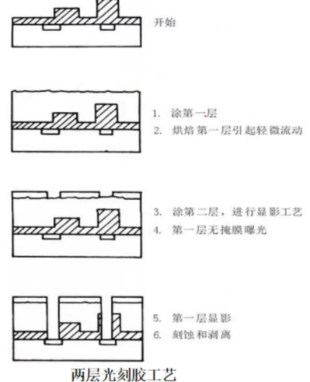

后四种解决思路则从光刻机出发，从工艺和装置角度改善。

高注入剂量能够让胶层侧壁垂直，但会导致下图所示的图形尺寸变小，计量不足会导致图形无法形成

缩短曝光和显影时间也存在着可能无法形成图像的副作用，需要根据晶圆具体情况而定

### 光刻板

光刻板（Mask或称为Reticle）工艺相对简单，以石英为衬底，覆盖金属铬防止透光

### 光刻机性能指标

1. 分辨率

    光刻机的分辨率参数分为**pitch分辨率**和**feature分辨率**两类。其中pitch分辨率指光刻工艺可以制作最小周期的一半，决定了芯片上晶体管之间的距离，直接影响到芯片的**成本**；feature分辨率是指光刻工艺可以制作的最小特征图形的尺寸（Critical Feature，CD，关键尺寸），决定了芯片上每个晶体管的大小，与芯片**运行速度和功耗**有直接关系

    对于占空比为1：1的周期性结构，两类分辨率相同

    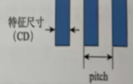

2. 套刻精度

    一个晶圆往往需要经过几十上百次曝光才能将不同掩膜层逐层转移到硅片上，每层图形都需要精确转移到硅片上的正确位置，使其相对于上层图形的位置误差在容限范围内。**套刻精度就用于描述硅片上新一层图形相对上一层图形位置的误差大小**

    **套刻精度与CD密切相关**，CD越小要求的套刻精度就越高，一般而言*套刻精度要小于CD的30%*

    

    与套刻精度相关，在如果以相同曝光剂量对不同厚度的光刻胶曝光，就会引起CD误差，这被称为**摆线效益**。

### 在光刻中常出现的问题

* 驻波效应（Standing Wave Effect）

* 摆线效应（Swing Curve Effect）

* **脚状图形**（Footing Profiles）

    在光刻胶底部出现曝光不足，显影后就会有明显光刻胶残留

    解决方案包括：避免光刻胶暴露在碱性环境中导致老化；清理硅片表面，防止基底上有碱性物质残留，再涂胶

* **T形图形**（T-Top Profiles）

    由于光刻胶表面感光剂不足而造成表层光刻胶图形尺寸变化

    主要解决方案就是要防止光刻中的碱性气体污染

### 浸没式光刻技术

最开始提到过浸没式光刻可以提高折射率NA。浸没式光刻基本原理就是在光学镜头和硅片之间充满水，从而提高折射率，但相对引入了表面缺陷（水渍残留、光刻胶与水反应、水中的颗粒），加大了对准难度（水中气泡）

水的折射率为1.33，透镜的折射率在1.5到1.8，空气折射率为1.0，而NA最大值受限于光路通过介质中n的最小值，如果将空气换成水可以大大提高NA

### 分辨率增强技术

分辨率增强技术（RET，Resolution Enhanced Technology）旨在修改光刻机结构和工艺而不是光刻胶来提高光刻的分辨率。包括以下几类：

**偏轴曝光**（OAI，Off Axis Illumination）：改变光源入射光方向使之与掩模版保持一定角度，捕获高阶衍射光，改善光强分布均匀性，从而增加分辨率；但会削弱光强

**相移掩模版**（PSM，Phase Shift Mask）：在掩模版上周期性在相邻图形中每隔一个图形特征对掩模版结构进行改变（加厚或减薄掩模版），使相邻图形的相位差相差180度，可以起到提高k1的作用，从而提升分辨率，但这会增加掩模版的制作难度（需要精确控制每个加厚和减薄台阶的高度）和成本（约增加10倍之高）

**光学近似修正**（OPC，Optical Proximity Correction）：在曝光过程中往往会因为光学邻近效应使最后图形质量下降，可以使用*智能型掩模版工程*来补偿这种尺寸变化——说人话就是在光刻板设计阶段就利用算法计算出最适合某处图形宽度的特征尺寸，从而修正可能的失真。具体措施包括但不限于*图形补偿（随图形密度而动态改变特征尺寸）*、*光刻板修正（将容易出现问题的图形拐角变圆）*等等

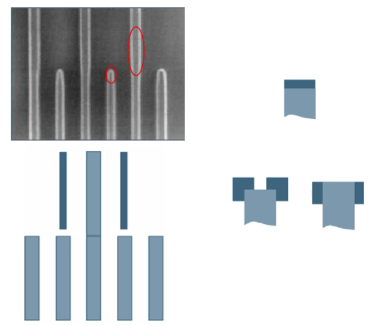

上图展示出图形补偿工艺；下图展示光刻板修正工艺

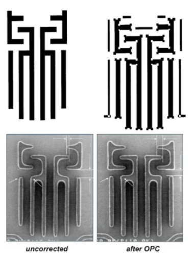

**二次光刻**（Double Patterning）：每次光刻板上的一部分，通过两次光刻的组合来提高整体分辨率。这会降低加工效率、提高成本

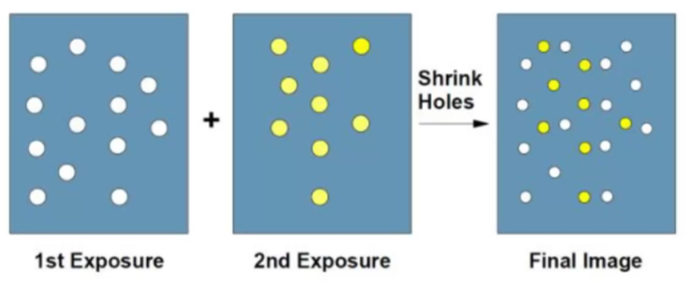

## 清洗

一个硅片表面具有多个微芯片，每个芯片有数以万计的器件和互连线路，它们对沾污都非常敏感。硅器件的性能、稳定性和电路成品率受到硅片表面或器件表面的**化学沾污**、**微粒沾污**影响极大，随着芯片的特征尺寸为适应更高性能和更高集成度的要求而缩小，控制表面沾污的需要变得越来越关键，对原始硅片和氧化后图形化后的硅片进行清洗更加重要。为了实现沾污控制，所有的硅片制备都要在沾污严格控制的**净化间**完成

> **沾污**是指半导体制造过程中引入半导体硅片的任何危害微芯片成品率及电学性能的不希望有的物质。沾污经常导致有缺陷的芯片。**致命缺陷**是导致硅片上的芯片无法通过电学测试的原因
>
> 任何本质上是有机或无机的外来物质在制造过程中接触到半导体表面，都有可能成为硅器件或精密装置中的致命缺陷。沾污中的粒子和金属分别可以用**颗粒密度**和**微量金属浓度**来描述，但除此之外还会存在**无法检测的致命缺陷**，随着清洗技术不断提高，对这类沾污将会进一步了解，但目前业界无法处理这种沾污

### 沾污

硅片沾污主要有四种来源。**设备**：包括各种机械、气体管道、镊子乃至离子注入设备和液体容器都会造成沾污；**人体**：来自操作者的沾污；**材料**：各种化学药品液体和气体的沾污，以及每个工艺步骤之间的化学处理残留物都会造成沾污；**过程**：以上各部分污染源处理中造成沾污

沾污包括五大类：

* **颗粒**：颗粒是能粘附在硅片表面的小物体。悬浮在空气中传播的颗粒被称为**浮质**。在硅片的制造过程中，颗粒往往引起表面导电抑或是跨接在导线间引起开路或短路。可以接受的颗粒尺寸的粗略法则是它**必须小于最小器件特征尺寸的一半**。更高的颗粒密度产生致命缺陷的机会也会更大
* **金属杂质**：金属来自于化学溶液或者半导体制造中的各种工序，离子注入工艺有着最高的金属沾污生成率（在10的12次方到13次方原子/平方厘米级数之间），化学品同传输管道和容器的反应也会引来金属离子沾污。以原子或离子形式存在的金属杂质，在高温或电场作用下会很容易地扩散进入半导体内部，因此会在晶圆表面、层级内部和界面发生扩散，在器件中引起**晶格缺陷、电缺陷、性能退化，降低成品率**，还会**降低氧化膜击穿电压**。原子电势顺序中，硅排在氢前，*重金属*（轻金属的影响远不如重金属影响大）更容易通过化学电流的运动扩散到硅片衬底，引起**过量漏电流，导致性能退化和稳定性问题**。碱金属则以工艺引入含量高而对晶圆造成巨大隐患
* **有机物沾污**：有机物沾污是指那些包含碳的物质，几乎总是同碳自身及氢结合在一起，有时也和其他元素结合在一起。在特定的工艺条件下，微量有机物沾污能**降低栅氧化层材料的致密性**——比较大的有机分子基团附着在晶圆表面，会阻碍和掩蔽加工过程、削弱粘连效果、在薄膜中造成核缺陷，甚至会形成有害（不管是对于操作人员还是对于工艺过程）的分解物。
* **自然氧化层**：如果曝露在室温下的空气或含溶解氧的去离子水中，硅片的表面将被氧化，这一薄氧化层称为自然氧化层。天然氧化层的厚度随曝露时间的增长而增加，会妨碍其他工艺步骤，如硅片上单晶薄膜的生长和超薄栅氧化层的生长。自然氧化层也包含了某些金属杂质，它们可以向硅片中转移并形成电学缺陷。自然氧化层引起的另一个问题在于金属导体的接触区。接触使得互连线与半导体器件的源区及漏区保持电学连接。如果有自然氧化层存在，**将增加接触电阻，减少甚至可能阻止电流流过**
* **静电释放**：静电释放（ESD）也是一种形式的沾污，它是静电荷从一个物体向另一个物体未经控制地转移，可能损坏微芯片。尽管ESD发生时转移的静电总量通常很小，然而放电的能量积累在硅片上很小的一个区域内。发生在几个纳秒内的**静电释放能产生超过1A的峰值电流，甚至可以蒸发金属导线和穿透氧化层**。放电也可能成为**栅氧化层击穿**的诱因。ESD带来的另一个重大问题在于，一旦硅片表面有了电荷积累，它产生的电场就能**吸引带电颗粒或极化并吸引中性颗粒到硅片表面**。颗粒越小，静电对它的吸引作用就越明显。随着器件关键尺寸的缩小，ESD对更小颗粒的吸引变得重要起来，能产生致命缺陷

清洗这个工艺听上去很简单，目的就是**在不损伤晶圆表面或退化性改变的条件下去除晶圆表面的微粒或化学沾污**，但实际上相当复杂，需要一整套物理、化学工艺流程才能实现，常见的工艺分为：物理**干法清洗**、化学**湿法清洗**、**气相清洗**、特殊清洗（专门针对锗材料或化合物半导体材料加工）

下面主要针对硅晶圆介绍清洗工艺

### 沾污的形成和避免沾污

沾污通常由于三种作用而形成：**表面效应**，也就是束缚沾污的力；**化学吸附**，即化学键作用；**物理吸附**，通常是指范德瓦尔斯力或分子间作用力。单纯用物理方法很难去掉沾污，因为微观尺度上这三种力是非常强大的，因此需要借助化学清洗甚至直接去掉硅片表面的一个薄层才能实现去除

**颗粒沾污**会通过各种硅片与浮质接触和搬运转移过程中与设备的接触来形成。颗粒沾污会降低清洗或冲洗效果，并且会对良好粘连的沉积膜造成损伤，还可能在后续工艺中形成有害分解物对于半导体制造，目标是控制并减少硅片与颗粒的接触。

**金属沾污**可以通过两种途径沉积在硅片表面上。第一种途径，金属通过金属离子与位于硅片表面的氢原子的电荷交换而被束缚在硅片表面上。这些类型的金属难以消除。第二种途径，是当表面氧化时金属杂质分布在氧化层内。在氧化层中的金属杂质只有通过去除硅片表面的氧化层来去除

金属离子在半导体材料中是高度活动性的，被称为**可动离子沾污**（**MIC**）。当MIC引入到硅片中时，在整个硅片中移动，严重损害器件电学性能和长期可靠性。未经处理过的化学品中的钠是典型的、最为普遍的MIC之一，人体中含有高浓度的钠。钠沾污在硅片加工中需要被严格控制

金属杂质导致了半导体制造中器件成品率的减少，包括氧化物-多晶硅栅结构中的结构性缺陷。额外的问题包括PN结上泄漏电流的增加以及少数载流子寿命的减少。MIC沾污能迁移到栅结构中的氧化硅界面，改变开启晶体管所需的阈值电压。由于它们的性质活泼，金属离子可以在电学测试和运输很久以后沿着器件移动，引起器件在试用期间失效。半导体制造的一个主要目标是减少与金属杂质和MIC的接触

**有机物沾污**的一些来源包括细菌、润滑剂、蒸气、清洁剂、溶剂和潮气等，因为有机物沾污一般都比较大，因此通过一般的清洗步骤可以将其去除

**天然氧化层**源于潮湿。当硅片表面曝露在空气中时，一秒钟内就有几十层水分子吸附在硅片上并渗透到硅表面，这引起硅表面在室温下就发生氧化。自然氧化层引起的另一个问题在于金属导体的接触区。接触使得互连线与半导体器件的源区及漏区保持电学连接。如果有自然氧化层存在，将增加接触电阻，减少甚至可能阻止电流流过

硅的自然氧化层需要通过使用**含HF酸的混合液的清洗步骤**去除。抑制自然氧化层的另一个方法是把多步工序集成在一个**包含了高真空室的多腔体设备**中，这样硅片就不会曝露于大气和潮湿的环境中

**ESD**产生于两种不同静电势的材料接触或摩擦。这种由吸引产生的电流泄放电压甚至可以高达几万伏。半导体制造中特别容易产生静电释放，因为硅片加工保持在较低的湿度中，典型条件为40%±10%相对湿度（RH）。这种条件容易使较高级别的静电荷生成。虽然增加相对湿度可以减少静电生成，但是也会增加其他沾污，因而这种方法并不实用

总体上讲如何**避免沾污**呢？一个是要**提高环境的洁净度**，另一个就是要**严格控制加工过程**。晶圆加工中的所有化学试剂都要使用超纯、低微粒的原料、有机溶剂、去离子水。在半导体厂商中，往往会使用**SIMS**次级离子质谱法、**TXRF**全反射荧光分析法等通过衍射、振动和成像的高精度方法探测晶圆表面，工序之间都会进行检查以及时找到沾污。在加工过程中，也往往使用高度真空的环境和尽可能小振动的器件来尽量避免沾污

相对于避免沾污，**清洗工艺**就复杂很多——但往往沾污难以避免，因此清洗工艺就更加关键。半导体工业早期，一般使用力学和化学方法清洗，但效果不佳，直到1970年Kern首次发表了**RCA清洗技术**，晶圆清洗才有了现实意义的可行性，到目前为止，清洗工艺在传统的湿法化学工艺基础上通过引入H2O2的方法控制清洗浓度并降低表面刻蚀速率达成了令人满意的效果。而利用物理方法的**干法清洗**依托刻蚀技术发展引入了产线，现在已经成为**高端芯片制造中主流**的清洗方法，**逐步取代了传统的湿法清洗**，湿法清洗因成本低廉还在低端芯片制造过程中大量采用

### 硅片沾污的测量

在硅片的制造过程中，颗粒能引起电路开路或短路。它们能在相邻导体间引起短路。**半导体制造中，可以接受的颗粒尺寸的粗略法则是它必须小于最小器件特征尺寸的一半**。更高的颗粒密度产生致命缺陷的机会也会更大

**颗粒数PWP**：*一道*工序引入到*硅片中*超过某一关键尺寸的颗粒数

在半导体制备的早期，通过**显微镜等**的简单工具直观的检查硅片表面的颗粒。自从20世纪80年代中期以来，颗粒检测已经采用**激光束扫描**硅片表面和**检测颗粒散射的光强及位置**来进行。在当前生产中应用的颗粒检测装置**能检测到的最小颗粒直径约为0.1微米**

硅片清洗的目标是去除所有表面沾污：颗粒、有机物、金属和自然氧化层。每一工艺步骤都是硅片上器件潜在的沾污源

### 湿法清洗

湿法清洗就是利用**水溶液**进行清洗，有以下优点：

* 易于使用，成本低廉
* 通过冲洗去离子水并使用合适的干燥方法来避免干燥后留下残留物
* 不易燃或易燃危险低
* 易于处理废弃物，环境污染小
* 去污效果好
* 水溶液比有机溶剂蒸汽压低，清洗方便
* 通过挑选溶质来进行选择性清洗

有以下缺点：

* 水溶液蒸汽压低导致干燥时不如有机溶剂快
* 由于需要干燥所以存在二次污染的风险
* 去除有机沾污时不如有机溶剂效果好
* 吸入某些化学品的水溶液或蒸汽具有危险性
* 某些化学品废液处理困难
* 水溶液与真空系统连接存在困难

考虑沾污形成过程中的吸附力，最主要的就是**衬底的化学性质**——衬底表面的化学性质决定了其表面发生化学反应的活性，并对沾污间形成化学键的方向产生影响。此外，**衬底的晶体结构**会影响到分子间短程力，也是一大重要影响因素——晶体表面结构可能呈现多孔、粗糙、光滑等多种形态，表面结构决定了*粒子与衬底表面距离多近时对吸附起重要作用的短程力才会变得比较显著*，同时还决定了经过处理后晶体表面滞留的沾污数量

> 热生长和热分解形成的氧化层表面致密程度不同，导致滞留的沾污数量有很大差别

对于湿法工艺，需要考虑清洗的沾污是有机物还是无机物：相似相溶并不总是有效，因此对于大多数有机沾污，都需要考虑让沾污与溶液中某种成分反应转化成易溶于水的物质，或者通过添加强氧化剂将不溶的有机沾污氧化成易溶物；而对于离子型态的物理沾污，总是会进入到晶片的亚表层，这时就需要用刻蚀的手段去除沾污，这也就是干法清洗的基本原理

湿法清洗工艺中最常见的清洗剂就是**RCA清洗剂**，分为SC-1和SC-2，配方如下所示：

二者比例都是1：1：5

对于完整的RCA清洗工艺，可以如下描述：

1. **piranha溶液**（食人鱼溶液）清洗

    Piranha是一种强效的清洗溶液，它联合使用硫酸和过氧化氢去除硅片表面的有机物和金属杂质。一般在SC-1和SC-2清洗步骤之前使用。最为常见的组分是浓缩H2SO4和H2O2呈7：3比例。通常的方法是把硅片浸入125℃的piranha中19分钟，紧接着用去离子水彻底清洗。

    > Caro酸是piranha的变种，它通过混合380份浓缩H2SO4、17份30%H2O2和1份超纯水制备而成

2. **稀HF缓冲溶液清洗**

    使用0.5%-2%的DHF溶液（稀氢氟酸溶液）清洗30s即可，目的是去除硅片表面自然氧化层。当然清洗后还需要浸入超纯水彻底清洗

3. **SC-1溶液清洗**

    使用1：1：5浓度的NH4OH-H2O2-H2O混合溶液（称为1号标准清洗液）在70℃进行清洗，清洗10min。SC-1湿法清洗主要通过**氧化颗粒**或**电学排斥起**到清除颗粒作用。

    **氧化颗粒**：过氧化氢是强氧化剂，能氧化硅片表面和颗粒。颗粒上的氧化层能提供消散机制，分裂并溶解颗粒或破坏颗粒和硅片表面之间的附着力。

    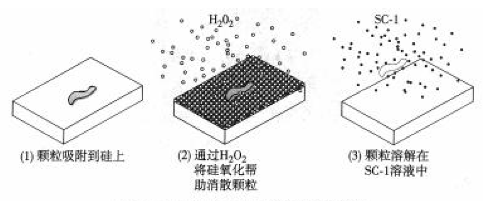

    **电学排斥**：氢氧化铵的氢氧根轻微侵蚀硅片表面，并从颗粒下部切入。氢氧根也在硅片表面和颗粒上积累负电荷。表面和颗粒上的负电荷发生排斥作用使得颗粒进入SC-1溶液（如图）。此外，表面负电荷的另一个好处是它阻止了颗粒的重新沉积

    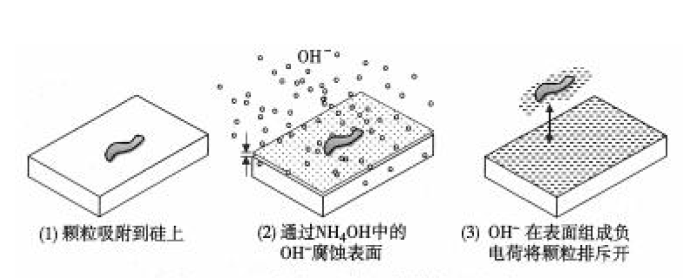

4. **SC-2溶液清洗**

    使用1：1：5配比的HCL-H2O2-H2O溶液（称为2号标准清洗液）在70℃环境下清洗10min，借助HCL在H2O2氧化性环境下的酸性来去除金属沾污。

5. 最后的**HF清洗**

    许多清洗方法都是在最后一步时把硅片表面曝露于DHF，以除去硅片表面的自然氧化层。硅片表面无自然氧化层是生长高纯外延薄膜和MOS电路栅极超薄氧化物（50埃或更薄）的关键。HF浸泡之后，硅片表面完全被氢原子终止，在空气中具有很高的稳定性，避免了再次氧化。氢原子终止的硅表面保持着与体硅晶体相同的状态

6. **化学蒸气清洗**

    硅片曝露在稀HF:H2O的细密喷雾中，化学去除工艺室内单个硅片上的残余氧化物和金属沾污。接下来进行离子水清洗和IPA（异丙醇）蒸气干燥。这个方法是为了减少HF的化学用量而提出的，但并没有广泛应用，因为它对清洗性能的改进是最小的（而成本却有一定提升）

7. **水清洗**

    清洗完成后的硅片上的化学残余物必须去除。**每一步湿法清洗工艺后面都跟随着超高纯度的去离子水清洗**。清洗过程需要向硅片表面持续不断的供给超纯水。水清洗也可以用来终止HF清洗步骤的氧化腐蚀作用

综上所述，RCA清洗的一般流程如下图所示：

每个步骤之后都紧跟UPW清洗。也就是Piranha溶液-DHF-SC1-DHF-SC2-DHF-干燥这一串流程。

RCA清洗的步骤经过严格设计，不能随意改动，以免引起二次沾污。使用的清洗液浓度也需要经过严格计算，在刻蚀清洗中，如果刻蚀剂浓度过高，就会导致晶片表面粗糙，影响器件电特性；刻蚀剂浓度过低，则不能让氧化层中的金属杂质被去掉。温度（温度越高，反应速率越快）、清洗时间（反应物会随清洗时间发生分解，影响清洗效果）、表面张力（表面张力提高会让清洗更加彻底）、夹具（夹具不合理会导致二次沾污）等都需要经过严格设计

清洗设备一般有以下两种：

* 浸入式

    将硅片连续不断放入装有清洗液的分立清洗槽中。该法化学原料选择广，易于实现；但是对化学品和工作空间要求严格，必需实时监控原料及时更换补充

* 喷射式

    使用高压离心喷射腐蚀性或苛性化学药品到硅片上。该法能够借助高压喷射物理去除沾污，但是缩短了清洗液与表面发生化学反应的时间，对系统的保养要求高

* 超声波式

    使用超声和兆声振荡去除晶圆表面微粒。设备简单、操作方便；但存在高温和空心气泡爆裂导致表面损伤的可能

### 湿法清洗的局限性

1. 湿法晶片的清洗操作和工艺存在明显不兼容，有碍于集成化趋势。

    要实现所有加工尺度的低压集束工艺，就需要开发出可以从镜片表面去除微量沾污的气相清洗技术，否则无法实现低压集束工艺

2. 在先进制程的大深宽比结构中，湿法工艺存在一定困难，结构中残存的杂质势必会重新污染镜片

3. 湿法工艺中使用液体化学品和冲洗干燥环节往往难以控制微粒，很可能造成二次沾污

4. 湿法清洗中需要使用高纯化学品和去离子水，成本高、具有危险性且废物难以处理

### 干法清洗

目前干法清洗已经在高端器件制造中全面取代湿法清洗工艺。但存在成本过高和效率不足的问题，因此还需要进一步研发才能适应大规模工业生产需求。**目前的发展趋势是干法工艺作为集成工艺系统的一部分，在其他各个关键工艺中插入使用，而不是将其作为单独的清洗单元使用**

干法清洗的核心机理：**将化学沾污转化为某种挥发性化合物，直接去除一薄层衬底来一同去除沾污，通过溅射方式去除化学沾污**，因此干法技术既使用了物理反应，也使用了化学反应，同时也**采用了更为灵活的热增强效应**，其**清洗剂压力可以在很大范围内控制**

螯合剂：用来结合并去除金属离子。一但这种螯合剂，如乙二胺四乙酸（EDTA），加入到清洗液中，就能减少溶液重金属的再淀积。它通过改变这类金属的氧化还原势以达此目的

臭氧：向超纯水中加入臭氧已被认为可能成为某些RCA湿法清洗代替。臭氧处理过的超纯水结合紧随其后进行的SC-2清洗步骤能有效去除诸如铜和银这样的金属，同时能去除有机沾污。臭氧注入到去离子水中可以取代piranha步骤用于轻有机物的清洗

低温喷雾清洗：充分冷却气体（氩）直至形成固体冰粒，喷射到硅片表面去除颗粒沾污。当氩氮混合物流经一盒喷嘴阵列时，氩的冷却通过真空室内的膨胀冷却完成。氮用来稀释氩并且控制固体氩粒子的直径。低温喷雾清洗比湿洗清洗更高级，但在当前并不广泛使用

## 刻蚀

**刻蚀**：用化学或物理方法有选择地从硅片表面去除不需要的材料的过程。

基本目标：**在涂胶的硅片上正确地复制掩膜图形**。有图形的光刻胶层在刻蚀中不受到腐蚀源显著的侵蚀。这层掩蔽膜用来在刻蚀中保护硅片上的特殊区域而选择性地刻蚀掉未被光刻胶保护的区域。

**干法刻蚀**：硅片表面曝露于气态中产生的等离子体，等离子体通过光刻胶中开出的窗口与硅片发生物理或化学反应。

干法刻蚀的缺点：对下层材料的刻蚀选择比较差、等离子体带来的器件损伤和昂贵的设备。在干法刻蚀中，用低压等离子体放电来去除集成电路中小尺寸图形里的材料。等离子体与硅片表面发生反应，然后去除表面材料

**干法刻蚀是亚微米尺寸下刻蚀器件的最主要方法**，干法刻蚀可以按照刻蚀的材料分为：

**金属刻蚀**：主要是在金属层上去掉铝合金复合层，制作出互连线

**介质刻蚀**：用于介质材料的刻蚀，如二氧化硅。

**硅刻蚀**：应用于需要去除硅的场合

**湿法刻蚀**：液体化学试剂（如酸、碱和溶剂等）以化学方式除去硅片表面的材料。

重要的刻蚀参数包括：

* **刻蚀速率**：刻蚀过程中去除硅片表面材料的速度。刻蚀速率通常正比于刻蚀剂的浓度，受到硅片表面几何形状等因素影响。刻蚀速率还受到**负载效应**作用：要刻蚀硅片表面的大面积区域，则会耗尽刻蚀剂浓度使刻蚀速率慢下来；如果刻蚀的面积比较小，则刻蚀就会快些。刻蚀速率的减小原因主要是*等离子体刻蚀反应过程中会消耗大部分的气相刻蚀基*
* **台阶高度**：刻蚀窗口的深度
* **刻蚀剖面**：被刻蚀图形的侧壁形状。刻蚀剖面分为两种。各向同性：刻蚀剖面在所有方向上（横向和垂直方向）以相同的刻蚀速率进行刻蚀，导致被刻蚀材料在掩膜下面产生钻蚀而形成，这样会带来不希望的线宽损
    失。各向异性：亚微米尺寸图形希望刻蚀剖面是各向异性的，即刻蚀只在垂直于硅片表面的方向进行。各向异性的刻蚀剖面可以包括适度（较小的侧壁倾角）或高各向异性（垂直的侧壁）两种情况

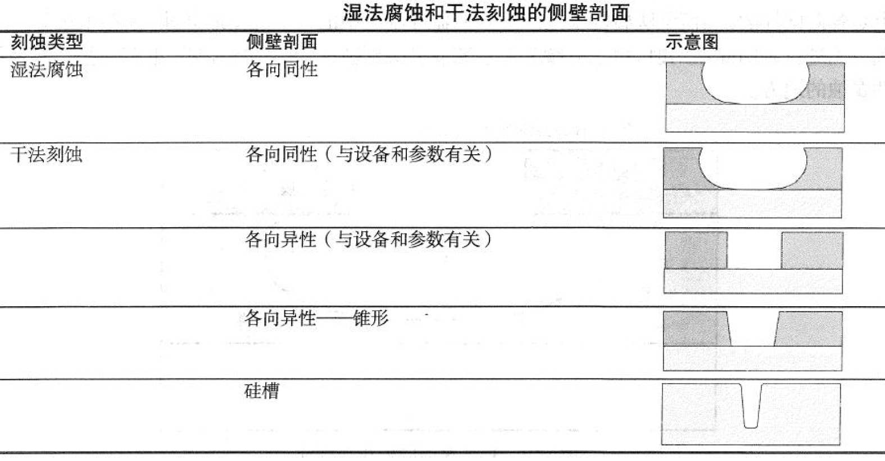

干法刻蚀不同于湿法腐蚀之处在于它对下面的材料没有好的选择比。所以需要终点检测来监测刻蚀工艺并停止刻蚀以减小对下面材料的过度刻蚀。因此需要使用**光发射谱**进行**终点检测**

## 掺杂与离子注入

掺杂工艺目的就是让本征半导体中加入一定量杂质成为掺杂半导体

最传统也是最基础的掺杂工艺就是**扩散**

### 扩散

存在于晶格间隙的杂质称为**间隙式杂质**。间隙式杂质从一个间隙位置到另一个间隙位置上的运动称为**间隙式扩散**；间隙式杂质半径小且不容易和硅原子键合的原子，它们以间隙方式在晶体中作扩散运动。占据晶体内晶格格点上的正常位置的杂质原子称**替位杂质**。替位杂质从一个晶格位置运动到另一个晶格位置上称为**替位式扩散**。替位杂质的近邻晶格上出现空位，替位杂质才能比较容易的运动到近邻空位上。当近邻没有空位时，通过换位才能实现替位杂质从一个晶格位置运动到另一个晶格位置上，这种换位会引起周围晶格发生很大的畸变，需要相当大的能量，这个过程是难以实现的，因此**替位杂质运动同间隙杂质相比一般来说更困难**

我们通常使用菲克第一定律描述扩散过程

**菲克第一定律**：如果在一个有限的基体中存在杂质浓度梯度 ，则杂质将会产生扩散运动，而且扩散方向是指向浓度低的方向
$$
J(x,t)=-D\frac{\part{C}}{\part{x}}
$$
**杂质的扩散流密度正比于杂质浓度梯度**。式中D为扩散系数，单位$cm^2/s$，C表示杂质浓度，记为函数$C(x,t)$；负号表示粒子从高浓度向低浓度扩散

**扩散系数D是表征扩散能力的重要参数**。它的数值越大，表示扩散得越快，在相同时间内，在晶体中扩散得越深
$$
D=D_0 exp(-\frac{\Delta E}{kT})
$$
ΔE表示扩散过程中的激活能，实际上就是杂质原子扩散时所必须克服的某种势垒

D0表示温度T为无穷大时，扩散系数D的表观值

k为玻耳兹曼常数

将上面定律扩展到二位情况，就得到**菲克第二定律**
$$
-\frac{\part{C(x,t)}}{\part{t}}=\frac{\part{J(x,t)}}{\part{x}}
$$
对应扩散方程为
$$
\frac{\part{C(x,t)}}{\part{t}}=D\frac{\part^2{C(x,t)}}{\part{x^2}}
$$
由扩散方程以及边界条件和初始条件不同，扩散方程的解不同，杂质的分布也不同。扩散分布主要有两种：**恒定表面源扩散**和**有限表面源扩散**

1. 恒定表面源扩散

    在整个扩散过程中，硅片表面始终暴露在具有恒定而均匀的杂质源的气氛里。即**表面的杂质浓度Ns始终不变**，有边界条件
    $$
    C(0,t)=C_s,x=0
    $$
    在扩散的开始时，除Si表面与杂质气体接触外，Si片内部各点都没有杂质扩进去，有初始条件
    $$
    C(x,0)=0,t=0
    $$
    带入解偏微分方程得到：
    $$
    C(x,t)=C_S erfc \frac{x}{2\sqrt{Dt}}
    $$
    其中，erfc表示*余误差函数*，有
    $$
    erf \frac{x}{2\sqrt{Dt}}=\frac{2}{\sqrt{\pi}} \int_{0}^{\frac{2}{2\sqrt{Dt}}}e^{-\lambda^2}d\lambda
    $$
    而
    $$
    1-erf \frac{x}{2\sqrt{Dt}} =erfc\frac{x}{2\sqrt{Dt}}
    $$
    **Cs一定的情况下，扩散的时间越长，杂质扩散就越深，扩到硅片内部的杂质也越多**

    **Cs由杂质在固体中的固溶度决定**。固溶度是指杂质在一定温度下能够溶入固体中的最大浓度

    如果扩散杂质与衬底原有的导电类型不同，则在两种杂质浓度相等处形成PN结，其结的位置Xj即**结深**。Xj与扩散系数D和扩散时间t的平方根成正比
    $$
    A=2erfc^{-1}(1-\frac{C_B}{C_S})
    $$
    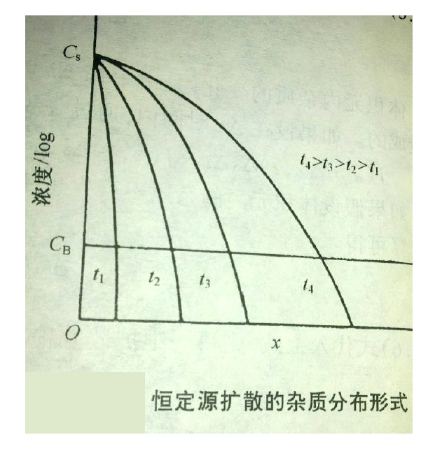

    **在Cs和CB一定的情况下，结深结越深，在结处的杂质浓度梯度越小**

2. **有限表面源扩散**

    如果扩散之前在硅片表面淀积一层杂质，在整个扩散过程中这层杂质作为扩散的杂质源,不再有新源补充，这种扩散方式称**有限源扩散**

    在整个扩散过程中，Si片内的杂质总量保持不变，没有外来杂质补充，只依靠扩散前在Si片表面上已沉积的那一薄层内有限数量的杂质原子向硅片体内扩散。随着扩散时间的增长，表面杂质浓度不断下降，并不断地向内部推进扩散，这时表面杂质浓度与扩散杂质深度都在发生变化，由此可确定。

    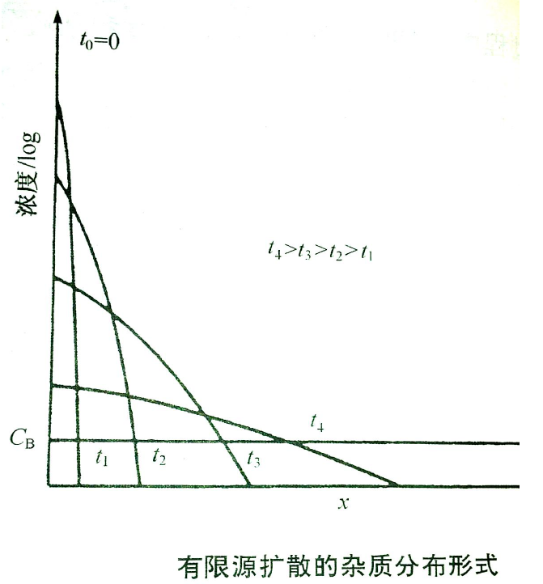

    这种情况下，扩散过程中无外来杂质补充，因此存在边界条件
    $$
    J=-D\frac{\part{C}}{\part{x}}=0
    $$
    也就是
    $$
    \frac{\part{C}}{\part{x}} |_{x=0} (x>0),C(\infin ,t)=0
    $$
    同时由于硅片内杂质总量不变，有初始条件
    $$
    \int_0^\epsilon C(x,0)dx=Q(\epsilon \rightarrow 0)
    $$
    经过计算得到
    $$
    C(x,t)=\frac{Q}{\sqrt{\pi Dt}} e^{-\frac{x^2}{4Dt}}
    $$
    其中Q表示扩散前存在于硅片表面薄层上单位表面积下的杂质总量

    可以发现：

    * **D愈大（扩散温度越高）t愈长，Cs则愈低**
    * **C与Cs成正比，与D，t的平方根成反比**
    * **在杂质分布形式相同的情况下CB越大，结深越浅**

对于限定源扩散来说，其特点是在整个扩散过程中，杂质总量保持不变，而随扩散时间的增长，表面浓度不断下降，扩散深度不断加深，因此，**采用有限表面源扩散时，既能控制表面浓度又能控制扩散深**

但采用有限源扩散时，扩散前必须在Si片表面沉积足够量的杂质源，并且必须具有较高的表面浓度，才能使限定源扩散获得符合要求的表面浓度和扩散深度。实践表明，采用恒定表面浓度扩散即能比较准确地控制扩散硅表面的杂质总量，又能获得高的表面浓度并且操作方便。因此，**在当前硅平面器件工艺中普遍采用两步扩散工艺**——**预淀积**（恒定表面扩散）的主要目的是为了控制扩散入Si片表面的杂质总量，为第二步的再分布创造必要的条件。**再分布**（有限表面源扩散）的目的，是控制整个扩散的表面浓度和结深，使它符合器件设计要求

需要注意：**扩散工艺只用于重掺杂**，大部分器件特征尺寸小于1mm就要用离子注入

在工艺生产中，控制扩散工艺条件的主要目的在于控制扩散的杂质分布。具体的说就是控制各次扩散的结深、表面浓度，结深可以直接测量，而表面浓度则是通过对扩散层的薄层电阻和结深推算出来的，因此**结深**、**薄层电阻**、**表面浓度**是评价扩散层质量的三个重要的工艺指标

### 离子注入

**离子注入**是一种向硅衬底中引入可控制数量的杂质，以改变其电学性能的方法。亚0.25微米工艺的注入过程有两个主要目标：向硅片中引入均匀、可控制数量的特定杂质；和把杂质放置在希望的深度。

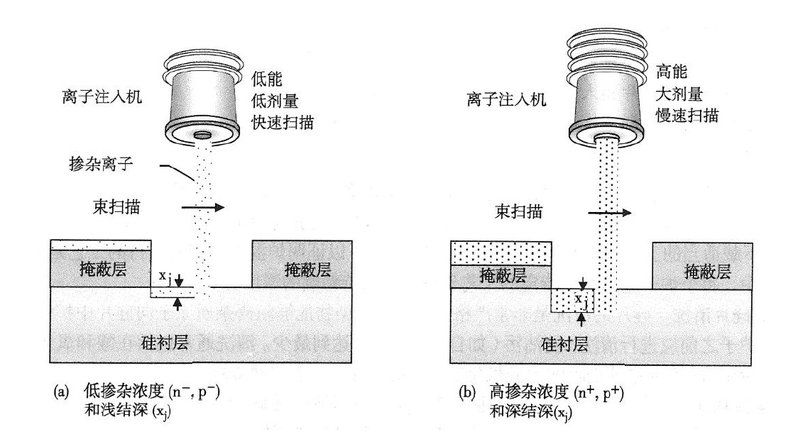

离子注入使用到了**等离子态**。当有高能电离的分子或原子的聚集体存在时就会出现等离子体。将一定气体暴露在高能电场中，就能诱发等离子态

> 如果采用离子注入工艺进行掺杂，可以带胶进行操作。采用扩散工艺进行掺杂为什么不能带胶操作？
> 答：扩散工艺需要高温，只能使用氮化物或者氧化物作为掩膜；离子注入工艺是低温操作，所以可以带胶操作

离子注入机包含以下5个部分：**离子源**、**引出电极**（吸极）**和离子分析器**、**加速管**、**扫描系统**、**工艺室**

通过电子轰击气体原子，离子源中会产生离子。电子通常由钨丝源产生。从离子源中引出的离子可能包含许多不同种类的离子。它们在吸极电压的加速下，以很高的速度运动，注入机中的磁性离子分析器能将需要的杂质离子从混合的离子束中分离出来。为了获得更高的速度，除了分析器磁铁，正离子还要在加速管中的电场下加速。加速管是一种线性设计，由一系列被介质隔离的电极组成，电极上的负电压依次增大。电极间总的电压差将叠加在一起，总电压越高，离子速度越大。在加速管的后加速器中，束流也会发生聚束。

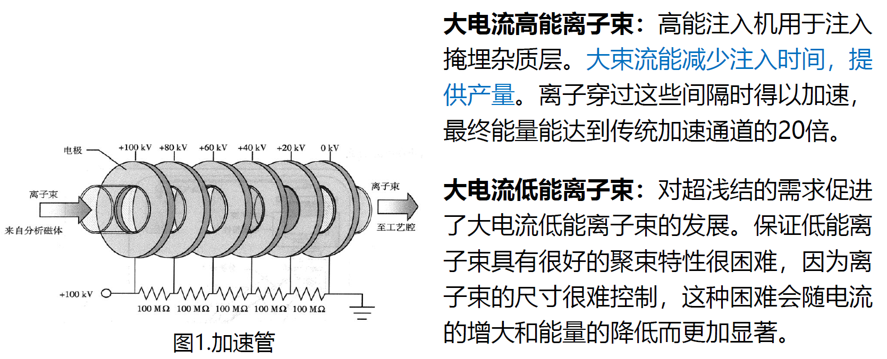

**空间电荷中和**：由于电荷之间相互排斥，所以一束仅包括正电荷的离子束本身不稳定，容易造成离子束膨胀，最终导致注入不均匀。离子束扩大可用二次电子中和正离子的方法缓解，被称为空间电荷中和。当高能杂质离子在行进过程中撞击某些表面时，就会产生**二次电子**。二次电子在负偏压板之间弹来弹去但不会离开离子束的特定区域。这些电子能中和离子束，阻止或减小离子束扩大

**中性束流陷阱**：正电荷离子束在小于10-6托的真空下形成，但仍有残余气体分子。当杂质离子与残留气体分子碰撞而获得一个电子时，就形成了中性离子。它们没有电荷因为不能偏转，若不能去除将会被同时注入。中性束流陷阱就是利用偏转电极，使离子束在进入靶室前一段距离内发生偏转。由于中性离子不发生偏转，它们将直接撞击到接地的收集板上

注入机中的扫描系统有以下几个不同种类：

静电扫描：静电扫描在一套X-Y电极上加特定电压，使离子束发生偏转，注入到固定的硅片上

机械扫描：离子束固定，硅片机械移动。此方法一般用于大电流注入机，因为静电很难使大电流高能离子束偏移

混合扫描：硅片放置在轮盘上旋转，并沿y轴方向扫描。离子束在静电（或电磁）的作用下沿x轴方向扫描。这种方法常用于中低电流注入，每次注入一个硅片

平行扫描：静电扫描的离子束与硅片表面不垂直，容易导致阴影效应。平行扫描的离子束与硅片表面的角度小于0.5度，因而能减小阴影效应和沟道效应。平行扫描中，离子束先静电扫描，然后通过一组磁铁，调整它的角度，使其垂直注入硅片表面

在注入过程中，离子束撞击硅片导致正离子在掩蔽层上的积累，即硅片充电。这种情况硅片上能形成大量电荷，特别是大电流注入机更严重。形成的电荷会改变离子束中的电荷平衡，使束斑扩大，剂量分布不均匀。还会损害表面氧化层，如损害栅氧化层导致器件出现可靠性问题

**离子注入会将原子撞击出晶格结构而损伤硅片晶格**。被注入离子基本不占据硅的晶格点，而是停留在晶格间隙。这些间隙杂质只有经过**高温退火**才能被激活。**退火能加热被注入硅片，修复晶格缺陷，还能使杂质原子移动到晶格点将其激活**

**高温炉退火**：传统的退火方式，用高温炉把硅片加热至800-1000°C并保持30分钟。此温度下，硅原子重新移回晶格位置，杂质原子也能代替硅原子位置进入晶格。**但这样的温度和时间会导致杂质扩散**

**快速热退火(RTA)**：用极快的升温和在目标温度短暂的持续时间对硅片进行处理，能够在晶格缺陷的修复、激活杂质和最小化杂质扩散之间取得优化，还能减小瞬时增强扩散

单晶硅原子的排列是长程有序的。当注入离子未与硅原子碰撞减速，而是穿透了晶格间隙时，就发生了**沟道效应**。沟道效应使预期的设计范围大大扩展，特别是在低能离子的浅注入时更加严重。杂质离子通过晶格通道时不与电子和原子核发生碰撞，因此比那些发生碰撞的离子穿透的更深

有四种方法控制沟道效应：**倾斜硅片、掩蔽氧化层、硅预非晶化、使用质量较大的原子**

## 薄膜沉积

薄膜沉积工艺中要制造的薄膜主要包括**单晶薄膜**、**多晶薄膜**、**非晶薄膜**和**有机分子薄膜**，将需要的材料使用**PVD**、**CVD**等各种原理沉积在晶圆表面的工艺就是薄膜沉积，这一步是为了在晶圆表面形成每一层的器件结构

一般薄膜内存在*点缺陷*，包括空位、空洞、杂质和位错，缺陷对芯片制造很重要，往往会导致制造器件不能按照理想方式工作，也就是不合格片

薄膜最重要的固有特性是**粘附性**和**内应力**，内应力分为**张应力**和**压应力**

> 这里所说的两种应力就是之前提到过的由于CTE（热膨胀系数）不匹配而产生的**拉伸应力**和**压缩应力**

薄膜中最重要的薄膜就是SiO2薄膜，它能够起到掩蔽、绝缘等多种作用，CMOS工艺中的SiO2薄膜是使用**热氧化**工艺将硅表面层直接转化而来。目前也出现了众多新材料薄膜，比如氮化硅SiN薄膜，它的介质特性优于二氧化硅膜，具有以下基本特征：1.结构致密、针孔密度小，因此抗钠、耐水汽能力强，可用于芯片表面钝化膜和保护膜；2.化学稳定性好，耐酸碱性能高，可以作为集成电路浅沟隔离工艺技术的CMP的停止层；3.对可动离子阻挡能力强，常用于掩蔽膜；4.介电常数高，适合作为电容的介质膜；5.抗氧化能力强，在需要选择性热氧化的场合中可作为选择性热氧化的掩膜

> 硅与氧化剂（一般使用氧气或水蒸气）在高温条件下（1000℃）左右会反应生成SiO2，这个过程称为热氧化
>
> 因此根据反应物不同，热氧化工艺也分为：
>
> * 干氧氧化：使用氧气氧化
> * 湿氧氧化：使用水氧化
> * 水汽氧化：使用高温水蒸气氧化

热氧化过程中存在一些问题：氧化层厚度不均、表面出现斑点、存在针孔、存在钠离子污染等。因此需要使用特殊方法来分析薄膜性能，常用的分析角度有以下几种：

**厚度**、**表面形貌**、**薄膜稳定性可靠性**、**薄膜成分分析**、**薄膜结构分析**

一般使用下面的技术进行评估：

**SiO2薄膜表面观察法**

**SiO2薄膜厚度测量**

**比色法估算SiO2氧化层厚度**

### 薄膜工艺

薄膜沉积工艺主要分为**PVD**和**CVD**，也就是**物理气相沉积**和**化学气相沉积**，分别利用物理方法和化学反应在硅片表面制造薄膜。

PVD使用固态或熔融物质作为靶材，经物理过程使其进入气相后包围衬底（要求气相下靶材不与衬底反应），处于低气压环境下，这样分子的散射作用就会大大减小，气相分子运动路径接近于直线，让气相分子在衬底上直接沉积下来。

比较常见的PVD工艺有以下几种：

**溅射**——将需要的材料变为高密度等离子态后打到衬底表面，在这个过程中要使用到氩气保护并使用大量冷却水防止晶圆过热，还要利用高压电流让离子束维持等离子态，中间定向发射的过程则由磁效应控制或使用激光扫描脉冲完成

**真空蒸镀**（Vacuum Evaporation）技术是指在真空环境中将要沉积的材料加热蒸发或升华，并让他在晶圆表面沉积析出成膜，这也是最一般的制作薄膜的方法。真空蒸镀工艺的四大关键参数包括：工艺真空、饱和蒸气压、蒸发速率、沉积速率

真空蒸镀法也是最早发明的**PVD物理气相沉积**工艺，其优点包括：设备简单、操作容易；薄膜纯度高质量好，可以精确控制厚度；成膜速率高，用掩膜可以获得清晰的图形；薄膜的生长机理比较单纯，工艺重复性好。他的主要缺点就是不容易获得结晶结构的薄膜，这样形成的薄膜在晶圆上的粘附力较弱

PVD还包含**真空离子镀**工艺

CVD则可以按照工艺沉淀温度分为低温（200-500℃）、中温（500-1000℃）、高温（1000-1300℃），按反应压力分为常压**APCVD**（大气压下进行）和低压**LPCVD**，按反应壁温度则可以分成**热壁**和**冷壁**式，按照反应激活方式可以分为**热激活**、**等离子体激活**（**PECVD**等离子体增强化学气相沉积）、**光激活**（Photo CVD，光激发CVD）等

其中LPCVD和PECVD是目前比较常用的工艺

其他CVD包括：MOCVD（Metal Organic CVD）、电子回旋共振（Electron Cyclotron Resonance，ECR）CVD、超高真空CVD（Ultra High Vacuum，UHV）、混合（Hybrid）激发CVD等

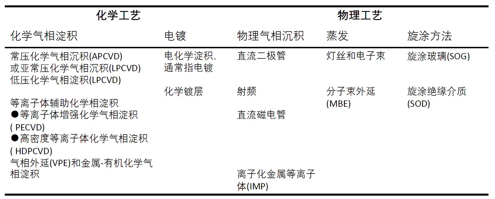

化学气相淀积工艺反应发生在硅片表面或者非常接近表面的区域，这是一种**异类反应**(也叫**表面催化**)。某些反应会在硅片表面的上方较高区域发生，这称为**同类反应**。**同类反应是要避免的**，因为反应生成物会形成束状物，这会导致反应物粘附性差、低密度和高缺陷“。**在化学气相淀积工艺中，需要异类反应来生成高质量的膜**

化学气相淀积过程有5种基本的化学反应：

高温分解：通常在无氧的条件下，通过加热化合物分解（化学键断裂）;

光分解：利用辐射使化合物的化学键断裂分解；

还原反应：反应物分子和氢发生的反应；

氧化反应：反应物原子或分子和氧发生的反应；

氧化还原反应：反应3与4的组合，反应后形成两种新的化合物。

在MOS器件中，掺杂的多晶硅作为栅电极

用掺杂的多晶硅作为栅电极的原因是：

* 通过掺杂可得到特定的电阻
* 和二氧化硅优良的界面特性
* 和后续高温工艺的兼容性
* 比金属电极更高的可靠性
* 在陡峭的结构上淀积的均匀性
* 实现栅的自对准工艺

在不同膜层中应用的介质材料会直接影响到微芯片的性能。介质的两个重要方面是**介电常数**和**器件隔离**

器件隔离技术为硅片上的器件提供了电学隔离。MOS技术中的两个基本隔离技术是：通过硅的**局部氧化**(**LOCOS**)隔离实现的局部场隔离和**浅槽隔离**(**STI**)。

对于特征尺寸为0.35μm以及更大的器件，传统上采用硅的局部氧化( LOCOS)技术来隔离。该技术采用图形化的Si3N4岛来定义氧生长的区域。限制LOCOS隔离在特征尺寸小于或等于0.25um工艺中应用的主要因素是硅氧化过程中氧的侧向生长。在高密度ULSI技术中， LOCOS隔离技术不适用。在0.25μm和以下的技术节点中，浅槽隔离(STI)技术被广泛应用。STI取代 LOCOS的原因有如下几点：

* 更有效的器件隔离的需要，尤其是对DRAM器件而言
* 对晶体管隔离而言，表面积显著减小
* 超强的闩锁保护能力
* 对沟道没有侵蚀
* 与CMP的兼容

### CMP化学机械平整化

有许多低k绝缘介质采用硅片旋涂的方法，称为旋涂绝缘介质(SOD)。在CMP被广泛应用之前，旋涂玻璃被用来进行间隙填充和ILD的平坦化。SOG通常有两种类型：有机物和无机物。有机物基于硅氧烷，无机物基于硅酸盐。有机硅氧烷SOG吸水性强，热不稳定，不能承受等离子体

### 外延

**外延**就是在单晶衬底上淀积一层薄的单晶层。新淀积的这层称为外延层。外延为器件设计者在优化器件性能方面提供了很大的灵活性

在外延淀积过程中，可能发生不希望的掺杂不均匀现象。因为轻掺杂外延层通常生长在重掺杂衬底上，外延层会发生自掺杂现象

## 金属化

一种合适的金属材料应该满足如下要求：

* 导电率：具有**高导电率**，能够传导高电流密度
* 粘附性：**能够粘附下层衬底**，容易与外电路实现电连接
* 接触电阻：与半导体和金属表面连接时**接触电阻低**
* 淀积：**易于淀积**并经相对的低温处理后具有**均匀的结构和组分**
* 刻印图形/平坦化：为刻蚀过程中不刻蚀下层介质的传统铝金属化工艺提供具有**高分辨率的光刻图形**
* 可靠性：为了在处理和应用过程中经受住温度循环变化，金属应**相对柔软且有较好的延展性**
* 抗腐蚀性：具有**很好的抗腐蚀性**
* 应力：**很好的抗机械应力特性**以便减少硅片的扭曲和材料失效，比如断裂、空洞的形成和应力诱导腐蚀

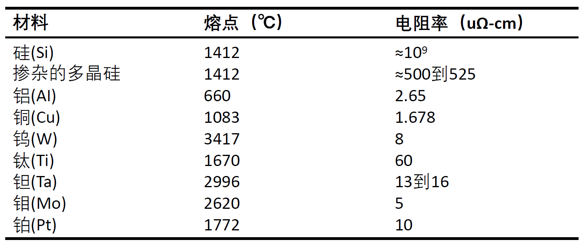

## 封装

### bonding

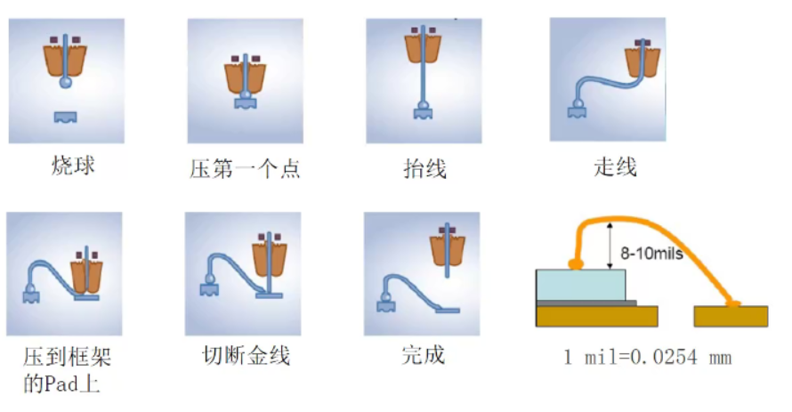

# 集成电路封测
