# IC产业链简介

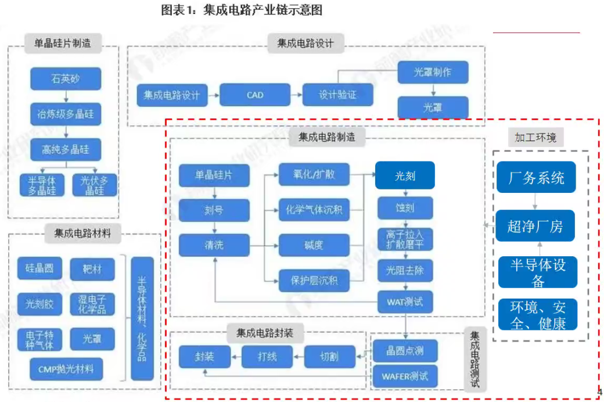

集成电路制造产业链包含如下几个主要部分：**加工环境**、**单晶硅片制造**、**材料**、**集成电路制造**、**设计**、**封测**。基本拓扑关系如上图所示，下面分模块介绍

# 集成电路加工环境

集成电路的加工环境说来很简单——恒温恒湿没有尘埃杂质的区域，也就是**超净间**

为什么需要超净间？

* 灰尘颗粒：如果沾到光刻掩膜板上，对应电路掩模将会残缺，导致后续工艺中不需要的图形出现；如果污染到离子注入工艺，则会导致设备中的PN结断开
* 温湿度：掩模板受温度影响较大，如果温度变化较大，掩模板上的图形就会变形，导致后续光刻出来的图形也会变形；光刻胶的变形则更加直接，不管是图像缩短了还是变宽了都会对后面的蚀刻、离子注入等造成巨大影响

不过实现一个超净间需要用到很多不同种类的设备，可以说超净间本身就是一个复杂的集成电路制造设备，其具有三个主要特点：

* 密闭无尘
* 结构复杂
* 投入巨大

## 超净间系统

超净间是将特定空间内空气中的微粒、有害空气、细菌等污染物排除，并将室内温湿度、洁净度、室内压力、气流速度与分布、噪音振动、照明、静电等控制在某一要求范围内而特别建设的厂房。不论外部空气条件如何变化，室内总能维持设定的洁净度、温湿度、压力等性能指标。

超净间在医疗、电子、精密仪器等领域均有广泛应用。近年来随着厂房建设成本下降，中低端超净间也正在普及

> 医院的手术室就是一个低成本、要求相对较低（仅仅不让细菌存在）的超净间。而机械硬盘维修、精密仪器维修（甚至包括比较高级的手表维修）也往往是在洁净度等级较低的超净间完成的。很多要求严格的现代食品企业也都在超净间中完成食品流水线制造
>
> 这个东西虽然高端但并不是只有集成电路产业才能用到

### 超净间的标准与测定

超净间的规格由**洁净度等级**描述，一般使用**激光粒子计数器**来测量洁净度

> 仪器利用散射光强度判断空气中粒子的直径：光传播过程中若照射到粒子，在粒子大于入射光波长很多倍时会发生反射；如果粒子小于入射光波长则发送散射，激光粒子计数器中安装有散射光透镜，变换激光波长，再通过检测透镜中接收到的散射光来识别粒子直径
>
> 

美标超净间标准如下

国标超净间标准如下

两种标准的对应该关系：国标的5和国际标准的100相当，此后加的数字序号多少就表示后面0的多少，比如国标7就对应了国际标准100后面加两个0也就是10000

### 超净间的分类

目前实际生产中用到的往往是混合式超净间，局部层流，主体乱流。需要明确一点：超净间的目的是**净化**为不是**维持**——超净间中的人员、机器甚至墙壁地板无时不刻不在产生微小颗粒，维持超净间洁净度是不可能的，因此超净间工作的根本思路就是**快速排除颗粒**——*超净间通过空调系统送入的空气是洁净无颗粒的（使用了高效过滤器），要用这部分空气快速混合甚至替换掉超净间中产生混有颗粒的空气*

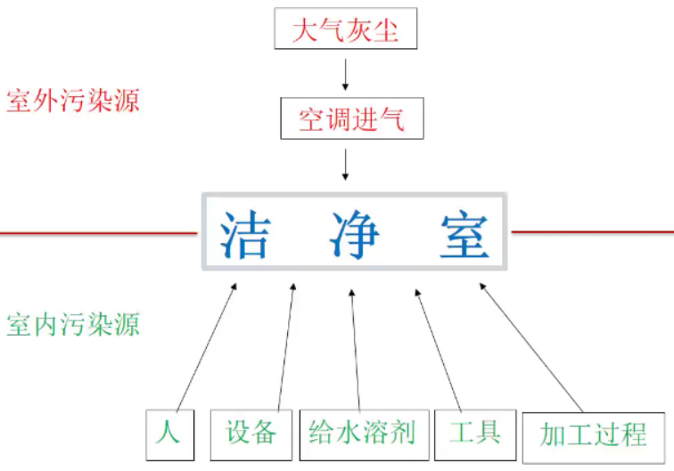

* 乱流式

    洁净空气由上方进入，由超净间两侧墙板或高架地板回风，气流非直线运动，呈乱流或涡流状态，适用于千级到十万级的超净间。建设成本低，扩充较容易。自净时间会更长一些

    

* 层流式

    空气气流运动成直线形，洁净空气进入室内后由两侧墙板或高架地板回风，适应于1到100级的超净间

    

    * 垂直层流

        空气由上向下吹，洁净度较高，灰尘可快速排出室外。管理容易、自净时间短，但构造费用较高，不易扩充，维修更换过滤器较麻烦

    * 水平层流

        空气自侧面墙吹出，由对边墙壁回风系统回风，气流呈水平状态。构造简单、运转稳定且自净时间短。建造费用很高且空间不易扩充

* 混合式

    混合乱流式和层流式构造，平衡二者优缺点
    
    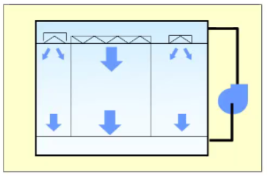

### 穿戴洁净服的流程

进入超净间一定要穿戴洁净服，下图描述了穿戴洁净服的关键步骤

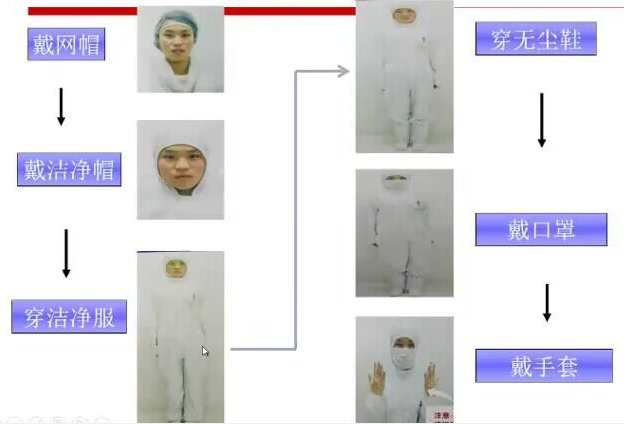

## 场务系统

要维护一个超净间就需要一系列复杂的**场务系统**，包括中央空调、制冷机组、真空机组、空压机组、化学品供应、气体供应、纯水供应、废水废气处理和其他环保、消防、蒸汽电力能源系统等

### 洁净空调系统

洁净空调系统用于向室内送入经过处理的空气以消除室内各种热湿干扰和灰尘污染，同时从室内排出部分废气

超净间的洁净空调系统与一般的空调具有本质区别：需要**控制输送空气中的粒子浓度**

因此洁净空调系统的控温控湿方法比较特殊：先加入粗过滤的空气，再利用冷冻水降温除湿，使用高效过滤器获得符合超净间洁净度的空气，最后经过纯水加湿得到符合超净间温湿度的空气

### 纯水系统

超净间的纯水系统负责向室内仪器设备提供各种专用水源，包括纯水/超纯水和冷冻水等特殊水

可以提供

* PCW制程冷却水：供给制程机台冷却
* UPW/DIW超纯水：用于补水、清洗、稀释等
* Chill Water冰水（冷冻水）：冷却用冷源、空调用冰水
* RW回收水：超纯水回收/冷凝回收/再生得到的回收水
* CW自来水：一般用水

### 大宗气体系统

大宗气体包括：

* CDA压缩干燥空气：用于搬运、气压缸、冲吹
* General N2一般氮气：用于清洁冲吹
* Pure N2纯化氮气：用于空间填充或超洁净冲吹
* B-GAS大宗气体：用于制程需求/空间填充/超洁净冲吹的气体
* S-GAS特殊气体：用于制程需求/空间填充的特殊气体

一般来说氮气从液氮储备中获取，经过特殊处理后成为*超纯氮气*，在各种仪器中作为保护、冲吹颗粒的主要气体储备。大宗气体则包括各种高纯/超纯气体的制造，目前我国能生产高纯的SiH4、PH3、GeH4、CH4、NH3、N2O、HCl、Cl2等，但是像砷烷、叔丁基锂、三乙基砷、叔丁基磷、六氟乙烯等产品都很难达到高纯水平

### 化学品供应系统

超净间中往往要使用高纯化学品来进行清洗和进行光刻刻蚀等制程。针对场务需求，化学品供应系统主要提供超纯氢氟酸和光刻胶，也会提供一些其他需要用到的大宗化学品

### 真空系统

**真空**即低于一个标准大气压的状态。半导体工业中一般使用**Torr**来描述真空气压

> 1Torr=133.3Pa

半导体加工中一般用到上图中框选范围的真空，即低真空（接近一个标准大气压）到超高真空（10^(-4)大气压）。在*离子注入*、*薄膜沉积*（尤其是PVD物理气相沉积工艺）、热氧化、*干法刻蚀*工艺中真空度都有着较高要求

超净间中需要使用真空环境：

* PV制程真空：用于吸引搬移晶圆或小型设备
* HV清洁真空：用于尘屑吸引清洁
* Pump Line制程高真空：用于制程转换中的高真空环境

在半导体制造设备中，晶圆一定要处于真空环境来保证最高的良品率

一般使用**真空泵**来获得真空，一般有四种分类：

* **干式机械泵**：生产5次方Pa到0.1Pa的中低真空

    干式真空泵包括螺杆真空泵、无油往复真空泵、无油涡旋真空泵、爪式真空泵等，基本原理都是利用机械进行吸气排气获得真空

* 罗茨泵：产生指数-3的高真空环境

* **涡轮分子泵**：可用于产生-1到-9指数的高真空

    主要由泵体、动叶轮、静叶轮、驱动系统构成，动叶轮和静叶轮交替排列，其尺寸基本相同但叶片倾斜角相反。在叶轮转动过程中，气体分子与高速运动的叶片碰撞而得到加速，这样就能让气体分子与动叶轮相碰撞后改变随机散射的特性而作定向运动，从而让气体分子按一个方向排出

* **低温泵**：利用低温液化空气来获得-2到-9指数的高真空

    其内表面极低温，可以令空气液化，这样气体就没有啦；同时里面装有的液氦会让凝结物的蒸汽压低于泵的极限压力，这样就能够维持里面的真空，从而起到抽气作用

    低温泵可以获得抽气速率最大、极限压力最低的清洁真空

使用过程中，每种泵都有其自身的测量范围，这是由其达到真空的原理决定的，实际使用中需要先使用低真空泵得到低真空环境再开启高真空泵获取更高的真空环境

而真空度一般使用传感器来测量，最基础的真空传感器是**薄膜式真空传感器**，一般利用薄膜电阻、电容、振动频率等方式运行，外界安装一个高精度电桥来测量阻值或容值变化就可以测出真空度了。还有**皮拉尼真空计**是利用皮拉尼效应来检测气压的真空度（皮拉尼效应：随气压降低，气体散热减少）。**微热电离真空传感器**采用电离真空中的剩余气体来产生电子和粒子，使用一个离子收集电极来得到真空电离电流（真空度越高，剩余气体就越少，得到的电子电流就越小）从而测定真空度。

需要注意：在使用真空计中千万不能开错顺序——薄膜式和皮拉尼式真空计适用于5到-1指数的中低真空，电离式真空计只适用于-1指数以下的高真空环境，如果在低真空环境中开启了电离式真空计抑或是在高真空环境中开启了薄膜式真空计都会损坏设备

### 废水废气处理系统

废水废气系统包括两部分：废水处理和废气处理，这两部分设备将有害气体液体进行无害化处理成满足环保要求的气体液体再排放出厂房

### 自动控制系统

超净间也是厂房，因此也与其他工控领域一样使用到了自控系统，一般来说分为三级：管理层ZK、过程控制层DDC、终端设备控制层TEC。TEC通过电缆或信号线连接到具体的设备和传感器；DDC通过总线网络构建，往往一个工作区有一套DDC集中在被控设备附近；ZK则位于中控机房，包括了主机服务器和操作终端，能够具体管理每个设备

常见的配置为多个DDC等级子系统管理整套超净间设备：包括百级自净系统、万级自净系统、排风系统、FFU群控系统、工艺冷却水系统、温湿度/压力控制系统、冷源自控系统、热源自控系统、大宗气体监视系统等

# 基础材料（化学试剂）

## 光刻

光刻中需要使用到很多危险化学品，主要有以下几种：

* 前处理：HMDS，易燃易爆
* 湿法清洗：硫酸、双氧水
* 负胶溶剂和显影液：二甲苯，易燃易爆
* 正胶显影溶剂：TMAH，有毒有腐蚀性
* 光源：汞蒸气，剧毒；氯气，腐蚀性；氟，剧毒，强腐蚀性

# 单晶硅片制造

# 集成电路设计

集成电路设计产业更贴近计算机，有着工具链、前后端的区分。具体来讲，集成电路设计分为**EDA**工具、**前端**、**后端**三大部分。整个设计流程都依赖于EDA电子设计自动化软件，EDA工具是整个集成电路设计的核心；前端主要负责芯片的功能规划、逻辑仿真，使用HDL硬件描述语言从抽象的功能实现大规模的晶体管；后端则负责版图规划和仿真，根据前端给出的电路进行布局布线，并使用Foundry给出的**PDK**制程设计工具包制作**光罩**供后续Foundry使用

# 集成电路制造

**集成电路**：将电阻、电容、晶体管等元件制作在一个芯片上，并具有一定功能的电路。

**特征尺寸**：芯片上的最小物理尺寸，是集成电路工艺水平的标志，包括**最小线宽**和**物理栅长**。最小线宽是光刻和刻蚀能达到的最小图形线宽；物理栅长是器件栅极所决定的沟道几何长度。一般在CMOS技术中特征尺寸指多晶硅栅的线宽；而在双极技术中，特征尺寸通常指接触孔的尺寸

**摩尔定律**：集成电路上可容纳的晶体管数目，约每隔18个月便会增加一倍，性能提升一倍，价格下降一半。

**登纳德缩放定律**：晶体管在满足内电场恒定（即每代芯片的供电电压降低30%）条件下，晶体管尺寸每代（约两年）减少30%。

由于以上两个定律，*建立一个芯片厂的成本每一年半会翻倍*，这就造成了“芯片滚雪球效益”——芯片性能不断提高，可靠性不断提高，制造成本不断降低，但投资总成本逐年升高，造成赢家通吃的局面

**ITRS**（International Technology Roadmap for Semiconductors）是集成电路制造领域的领航灯塔，由**ITWGs**（International Technology Working Groups）组成的**IRC**（International Roadmap Committee）编写制定

IC制造中用到的基本工艺包括以下几种：

* **衬底制备**：一般使用高纯单晶硅片作为衬底，**单晶硅棒**一般由上游vendor提供。经过切削得到的硅片要经过倒角、研磨、腐蚀、抛光、清洗等步骤，得到原始硅片（bare **wafer**）

* **绝缘层氧化**：一般使用二氧化硅作为绝缘层材料，因此硅片首先要进入**氧化炉**，在其表面生长一层具有良好化学稳定性和绝缘性的二氧化硅，这层SiO2可以作为MOSFET的栅极氧化层、器件保护层、电容器介质膜的基底。

* **光刻**：上游设计厂商提供的光罩文件会被制作成对应层的**掩模版**，掩模版上涂有**光刻胶**，之后要使用**光刻机**进行曝光和显影，让光敏的光刻胶在衬底上形成三维浮雕图形

    光刻完毕后晶圆表面会覆盖一层光刻胶，在下面的工艺中会起到掩蔽下方半导体的作用，工艺最后还需要将光刻胶洗去

    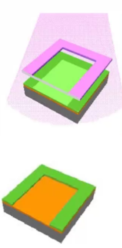

* **刻蚀**：在光刻胶的掩蔽下，根据需要形成微图形的膜层不同，会采用不同种类的*刻蚀剂*和对应的刻蚀方法在膜层上进行刻蚀，也就是剥离掉没有没光刻胶掩蔽的当前层物质。这一步是为了让光刻胶的图形以实体化的材料形式转移到膜层上

    

* **薄膜沉积**：在光刻胶的掩蔽下，以物理或化学的方式（PVD、CVD）在晶圆表面制造一层由特定材料构成的薄膜。

    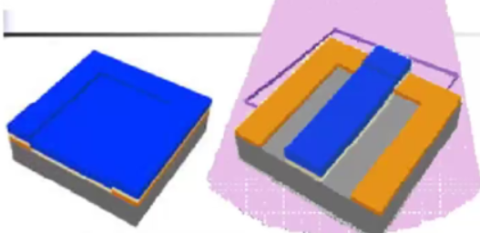

* **扩散**或**离子注入**：将需要的杂质以一定方式（扩散法或离子注入法）加入晶圆上某一层，从而将表面的本征半导体改为掺杂半导体，改变其电学特征。

    **光刻-蚀刻-薄膜沉积-掺杂-去胶工艺综合使用，就可以在硅片表面制造需要的半导体器件了**

    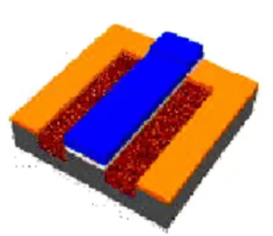

* **金属化**：采用化学或物理方法在芯片上沉积一层导电金属薄膜，再配合光刻和蚀刻即可形成布线。

    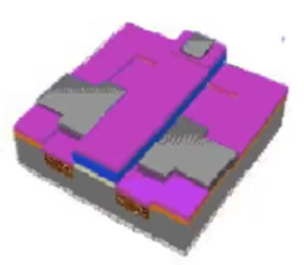

* 裸die**测试**：硅片上每个芯片都要进行测试，挑选出有缺陷的芯片剔除出去。

* **封装**：芯片需要按照功能不同进行对应封装，裸die在这一步工艺中被bonding——用金线连接芯片上引出的绑定点和封装外的金属引脚，并使用聚合树脂材料进行封装

* 封装**测试**：完成封装后芯片会再进行依次测试以确保功能正常

工艺流程也可以分为前后端，*最后三个测试-封装-测试过程一般被归类为后端，而前面的工艺流程一般会组合使用来制造一枚完整的芯片，被归类为前端*。

下面来分工艺进行介绍

## 光刻

光刻就是通过光学手段在晶圆上印制layout的过程，占据了芯片制造中40%-50%的工艺流程，因此Foundry加工时都会按照光刻步骤来收取工艺手续费。

光刻技术的精度（**分辨率**）到目前为止已经从早期的um级光刻演变到5nm等级，这都是围绕**Rayleigh公式**进行的
$$
Resolution=k_1 \frac{\lambda}{NA}
$$
其中λ表示照射光波长，NA表示透镜的数值孔径（Numerical Aperture），k1表示系数
$$
NA=n \times sin(\alpha)
$$
其中n表示介质折射率，α表示焦点和透镜边缘连线与主光轴的夹角，如下图所示

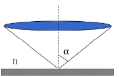

α反映了透镜的大小。**因此透镜越大，介质折射率越高，NA就越大**

光刻技术提高分辨率的手段有以下三种：

* **减小波长λ**

    从前期的193nmDUV发展到13nm**EUV**光刻，采用的光波长一路推进到极紫外光等级

* **提高NA**

    一般使用水为介质实现**浸没式光刻**，从而获得最大的透镜和较高的介质折射率

* **提高k1**

    使用**double patterning**、**光学修正**等手段

### 光刻工艺流程

光刻工艺具体来讲包含以下复杂的物理、化学过程：

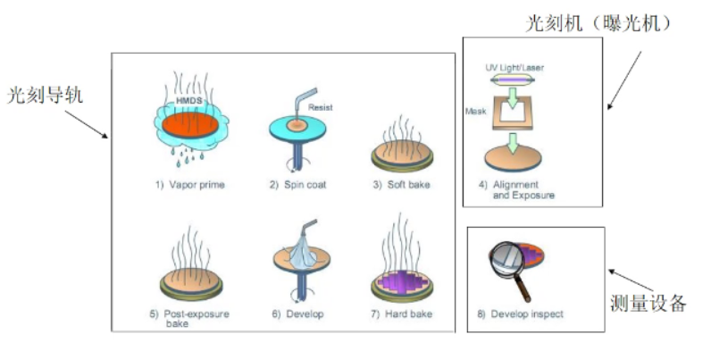

* **HMDS表面处理**

    HMDS即六甲基二硅胺。使用其在200℃下作用60s，可以让Si表面的Si-OH键变成Si-O-Si(CH3)3键，有机聚合物与甲基的附着性更好，因此可以让光刻胶更容易附着在硅片上

* **涂胶**

    光刻胶是液态的，这一步就是要将胶滴在晶圆表面，下方转台缓慢加速5s后持续匀速转动，利用离心作用让光刻胶在晶圆表面均匀分布

* **去边**

    在涂胶后，光刻胶会在硅片边缘形成较厚的边，会影响光刻图形的精度，而且在传送硅片时容易污染设备，因此在这一步要先将边缘的光刻胶去除掉

    光刻胶厚度计算公式如下：
    $$
    T=KS^\alpha (\frac{\eta^\beta}{\omega^\gamma R^2})^{-\frac{1}{3}}
    $$
    其中T：光刻胶厚度；S：固体溶质百分比；η：粘度；ω：旋转角速度；R：硅片半径；S和η会随着溶剂蒸发而改变，粘度越大，产生光刻胶厚度就越厚

* **前烘**

    涂胶后，硅片表面容易产生涂胶不均匀的情况，主要情况有以下几种

    

    因此要引入前烘干，这步可以实现以下功能：

    * 去除80%到90%溶剂
    * 释放光刻胶表面应力
    * 提高光刻胶粘附性

    但是这步的作用时间很关键，如果过度烘干，会降低光刻胶敏感性，后面的曝光步骤会受到影响；如果烘干不足，显影时的分辨率也会出现降低

* **曝光**

    这是光刻机的核心操作。根据曝光模式不同，光刻机可以被分为：**接触式**、**接近式**、**投影式**、**直接写入式**；光刻机使用的光源及其对应光波长也有区分：g-line（436nm）、i-line（365nm）、KrF（248nm）、ArF（193nm）、F2（157nm）。在这一步要根据光刻胶敏感度确定曝光剂量在何时区间，否则会影响图形

    实验室中一般采用简单的接触式和接近式光刻，而在工业生产中则采用投影式光刻

    使用到光刻胶分两种：**正胶**和**负胶**，**正胶经过光刻后会被破坏掉曝光部分的化学键，留下被光刻板掩盖住的部分，起到“正刻”作用；负胶则在经过光刻后让对应位置原子成键，也就是留下曝光部分，被光刻板掩盖的部分会被破坏掉**。需要注意：在曝光这一步完成后光刻胶只是产生光化学反应让对应位置的化学键破坏或交叉生成中间物，需要等到后面显影步骤洗去与显影液互溶的部分才能让光刻图像保留下来

    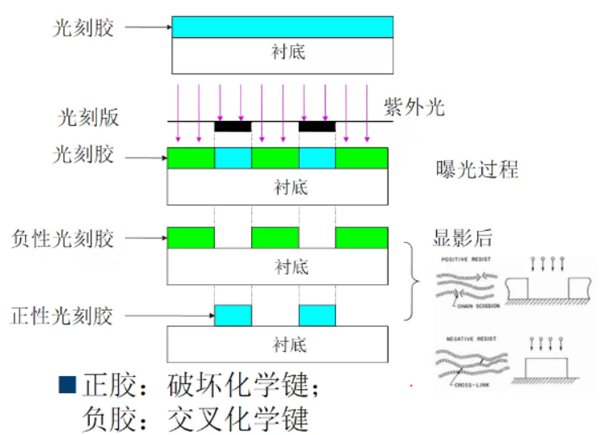

* **显影**

    这一步一般使用**TMAH**溶剂在20℃下作用1min，完成光刻胶中化学成分的转换。正胶曝光后会产生酸性物质，使用碱性显影液显影后就可以将曝过光的部分光刻胶图形腐蚀掉；负胶曝光后会生成碱性的掩膜层，这样就保护曝光过的部分不被腐蚀。除了腐蚀以外光刻胶还可能基于溶解度原理实现显影，但总的来说都是让被掩蔽没有接受的曝光的部分或接受过曝光的部分被洗去。显影步骤中可能出现的严重问题是*显影不足造成光刻胶的不规则残留*

* **坚膜（后烘）**

    完成显影后的晶圆还需要在120℃热环境中进行10min左右的后烘干，这一步是为了提高阻挡层的强度和粘附性，并防止其发生膨胀。光刻

* **检测**

    最后一步就是对光刻完成的晶圆进行检查，如果出现不合格的产品要及时标记并在之后的步骤中清除出去。这一步被称为*显影后检测*（ADI，After Development Inspection），将一个无缺陷的标准图形与每个芯片的图形比较，出现不同点就在硅片defect map中显示（顺带提一下，这个算法一般使用模板匹配），从而及时将硅片表面缺陷检测出来

### 光刻胶

光刻胶是一种成分复杂的化学试剂，其中主要含有**聚合物**、**溶剂**、**感光剂**和**染色添加剂**。聚合物是胶膜的肢体材料，一般是固体有机材料，具有光敏特性，能够在UV曝光后发生光化学反应改变其溶解性，从溶剂中析出转移到硅片上，从而让图形能够转移到硅片。溶剂起到溶解聚合物的作用，能够让光刻胶维持粘稠液态，经过旋转后得到薄光刻胶膜。感光剂负责控制光化学反应，还可以辅助决定曝光的时间和强度。还会为了达到不同工艺效果而额外加入不同添加剂

光刻胶一般具有如下工艺要求：

* **高分辨率**：光刻胶在硅片上形成的胶膜必须薄，以此来提高分辨率，
* **高抗刻蚀性**：光刻胶薄可以提高分辨率，但是相对应抗刻蚀和离子注入的能力会降低，因此需要尽可能提高光刻胶单位厚度下的抗刻蚀性，防止后续工序中因为光刻胶抗刻蚀能力低导致刻蚀出现问题
* **高粘附性**：光刻胶必须能够良好附着在硅片表面
* **注入屏蔽能力强、针孔少**：光刻胶需要尽可能提高屏蔽离子注入的能力，这就要让光刻胶变厚，因此需要找到一个合适的区间，既能让光刻胶有高分辨率又不会因为过薄而降低其屏蔽性能
* **宽工艺窗口**：一种好光刻胶需要能适应工艺的变更

光刻胶的常见材料包括以下几种：

* **二元正性光刻胶**

    由敏化剂和酚醛树脂胶共同构成，使用其他有机溶剂溶解成胶

    **敏化剂**是一种由辐射而形成的酸，对氨气（氨水）敏感，本身不溶于碱溶液，但在暴露于光辐射后发生变性，就可以溶解在对应显影剂中。酚醛树脂在其中的占比在80%以上，不与光发生反应，呈酸性，可以缓慢溶解在碱性溶液中，其具体结构和组成会影响粘度和胶在显影剂中的溶解度

    敏化剂是光刻胶中起到光转化作用的主要材料

* **一元正性光刻胶**

    可以使用**聚甲基丙烯酸甲酯PMMA**制造，分子量比较大（200-1000k），因此分辨率较高但灵敏度低。在受到光辐射后会发生聚合物断链，形成大量低分子量的聚合物，因此显影过程中直接选择性洗去低分子量聚合物即可达到要求

* **二元负性光刻胶**

    同样由敏化剂和酚醛树脂构成，但敏化剂会在光照后发生变性，促进酚醛树脂发生聚合反应生成更长的链和更大的分子量，在后续显影中留存下来

* **一元负性光刻胶**

    使用PMMA制造，但这里使用的PMMA会在光照后发生化学链交叉，形成大分子链，不易被洗去，造成了负性光刻胶效果

光刻胶的轮廓在理想情况下是上下垂直的，如下图所示：

但实际上光刻胶轮廓壁有一定倾角，呈梯形（没有图示那么平缓），*这与光刻胶的对比度（分辨率）和曝光轮廓有关*。由于光子的**驻波效应**，在倾角比较大的轮廓壁内还可能会发生散射问题，这在有很多阶梯（平行布置的线形图像光刻的情况）的图形中尤为突出：

一排阶梯的侧面会将入射光一部分反射到光刻胶内部，反射光和入射光叠加出现驻波，就会令有些区域的光刻胶收到强照射，有些区域的胶只受到弱照射，*在胶层侧壁形成凹凸的花纹*（会引起分辨率降低)，在曝光以后就会让光刻胶层侧面变成下图这样，之后不论是离子注入、刻蚀还是薄膜沉积都会收到影响

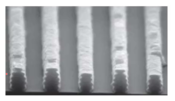

> 驻波效应的缓解方法有以下三种：
>
> * 涂反射层，减少光散射，帮助光刻胶成像。这种方法可以降低散射光同时平整晶圆表面结构；但对工艺要求提高，并且膜厚和后期显影会受到影响
>
>     抗反射涂层（ARC，Anti-Reflective Coating）按照涂敷位置可分为顶部和底部ARC（BARC和TARC）。BARC涂敷在光刻胶底部，减少反射光，一般使用有机物在硅片表面旋涂（利用有机物直接吸收入射光）或无机物在硅片表面PECVD（使用TiN或SiN在硅片表面进行等离子增强化学气相沉积，通过特定波长光相位相消）得到。TARC涂敷在光刻胶顶部，不会吸收光，而是通过特定波长光相位相消来消除反射
>
> * 将光刻胶层侧壁变得垂直。这种方法相对于上种可以更好解决驻波问题，同时只需要改变光刻胶主体材料，各大厂商所使用的解决思路大都是这种

要获得垂直的光刻胶侧壁，可以考虑下面几种方式：

* **大对比度**
* 小吸收
* 小光散射
* **高注入剂量**
* 缩短曝光时间
* 使用薄光刻胶层
* 缩短显影时间

前三个解决思路是从光刻胶角度出发，总体思想就是提高光刻胶性能。

**化学放大光刻胶**和**多层光刻胶**是两种比较常用的提高光刻胶性能的方法。化学放大光刻胶即CA光刻胶，使用催化反应让光刻胶中的敏化剂敏感性增强，并通过PAG（Photoacid Generator光致产酸剂）的分解来产生强酸，在热作用下扩散并将光刻胶主体材料中对酸敏感的部分分解成可溶于*碱性溶液*的小分子基团。这样，显影过程中由于小分子基团和未发生变化部分材料的溶解度差异来让主体材料溶解达到光刻作用。这个方法可以让光刻胶获得高分辨率，但对空气中污染物也更敏感，而且抗刻蚀性能会大幅下降。另一种方法是多层光刻胶（Bi-layer双层胶或Tri-layer三层胶）：利用多层光刻胶累加赋予整体光刻胶层更高分辨率和更强的抗刻蚀性能，但这会复杂化工艺

后四种解决思路则从光刻机出发，从工艺和装置角度改善。

高注入剂量能够让胶层侧壁垂直，但会导致下图所示的图形尺寸变小，计量不足会导致图形无法形成

缩短曝光和显影时间也存在着可能无法形成图像的副作用，需要根据晶圆具体情况而定

### 光刻板

光刻板（Mask或称为Reticle）工艺相对简单，以石英为衬底，覆盖金属铬防止透光

### 光刻机性能指标

1. 分辨率

    光刻机的分辨率参数分为**pitch分辨率**和**feature分辨率**两类。其中pitch分辨率指光刻工艺可以制作最小周期的一半，决定了芯片上晶体管之间的距离，直接影响到芯片的**成本**；feature分辨率是指光刻工艺可以制作的最小特征图形的尺寸（Critical Feature，CD，关键尺寸），决定了芯片上每个晶体管的大小，与芯片**运行速度和功耗**有直接关系

    对于占空比为1：1的周期性结构，两类分辨率相同

    

2. 套刻精度

    一个晶圆往往需要经过几十上百次曝光才能将不同掩膜层逐层转移到硅片上，每层图形都需要精确转移到硅片上的正确位置，使其相对于上层图形的位置误差在容限范围内。**套刻精度就用于描述硅片上新一层图形相对上一层图形位置的误差大小**

    **套刻精度与CD密切相关**，CD越小要求的套刻精度就越高，一般而言*套刻精度要小于CD的30%*

    

    与套刻精度相关，在如果以相同曝光剂量对不同厚度的光刻胶曝光，就会引起CD误差，这被称为**摆线效益**。

### 在光刻中常出现的问题

* 驻波效应（Standing Wave Effect）

* 摆线效应（Swing Curve Effect）

* **脚状图形**（Footing Profiles）

    在光刻胶底部出现曝光不足，显影后就会有明显光刻胶残留

    解决方案包括：避免光刻胶暴露在碱性环境中导致老化；清理硅片表面，防止基底上有碱性物质残留，再涂胶

* **T形图形**（T-Top Profiles）

    由于光刻胶表面感光剂不足而造成表层光刻胶图形尺寸变化

    主要解决方案就是要防止光刻中的碱性气体污染

### 浸没式光刻技术

最开始提到过浸没式光刻可以提高折射率NA。浸没式光刻基本原理就是在光学镜头和硅片之间充满水，从而提高折射率，但相对引入了表面缺陷（水渍残留、光刻胶与水反应、水中的颗粒），加大了对准难度（水中气泡）

水的折射率为1.33，透镜的折射率在1.5到1.8，空气折射率为1.0，而NA最大值受限于光路通过介质中n的最小值，如果将空气换成水可以大大提高NA

### 分辨率增强技术

分辨率增强技术（RET，Resolution Enhanced Technology）旨在修改光刻机结构和工艺而不是光刻胶来提高光刻的分辨率。包括以下几类：

**偏轴曝光**（OAI，Off Axis Illumination）：改变光源入射光方向使之与掩模版保持一定角度，捕获高阶衍射光，改善光强分布均匀性，从而增加分辨率；但会削弱光强

**相移掩模版**（PSM，Phase Shift Mask）：在掩模版上周期性在相邻图形中每隔一个图形特征对掩模版结构进行改变（加厚或减薄掩模版），使相邻图形的相位差相差180度，可以起到提高k1的作用，从而提升分辨率，但这会增加掩模版的制作难度（需要精确控制每个加厚和减薄台阶的高度）和成本（约增加10倍之高）

**光学近似修正**（OPC，Optical Proximity Correction）：在曝光过程中往往会因为光学邻近效应使最后图形质量下降，可以使用*智能型掩模版工程*来补偿这种尺寸变化——说人话就是在光刻板设计阶段就利用算法计算出最适合某处图形宽度的特征尺寸，从而修正可能的失真。具体措施包括但不限于*图形补偿（随图形密度而动态改变特征尺寸）*、*光刻板修正（将容易出现问题的图形拐角变圆）*等等

上图展示出图形补偿工艺；下图展示光刻板修正工艺

**二次光刻**（Double Patterning）：每次光刻板上的一部分，通过两次光刻的组合来提高整体分辨率。这会降低加工效率、提高成本

## 清洗

硅器件的性能、稳定性和电路成品率受到硅片表面或器件表面的**化学沾污**、**微粒沾污**影响极大，随着硅器件尺寸不断缩小，对原始硅片和氧化后图形化后的硅片进行清洗更加重要。

> 任何本质上是有机或无机的外来物质在制造过程中接触到半导体表面，都有可能成为硅器件或精密装置中的致命缺陷。沾污中的粒子和金属分别可以用**颗粒密度**和**微量金属浓度**来描述，但除此之外还会存在**无法检测的致命缺陷**，随着清洗技术不断提高，对这类沾污将会进一步了解，但目前业界无法处理这种沾污

清洗这个工艺听上去很简单，目的就是**在不损伤晶圆表面或退化性改变的条件下去除晶圆表面的微粒或化学沾污**，但实际上相当复杂，需要一整套物理、化学工艺流程才能实现，常见的工艺分为：物理**干法清洗**、化学**湿法清洗**、**气相清洗**、特殊清洗（专门针对锗材料或化合物半导体材料加工）

下面主要针对硅晶圆介绍清洗工艺

### 硅片沾污

硅片沾污主要有四种来源。**设备**：包括各种机械、气体管道、镊子乃至离子注入设备和液体容器都会造成沾污；**人体**：来自操作者的沾污；**材料**：各种化学药品液体和气体的沾污，以及每个工艺步骤之间的化学处理残留物都会造成沾污；**过程**：以上各部分污染源处理中造成沾污

沾污主要分为三种类型：

* 分子型：比较大的分子基团附着在晶圆表面，会阻碍和掩蔽加工过程、削弱粘连效果、在薄膜中造成核缺陷，甚至会形成有害（不管是对于操作人员还是对于工艺过程）的分解物。分子沾污会降低清洗或冲洗效果，并且会对良好粘连的沉积膜造成损伤，还可能在后续工艺中形成有害分解物
* 离子型：以离子形式存在的杂质，在高温或电场作用下，离子沾污会很容易地扩散进入半导体内部，因此会在晶圆表面、层级内部和界面发生扩散，在器件中引起晶格缺陷、电缺陷、性能退化，降低成品率，还会降低氧化膜击穿电压。
* 原子型：以单个或多个原子形式存在的沾污，其中以金属原子对半导体器件产生的危害最大（原子电势顺序中，硅排在氢前，*重金属*（轻金属和碱金属的影响远不如重金属影响大）更容易通过化学电流的运动扩散到硅片衬底，引起过量漏电流，导致性能退化和稳定性问题）。易于扩散而且往往引起表面导电抑或是跨接在导线间引起短路，严重的甚至会导致晶体成核缺陷，这会降低少子寿命和器件的电性能，还会影响产品成品率

如何**避免沾污**呢？一个是要**提高环境的洁净度**，另一个就是要**严格控制加工过程**。晶圆加工中的所有化学试剂都要使用超纯、低微粒的原料、有机溶剂、去离子水。在半导体厂商中，往往会使用**SIMS**次级离子质谱法、**TXRF**全反射荧光分析法等通过衍射、振动和成像的高精度方法探测晶圆表面，工序之间都会进行检查以及时找到沾污。在加工过程中，也往往使用高度真空的环境和尽可能小振动的器件来尽量避免沾污

相对于避免沾污，**清洗工艺**就复杂很多——但往往沾污难以避免，因此清洗工艺就更加关键。半导体工业早期，一般使用力学和化学方法清洗，但效果不佳，直到1970年Kern首次发表了**RCA清洗技术**，晶圆清洗才有了现实意义的可行性，到目前为止，清洗工艺在传统的湿法化学工艺基础上通过引入H2O2的方法控制清洗浓度并降低表面刻蚀速率达成了令人满意的效果。而利用物理方法的**干法清洗**依托刻蚀技术发展引入了产线，现在已经成为**主流**的清洗方法，**逐步取代了传统的湿法清洗**

沾污通常由于三种作用而形成：**表面效应**，也就是束缚沾污的力；**化学吸附**，即化学键作用；**物理吸附**，通常是指范德瓦尔斯力或分子间作用力。单纯用物理方法很难去掉沾污，因为微观尺度上这三种力是非常强大的，因此需要借助化学清洗甚至直接去掉硅片表面的一个薄层才能实现去除

### 硅片沾污的测量

### 湿法清洗

湿法清洗就是利用**水溶液**进行清洗，有以下优点：

* 易于使用，成本低廉
* 通过冲洗去离子水并使用合适的干燥方法来避免干燥后留下残留物
* 不易燃或易燃危险低
* 易于处理废弃物，环境污染小
* 去污效果好
* 水溶液比有机溶剂蒸汽压低，清洗方便
* 通过挑选溶质来进行选择性清洗

有以下缺点：

* 水溶液蒸汽压低导致干燥时不如有机溶剂快
* 由于需要干燥所以存在二次污染的风险
* 去除有机沾污时不如有机溶剂效果好
* 吸入某些化学品的水溶液或蒸汽具有危险性
* 某些化学品废液处理困难
* 水溶液与真空系统连接存在困难

考虑沾污形成过程中的吸附力，最主要的就是**衬底的化学性质**——衬底表面的化学性质决定了其表面发生化学反应的活性，并对沾污间形成化学键的方向产生影响。此外，**衬底的晶体结构**会影响到分子间短程力，也是一大重要影响因素——晶体表面结构可能呈现多孔、粗糙、光滑等多种形态，表面结构决定了*粒子与衬底表面距离多近时对吸附起重要作用的短程力才会变得比较显著*，同时还决定了经过处理后晶体表面滞留的沾污数量

> 热生长和热分解形成的氧化层表面致密程度不同，导致滞留的沾污数量有很大差别

对于湿法工艺，需要考虑清洗的沾污是有机物还是无机物：相似相溶并不总是有效，因此对于大多数有机沾污，都需要考虑让沾污与溶液中某种成分反应转化成易溶于水的物质，或者通过添加强氧化剂将不溶的有机沾污氧化成易溶物；而对于离子型态的物理沾污，总是会进入到晶片的亚表层，这时就需要用刻蚀的手段去除沾污，这也就是干法清洗的基本原理

湿法清洗工艺中最常见的清洗剂就是**RCA清洗剂**，分为SC-1和SC-2，配方如下所示：

二者比例都是1：1：5

对于完整的RCA清洗工艺，可以如下描述：

RCA清洗的步骤经过严格设计，不能随意改动，以免引起二次沾污。使用的清洗液浓度也需要经过严格计算，在刻蚀清洗中，如果刻蚀剂浓度过高，就会导致晶片表面粗糙，影响器件电特性；刻蚀剂浓度过低，则不能让氧化层中的金属杂质被去掉。温度（温度越高，反应速率越快）、清洗时间（反应物会随清洗时间发生分解，影响清洗效果）、表面张力（表面张力提高会让清洗更加彻底）、夹具（夹具不合理会导致二次沾污）等都需要经过严格设计

清洗设备一般有以下两种：

* 浸入式

    将硅片连续不断放入装有清洗液的分立清洗槽中。该法化学原料选择广，易于实现；但是对化学品和工作空间要求严格，必需实时监控原料及时更换补充

* 喷射式

    使用高压离心喷射腐蚀性或苛性化学药品到硅片上。该法能够借助高压喷射物理去除沾污，但是缩短了清洗液与表面发生化学反应的时间，对系统的保养要求高

* 超声波式

    使用超声和兆声振荡去除晶圆表面微粒。设备简单、操作方便；但存在高温和空心气泡爆裂导致表面损伤的可能

### 湿法清洗的局限性

1. 湿法晶片的清洗操作和工艺存在明显不兼容，有碍于集成化趋势。

    要实现所有加工尺度的低压集束工艺，就需要开发出可以从镜片表面去除微量沾污的气相清洗技术，否则无法实现低压集束工艺

2. 在先进制程的大深宽比结构中，湿法工艺存在一定困难，结构中残存的杂质势必会重新污染镜片

3. 湿法工艺中使用液体化学品和冲洗干燥环节往往难以控制微粒，很可能造成二次沾污

4. 湿法清洗中需要使用高纯化学品和去离子水，成本高、具有危险性且废物难以处理

### 干法清洗

目前干法清洗已经在高端器件制造中全面取代湿法清洗工艺。但存在成本过高和效率不足的问题，因此还需要进一步研发才能适应大规模工业生产需求。**目前的发展趋势是干法工艺作为集成工艺系统的一部分，在其他各个关键工艺中插入使用，而不是将其作为单独的清洗单元使用**

干法清洗的核心机理：**将化学沾污转化为某种挥发性化合物，直接去除一薄层衬底来一同去除沾污，通过溅射方式去除化学沾污**，因此干法技术既使用了物理反应，也使用了化学反应，同时也**采用了更为灵活的热增强效应**，其**清洗剂压力可以在很大范围内控制**

## 刻蚀

## 掺杂与离子注入

掺杂工艺目的就是让本征半导体中加入一定量杂质成为掺杂半导体

最传统也是最基础的掺杂工艺就是**扩散**

离子注入使用到了**等离子态**

当有高能电离的分子或原子的聚集体存在时就会出现等离子体。将一定气体暴露在高能电场中，就能诱发等离子态

如果采用离子注入工艺进行掺杂，可以带胶进行操作。采用扩散工艺进行掺杂为什么不能带胶操作？
答：扩散工艺需要高温，只能使用氮化物或者氧化物作为掩膜；离子注入工艺是低温操作，所以可以带胶操作

## 薄膜沉积

薄膜沉积工艺中要制造的薄膜主要包括**单晶薄膜**、**多晶薄膜**、**非晶薄膜**和**有机分子薄膜**，将需要的材料使用**PVD**、**CVD**等各种原理沉积在晶圆表面的工艺就是薄膜沉积，这一步是为了在晶圆表面形成每一层的器件结构

一般薄膜内存在*点缺陷*，包括空位、空洞、杂质和位错，缺陷对芯片制造很重要，往往会导致制造器件不能按照理想方式工作，也就是不合格片

薄膜最重要的固有特性是**粘附性**和**内应力**，内应力分为**张应力**和**压应力**

薄膜中最重要的薄膜就是SiO2薄膜，它能够起到掩蔽、绝缘等多种作用，CMOS工艺中的SiO2薄膜是使用**热氧化**工艺将硅表面层直接转化而来。目前也出现了众多新材料薄膜，比如氮化硅SiN薄膜，它的介质特性优于二氧化硅膜，具有以下基本特征：1.结构致密、针孔密度小，因此抗钠、耐水汽能力强，可用于芯片表面钝化膜和保护膜；2.化学稳定性好，耐酸碱性能高，可以作为集成电路浅沟隔离工艺技术的CMP的停止层；3.对可动离子阻挡能力强，常用于掩蔽膜；4.介电常数高，适合作为电容的介质膜；5.抗氧化能力强，在需要选择性热氧化的场合中可作为选择性热氧化的掩膜

> 硅与氧化剂（一般使用氧气或水蒸气）在高温条件下（1000℃）左右会反应生成SiO2，这个过程称为热氧化
>
> 因此根据反应物不同，热氧化工艺也分为：
>
> * 干氧氧化：使用氧气氧化
> * 湿氧氧化：使用水氧化
> * 水汽氧化：使用高温水蒸气氧化

热氧化过程中存在一些问题：氧化层厚度不均、表面出现斑点、存在针孔、存在钠离子污染等。因此需要使用特殊方法来分析薄膜性能，常用的分析角度有以下几种：

**厚度**、**表面形貌**、**薄膜稳定性可靠性**、**薄膜成分分析**、**薄膜结构分析**

一般使用下面的技术进行评估：

**SiO2薄膜表面观察法**

**SiO2薄膜厚度测量**

**比色法估算SiO2氧化层厚度**

### 薄膜工艺

薄膜沉积工艺主要分为**PVD**和**CVD**，也就是**物理气相沉积**和**化学气相沉积**，分别利用物理方法和化学反应在硅片表面制造薄膜。

PVD使用固态或熔融物质作为靶材，经物理过程使其进入气相后包围衬底（要求气相下靶材不与衬底反应），处于低气压环境下，这样分子的散射作用就会大大减小，气相分子运动路径接近于直线，让气相分子在衬底上直接沉积下来。

比较常见的PVD工艺有以下几种：

**溅射**——将需要的材料变为高密度等离子态后打到衬底表面，在这个过程中要使用到氩气保护并使用大量冷却水防止晶圆过热，还要利用高压电流让离子束维持等离子态，中间定向发射的过程则由磁效应控制或使用激光扫描脉冲完成

**真空蒸镀**（Vacuum Evaporation）技术是指在真空环境中将要沉积的材料加热蒸发或升华，并让他在晶圆表面沉积析出成膜，这也是最一般的制作薄膜的方法。真空蒸镀工艺的四大关键参数包括：工艺真空、饱和蒸气压、蒸发速率、沉积速率

真空蒸镀法也是最早发明的**PVD物理气相沉积**工艺，其优点包括：设备简单、操作容易；薄膜纯度高质量好，可以精确控制厚度；成膜速率高，用掩膜可以获得清晰的图形；薄膜的生长机理比较单纯，工艺重复性好。他的主要缺点就是不容易获得结晶结构的薄膜，这样形成的薄膜在晶圆上的粘附力较弱

PVD还包含**真空离子镀**工艺

CVD则可以按照工艺沉淀温度分为低温（200-500℃）、中温（500-1000℃）、高温（1000-1300℃），按反应压力分为常压**APCVD**（大气压下进行）和低压**LPCVD**，按反应壁温度则可以分成**热壁**和**冷壁**式，按照反应激活方式可以分为**热激活**、**等离子体激活**（**PECVD**等离子体增强化学气相沉积）、**光激活**（Photo CVD，光激发CVD）等

其中LPCVD和PECVD是目前比较常用的工艺

其他CVD包括：MOCVD（Metal Organic CVD）、电子回旋共振（Electron Cyclotron Resonance，ECR）CVD、超高真空CVD（Ultra High Vacuum，UHV）、混合（Hybrid）激发CVD等

## 封装

### bonding

# 集成电路封测
