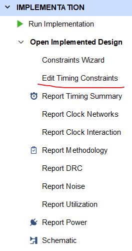
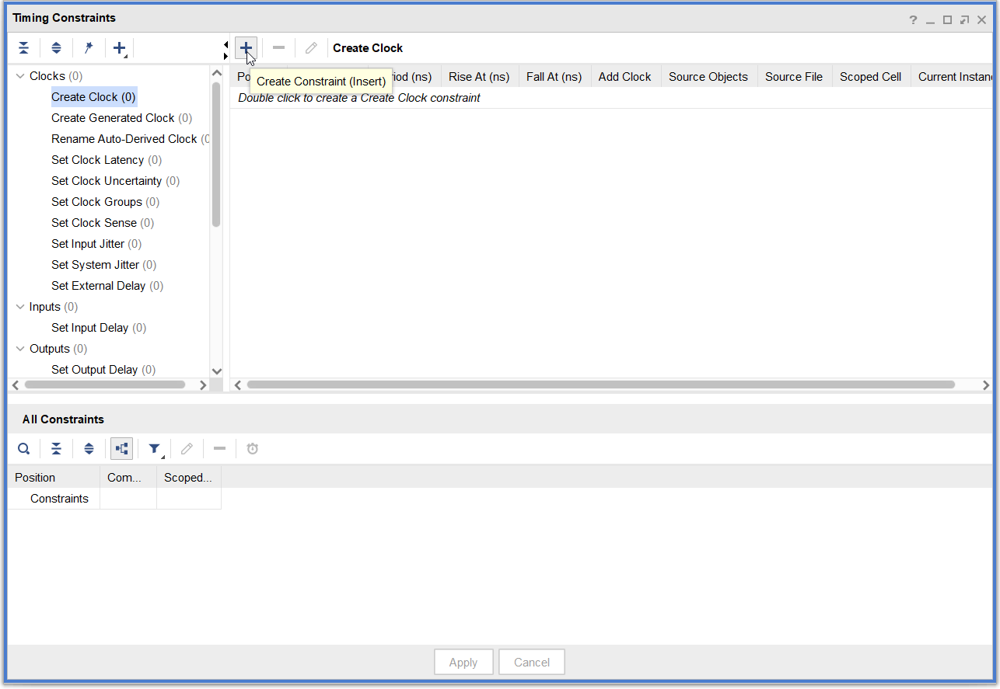
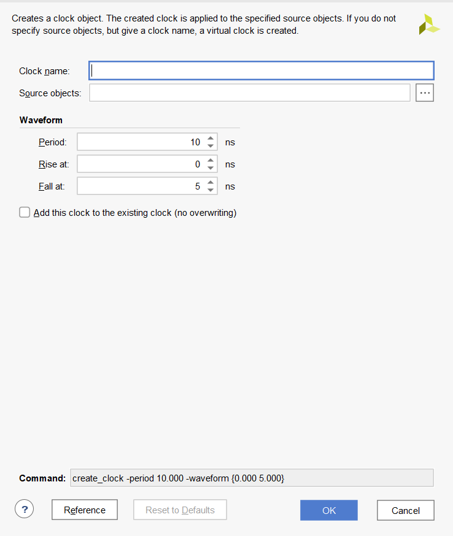

# FPGA学习笔记【时序约束】

本篇博文主要介绍Xilinx FPGA的时序约束概念和基本xdc语法

## 片上时序

在介绍时序约束前，先回顾一下数电中讲到的有关数据延迟的知识点

### 逻辑级数

**逻辑级数**：组合逻辑中，一般将一级LUT视为一个逻辑等级；时序逻辑中，一个触发器或锁存器会被视为一个逻辑等级。FPGA片上电路的逻辑级数就等于所有通路中最长的总逻辑等级

**扇出数**：连接到同一个输出网络的元件数，也就是数据流中一个上级元件连接到下级元件的数目

**时序路径**：包含了起点和终点的数字信号通路

每个时序路径都有一个起点和一个终点，*起点*是时序单元的时钟引脚或者设计的输入端口；*终点*是时序单元的数据输入引脚或者设计的输出端口

时序路径表明了某个数字信号传输过程中经历的延迟。我们通常选取数条最糟糕（延迟最高）的时序路径作为分析对象，它们称为**关键路径**（Critical Path）

### 竞争冒险

**竞争**：从输入到输出的途径不同，延时时间不同，到达输出端的时间不同，这种现象为竞争

**冒险**：输入信号变化导致逻辑电路产生错误输出，称为冒险或险象

信号竞争会导致两路信号传递到同一个触发器的时间不同，从而引发冒险；冒险则会导致电路整体不能正常工作

**亚稳态**：由于冒险产生的毛刺或不稳定状态统称亚稳态

亚稳态是导致电路失效的关键因素，我们要尽量避免亚稳态产生

### 数字信号的时钟裕量

**建立时间**：在触发器的时钟触发沿到来前，数据必须提前保持稳定的持续时间，以保证触发器可以顺利安全的取到数据，能满足触发器采样成功的最短时间称为建立时间

**保持时间**：在触发器的时钟触发沿到来之后数据必须保持稳定的持续时间

规定好建立时间就可以约束数据路径上的**最大**延时，若建立时间**违例**（Critical Failing），就很可能导致亚稳态产生；规定好保持时间可以约束数据路径的**最小**延时，

> 实际电路的建立时间越短，后级逻辑的采样间隔就可以更高；保持时间越短，前级逻辑的输出速率就可以更快，因此建立时间和保持时间是FPGA片上时钟速率的关键影响因素

**静态时序分析**（Static Timing Analysis，STA）就是针对关键路径的建立时间-保持时间进行分析，从而优化片上器件工作速率的方法

STA使用建立时间检查和保持时间检查来


## 跨时钟域问题

> 假设我们要使用低速串口发送从高速ADC读取的数据，会出现两个子电路时钟不匹配的问题；如果我们在FPGA中使用软核CPU搭建SoC，还常常会碰到CPU、片上总线、片上外设时钟不同的情况

在这种情况下，如果我们直接简单地用一个低速时钟向高速寄存器中写入数据，就很可能会出现*亚稳态*——读数据子电路在寄存器有效时间外进行读取，就会读取到错误的数据。因此我们要使用特殊的子电路处理跨时钟域的信号传输

最通用的方法就是使用**异步FIFO**或**双口RAM**，避免由于时钟交错产生的数据冒险。但是二者的开销对于部分场合明显太大了，因此**乒乓缓存**（也就是跨时钟域脉冲同步寄存器）常被用于单bit数据的跨时钟域传输，可以用相对小的开销实现跨时钟域数据传输

需要注意：乒乓缓存和异步FIFO只能把亚稳态的几率降到最低，**不能从理论上消除亚稳态**。复用多级乒乓缓存可以有效抑制亚稳态，但会引入跨时钟域延迟，这会降低FPGA的运行速率

> 乒乓缓存本质上是打两排——两个寄存器交替读写时发生亚稳态的概率是1%，但如果再引入一个寄存器，那么亚稳态的发生概率会变为原来的平方，出错概率会大大减少

### 时钟参数

**同步时钟**：来自同一个时钟源，且相位满足一定关系、频率有一定关系的时钟

> 有人认位频率相等、相位一致的时钟才是同步时钟，但实际上相位移满足一定关系的同源时钟也被视为同步
>
> 比如有
>
> ```
>              +--------+
>              |        |
>              |        |
>              |        |  75MHz 0
>   50MHz 0    |        +------------> C
> A  +----------->+  MMCM  |
>              |        |
>              |        |  100MHz 180
>              |        +------------> D
>              |        |
>              +--------+
> 
>              +--------+
>              |        |
>              |        |
>              |        |  75MHz 0
>   100MHz 0   |        +------------> E
> B  +----------->+  PLL   |
>              |        |
>              |        |  25MHz 0
>              |        +------------> F
>              |        |
>              +--------+
> ```
>
> 那么其中C、D是同步时钟，E、F也是同步时钟，但C、E或D、F都是异步时钟
>
> 时钟源可以是设计的端口，也可以是设计内部某个单元的引脚（通常是时钟生成逻辑的一部分）

**异步时钟**：来自不同时钟源，相位不一致、频率没有关系的时钟

不可扩展时钟：频率相差非常小的时钟

不可扩展时钟一般不能在FPGA上得到构建，布局布线工具会对两个频率相差非常小的时钟路径给出警告，在设计过程中也要避免出现不可扩展时钟

### 跨时钟域处理

1. 慢时钟域到快时钟域

    若是同一个时钟经过分频器得到的慢时钟和快时钟，即两个时钟同源，那么需要进行约束；如果两个时钟不同源，需要向STA工具传递异步时钟声明，避免对两个时钟进行分析

2. 快时钟域到慢时钟域


## Xilinx FPGA的时序约束

FPGA开发中存在两类约束

* **物理约束**
* **时序约束**

其中物理约束包含了引脚约束和片上布局约束，基本上按照FPGA的PCB设计编写；同时根据片上资源使用量来规划片上布局。FPGA源码中必须包含物理约束来规定IO

时序约束则包含了对关键路径时序的约束，布局布线工具会根据时序约束对片上电路进行优化。*时序约束告诉工具关键路径需要满足的建立时间、保持时间*。FPGA源码中不一定需要时序约束，时序约束更像是传递给综合器/布局布线工具的仿真参数

Vivado的时序分析中默认：

* 所有时钟都是关联的、同步的，对所有时钟路径做时序分析
* 需要单独对异步时钟路径进行异步时钟约束

在说明时序约束前，需要强调：低速的片上设计很可能不需要使用时序约束，时序约束的目的是**让综合器对片上电路系统的关键路径进行检查，查看仿真延迟符合目标延迟，如果不符合综合器会在一定程度上进行优化，若优化后仍不能满足约束条件，则需要人工放宽约束或修改RTL，从而尽可能提高FPGA的工作频率**

大多数数字电路都是按照*全局异步，局部同步*的时序设计的，但是**静态时序分析都是针对同步电路构建的，需要额外通过时序约束告诉STA工具不要分析对应异步的时序路径**

由于半导体制造工艺、设备使用环境等限制，每个芯片都有不同的内部电路物理结构，器件本身的延迟也就不同。影响设备延迟的主要条件包括：

* 工艺制程（Process）：制程越先进，器件能允许的延迟越高，对片上电路的时序要求越宽松
* 电压（Voltage）：片上电源电压在标称电压以上附近时器件处于最佳工作状态，可以允许更高的延迟，片上允许延迟会随电压降低呈对数下降
* 温度（Temperature）：对于半导体结温具有正温度系数的器件，温度越高，允许延迟越高；对于具有负温度系数的器件，温度在一个合适范围内的时候允许延迟会到达最低


这三种条件合称**PVT条件**（Process Voltage Temperature Condition）

STA工具可以根据上面的条件对时序路径的逻辑单元延时和互连线延时进行计算

一般来说仿真工具会提供三种工艺制程模型，同时给出这三种条件下的仿真结果供设计人员参考，Vivado也提供了对应的模型

* **Slow**（最差条件**Worst-Case Slow**）：制程最低（对应型号FPGA所使用的最落后制程工艺），温度最高（一般设置为125℃），电压较低（一般设置为内核标准供电电压的90%）的情况
* **Typical**（典型条件）：典型制程（对应型号FPGA所使用的最常见制程工艺），温度适中（一般设置为25℃），电压正合适（一般设置为内核标准供电电压）的情况
* **Fast**（最好条件**Best-Case Fast**）：制程最高（对应型号FPGA所使用的最新先进制程工艺），温度最低（一般设置为-40℃），电压较高（一般设置为内核标准供电电压的110%）的情况

需要注意：**在Fast（最大允许延迟）条件下，STA工具会检查建立时间；在Slow（最小允许延迟）环境下会检查保持时间。**


### 源时钟约束

向布局布线工具传递时钟路径的速率和占空比

源时钟约束和衍生时钟约束的基本语法如下

```tcl
create_clock -add -name sys_clk_pin -period 10.00 -waveform {0 5} [get_ports {CLK100MHZ}];
```

其中`create_clock`指明了该语句是时钟约束语句；参数`-name`指明了本条语句所创建时钟的名字；`-period`参数指明了时钟的周期，单位是ns；`-waveform`语句由一个元组构成，第一个元素是时钟上升沿时刻，第二个参数指明了适中的下降沿时刻；最后的`get_ports`语句用于确定要施加是一种约束的路径名

### 衍生时钟约束

经过用户自定义分频器/倍频器的时钟信号必须进行衍生时钟约束，规定时钟路径的速率、相位、占空比信息

但经过FPGA内时钟硬核（MCMM、PLL、BUFR等）生成的时钟不需要进行衍生时钟约束

> 事实上调用硬核后，Vivado会自动完成对这些时钟的约束，使用时序仿真时也会自动调用

如果手动编写时钟约束，只需要按照和上面一样的语法即可；但对于衍生时钟，Xilinx官方推荐使用Vivado的图形化配置功能以避免约束出错，流程在后续进行说明

需要清楚：时钟具有不确定性，我们常常还要用到不确定时钟声明来约束衍生时钟

时钟不确定性主要来源于以下三点：

* 时钟**偏差**（Diff）：时钟源与不同触发器中间的连线延迟导致时间偏差
* 时钟**抖动**（Jitter）：时钟边沿的超前或滞后
* 时钟**延迟**（Delay）：连线网络和时钟源内部电路导致的延迟

不确定时钟声明采用以下语句约束

```tcl
# 建立时间提前0.2ns
set_clock_uncertainty -setup 0.2 [get_ports CLK_UNC]
# 保持时间延后0.4ns
set_clock_uncertainty -hold 0.4 [get_ports CLK_UNC]
```

也可以使用`-from`和`-to`分别指定时钟输出和输入的两个端口（port）来表示本级逻辑中时钟输入输出之间存在不确定性

两个相移的衍生时钟可以用下面语句进行约束

```tcl
create_clock -period 10.00 -waveform {0 5.0} [get_ports CLK_0P]
create_clock -period 10.00 -waveform {5 10.0} [get_ports CLK_90P]
```

通过更改`-waveform`参数即可控制时钟延迟

### 异步时钟约束

对于异步时钟，时序约束主要是为了声名哪些路径传递了异步时钟，这是之前提到过Vivado的默认要求

异步时钟约束的基本语法如下

```tcl
create_clock -add -name sys_clk_async -asynchronous -period 10.00 -waveform {0 5} [get_ports {ACLK100MHZ}];
```

可以发现与上面语句的不同仅在于参数`-asynchronous`，添加该参数就可以指明异步时钟了

在使用异步FIFO的情况下，异步时钟约束可以有效提高布局布线得到的电路工作频率

### 互斥时钟约束

两个非同步时钟一定要进行时序约束，否则对应时钟路径可能会被布局布线工具优化掉

## 使用Vivado创建时钟时序约束

 Vivado中提供了时钟时序约束工具，可以通过图形界面生成xdc语句

使用`Edit Timing Constraints`可以打开时钟约束编辑器，首先选择要设置的时钟路径（可以通过内置的Tcl查询语句或图形界面来查找要编辑的路径），然后对时钟的延迟、周期、占空比、上升沿时刻、下降沿时刻等参数进行配置，Vivado会自动生成xdc语句并保存到约束文件中

在实现（Implemention）后的Timing信息框中可以查看**时序违例**（Timing Failing）情况，最坏时钟裕量（Worst Negative Slack，**WNS**）如果以红色字体显示，说明实现的结果不符合时序约束，需要对设计进行修改

使用Vivado的时序报告功能可以查看最好路径、最坏路径时序情况

根据最坏路径的时序情况，我们可以获得FPGA的运行频率（FPGA运行频率=1/最坏路径总延迟）

### 时钟约束编辑器工具



点击如图位置即可打开图形化的时钟约束编辑工具



点击上图所示的加号来创建时钟路径的约束，当然该工具还可以设置如左侧所示的很多时序约束语句



上图给出了新建时钟的页面，对应填写配置即可生成下方Command栏中显示的语句，并自动添加到项目的xdc文件中

## 参考资料

https://blog.csdn.net/qq_43045275/article/details/123832477