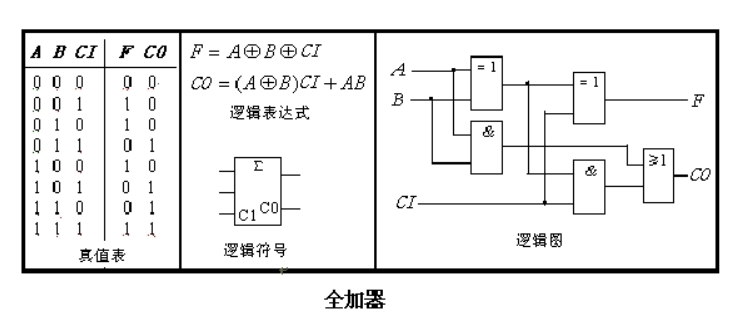

# 加法器

最简单的加法器拓扑中，一个n位二进制加法器由n个全加器构成，每个全加器由两个半加器构成

### 半加器和全加器

两个二进制数相加的真值表如下所示

| 加数a | 加数b | 进位cout | 和sum |
| ----- | ----- | -------- | ----- |
| 0     | 0     | 0        | 0     |
| 0     | 1     | 0        | 1     |
| 1     | 0     | 0        | 1     |
| 1     | 1     | 1        | 0     |

也就是说，存在以下逻辑关系：

$$
cout = a\oplus b\\
sum = a \& b
$$
在verilog中，使用以下代码描述半加器

```verilog
module half_add1 (
	input a,
    input b,
	output cout,
    output sum
);
    assign cout = a ^ b;
    assign sum = a & b;
endmodule
```

半加器只有两个输入端，无法处理来自前一位的进位数据，因此不能处理多位二进制数加法，可以改进出全加器，如下图所示



**全加器可看作一个三路表决器处理进位输出，一个三变量异或电路处理加和输出**

**全加器也可以看作两个半加器串联构成**


在verilog中，可以直接用`+`运算符表示加法器

```verilog
`define BITS 31
module Sub(
    input[BITS:0] a,
	input[BITS:0] b,
	input cin,
    output[BITS:0] sum,
	output cout
);
    assign {cout,sum} = a+b;
endmodule
```

也可以调用半加器模块形成一个全加器

```verilog
module HalfSum(
	input a,
    input b,
	output cout,
    output sum
);
    assign cout = a ^ b;
    assign sum = a & b;
endmodule

module Sum(
    input a,
	input b,
	input cin, //前一级进位输入
    output sum,
	output cout
);
    wire temp_sum;
    wire temp_cout_A;
    wire temp_cout_B;
    
    assign cout = temp_cout_A & temp_cout_B;
    
    HalfSum A(
        .a(cin),
        .b(temp_sum),
        .cout(temp_cout_A),
        .sum(sum)
    );
    
    HalfSum B(
        .a(a),
        .b(b),
        .cout(temp_cout_B),
        .sum(temp_sum)
    );
endmodule
```

将n个加法器级联起来就可形成**n位串行进位二进制加法器**

如果将前一个加法器的进位输出直接输出，这样就可以节省一个进位的时钟周期，让加法器单元可以并行排列实现计算，加快速度；但同时由于进位需要单独处理，和也需要在最后与进位相加，还需要引入对应的加法电路——最后可以改进出**n位超前进位加法器**

一个四位超前进位加法器的verilog实现如下所示

```verilog
module Adder (
  	input[3:0] a,
    input[3:0] b,
  	input c_in,
    output[3:0] sum,
  	output c_out
);
    
    wire[4:0] g,p,c;
    
    assign c[0] = c_in;
    assign p = a | b;
    assign g = a & b;
    assign c[1] = g[0]|(p[0]&c[0]);
    assign c[2] = g[1]|(p[1]&(g[0]|(p[0]&c[0])));
    assign c[3] = g[2]|(p[2]&(g[1]|(p[1]&(g[0]|(p[0]&c[0])))));
    assign c[4] = g[3]|(p[3]&(g[2]|(p[2]&(g[1]|(p[1]&(g[0]|(p[0]&c[0])))))));
    assign sum = p ^ c[3:0];
    assign c_out = c[4];
endmodule
```

这是一种典型的用空间换时间优化思路

# 减法器

电路中的有符号数通常使用**补码**表示

> 取负数的补码即将它按位取反后加1
>
> 如`a`是一个负数，其补码表示为`~a+1`

因此对于减法，可以理解为“加一个有符号负数”

即`a+(-b) = a+(~b+1) = a+(~b)+1`

在电路实现上，对加法器进行如下变换：

1. 信号a不变
2. 将信号b按位取反
3. 将输入进位位置1

这样就可以把加法器（全加器）改为减法器

下面的代码展示了一个减法器模块

```verilog
`define BITS 31
module Sub(
    input[BITS:0] a,
	input[BITS:0] b,
	input cin,
    output[BITS:0] diff,
	output cout
);
    assign {cout,diff} = a + (~b) + 1;
endmodule
```

但是现在的综合器一般都比较智能，可以直接用`a-b`进行减法运算

```verilog
`define BITS 31
module Sub(
    input[BITS:0] a,
	input[BITS:0] b,
	input cin,
    output[BITS:0] diff,
	output cout
);
    assign {cout,diff} = a-b;
endmodule
```

# 乘法器

乘法器基于移位和加法器构成

### 基本乘法器

使用verilog编写基本乘法器电路非常简单——一般来说都厂商的综合工具内置了乘法器电路的优化算法，只要使用`*`即可实现

```verilog
module BasicMultiply(
    input clk,
    input [7:0] x,
    input [7:0] y,
    
    output [15:0] result
);
    
    always @(posedge clk) begin
        result = x * y;
    end

endmodule
```

对于速度一般的FPGA电路使用这种方案已经足够，但是仍可以针对某方面特性进行优化

### 串行乘法器

它的速度很慢、时延很大，但是占用面积相当小，适合单独用于低速信号处理，可以节省宝贵的片上面积

```verilog
module SerialMultiply(
    input clk,
    input [7:0] x,
    input [7:0] y,
    
    output reg [15:0] result
);

    reg [1:0] state = 0; //状态机控制变量
    parameter s0 = 0;
    parameter s1 = 1;
    parameter s2 = 2;
    
    reg [2:0] count = 0;
    reg [15:0] P;
    reg [15:0] T;
    reg [7:0] y_reg;

    /* 使用状态机处理串行的数据输入并按位进行运算 */
    always @(posedge clk) begin
        case (state)
            s0: begin //复位
                count <= 0;
                P <= 0;
                y_reg <= y;
                T <= {{8{1'b0}}, x};
                state <= s1;
            end
            s1: begin //按位运算
                if(count == 3'b111)
                    state <= s2;
                else begin
                    if(y_reg[0] == 1'b1)
                        P <= P + T;
                    else
                        P <= P;
                    y_reg <= y_reg >> 1;
                    T <= T << 1;
                    count <= count + 1;
                    state <= s1;
                end
            end
            s2: begin //输出
                result <= P;
                state <= s0;
            end
            default: ;
        endcase
    end
endmodule
```

### 经过优化的逐位并行乘法器


### 流水线乘法器

对于FPGA，进位速度要快于加法速度（除非自带片上的加法器阵列硬核），因此逐位并行的迭代阵列并不适合FPGA实现，相比之下使用流水线设计就可以大大提升乘法器效率——相对应地引入寄存器也会增大面积

```verilog
module multi_4bits_pipelining(
    input [3:0] mul_a,
    input [3:0] mul_b,
    input clk,
    input rst_n,
    
    output reg [7:0] mul_out
);
    
    reg [7:0] stored0;
    reg [7:0] stored1;
    reg [7:0] stored2;
    reg [7:0] stored3;

    reg [7:0] add01;
    reg [7:0] add23;

    always @(posedge clk or negedge rst_n) begin
        if(!rst_n) begin //复位
            mul_out <= 0;
            stored0 <= 0;
            stored1 <= 0;
            stored2 <= 0;
            stored3 <= 0;
            add01 <= 0;
            add23 <= 0;
        end
        else begin //四段流水线
            stored0 <= mul_b[0]? {4'b0, mul_a} : 8'b0;
            stored1 <= mul_b[1]? {3'b0, mul_a, 1'b0} : 8'b0;
            stored2 <= mul_b[2]? {2'b0, mul_a, 2'b0} : 8'b0;
            stored3 <= mul_b[3]? {1'b0, mul_a, 3'b0} : 8'b0;

            add01 <= stored1 + stored0;
            add23 <= stored3 + stored2;

            mul_out <= add01 + add23;
        end
    end
endmodule
```

这就是在FPGA中应用较多的软乘法器了

对于更高速的乘法器已经不适合用FPGA实现，厂商一般会将其封装成DSP硬核嵌入，使用厂商的综合工具即可自动进行调用，这些乘法器的架构一般是下面的几种类型

### Wallace树乘法器


### Booth4乘法器


# 除法器

**除法器**（除法算法）是一类算法：给定两个整数 N（分子、被除数）和 D（分母、除数），计算它们的商和（或）余数

除法算法主要分为两类：**慢除法**和**快除法**

慢除法在每次迭代的过程中给出商的一位数字。慢除法包括复原法、非复原法和SRT除法等；快除法从商的一个近似估计开始，在每次迭代过程中产生有效位数为最终商的两倍的中间值

**简单的二进制除法器本质上是多次减法，循环执行直到余数小于除数为止**

也就是说硬件除法使用类似以下逻辑

```c
int divide=4;//除数
int p=32;//被除数
int i=1;//商
int rest=0;//余数

do
{
	p=p-divide;
  	rest=p;
  	i++;
} while (rest>divide);

return i;
```

## 常见除法逻辑

除法遵循的基本逻辑就是

被除数=**商**\*除数+**余数**


### 恢复余数除法

两个N位二进制数相除：

1. 设置2N位寄存器A的低N位存放被除数，设置2N位寄存器B的高N位存放除数，设置N位寄存器C存放商，设置计数器cnt

2. 将A左移一位，与B比较高N位大小

   若$A[2N-1:N] \geq B[2N-1:N]$，则令A=A-B，再令C左移一位，最低位为1；

   若$A[2N-1:N] < B[2N-1:N]$，则令C左移一位，最低为0；

3. 计数器cnt加1，

   若小于N则继续进行步骤2，否则结束计算。

4. 得到A中剩余的高N位为余数，C中的为商。

恢复余数除法采用串行结构，计算速度慢，且需要的时钟周期数不确定，不利于进行控制设计

verilog实现如下：

```verilog
`timescale 1ns/1ps

module divider(a,b,start,clk,rst,q,r,busy,ready,cnt);
    input   [31:0]  a;//被除数
    input   [15:0]  b;//除数
	input           start,rst,clk;//控制信号
    
    output  [31:0]  q;//商
    output  [15:0]  r;//余数
	output          busy,ready;//状态指示
    output  [4:0]   cnt;//计数器
    
	wire    [31:0]  a;
	wire    [15:0]  b;
	wire            ready,start,rst,clk;
	wire    [31:0]  q;
	wire    [15:0]  r;
	wire    [16:0]  sub_out;
	wire    [15:0]  mux_out;
    
	reg     [31:0]  reg_quotient;
	reg     [15:0]  reg_remainder;
	reg     [15:0]  reg_b;
	reg     [4:0]   cnt;
	reg             busy,busy2;
	
always@(posedge clk or posedge rst)
begin
    if(!rst)//复位
    begin
		cnt   <= 0;
		busy  <= 0;
		busy2 <= 0; 
	end else
    begin
		busy2 <= busy;//等待1个时钟周期脱离忙状态
        if(start)//开启
        begin
			reg_quotient  <= a;
			reg_remainder <= 16'b0;
			reg_b         <= b;
			cnt           <= 5'b0;
			busy          <= 1'b1;
        end	else if(busy)
        begin//执行32个循环
            reg_quotient  <= {reg_quotient[30:0],~sub_out[16]};//
			reg_remainder <= mux_out;   
			cnt  		  <= cnt + 1;
			if(cnt == 5'h1f)
				busy <= 0;//完成
		end
	end
end
	
assign ready   = (~busy)&busy2;//当不忙碌时就说明准备好了
assign sub_out = {r,q[31]} - {1'b0,reg_b};//减法输出
assign mux_out = sub_out[16]?{r[14:0],q[31]}:sub_out[15:0];//是否存储
assign q       = reg_quotient;//输出商
assign r       = reg_remainder;//输出余数
	
endmodule
```

### 交替加减法

交替加减法可以采用脉动阵列的形式，实现更高并行度，增加效率

verilog实现如下：

```verilog

```


# 微分与积分电路

数字电路实可以进行离散的微分和积分的，但是进行这样复杂的运算往往需要使用大面积的专用电路，所以通用计算设备往往采用CPU进行软件微分与积分处理，或者使用硬件处理更方便的积分，用软件处理微分运算


# DSP

数字信号处理（DSP）核一般会在高速的加法器、减法器、乘法器、除法器基础上引入**乘加器**（用一个时钟周期即可完成n位乘加运算）、**桶形移位器**（常用于定点数重定标）、**长流水线**等结构


# FPU


## 浮点数


### 定点数


### 浮点数


## 浮点数计算


