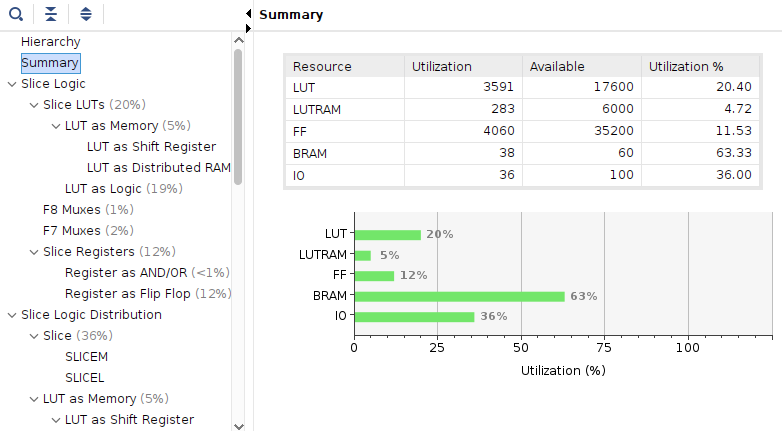
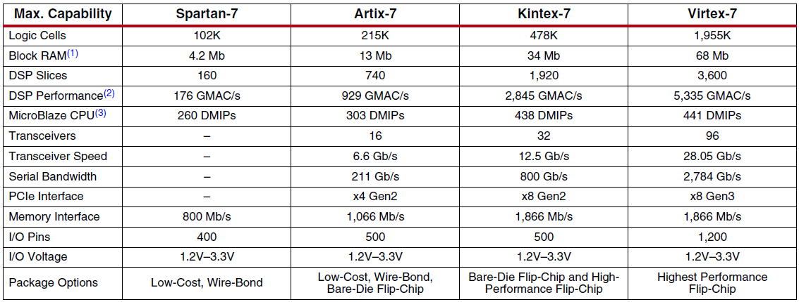
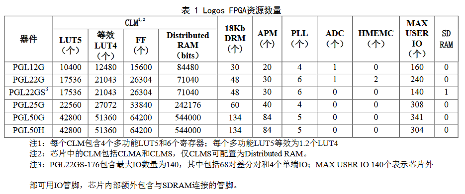
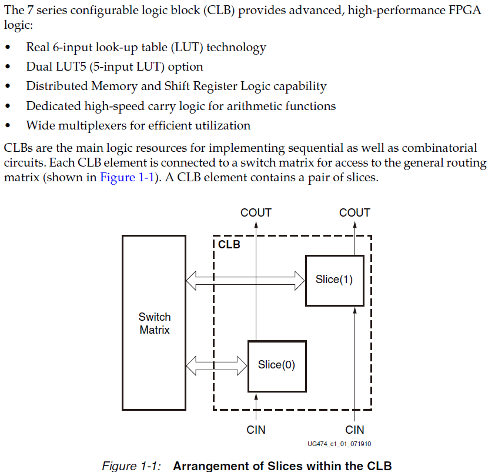

# Xilinx的CLB

Xilinx官方文档中将**可配置逻辑块CLB**（Configurable Logic Block）作为FPGA的逻辑资源的最小单元。但CLB实际是由多个Slice构成，因此工程应用中常常把Slice作为最小逻辑单元，很少提起CLB。本篇博文主要介绍Xilinx FPGA的CLB和Slice结构

## 区分Cells、CLB和Slice

Vivado的资源利用率（Utilization）列表往往像下面这样

Slice和组成Slice的LUT、FF、BRAM是主要的显示项，也是工程中最为常用的资源；而在官方手册中，我们经常能看到Xilinx与友商通过逻辑单元（Logic Cells）进行比较；官方文档中又把CLB作为最基本逻辑单元。我们下面来详细区分一下三者

### Logic Cells

首先看最为广义的Logic Cells概念

Logic Cells是Xilinx为了和友商对线创造出的一个市场说法，1个LC代表无任何附加功能的LUT4（4输入LUT）。

我们拿紫光同创的资源举例

紫光的Logos FPGA使用自研的多功能LUT5作为基本逻辑单元，将其等效为1.2个LUT4，那么我们可以用1个LUT5等效成1.2个LC，从而与Xilinx的芯片对比：7000系FPGA使用LUT6作为基本LUT单元，并基于LUT6组合成Slice，因此采用系数**1.6**，即1个LUT6可以等效成1.6个LC，于是我们可以发现1个紫光同创的多功能LUT5=1.2/1.6个Xilinx的LUT6。这样就能横向比较两个公司的器件了

> 商业宣传，懂得都懂。在合理范围内营造一定水分XD

### CLB

下面是来自手册UG474的CLB介绍

可以知道**一个CLB里面包含2个Slice**，每个CLB都连接到一个互联交换矩阵（Switch Matrix），这些交换矩阵被统一的通用路由矩阵连接起来

**CLB资源是对开发者不可见的**，它会被综合器和布局布线工具在底层调用，也就没有在RTL文件中实例化的必要。综合器会将RTL解析成以CLB为层次安排的Slice网表（网表中所有原语都调用Slice，但这些Slice符合CLB的布局要求）

CLB要么*被配置过*，要么*被复位*。设计者不能同时使用设置和复位CLB

### Slice

Slice是实际上能被调用的FPGA最小组成单元。7000系列FPGA的Slice具有四种功能：

- **逻辑单元**，即LUT6，1个Slice里包含4个LUT6
- **存储单元**，也就是常说的触发器（Flip-Flop，FF）。1个Slice里包含8个触发器。每4个触发器为一组，可配置成锁存器。
- **多路复用器**，也就是1位宽的数据选择器（MUX），每个Slice里面都会配有海量MUX
- **进位逻辑**，每个Slice都有负责处理算术运算的进位逻辑，与本列的上下Slice的进位逻辑相连

7000系FPGA中的一个LUT可以被配置成*一个具有6输入1输出的LUT6*或被配置成*两个具有独立输出但使用共同地址或逻辑输入的5输入1输出LUT5*。可以选择利用一个LUT5的输出恰好构成一个触发器（Flip-Flop，FF）。四个LUT6和对应配置为双路LUT5时候能最多使用的8个触发器、多路复用器以及额外的算术运算逻辑构成一个Slice，再由两个Slice构成一个CLB。每个Slice中的四个FF可以选择配置为锁存器（Latch），在这种情况下，该片中剩余的四个FF必须保持不使用。

> 1个Slice等于4个6输入LUT+8个FF+MUX+算数进位逻辑
>
> 每个Slice的4个触发器（虽然有8个FF，但是每个LUT会被唯一地分配一个FF）可以配置成Latch，这样会有4个FF不能使用——*因为它们对应的LUT资源被用在了配置另外四个FF为Latch上面*

此外，FPGA里的Slice有2种，一种被称为**SliceL**，另一种被称为**SliceM**，有的CLB由2个sliceL构成，有的则是由1个sliceL和一个sliceM构成。

> 大约有三分之二的片子是SliceL逻辑片，其余的是SliceM

SliceM除了基本功能外，还可以实现**分布式64位RAM**或**32位移位寄存器**或**两个16位移位寄存器**的功能，这三种功能都可以通过调用Xilinx提供原语来在RTL文件中调用

## CLB和ASMBL架构

Xilinx设计了**高级硅模块块（Advanced Silicon Modular Block，ASMBL）**架构，以使具有不同功能组合的FPGA平台能够针对不同的应用领域进行优化。

FPGA内部的逻辑资源按照岛型排列，每个岛以竖列（Column）布局，

ASMBL体系结构通过以下方式突破了传统的设计障碍：
 •消除了几何布局约束，例如I / O数量与阵列大小之间的依存关系。
 •通过允许将电源和地线放置在芯slice上的任何位置来增强芯slice上的电源和地线分布。
 •允许彼此独立地扩展不同的集成IP块和周围资源。

### LUT

### 存储单元

### Distributed RAM

### 移位寄存器SRL

### 多路选择器MUX

