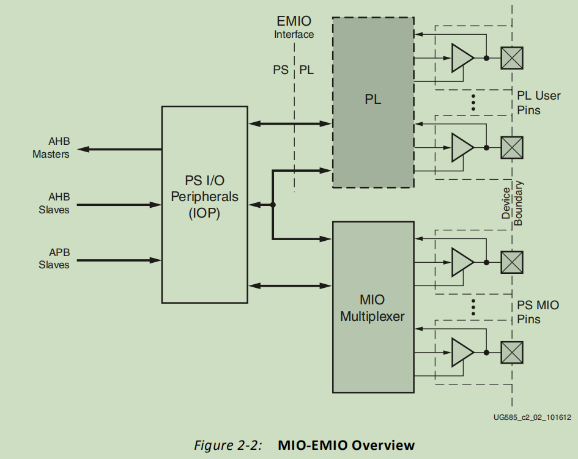

这里的示例程序在上一部分的基础上实现更多功能：

1. 使用UART通过串口向上位机发送Helloworld字符串
2. 使用MIO实现按键点亮LED功能
3. 使用EMIO驱动一个LED闪烁
4. 使用AXI总线驱动GPIO，实现LED以另一频率闪烁

# EMIO

EMIO就是Extendable MIO，当PS部分的MIO对应片上引脚不够用时，就可以使用EMIO引出PL部分的bank引脚到片内

**EMIO实际上是PS端和PL端之间的接口**，可以让PS端的外设使用PL端的引脚、FPGA外设模块等

## EMIO与MIO之间的差异

1. MIO的输入、输出值一致；但EMIO的输出值和输入值之间无关
2. MIO的输出在OEN寄存器配置为1时保持高阻态；EMIO的输出直接连接到PL端，高阻态的配置与OEN无关
3. EMIO的OEN被接入PL端，通过PL端硬件逻辑控制EMIO的OEN信号

## 通过EMIO点亮LED

PS端GPIO外设的GPIO有四个bank，其中bank0、bank1连接到MIO，bank2、bank3连接到EMIO，可经由EMIO连接到PL端引脚

在这里使用开发板上的三个用户按键控制3个LED亮灭，其中一个使用GPIO连接MIO，一个使用GPIO连接EMIO，一个使用纯FPGA逻辑

### 创建Vivado工程

### 创建各个模块的IP

### 生成顶层HDL文件进行封装

### 生成比特流文件并烧录

### 使用Vitis创建SDK工程

### 烧录软件到开发板

