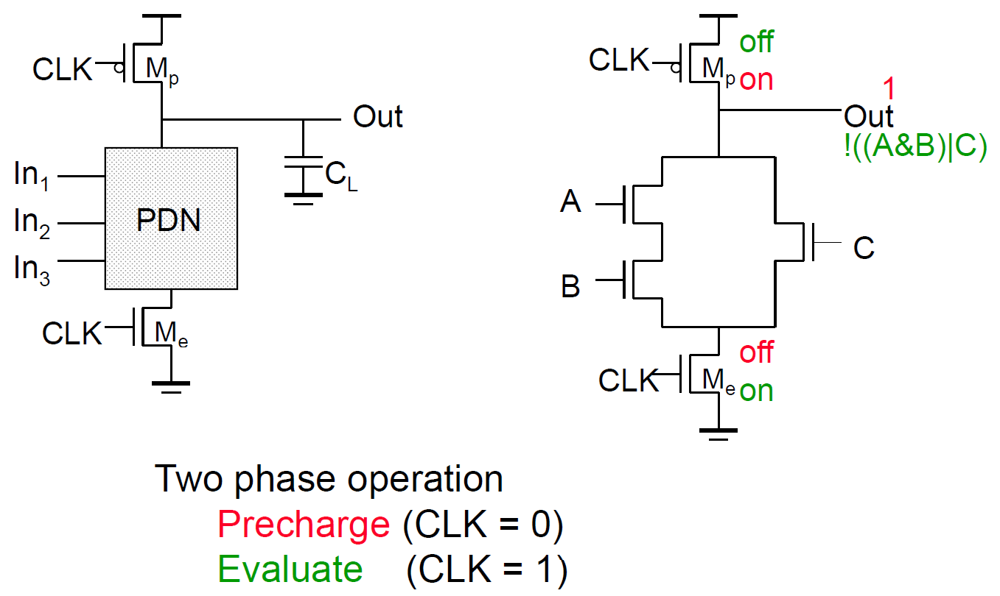
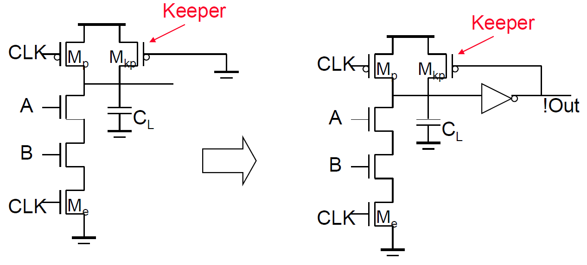
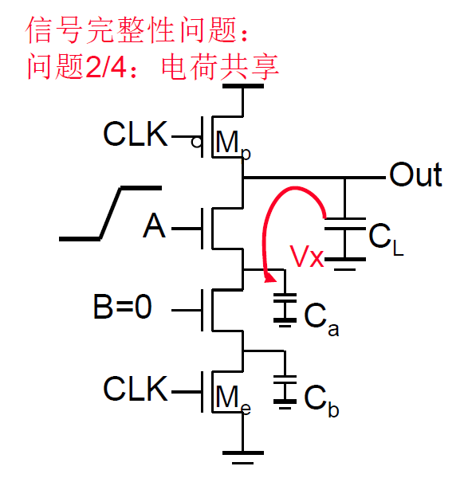
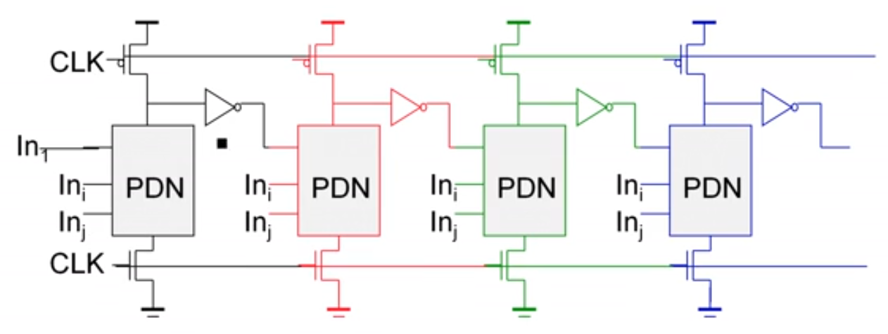
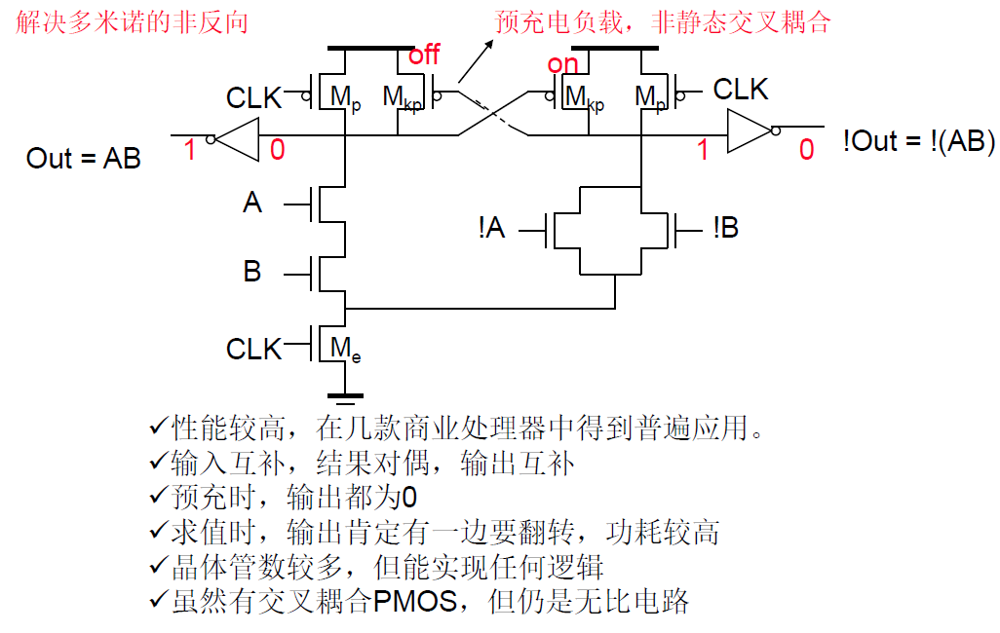

# 数字集成电路设计5【动态电路】

电路中的P网络会给设计带来很多难题，因此就要考虑将其优化掉，但对于静态电路而言，我们只能添加PMOS控制或者使用传输管/门，本质上都是在用等效电阻

> 需要注意：采用等效电阻方式上拉或者下拉的电路总是有比电路，这对设计者来说是很麻烦的

不过换个思路——如果在N网络下方再加一个MOS，上下MOS交替开关，就可以避免静态功耗了

使用一对时钟控制电路预充电和预放电，这样就可以把PMOS扔掉了（前提是要使用CLK非——或者保留一个PMOS，这样可以避免对时钟线使用非逻辑）

这时候电路是无比电路，而且只比伪NMOS电路多一个NMOS。同时，在没有时钟高电平时，输出端总是高阻态的，需要使用时钟高电平为其不定时充电

该电路具有如下缺点：

* PR=1期间，负载电容$C_L$放电。在此期间，不允许输入信号再有任何变化，否则逻辑取值就不是唯一的了

    > 这一点也是动态电路的特点

* P管尺寸不影响功能，增大P管可以上升快，但下降慢，同时时钟功耗也会变大

* 电路静态功耗低

动态电路是一种比较敏感的设计，也存在一些缺点：

* 电路翻转阈值和器件阈值电压在同一水平，电路抗噪声能力弱（噪声容限小）
* 由于电路的充电速度和时钟速度限制，开关阈值是一个动态量

## 动态电路特性

### 预充和预放对翻转的影响

由于动态电路需要对输出端进行预充和预放，而负载电容会在非充电边沿抽走一定电压，会导致出现“浪费电”的情况。对于静态门发生翻转的概率$P=P_0P_1$，而动态门的翻转概率伪$P=1P_0 $，只要输出1，就一定会发生翻转，这就是所谓的在输出高电平时“浪费电”

### 开关活动性因子

我们将上面所说门电路发生翻转的概率$P$称为**开关活动性因子**，可知动态电路的开关活动性因子比静态电路大，但实际上需要用动态电路的调用概率来计算

### 电荷泄露

虽然预充后可以在输出端维持高电平，但输出端的电压会由于各种原因出现漏电，因此需要对其进行不间断的充电，这就意味着**动态电路需要一个最低的刷新频率**来防止电荷泄露

回想之前传输管逻辑常用的反相器+PMOS的电平恢复器，也可以在动态电路中引入一个正反馈计指，如下图所示

这样的一个保持器可以做的很小，仅仅为了解决漏电问题

### 电荷共享

由于预充过程中会导致与输出端相邻的NMOS充电，又因为NMOS内部可能是关断的，这样电荷就会被存储到一个NMOS中，很可能会导致信号完整性问题，如下图所示

我们也可以通过在每个NMOS中间结点引入预充PMOS

### 回栅耦合

栅源之间存在一个交叠电容，这会对动态电路输出端造成影响——**输出端耦合的交叠电容会从前级取电**，使输出端电平下降，如果信号变化过快会导致信号完整性问题

### 时钟馈通

栅源交叠电容也在时钟控制PMOS上存在，它会导致存电，当下个充电周期到来时让NMOS的输出端电压高于预期的充电电压。*时钟馈通会导致信号过冲*，有可能导致正偏和闩锁效应

### 动态电路级联

动态电路的级联可能会出现延迟问题，当前一级电路输出信号到达后一级时，会存在一个延迟，就可能导致第二级输出错误。本质原因是前一级的输出端直接连接到了后端

我们可以通过**多米诺逻辑**（Domino Logic）解决这个问题：前一级的信号后加入一个反相器，传递给后级，只有前一级电路预充完毕时信号才会传输到下一级，如下图所示

多米诺逻辑会导致预充时下一级电路的所有输入都是0，因此可以考虑将输出端信号通过一个反相器连接到接地的NMOS栅极，也有人提出了*差分多米诺逻辑*，利用反逻辑来实现耦合，如下：

本质上就是将普通的动态多米诺电路构造成了差分形式

还有np-CMOS的改进方法，如下图所示

