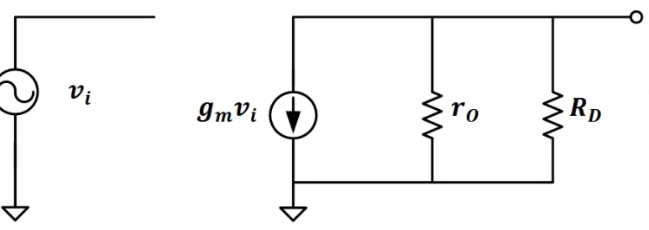
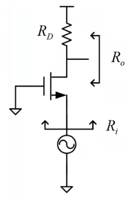
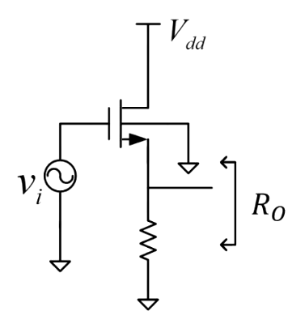
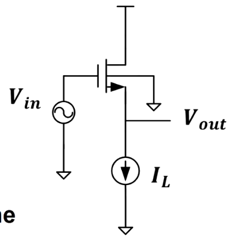
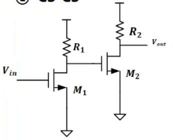
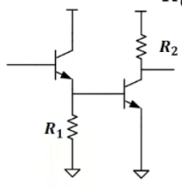
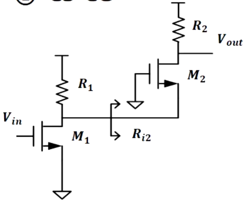
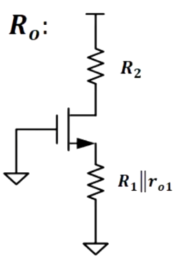
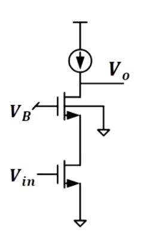

# 模拟集成电路设计3【基本放大器】

基本放大器有下面三种拓扑结构：

* **共源/共射接法**（CS/CE）：负载是漏极电阻$R_D$，输入电压$v_x$来自栅极/基极
* **共栅/共基接法**（CG/CB）：负载是漏极电阻$R_D$，输入电压$v_x$来自源极/发射极
* **共漏/共集接法**（CD/CC）：负载时源极电阻$R_S$，输入电压$v_x$来自栅极/基极

## 共源/共射接法

使用大信号分析解出直流偏置条件
$$
V_{out}=V_{DD}-\frac{1}{2} \mu_n C_{ox} \frac{W}{L} (V_{GS} -V_{TH})^2 R_D
$$
输入电压从0到$V_{TH}$提高过程中，$V_{DS}=V_{out}$会从$V_{DD}$下降。当输入电压$V_{in}$提高到接近$V_{DD}$时，MOSFET从饱和区转换到线性区。MOSFET在饱和区中只能发挥开关作用，只有当它到达线性区后，才能进行放大

对应小信号电路

可得
$$
A_v=-GM R_O =-g_m (r_O //R_D) \approx -g_m R_D
$$
由于拓扑共源（源极电势一致），所以不考虑体效应；而输出电阻与负载电阻相比，当负载是电阻（一般很小）的情况下，是可以把输出电阻忽略掉的，但当负载是晶体管尤其是MOSFET的情况下，输出电阻就不能忽略了

在集成电路中经常使用MOSFET电流源为器件提供偏置，如果不接后级电路，那么电流源就会作为负载，从而导致负载电阻非常大，这时候就不能忽略输出电阻；如果接入后级电路，由于MOSFET的栅极输入相当于开路，所以也会导致负载电阻非常大，不能忽略输出电阻

在BJT情况下，该拓扑的放大系数
$$
A_v=-g_m (r_O //R_C ) \approx -g_m R_C
$$
特别地，在使用电流源做负载时，有
$$
A_v = -\frac{2V_A}{V_{OV}} \propto I_D ^{-\frac{1}{2}}
$$

对于BJT，有
$$
A_V =-\frac{V_A}{V_T}
$$
$V_A$与工艺相关；$V_T$与温度相关，因此温度变化会导致增益变化，导致电路不可靠。在模拟集成电路中不适合使用共射放大电路

### 为什么我们要保证$V_{OV} > 100mV$

在亚阈值区，MOSFET的转移特性变成了
$$
I_{DS}=I_{DC} \frac{W}{L} exp(\frac{V_{GS} - V_{TH}}{nV_T})(1+\frac{V_{DS}}{V_A})
$$
得到
$$
g_m =\frac{I_D}{nV_T},r_O=\frac{V_A}{I_D},A_v=-g_m r_O =-\frac{V_A}{nV_T}
$$
把它和之前得到线性区的$A_v$公式连立，得到
$$
V_{OV}=3V_T =78mV \approx 100mV
$$
保证$V_{OV} =100mV$主要是为了让反型电压超过3倍$V_T$

## 共栅/共基接法

在这个拓扑中，G极接地，S极作为输入，与S极相连的B极就相当于“悬空”，因此MOSFET要考虑体效应，

根据大信号分析，
$$
R_i =\frac{R_D +r_O}{1+(g_m +g_{mb}) r_O}
$$
输出电阻可以近似为$R_O=R_D //r_O$，和共源的情况类似

对于小信号模型，

考虑体效应，有
$$
v_{gs}=v_{bs}=-v_x
$$
计算得
$$
A_v =-G_M R_O = (g_m +g_{mb})(r_O //R_D) \approx -g_m R_D
$$

对于BJT器件，

输出电阻$R_O=R_C //r_O$

放大倍数$A_v=-G_MR_O =g_m (r_O //R_C)$，

输入电阻$R_i \approx \frac{1}{g_m} \frac{r_O +R_C}{r_O + \frac{R_C}{\beta}}=r_{\pi} // (\frac{r_O +R_C}{1+g_m r_O})$

## 共漏/共集接法

这一拓扑中，使用$V_{dd}$驱动源极负载，且负载电阻不能太大，否则很容易让MOSFET进入线性区

> $R_L$很大的情况下，其两端压降较大，而MOSFET的DS两端电压减小，有可能让
> $$
> V_{DS} < V_{GS} -V_{TH}
> $$
> 从而进入线性区。我们需要的是让MOSFET工作在饱和区，因此不能让负载电阻太大

可以得到输出电阻
$$
R_O =R_L //r_O // \frac{1}{g_m + g_{mb}}
$$
如果负载电阻$R_L$无穷大，那么有
$$
R_O \approx \frac{1}{g_m +g_{mb}}
$$
此时输出电阻会非常小，**近似于一个电压源**，能够驱动较大的负载

而放大倍数
$$
A_V = \frac{g_m}{g_m +g_{mb}} = \frac{1}{1+\chi} \approx 0.8 \sim 0.9
$$
如果负载电阻很小的情况下，
$$
A_V =\frac{g_m R_L}{1+(g_m +g_{mb}) R_L}
$$
这样，这个电路可以用作**反相器**（buffer）或**缓冲器**（shifter）

为了避免负载电阻过大的情况，可以考虑换成一个电流源——如果把负载电阻改成电流源，如下图所示，

那么存在
$$
V_{out}=V_{in}-V_{TH}-V_{DS(sat)}
$$
输出电流是固定的，因此本电路的$V_{DS(sat)}$也是固定的

使用这个电路就可以构成一个理想的**源极跟随器**。**源极电压会直接反映在漏极**

再来看三极管的情况，

输出电阻
$$
R_O =r_O //r_{\pi} // \frac{1}{g_m} // R_L
$$
放大倍数
$$
A_V =-G_M R_O \approx \frac{g_m R_L}{1+ g_m R_L} <1
$$
虽然放大倍数小于1，但还是比MOS同拓扑的放大倍数高一点（更接近1）。我们也可以使用这个拓扑构建电压跟随器（射极跟随器）

## 组合放大器

### Cascade放大器

通过**级联**的方式构建放大器

1. **CS-CS放大器**

    级联两个共源放大器可以得到更高的放大倍数

    

    漏极电阻作为负载，比较简单，但：当R较大时，容易让MOS脱离饱和区；R较小时，容易让增益损失较大

    输出电阻等于第二级CS放大器的输出电阻
    $$
    R_O =R_2 //r_{O2}
    $$
    增益等于两级放大器增益相乘
    $$
    A_V =A_{V1} A_{V2}=g_{m1}(r_{O1} //R_1)g_{m2}(r_{O2} //R_2)
    $$

2. **CS-CD放大器**

    

    其中CS用于电压放大；CD放大器具有电压跟随器的性质，可以用作前后级放大器的隔离

    输出阻抗为第二级CD放大器的输出阻抗
    $$
    R_O =R_L //r_O // \frac{1}{g_m + g_{mb}}
    $$
    于是该电路能够驱动大负载的同时防止增益下降
    
    放大器增益为
    $$
    V_A=-g_{m1} R_1 g_{m2} \frac{1}{g_{m2} +g_{mb2}}
    $$
    
3. **CC-CE放大器**

    常常用在古老射频电路中的放大电路，没有MOSFET版本

    

    放大器增益为
    $$
    V_A=-g_{m2} (R_2 // r_{O2})
    $$
    这个电路最大的特点是很高的输入阻抗，因此可以把微弱的小信号收集起来放大
    $$
    R_i =r_{\pi 1}+(1+\beta) (r_{O1} //R_1 //r_{\pi 2})
    $$

### Cascode放大器

通过

1. **CS-CG放大器**

    

    其中输出级的MOS管可以近似为一个负载电阻（CG放大器），因此这个电路可以被简化成

    

    求得其增益为
    $$
    A_V=-g_{m1} R_2 // [(R_1 // r_{O1}) +r_{O2} [1+(g_{m2} +g_{mb2})(R_1 // r_{O1})]]
    $$
    **当第一级、第二级输出电阻都可以等效为无穷大（开路）时，该拓扑被称为Cascode拓扑**，等效电路如下图所示

    

    Cascode放大器的一个特点就是**将下管的输出电阻通过上管进行放大**，有
    $$
    R_O = r_{O1} +r_{O2}[1+(g_{m2} +g_{mb2})r_{O1}] \approx g_{m2} r_{O2} r_{O1}
    $$
    另一个特点就是**它具有极高的放大倍数（增益）**
    $$
    A_V =-g_{m1} r_{O1} r_{O2} (g_{m2} +g_{mb2}) \approx (g_m r_O)^2
    $$
    但需要注意：Cascode放大器具有**输出摆幅**（Output Swing）问题。若$V_{O}<2V_{OV}$会导致MOS偏离饱和区，产生非线性失真