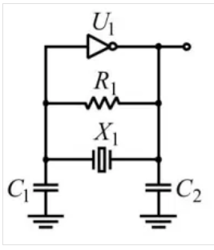

作为一个STM32的学习者，同时我也是一名微电子专业的学生，自然要将二者联系一下——本篇笔记就从基础的触发器verilog代码说起，简单剖析STM32中基础电路的实现

本篇文章不涉及原理，只讨论可行的verilog代码，相关内容可参考verilog基础教程、集成数字电路设计教程及ARM-AMBA协议相关教程

# 触发器实现

基本触发器电路主要有D触发器、JK触发器、T触发器三种，其中T除法器和D触发器都是在JK触发器基础上改进而来

触发器是一个单片机外设配置的基础

## JK触发器

JK触发器是最基础的用于边沿触发的数字电路

```verilog
module jk_trigger(
    input clk, 
    input j, 
    input k, 
    output reg q,
    output reg n_q
);    
    always@(posedge clk) //时钟上升沿到来时，判断jk的值
	begin
		case({j,k})
            2'b00: q <= q;       //{j,k}=00 保持
            2'b01: q <= 1'b0;    //{j,k}=01 置1
            2'b10: q <= 1'b1;    //{j,k}=10 清0
            2'b11: q <= ~q;      //{j,k}=11 翻转
			default: q <= q;
		endcase
	end
	assign n_q = ~q;
endmodule
```

## D触发器

D触发器是数字电路中最常用的时钟边沿触发时序逻辑电路，由JK触发器改进而来

**存储信号的时序逻辑电路常用锁存器（Latches）或D触发器（D-type Flip-Flop），前者是电平触发器件，后者是时钟边沿触发器件**

D触发器常被称为“寄存器”，在MCU的CPU、外设中负责管理硬件状态的寄存器就是由D触发器构成的

```verilog
module D_trigger(
    input d,
    input clk,
    input r,
    input s,
    output reg q,
    output reg qn,
);
    
    always @(posedge clk) begin
	if({r,s}==2'b01) //判断是否有r=0,s=1
	begin
		q=1'b0; //复位输出0
		qn=1'b1;
	end
	else if({r,s}==2'b10) //判断是否有r=1,s=0
	begin
		q=1'b1; //复位输出1
		qn=1'b0;
	end
	else if({r,s}==2'b11) //判断是否有r=1,s=1
	begin
		q=d; //保持原来状态
		qn=~d;
	end
end
endmodule
```

# 分频器实现

这里的分频器指的是时钟信号**数字分频器**，不同于模拟电路中使用运放和阻容网络实现的用于将输出信号频率变为原来的1/n的模拟分频器，数字分频器是一种能够将时钟信号频率按照选定的比例进行切分的电路

分频器主要分为奇数分频，偶数分频，半整数分频和小数分频

如果在FPGA上实现，分频器通常能通过计数器的循环来实现

## 奇数分频

奇数分频完全可以通过**计数器**来实现

三分频即对输入时钟模3计数，当计数器计数到邻近值再进行两次翻转：比如在计数器计数到1时，输出时钟进行翻转，计数到2时再次进行翻转，这样实现的三分频占空比为1/3或者2/3；如果要实现占空比为50%的三分频时钟，可通过分频时钟下降沿触发计数，和上升沿同样的方法计数进行三分频，然后下降沿产生的三分频时钟和上升沿产生的时钟进行或运算，即得到占空比为50%的三分频时钟。

先定义2个2位计数器，**一个计数器用于对时钟上升沿计数**，产生00、01、11三种状态，**另一个计数器对时钟下降沿计数**，产生00、01、11三种状态。再**定义两个寄存器，分别在00状态下赋值为高电平**，然后**将两个计数器输出逻辑相或**

对于5分频的情况，同样先定义2个3位计数器，分别在时钟上升沿和下降沿计数，产生000、001、010、011、100五种状态，再分别定义两个寄存器，在000、001均赋值为1，其他赋值为0，然后逻辑相或得到五分频

这里需要注意**一个n分频等价于n倍时钟周期，所以需要n个计数器状态**

总结来说，实现占空比为50%的n倍奇数分频，首先进行**上升沿触发模N计数**，**计数选定到某一个值进行输出时钟翻转**，然后经过$\frac{N-1}{2}$再次进行翻转得到一个占空比非50%奇数n分频时钟。**同时进行下降沿触发的模N计数**，到和上升沿触发输出时钟翻转选定值相同值时，进行输出时钟时钟翻转，同样经过$\frac{N-1}{2}$时，输出时钟再次翻转生成占空比非50%的奇数n分频时钟。两个占空比非50%的n分频时钟相或运算，得到占空比为50%的奇数n分频时钟。

从实现上说，就是**定义两个m位的计数器（最小的m值要保证使2m>n），产生n个状态计数；再定义两个寄存器，然后在n/2之前的的状态计数赋值为1，其他均为0，最后逻辑相或即可得到奇数n分频**

```verilog
module fenpin(
  input  i_clk,
  input  n_rst,

  output o_clk
);
  
	//log2(3) = 1.5850 <= 2
    reg [1:0] cnt_p; //上升沿计数
    reg o_clk_p; //上升沿时钟输出寄存器
    reg o_clk_n; //下降沿时钟输出寄存器
    
	//3位上升沿计数器: 0~2
    always @ (posedge i_clk, negedge n_rst) begin
  		if (!n_rst)
    		cnt_p <= 0;
  		else begin
            if (cnt_p == 2) //2=3-1
      			cnt_p <= 0;
    		else
      			cnt_p <= cnt_p + 1'b1; //计数
    	end
	end
 
	//log2(3) = 1.5850 <= 2  
    reg [1:0] cnt_n; //下降沿计数
 
	//3位下降沿计数器: 0~2
	//2 = 3 - 1
    always @ (negedge i_clk, negedge n_rst) begin
 		if (!n_rst)
    		cnt_n <= 0;
  		else begin
            if (cnt_n == 2) //2=3-1
      			cnt_n <= 0;
    		else
      			cnt_n <= cnt_n + 1'b1; //计数
  		end
	end
 
	//输出上升沿时钟
	//0     ~ 1 ↑-> 1
	//(1+1) ~ 2 ↑-> 0
	//1 = 3 >> 1
	//2 = 3 - 1
    always @ (posedge i_clk, negedge n_rst) begin
  		if (!n_rst)
    		o_clk_p <= 0;
  		else begin
            if (cnt_p <= 1) // 1 = 3>>1 ,右移相当于除以2
      			o_clk_p <= 1;
    		else
      			o_clk_p <= 0;
  		end
	end

	//输出下降沿时钟
	//0     ~  1 ↓-> 1
	//(1+1) ~  2 ↓-> 0
	//1 = 3 >> 1
	//2 = 3 - 1
    always @ (negedge i_clk, negedge i_rst_n) begin
  		if (!n_rst)
    		o_clk_n <= 0;
  		else begin
            if (cnt_n <= 1) // 1 = 3>>1 ,右移相当于除以2
      			o_clk_n <= 1;
    		else
      			o_clk_n <= 0;
  		end
	end

	assign o_clk = o_clk_n | o_clk_p; //按位或

endmodule
```

五分频RTL如下：

```verilog
//rtl
module divider(
    clk,
    rst_n,
    clk_div
);
    input clk;
    input rst_n;
    output clk_div;
    reg clk_div;

    parameter NUM_DIV = 5;
    reg[2:0] cnt1;
    reg[2:0] cnt2;
    reg    clk_div1, clk_div2;

always @(posedge clk or negedge rst_n)
    if(!rst_n)
        cnt1 <= 0;
    else if(cnt1 < NUM_DIV - 1)
        cnt1 <= cnt1 + 1'b1;
    else
        cnt1 <= 0;

always @(posedge clk or negedge rst_n)
    if(!rst_n)
        clk_div1 <= 1'b1;
    else if(cnt1 < NUM_DIV / 2)
        clk_div1 <= 1'b1;
    else
        clk_div1 <= 1'b0;

always @(negedge clk or negedge rst_n)
    if(!rst_n)
       cnt2 <= 0;
    else if(cnt2 < NUM_DIV - 1)
       cnt2 <= cnt2 + 1'b1;
    else
       cnt2 <= 0;

always @(negedge clk or negedge rst_n)
    if(!rst_n)
        clk_div2 <= 1'b1;
    else if(cnt2 < NUM_DIV / 2)
        clk_div2 <= 1'b1;
    else
        clk_div2 <= 1'b0;

    assign clk_div = clk_div1 | clk_div2;
endmodule
```

## 偶数分频

由待分频的时钟触发计数器计数，当计数器从0计数到N/2-1时，输出时钟进行翻转，并给计数器一个复位信号，使得下一个时钟从零开始计数。以此循环下去。这种方法可以实现任意的偶数N分频

对于$2^n$分频，利用计数器的方式，定义n位$2^n$bit的计数器，在0状态取反，其他状态保持，就可以产生对应分频了

```verilog
module even_divider(
    input clk,
    input rst_n,
    output reg clk_div
);

    parameter NUM_DIV = N;
    reg [3:0] cnt;

always @(posedge clk or negedge rst_n) begin
    if(!rst_n) //复位
    begin
        cnt <= 4'd0;
        clk_div <= 1'b0;
    end
    else if(cnt < NUM_DIV / 2 - 1) //平常情况下计数器+1
    begin
        cnt <= cnt + 1'b1;
        clk_div <= clk_div;
    end
    else begin //到达N/2-1时进行输出反转达到N分频
        cnt <= 4'd0;
        clk_div <= ~clk_div;
    end
end
endmodule
```

## 半整数分频

在verilog程序设计中，我们往往要对一个频率进行任意分频，而且占空比也有一定的要求这样的话，对于程序有一定的要求。
现在在前面两个实验的基础上做一个简单的总结，实现对一个频率的任意占空比的任意分频。
比如：FPGA系统时钟是50MHz，而我们要产生的频率是880Hz，那么，我们需要对系统时钟进行分频。很容易想到用计数的方式来分频：50000000/880 = 56818。
显然这个数字不是2的整幂次方，那么我们可以设定一个参数，让它到56818的时候重新计数就可以实现了。程序如下：

```verilog
//rtl
module div(
    clk,
    rst_n,
    clk_div
);
    input clk,rst_n;
    output clk_div;
    reg clk_div;

    reg [15:0] counter;

always @(posedge clk or negedge rst_n)
    if(!rst_n)
        counter <= 0;
    else if(counter==56817)
        counter <= 0;
    else
        counter <= counter+1;

   assign clk_div = counter[15];
endmodule
```

如果这个数字是奇数，完全可以用上面讲过的奇数分频，无非是要增大计数寄存器长度

## 小数分频

继续来看如何实现任意占空比，比如还是由50M分频产生880Hz，而分频得到的信号的占空比为30%。

56818×30%=17045

```verilog
//rtl
module div(
    clk,
    rst_n,
    clk_div,
    counter
);
    input clk,rst_n;
    output clk_div;
    reg clk_div;
    output [15:0] counter;
    reg [15:0] counter;

always @(posedge clk)
    if(!rst_n)
        counter <= 0;
    else if(counter==56817)
        counter <= 0;
    else counter <= counter+1;

always @(posedge clk)
  if(!rst_n)
    clk_div <= 0;
  else if(counter<17045)
    clk_div <= 1;
  else
    clk_div <= 0;
 endmodule
```

# 时钟、倍频及PLL实现

### 皮尔斯震荡器



stm32通过外部晶振或内部晶振实现时钟信号，都需要通过皮尔斯震荡器电路。一个反相器、一个电阻、一个石英晶体、两个小电容就可以构成这个电路。回授电阻R1可看成反相器的偏压电阻，令反相器工作在线性区域而成为高增益的反相放大器，并确保振荡发生。石英晶体与C1、C2两匹配电容构成带通滤波器（Π形滤波网络），在石英晶体的共振频率上提供180度相移和所需的电压增益。电路上的总电容量称为石英晶体的负载电容，这个电容量需要仔细把握。很多时候晶振走线过长导致分布电容增大就会让电路无法起振；两匹配电容容值不对更是会让电路无法工作

### 倍频器

使用同或门配合D触发器即可实现基本的**二倍频**电路，代码如下所示

```verilog
module DoubleFreq(
	input clk,
	input rst,
	output clk_out 
);

	reg Q;
	wire XNOR_clk;
    
    assign XNOR_clk = Q ^ clk; //同或门作为D触发器时钟源
	assign clk_out =  Q ^ clk; //clk_out的频率是clk的两倍
    
    always@(posedge XNOR_clk or negedge rst) begin //D触发器
		if(!rst)
			Q <= 0;
		else
			Q <= ~Q;
	end
endmodule
```

该电路的缺点在于倍频数、占空比不可调

因此引入下面的改进版电路，结合基本分频器实现了任意倍频-分频

```verilog
module frequency_m_d (
     input clk,
     output multiplier_clk,
     output reg divider_clk
);
    /* 倍频 */
    reg temp_mul;
    assign multiplier_clk = ~(clk ^ ~temp_mul);
    
    always @(posedge multiplier_clk)
    begin
        temp_mul <= ~temp_mul ;
    end
    
    /* 分频 */
    reg [27:0] count;
    
    always@(posedge clk) begin
        if(count < 28'd1_0000_0000)
            count <= count + 1'b1;
        else
            count <= 1'b0;
	end
    
    always@(posedge clk) begin
        if(count >= 28'd6_000_0000)
            divider_clk <=1'b0;
        else
            divider_clk <=1'b1;
	end
endmodule
```

### 锁相环电路

这里的PLL特指数字锁相环——而stm32内部的PLL其实是模拟-数字混合的锁相环，但它们的原理是类似的

模拟锁相环中的鉴相器一般使用模拟乘法器来实现

## 片上总线


