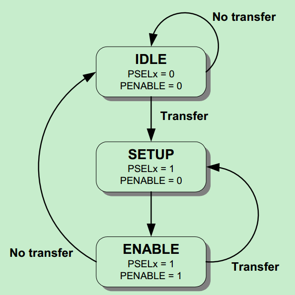

# AMBA总线规范

AMBA规范由ARM公司制定，用于SoC内IP互联

AMBA即（Advanced Microcontroller Bus Architecture，AMBA）规范是一种开放式标准片上互联规范，用于连接和管理片上系统中的各个功能模块（IP）。显而易见，AMBA协议是一套片上总线协议，一般来说其信号线数量都比较多——ARM通过这套协议规定了各种信号线的作用，并没有规定信号线的位宽和具体实现，所以说每个芯片中的AMBA都可能具有不同的架构

AMBA中有以下几个主要接口：

* 高级外设总线APB：用于低速低功耗外设连接
* 高级高性能总线AHB：用于高速外设连接
* 高级可扩展接口AXI：最普遍使用的高性能总线
* 高级跟踪总线ATB：用于在芯片外围移动跟踪数据
* AXI一致性扩展接口ACE：用于移动设备的大小核之间高速连接
* 相关集线器接口CHI：用于网络和服务器设备的高带宽高性能数据传输

## APB规范

**在APB总线中，唯一的主机为APB总线桥，其它外设都是从机**。因此APB总线不需要有一个像AHB一样的仲裁器以及其它控制器，因此通常APB总线可看做由**APB总线桥**和**APB上的从设备**两部分组成。APB总线通常是AHB或者ASB系统总线（已经过时的总线）的扩展，便于外设链接到系统总线上，AHB和APB之间就使用APB总线桥来链接

APB规定**所有信号必须在时钟上升沿进行传递**

APB总线包含8根信号线，都是以H开头，区别其他的AMBA总线信号：

* **PCLK**：总线时钟，由总线时钟源提供
* **PRESETn**：复位信号，低电平有效，由系统总线复位信号提供
* **PADDR**：总线地址信号，由外设APB总线桥提供
* **PPROT**：保护信号，用于表示普通的、剥夺的或安全保护级别
* **PSELx**：总线选择信号，该信号表示选中某个从设备，*每个从设备都应该有一个PSELx信号*
* **PENABLE**：总线数据传输使能，用于触发APB总线的访问周期
* **PWRITE**：总线访问方向信号，信号拉高表示APB写访问；信号拉低表示APB读访问
* **PWDATA**：写数据信号，使用该信号线驱动写数据总线
* **PRDATA**：读数据信号，在读周期时从所选择的从设备驱动该总线，宽度受限（最高32位）
* **PSTRB**：写选通信号，用于表示写传输时更新哪个字节通道。每8位使用一个PSTRB信号线控制。在读传输时，写选通信号不活动
* **PREADY**：总线准备信号，从设备控制该信号来扩展APB传输
* **PSLVERR**：总线错误信号，用于表示传输失败。外设可以不使用PSLVERR引脚，在外设不包含该引脚时，APB桥的数据应适当拉低

以上总线结构可以和下文相互参考理解

### 读写时序

1. 无等待状态写
    1. 需要一个**建立周期**寄存PADDR、PWDATA、PWRITE、PSEL，这些信号会在PCLK上升沿完成寄存
    2. 在第二个周期，PENABLE和PREADY寄存，PENABLE表示传输**访问周期**开始；PREADY表示PCLK的下一个上升沿从设备可以完成传输
    3. 第三个周期完成之前，PADDR、PWDATA和控制信号会一直保持有效
    4. 第四个周期，PENABLE和PSEL变成无效，等待下一个传输开始
    
    
    
2. 有等待状态写

    1. 在访问周期开始时，PENABLE为高时，可以通过拉低PREADY来扩展传输
    2. PREADY拉低后，可以添加两个传输周期
    3. 新添加的周期也可以是有等待状态的，即可以通过拉低PREADY来无限延长传输周期

3. 无等待状态读

    基本时序和无等待状态写类似，但是使用PRDATA作为信号传输线，在读传输结束之前，从设备必须主动提供数据

    

4. 有等待状态读

    与有等待状态写类似，可以通过拉低PREADY来实现延长传输周期

事实上，除了写信号有效性相反外，APB读操作时序和写操作时序非常相似。特别地，如果写操作之后跟随着读操作或者相反，那么需要 3个等待周期来完成读操作。通常的情况下，不会有读操作之后紧跟着写操作的发生，因为两者之间CPU会进行取指操作——更重要的是指令存储器不太可能直接挂在APB总线上

### 错误响应

传输中使用*PSLVERR*信号来指示APB总线传输的错误条件。

为了防止读写交易过程中发生错误，当PSEL、PENABLE、PREADY都为高时，PSLVERR有效

当外设接收到一个错误时，写交易并不会更新外设内的寄存器；而当读交易能够返回无效的数据，对于读错误，并不会要求外设将数据总线驱动置0

### APB控制状态机

APB总线状态机如上图所示

* **IDLE**：空闲状态，APB总线默认处于此状态
* **SETUP**：建立状态，当请求传输时，PSEL=1。在一次传输中，该状态只会保留一个时钟周期
* **ACCESS**：访问状态，PSEL=1，PENABLE=1。要求地址信号、选择信号、读/写数据信号保持不变。准备信号PREADY决定了是否从ACCESS状态退出（PREADY=0，保持；PREADY=1，退出，如果此使没有其他传输请求，就返回IDLE，否则继续进入SETUP）

APB的每次传输均需**消耗2个周期的时间**

## AHB规范

APB总线用于低速低功耗的情况，一般只是用他来控制外设的寄存器；而AHB总线则通常用于更高速的情况——基于ARM核的MCU一般都使用AHB连接内核和APB总线。

如上图所示，典型AMBA总线系统就是这样，ARM核、片上RAM、DTCM/ITCM等高带宽内存、DMA设备这些需要高速传输的设备挂载到AHB总线上；APB总线连接低速的定时器、GPIO、串口、片外总线控制器等外设；AHB总线和APB总线间通过总线桥相连不过近年来，随着外设和片外总线速度越来越高（MCU逐渐整合DSP功能），一些高速定时器、高速GPIO都会被直接挂载到AHB总线上

与APB总线协议不同，AHB总线具有以下特性：

* 高性能：支持流水线操作和分割交易（分割交易含义在后文给出）
* 支持猝发传输（也就是突发传输Burst Mode）：在一次传输内向固定地址传输多个数据字，也就是说可以一次传输一个地址和一批地址连续的数据
* 可由多个总线主设备控制

### 总线互联

AHB协议规范只规定了总线的通信时序，并没有规定总线的具体实现方法和互联机制，于是可以在AHB基础上采用多路复用器互联、总线矩阵等等实现思路

最基本的互联方式就是**多路复用器互联**：使用两个MUX分别控制地址信号线和读写数据信号线的传输，使用一个译码器实现主设备控制读写数据和响应信号的切换，所有总线设备都由总线仲裁器控制。如下图所示

### 总线操作流程

1. **总线仲裁**

    在开始传输前，主设备需要先向AHB总线仲裁器提出使用申请，总线仲裁器随后会根据仲裁逻辑授权主设备进行总线访问。

    在总线仲裁之前，允许一个主设备以特定的猝发方式完成所有传输。但是为了避免产生过长的仲裁延迟，仲裁器可以将一个猝发分解，这个操作称为**分割交易**

2. 猝发传输

    在总线仲裁完毕后，主设备会启动AHB传输，在这个阶段可以使用两种被允许的猝发传输逻辑（不知道该怎么翻译比较好）：

    * 增量猝发：在地址边界不回卷
    * 回卷猝发：在特殊的地址边界回卷

3. 每次传输由*地址和控制周期*与*数据周期*构成

    在传输期间，所有从设备必须采样地址

4. 从设备回报

    在每次传输期间，从设备使用响应信号HRESP[1:0]显示状态，可选的状态如下：

    * OKAY：传输正常，当HREADY=2'b11时，表示传输成功结束
    * ERROR：传输失败。表示发生传输错误
    * RETRY和SPLIT：表示不能立即完成传输，但是总线主设备应该继续尝试传输

    如果发生分割交易，主设备会在这个时间段向仲裁器提出仲裁以便完成猝发传输中剩余的操作

### 读写时序

如果没有猝发传输或等待，主设备会发起一个普通传输，分成两个主要部分

1. 地址周期

    这个环节持续一个时钟周期，在第一个HCLK上升沿，主设备会先驱动总线上的地址和控制信号并保持
    
2. 数据周期

    在下一个时钟上升沿，从设备采集总线上的地址和控制信号

    从设备完成采集后立刻驱动响应信号线，在第三个时钟上升沿时，主设备再采样这个响应

    数据周期可以持续几个时钟周期，因为在任何一个传输中，从设备都可能插入等待状态。在读传输的等待状态中，从设备不必提供有效数据，在将要完成传输前提供有效数据即可

    为了允许更高性能的操作，AHB总线允许**流水线操作**：在前一个数据周期结尾，一旦主设备采样完成就可以启动地址周期，驱动总线的地址和控制信号，这样从设备就能够获得充足时间响应一次传输

### AHB总线的信号线种类

AHB总线的信号都是以H开头，区别其他的AMBA总线信号

| 信号名                                      | 信号源               | 信号功能                                                     |
| ------------------------------------------- | -------------------- | ------------------------------------------------------------ |
| HCLK                                        | 总线时钟源           | 总线时钟信号，上升沿有效                                     |
| HRESET                                      | 系统复位             | 系统reset信号，低电平有效                                    |
| HADDR[31:0]                                 | 主设备               | 32位系统地址总线                                             |
| HTRANS[1:0]               | 主设备               | 传输类型，一共有四种类型：NONSEQ、SEQ、IDLE、BUSY |
| HSIZE[2:0]                | 主设备               | 每次传输的数据大小。以字节为单位。最高支持1024位 |
| HBURST[2:0]                  | 主设备               | 猝发传输类型，一共有8种                               |
| HPROT[3:0]          | 主设备               | 保护控制信号                                       |
| HWDATA[31:0]             | 主设备               | 写数据信号线                                              |
| HSELx                      | 译码器               | 从设备选择信号线                                               |
| HRDATA[31:0]              | 从设备               | 读数据信号线                                            |
| HREADY                    |      从设备                | 传输完成信号。当这个信号线拉高时，表示当前传输完成；从设备也可以通过拉低这个信号线来延长一个传输。注意：从设备需要2个HREADY信号线，其中一个作为输出，一个作为输入 |
| HRESP[1:0]            |从设备               | 从设备给主设备的响应信号。一共有四种：OKAY、ERROR、RETRY、SPLIT |
||                                              下面是仲裁器的信号                                           ||
| HBUSREQx                    | 主设备               | 主设备请求信号线。主设备通过该信号线向仲裁器发出获得总线使用权的请求信号，最多支持16个主设备 |
| HLOCKx                 | 主设备               | 总线锁定信号线。如果一个主设备希望自己在传输期间不丢掉总线，则需要向仲裁器发送这个锁定信号 |
| HGRANTx                       | 仲裁器              | 授权信号线。仲裁器的仲裁结果会通过该信号线传送给每一个主设备。当HREADY和HGRANTx同时为高时，主设备被允许获取系统总线 |
| HMASTER[3:0]              | 仲裁器           | 主设备ID信号线。仲裁器为每一个主设备分配对应的的ID，用来给多路选择器提供选择信号和为SPLIT操作提供控制信号 |
| HMASTLOCK               | 仲裁器           | 总线阻塞信号。表示当前的主设备正在执行锁定操作。该信号和HMASTER时序相同 |
| HSPLITx[15:0] | 具有SPLIT操作的从设备 | 仲裁器SPLIT控制信号 |

### 传输类型编码

每个传输都有独立的传输类型，由HTRANS[1:0]表示

* 00：**IDLE**（空闲）。表示没有请求数据传输，这个信号表示总线主设备获得了总线控制权但是并没有执行数据传输。这种情况下从设备需要返回一个零状态等待信号OKAY并忽略本次传输
* 01：**BUSY**（忙碌）。忙传输，允许总线主设备在猝发传输中插入空闲周期。一般这种类型表示主设备正在连续执行猝发传输但不能立即产生下一次传输。当一个主设备触发该类型时，要求它驱动带地址和控制信号必须反映猝发中的下一次传输；从设备则应该忽略这种传输
* 10：**NONSEQ**（非连续）。一次猝发的第一次传输或者一个独立传输，表示地址与控制信号和前一次传输无关。总线上的单个传输会被看作一次猝发传输，随意使用这个信号会导致传输不连续
* 11：**SEQ**（连续）。表示在一次猝发传输中剩下的传输是连续传输且与前一次传输有关，控制信息和前一次传输时一样，地址等于*前一次*传输的地址加上传输大小（以字节为单位）。在回卷猝发的情况下，传输地址需要在地址边界处回卷，*回卷值等于传输大小乘传输次数*

### 传输控制信号

每次AHB传输中，都会使用一组控制信号线提供传输的附加信息，要求他们的时序和地址总线时序严格一致，并且信号在猝发传输中保持不变

下面是用到的控制信号

1. 传输方向HWRITE

    HWRITE=1时，表示写传输，主设备会将数据放到写数据总线HWDATA[31:0]

    HWRITE=0时，表示读传输，从设备会将数据放到读数据总线HRDATA[31:0]

2. 传输大小HSIZE

    使用HSIZE[2:0]表示传输宽度，该信号线和HBURST[2:0]信号一起决定了回卷猝发的地址边界

    有以下几种选项：

    * 000：8位，字节
    * 001：16位，半字
    * 010：32位，字
    * 011：64位，双字
    * 100：128位
    * 101：256位
    * 110：512位
    * 111：1024位

3. 保护信号HPROT[3:0]

    用于提供附加信息，一般提供给能执行不同保护级别的模块使用，表示传输时一次预取指或数据访问、特权模式、用户模式访问，或带高速缓存/无高速缓存

    设备在没有严格要求的情况下不需要使用该信号

    * HPROT[0]：0，预取指；1，数据访问
    * HPROT[1]：0，用户模式；1，特权模式
    * HPROT[2]：0，无缓冲；1，带缓冲
    * HPROT[3]：0，无高速缓存；1，带高速缓存

### 猝发操作详解

AHB协议规定了4、8、16拍的基本猝发和未定长度的猝发。协议默认支持两种猝发方式

* 递增猝发：访问连续地址且猝发中每次传输的地址仅是前一次地址的一个递增和回卷

* 回卷猝发：若传输起始地址并未和猝发中的字节总数对齐，那么传输地址会在达到边界处回卷

    > 一个4拍回卷猝发的字访问将在16字节边界回卷，因此若传输起始地址是0x34，那么它会包括0x34、0x38、0x3C和0x30四个地址，其中0x30是由回卷导致的

通过HBURST[2:0]信号线指示促发信息，具有8种可能的猝发类型：

* 000：单一传输
* 001：未定长度的递增猝发
* 010：4拍回卷猝发
* 011：4拍递增猝发
* 100：8拍回卷猝发
* 101：8拍递增猝发
* 110：16拍回卷猝发
* 111：16拍递增猝发

特别注意：**猝发不能超过1KB的地址边界**

猝发大小表示猝发的节拍数量而不是一次猝发传输的实际字节数——**每拍字节数是由HSIZE[2:0]指示的**

对于一个从设备而言，可以在不允许完成一个猝发的特殊情况下提前终止猝发传输。一般通过监控*HTRANS信号*完成，如果产生一个非连续或空闲传输，则表示新的猝发开始，需要保证在此之前终止了前一次的猝发传输，并向主设备提供过连续或忙指示

### 地址译码器

**AHB总线上的从设备一般共用一个中央地址译码器提供选择信号HSELx**

一般要求这个译码器尽可能简单可靠，避免复杂的逻辑实现高速操作

协议规定：

1. 从设备只能在HREADY为高时采样地址总线信号、控制信号和HSELx信号
2. 当HSELx信号为高时，表示当前传输完成，因此在特定情况下会在HREADY为低时采样HSELx信号，但会在传输完成后更改选中的从设备
3. 总线主设备不能执行超过1KB地址边界的递增传输
4. 在存储器映射不能完全填满存储空间时，需要设置一个额外的默认从设备来让主设备访问不存在地址空间时提供响应，要求至少实现以下两个响应
    * ERROR：当传输访问不存在的地址空间或出现非连续传输时
    * OKAY：当空闲或访问不存在的地址空间（默认从设备）时

### 从设备传输响应时序

从设备使用HREADY信号来扩展一次AHB传输的数据周期——HREADY=0，表示要扩展传输；否则表示传输完成

协议推荐从设备不要插入多余16个扩展传输等待状态，否则单个访问会将总线锁定较长的时钟周期，影响片上数据传输——*不过这并不是强制规定*

HREADY具有以下四种状态：

* 00：OKAY，表示成功完成传输
* 01：ERROR，表示发生传输错误，出现错误条件时，需要两个周期响应
* 10：RETRY，表示传输并未完成，总线主设备应重新传输直到完成，要求两个周期响应。仲裁器收到该指示后会继续使用原有的优先级方案，重新为申请总线的设备排序并进行调度分配
* 11：SPLIT，表示未成功完成传输，下次授权总线主设备访问总线时再尝试传输；当能够完成传输时，从设备会将请求代替主设备访问总线，要求两个周期响应。仲裁器收到该指示后会调整优先级方案来让其他主机的传输优先完成，随后再进行当前主机的传输

上面要求两个周期响应的情况被称为**双周期响应**，需要在最后一个传输的前一个周期驱动HRESP[1:0]表示扩展一个周期。而如果从设备还需要更多周期，应该在传输开始时将HREADY信号拉低，同时响应OKAY。双周期响应允许主设备有足够时间取消该地址，并且在下次传输前驱动HTRANS[1:0]为空闲传输

特别的，如果从设备出现错误响应，主设备可以选择取消猝发中剩下的传输，但这并不是强制规定

由于分割传输的“**释放总线**”特性，可以更有效地实现长数据分批传输

### 数据总线

AHB协议要求读写数据总线至少为32位，但是允许用户扩展数据位，一些高性能核使用64位的读写数据总线

1. 写数据总线HWDATA

    写数据总线依赖主设备驱动，如果使用扩展传输，总线主设备需要保持数据有效知道HREADY为高（表示传输完成）为止

2. 读数据总线HRDATA

3. 端结构

### 仲裁器

### 分割交易详解

### AHB复位

HRESETn是AHB协议中唯一的低电平有效信号，并且是所有总线设备的复位源

**AHB总线采用异步复位**

但是复位可以在HCLK上升沿被同步撤销

需要保证复位期间主设备信号可控，并使用HTRANS[1:0]信号表示空闲

### 一套开源的AHB总线实现

GitHub上的一套开源[AHB总线实现](https://github.com/Lianghao-Yuan/AHB_Bus_Matrix)

## AXI4规范

AHB总线和APB总线相关内容可以参考知乎上面@[桔里猫](https://www.zhihu.com/people/orangeofcat)的[简介](https://zhuanlan.zhihu.com/p/157808097?from_voters_page=true)，本博文也参考了一部分

下面再介绍现代FPGA中常用的AMBA总线：AXI4总线

