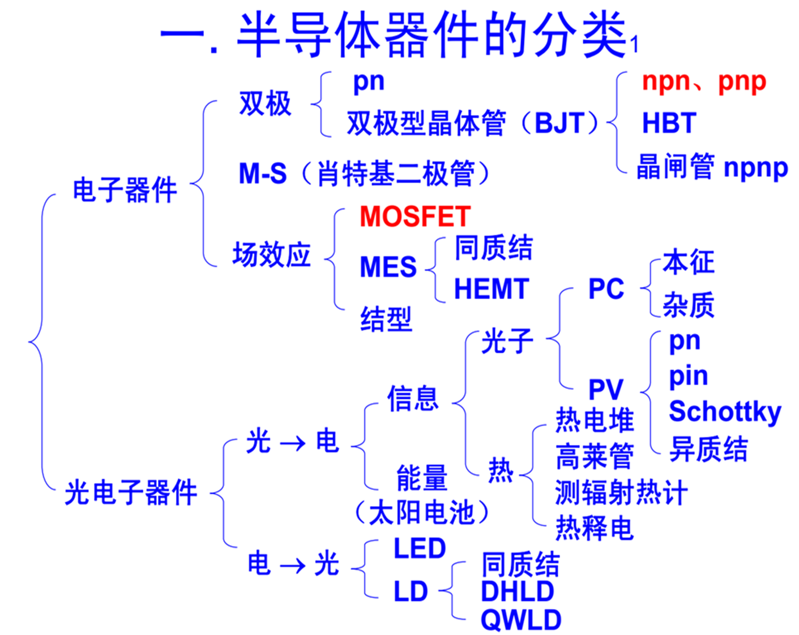
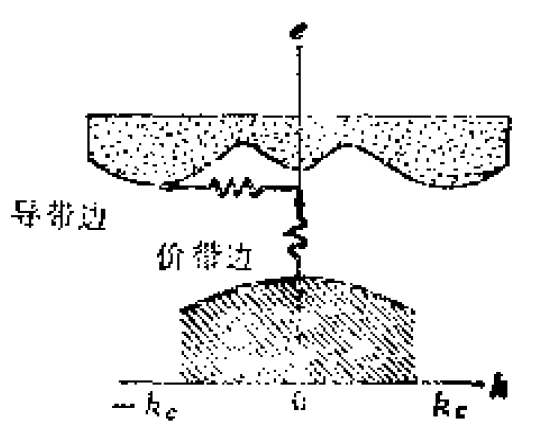
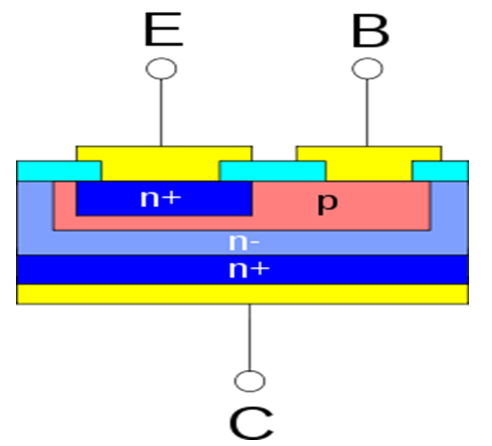
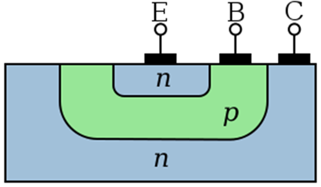

# 半导体器件物理0【绪论】

半导体器件物理中，我们主要关注电子器件，并且重点研究基于硅的*掺杂*、*注入*、*PN结*、*异质结*这几个物理情景制造的**二极管**、**BJT**和**MOSFET**器件的物理特性

## 半导体器件物理

硅和锗是典型的**间接带隙半导体**，电子在从价带进入导带的过程中需要吸收光子（本征光吸收），同时电子会很难从导带跌落回价带

> 间接带隙半导体的导带边和价带边的电子存在动量不守恒，因此价带电子需要与光子耦合才能获得合适的动量。电子首先被光子激发到某导带极小值最近处（此时没有进入导带），再通过弛豫过程移动到导带边。这就导致其需要吸收光子才能跃迁。而在逆过程中，电子跃迁不满足动量匹配，光子能量会被全部吸收提供能量，这就是导致**间接带隙半导体会有光致电现象但很难出现电致发光现象**

### 二极管

### BJT

经典Bipolar-NPN晶体管的剖面图如下所示

我们制造三极管的目的就是对电流进行控制，因此会使用垂直结构来尽可能减少损耗、减小硅上面积。这个结构抽象后可以近似为

这就是我们更熟悉的NPN三极管模型

### MOSFET

