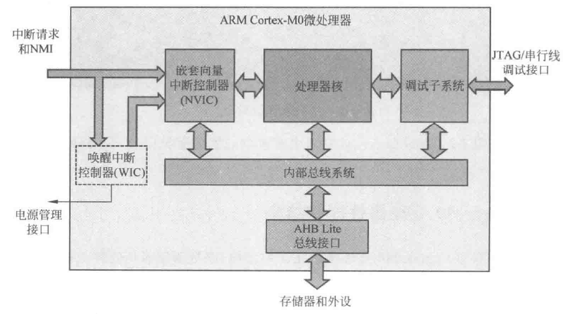

本系列博文旨在以计算机组成的角度剖析嵌入式应用中较常见的ARM架构，由于CM0是相对先进且*简单*的内核，所以选择了CM0作为切入点而不是STM32中常见的CM3/CM4

部分资料来源：何宾《ARM Cortex-M0全可编程SoC》、Joseph Yiu著 吴常玉 张淑 吴卫东等译《ARM Cortex-M0玉Cortex-M0+权威指南》、ARM官方资料《AT510-BU-98000-r1p0-00rel0》（cortexm0_designstart工具包）、《DDI0432C-cortex_m0_r0p0_trm》（ARM Cortex-M0官方手册）

整套博文应当在读者具有计算机体系结构基础知识的情况下阅读，否则不容易形成连贯的感知。推荐没有计组基础的老哥先去阅读胡伟武老师的[《计算机体系结构》](https://github.com/foxsen/archbase)

# Cortex-M0解读1【内核结构】

Cortex-M0处理器是ARM Cortex-M系列里面结构和功能最简单的处理器，基于**32位ARMv6-M架构**，**三级流水**（取指-译码-执行）；使用**冯诺依曼架构**（指令数据共享TCM）；支持绝大部分的16位**Thumb-1**指令和部分32位**Thumb-2**指令，一共包含**56条指令**；支持Cotrex-M系列内核常见的32位中断，并且支持**NMI**（不可屏蔽中断），提供低功耗休眠模式

> 下面所有内容中的Cortex-M0简写为CM0

CM0内核中包含**处理器核**、嵌套向量中断控制器（Nested Vector Interrupt Controller，**NVIC**）、调试子系统（**DAP**）、唤醒中断控制器（Wakeup Interrupt Controller，**WIC**）、**AHB-Lite**接口及内**核总线**



NVIC用于管理外部中断，并向处理器核发出中断请求信号，可以用于处理32个中断请求，并额外处理一个NMI中断。NVIC能够自动处理嵌套中断（比较中断请求之间的优先级以及当前中断的优先级）。总线系统用于处理内核内部握手交互，并连接了AHB-Lite接口单元，总线宽度固定为32位，总线系统还直接连除JTAG调试口，能够满足CoreSight调试架构的需求。DAP调试子系统提供调试控制、程序断点、数据监控点的功能，在产生调试事件时，它会将处理器核阻塞，开发者可以在此时调用查看处理器状态。WIC用于低功耗应用，通过设置寄存器中的指定位来控制，启用后会将外设时钟关断、电源下电，当检测到发生中断后，WIC再通知PMU（电源管理单元）给系统上电，并恢复外设时钟，处理器恢复正常状态

## 内核

CM0内核包含三级流水线、寄存器组和特殊控制寄存器。官方只开源了寄存器组、特殊控制寄存器的代码还有一套标准的外设RTL，关于内核的三级流水是使用了门级网表开源，打开RTL文件后只能看到一坨经过混淆的逻辑门表达式，不过我们还是能从官方文档、第三方描述中推断出一些关于内核的东西。

### 存储器空间映射

CM0是典型的32位CPU，提供了4GB的存储器寻址空间，分配如下图所示

> 虽然ARM规定了寻址空间分配，但用户可以根据具体要求灵活定义存储器映射，在软件上加以修改即可
>
> 不过并不推荐这样做，因为大多数上层软件都是基于ARM推荐的寻址空间分配设计，如果硬要修改可能会面临兼容性问题


我们从下往上（低地址到高地址）说。

最下面是**代码段**，用于保存程序代码，也常用于存储静态数据。这一部分的存储设备由ITCM、片上Flash等非易失存储器。**SRAM段**顾名思义，由DTCM、片上SRAM、SDRAM等易失性存储器承担，用于保存程序运行时数据。堆栈就在这一段内。**外设段**用于外设访问，一般MCU的片上外设寄存器都会被映射到这个区域内，CPU通过AHB、APB总线来访问外设（需要注意：CM0不支持AXI总线，当然支持了也没啥用）。**外部RAM段**用于保存大的数据块作为存储器高速缓存——这部分的物理设备一般由片外的SDRAM、DDR、Flash承担，但是也不排除有些特殊需求的设备在片上集成这些东西。访问外部RAM段一般需要消耗较长时间，因为这部分存储器（也称为片外存储器*Off-chip Memory*）需要借助AHB总线进行访存，甚至要通过板级总线连接到遥远的另一个芯片。此段还能够用于LCD显示，也就是我们常说的“显存”，当然这需要片上外设的支持。**外部设备段**用于映射到片外的设备，最常见的用途就是连接SD卡或者eMMC。**私有外设总线**（PPB，Internal Private Peripheral Bus）**段**专用于内核。CPU核通过PPB连接到内核外设，PPB有一套独立的存储空间，被称为**SCS系统控制空间**，只有内核能够访问，外设（DMA等）是不能读取的，不过地址确实被映射到了图示位置。这一段分类比较细，我们挨个说。

首先是用于调试的断点单元和数据监视点单元，这两个部分都是给系统DAP提供。ROM表也是用于调试的组件，它提供了外设是否挂载到内核的依据。详细内容可以参考https://www.cnblogs.com/dac1bw2zkx3/p/10466562.html。

SCS中映射了NVIC和SysTick内核定时器的寄存器地址，这两个是CM系列内核必备的东西，不多赘述。**SCB系统控制块**则是内核编程中最重要的部分，相当于CPU的配置寄存器，更改SCB可以调整CPU的工作状态

### Register File寄存器组

CM0的RegFile结构如下所示


如上图所示，R0\~R12是**通用寄存器**。其中R0\~R7为低寄存器，这些寄存器可以被任何指令访问；R8~R12为高寄存器，一些Thumb指令不可以访问这些寄存器

R13寄存器是**堆栈指针**（**SP**，Stack Pointer）。堆栈中的**栈**（Stack）是内存中的一片固定区域，CM0的栈结构从高地址区域向低地址区域生长。当进行子程序跳转的时候，使用堆栈来保存上下文（现场保护、恢复现场）。SP用于记录当前栈顶的地址。入栈过程中，每有一个寄存器的数据被放入当前SP位置，SP都会随之**-4**；出栈中，每有一个寄存器数据被弹出，SP会随之**+4**


堆栈结构中的另一部分是**堆**（heap），这是在栈更高地址的一片区域，一般由用户程序或操作系统自行分配，堆是按照内存地址从低向高生长的。CM0为堆栈都预留了内存区域，在上面的内存映射部分已经提过

CM0中SP分为**MSP**（Main Stack Pointer，主堆栈指针）和**PSP**（Process Stack Pointer，进程堆栈指针）。MSP用于应用程序的特权访问（privilege access），一般来说嵌入式程序直接使用MSP而不使用PSP，MSP可以访问操作系统内核和异常句柄等关键区域；PSP不能执行异常句柄的跳转，这个指针在使用操作系统的情况下会应用于一般用户程序代码

> ARMv6-M架构有两个访问等级：特权和非特权。特权访问等级可以访问处理器内的所有资源，而非特权等级则存在一些存储器区域是无法访问的，并且有些操作无法执行。CM0没有非特权访问等级，所有操作都是特权的（CM0+中的非特权等级是可选的）

R15是**程序计数器PC**（Program Counter），记录了**当前运行的指令代码的地址**。在取指阶段，每个时钟周期PC自动+4（32位指令的情况）或+2（16位指令的情况）。在执行分支跳转指令的情况下，会将PC指向所要跳转到的地址，同时将当前PC值保存到**链接寄存器LR**（Link Register）中

R14就是链接寄存器，专门保存子程序或程序调用的返回地址。当程序调用结束后，LR中的值会被加载到PC。在后面的分支跳转部分会详细叙述这一过程

### SFR特殊控制寄存器（Special Function Register）

SFR有三个寄存器：xPSR、PRIMASK、CONTROL


xPSR是组合程序状态寄存器，实质上是三个寄存器，但CM0中可以通过相同的地址调用三个寄存器中的不同位——三个寄存器被映射到了同一个32位地址上

> 需要注意：这三个寄存器真的被映射成了同一个寄存器——xPSR在压栈时是作为一个整体进入栈的，返回时也会作为一个整体传回到三个寄存器对应位中
>
> CM0的官方实现中采用了如下代码
>
> ```verilog
> assign cm0_xpsr = {vis_apsr[3:0],3'd0,vis_tbit,18'd0,vis_ipsr[5:0]};
> ```
>
> 直接把这三个寄存器给合并成了一个
>
> 不过在内核中，它们就是三个寄存器，下面是官方实现进行例化的部分（例化的是内核模块）
>
> ```verilog
>   .vis_apsr_o           (vis_apsr[3:0]),
>   .vis_tbit_o           (vis_tbit),
>   .vis_ipsr_o           (vis_ipsr[5:0]),
> ```


三个寄存器分别是**APSR**应用程序状态寄存器、**IPSR**中断程序状态寄存器、**EPSR**执行程序状态寄存器

APSR（Application Program Status Register）用于指示ALU的关键计算结果，其中包含NZCV四个标志位

* **N**：**N**egtive负数指示。当ALU按有符号数字运算结果为负数时，该位置1；运算结果为正时，该位置0
* **Z**：**Z**ero零标志。当ALU运算结果等于0时，该位置1；运算结果不为0时，该位置0；如果两个数经比较后相等也会把该位置为1
* **C**：**C**arry进位标志。当无符号数加法产生无符号溢出情况下，该位置1；当无符号减法计算产生借位时，该位为借位输出状态取反
* **V**：o**V**erflow溢出标志。当有符号数加减法产生有符号溢出时，该位置1；否则置0

*几乎所有数据处理指令（R型指令）都会更改APSR，不过有些指令不会修改V、C标志位*，具体情况可以查看指令集资料

IPSR（Interrupt Program Status Register）用于保存当前正在执行中断服务程序（ISR）的**中断号**。CM0中每个异常都有自己的中断号，通过查看IPSR，调试时候可以知道正在执行的是哪一个中断

EPSR（Execution Program Status Register）中的T标志位用于指示是否处于Thumb状态。**CM0只支持Thumb状态，因此该寄存器中的T标志位恒为1**


PRIMASK寄存器又称为**IMSR中断屏蔽特殊寄存器**（Interrupt Mask Special Register），CM0中只有最低位PRIMASK标志位可用，**当该位置为1时，内核会屏蔽除了NMI不可屏蔽中断和HardFault硬件异常外的其他所有中断**

CONTROL寄存器中包含了一位用于定义堆栈的控制标志位，即`CONTROL[1]`，该位置1时，使用PSP进程堆栈指针；置0时，使用MSP主堆栈指针


### 取指


### 译码


### 执行


### 分支跳转


## Memory存储器


### 端序

**端序**（Endian）是保存在存储器中的字节顺序，也称为字节序。一般分为大端（Big Endian）和小端（Little Endian）。**小端序是低址低字节，高址高字节**；**大端序是低址高字节，高址低字节**

二者差别如下图所示


每个字节内部都是从右往左的第0位到第7位

CM0同时提供了小端存储和大端存储的支持，并支持在软件层次上的端序虚拟化，也就是在软件上不需要考虑大小端这个概念


### 栈

CM0的栈结构是典型的**向下生长栈**：入栈过程中，每有一个寄存器的数据被放入当前SP位置，SP都会随之**-4**；出栈中，每有一个寄存器数据被弹出，SP会随之**+4**。栈从内存的高地址向低地址增加，因此我们吗往往将栈指针初始化到SRAM的上边界，最常见的初始化范围就是从`0x2000_0000`到`0x2000_7FFF`的空间，我们将栈指针初始化到`0x2000_8000`，第一次PUSH入栈后，地址变为`0x2000_7FFC`也就是SRAM区域的最高字

在一般的嵌入式软件中，我们会首先在bootloader开头设置MSP的初值（PSP初值未定义，只能由软件初始化），随后可以在C启动代码执行期间（main函数内）设置SP，利用这样的机制，我们可以让系统在启动时让SP先指向SRAM的一小片区域，之后再外部存储器初始化完成后在为栈定义更大的外部存储器空间


