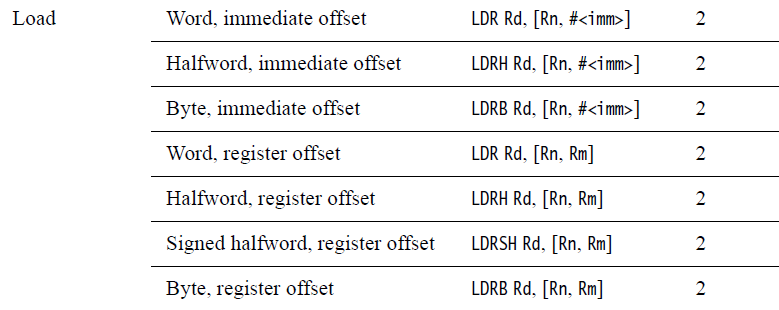
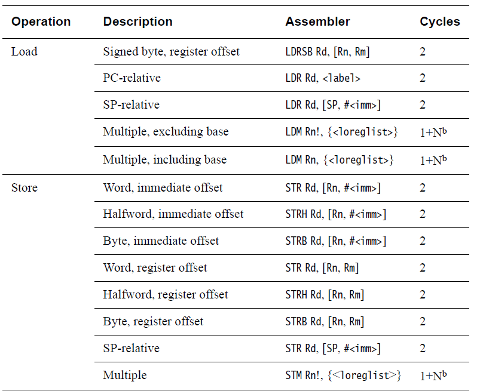
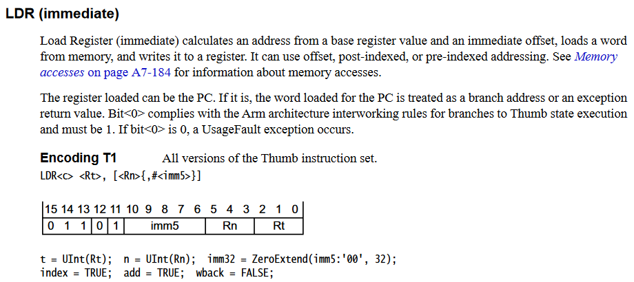
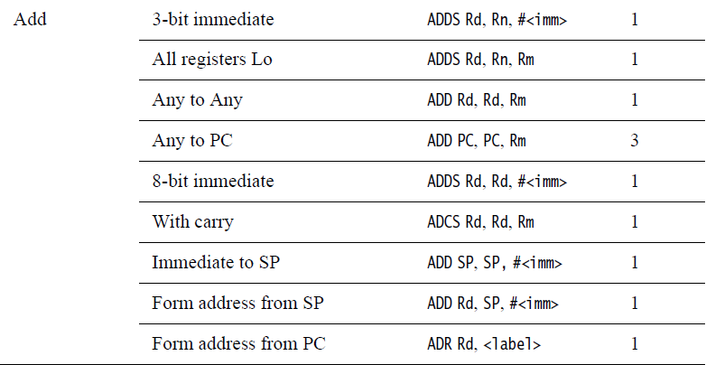
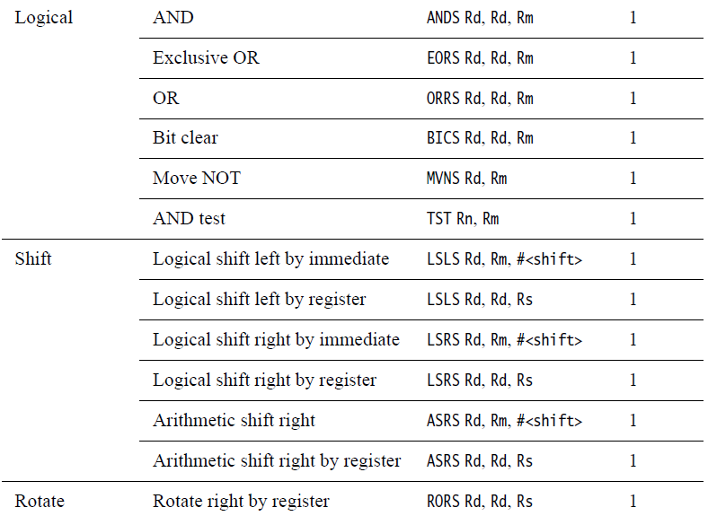
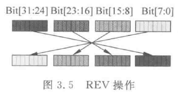
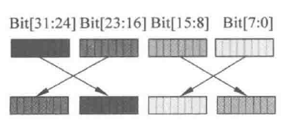
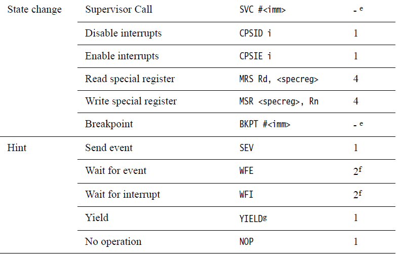

本系列博文旨在以计算机组成的角度剖析嵌入式应用中较常见的ARM架构，由于CM0是相对先进且*简单*的内核，所以选择了CM0作为切入点而不是STM32中常见的CM3/CM4

部分资料来源：何宾《ARM Cortex-M0全可编程SoC》、Joseph Yiu著 吴常玉 张淑 吴卫东等译《ARM Cortex-M0玉Cortex-M0+权威指南》、ARM官方资料《AT510-BU-98000-r1p0-00rel0》（cortexm0_designstart工具包）、《DDI0432C-cortex_m0_r0p0_trm》（ARM Cortex-M0官方手册）

整套博文应当在读者具有计算机体系结构基础知识的情况下阅读，否则不容易形成连贯的感知。推荐没有计组基础的老哥先去阅读胡伟武老师的[《计算机体系结构》](https://github.com/foxsen/archbase)

# Cortex-M0解读2【基础指令】

CM0基于ARMv6-M架构，支持Thumb-1的超集和Thumb-2的子集。对于ARM的v6-M和v7-M架构，简单来说可以用下面这段话描述：

> ARMv6-M向上兼容ARMv7-M向上兼容ARMv7E-M

因此CM0/CM0+/CM1的程序可以直接给CM3执行，CM3的程序可以直接给CM4执行，CM4的程序可以直接给CM7执行。而自上而下的移植过程也比较简单，只需要删去低版本不支持的指令即可

## 指令集

指令集架构（ISA）是软件和硬件的分界线，解读完CM0的基础结构后就必须看看它的ISA了

这里需要说明一下：ARM的*指令集*和*架构*在大部分地方可以混用，但是二者在ARM官方的定义是有区别的。指令集主要指处理器能识别（译码-执行）的指令的格式；架构则包含了处理器具体实现上的一些细节性要求或硬性规定。

### 编程模型

ARMv6-M架构有两个访问等级：特权和非特权。**特权访问等级**可以访问处理器内的所有资源，而**非特权访问等级**则存在一些存储器区域是无法访问的，并且有些操作无法执行。CM0没有非特权访问等级，所有操作都是特权的（CM0+中的非特权等级是可选的，根据具体实现而定）

> 这段内容在上篇中提到过

同时ARMv6-M架构设置了两种处理状态：**Thumb状态**和**调试状态**。处理器运行某个程序时会处在Thumb状态，此时处理器可能处于两种模式之一：**处理器模式**或**线程模式**。二者几乎相同，最大区别就是处理器模式使用MSP主堆栈指针，线程模式使用PSP进程堆栈指针。而当处理器被调试模块暂停时，会进入调试模式，这时调试器被允许访问或修改处理器内寄存器的值，也可以访问系统存储器。**处理器上电后，默认处于Thumb状态的线程模式下运行代码**，**CM0**只有特权访问等级，因此**所有内存资源都是用户可见的**。

> 你还记得之前提过CM0的CONTROL寄存器第0位是空的吗？CONTROL[0]寄存器是ARMv6-M指令集里面规定的特权标志位（nPRIV），当它设置为0时，会进入特权等级执行；为1时则是非特权等级。**由于CM0不支持非特权等级（CM0一直处于特权等级运行），因此这个位一直是0**！

### Thumb指令集

早期的ARM处理器使用32位指令集，称为**ARM指令**。32位指令集的运行性能较高，有更大的存储空间映射，但也带来了较大功耗，指令空间占用也比较大。随着1995年到来，16位Thumb-1指令集得到了应用，这是ARM指令集的子集，通过降低性能来唤起更短的代码长度。Thumb-1指令集的应用也带来了之前说过的EPSR寄存器——EPSR寄存器的T位连接到一个MUX，通过它可以选择使用Thumb指令集还是ARM指令集，如下图所示


这个多路复用器也被保留到现在。Thumb指令可以通过CPU内的重映射逻辑作为ARM指令来使用，从而提高了16位指令的效率

随后2003年，**Thumb-2指令集**被研发出来，这是32位Thumb指令的一部分和16位Thumb指令的另一部分拼接得到的指令集，CM3就用到了这个指令集，作为嵌入式微处理器一炮打响（多亏ST的库函数让大伙终于不用啃寄存器表）

ARM Cortex-M系列处理器支持的指令集称为Thumb，系列处理器的架构有ARMv6-M和ARMv7-M两类

对于CM0来说，它采用了ARMv6-M架构，支持Thumb-2的最小子集和Thumb-1的超集，也就是支持完善的16位指令，同时能够运行一部分32位指令。由于指令集较小，CM0很显然不是为了面向数据处理任务而生，我们更常用他来进行实时控制和一些简单的低性能低功耗计算

下面将会具体介绍CM0的所有指令，但在此之前我们先看一下CM0的汇编格式

### CM0汇编格式

目前ARM编译器和GNU编译器都支持CM0汇编，但是二者的汇编存在一定区别，这里只介绍ARM编译器的汇编指令，如果有需要可以自行参考gcc官网的手册来学习GNU汇编

总的来说，ARM汇编是不区分字母大小写的，使用下面的格式

```assembly
label
order dest, src, ... ;comment
```

前面的标号用于参考地址位置，也就是符号地址。助记符就是指令的汇编指令或者汇编器提供的伪指令。dest表示目的操作数，src表示源操作数，一个指令后面往往会跟不定数量的操作数，有的指令可能不需要操作数。ARM汇编统一使用`;`来进行单行注释

立即数用`#123`这样的形式表示

我们也可以使用汇编存取寄存器内的数据并访问内存，如下所示

```assembly
STR R1, [R0]
```

上面代码表示将R0寄存器内的数据作为地址，把R1寄存器中的值作为数据，之后把数据存入对应地址。也就是说`[]`符号表示把寄存器内容当成地址，再从取对应地址取数据进行操作

我们还经常用到汇编器的常量定义功能，经常把寄存器地址定义为常量来提高可读性

```assembly
NVIC_IRQ_SETEN EQU 0xE000E100

MOVS R0, =NVIC_IRQ_SETEN ;将0xE000E100存入R0
```

上面代码就定义了一个`NVIC_IRQ_SETEN`常量，表示0xE000E100，在后面使用时要在常量名前加`=`

下面代码演示了使用常量代表立即数

```assembly
ENABLE EQU 0x1

MOVS R1, #ENABLE' ;将立即数0x1存入R1
```

汇编器还支持在程序中插入数据，也就是把某些数据直接写死在存储器的特定地址中，例如

```assembly
ALIGN 4
STATIC_NUMBER DCD 0x01234567
HELLO_WORLD DCB "Hello,world\n", 0
```

`DCD`和`DCB`分别表示插入字（worD）大小的数据和插入字节（Byte）大小的数据。需要注意：插入字大小的数据时需要在前面加入`ALIGN`伪指令来进行字（32位）对齐——CM0不支持非对对齐传输，如果出现非对齐的数据可能会导致程序错误乃至处理器HardFault。`ALIGN 4`伪指令强制让后续数据按4字节（32位）对齐（通过将空位置0或插入NOP空指令的方式），这样就避免了可能出现的对齐问题。

ARM汇编器常用的插入数据伪指令如下：

DCB字节；DCW半字；DCD字；DCQ双字；DCFS单精度浮点；DCFD双精度浮点；DCB字符串；DCI指令

如果想要调用插入的数据，直接使用`=`连接数据名即可获取对应数据的起始地址，如

```assembly
LDR R0, =STATIC_NUMBER ;将STATIC_NUMBER数据的地址存入R0中
LDR R1, [R0] ;将STATIC_NUMBER的数据（0x0x01234567）存入R1中

LDR R0, =HELLO_WORLD ;将字符串首地址存入R0中
```

还是要强调一下，在使用汇编语言时候要看准汇编器，汇编器会影响到使用的伪指令格式

> 给出一个GNU汇编器的例子
>
> ```assembly
> .equ TRUE 0x1
> .equ FALSE 0x0
> 
> .align 4
> GNU_NUM:
> .word 0x12345678
> HELLO_GNU:
> .asciz "hello\n"
> 
> MOVS R0, #0x12 @ 单行注释
> MOVS R1, #'A' @ 也能直接将ASCII字符放入寄存器
> /* 单行注释 */
> STR R0, [R1]
> LDR R3, =HELLO_GNU
> ```
> 

## CM0的指令

CM0一共支持50条16位指令和6条32位指令，正好56条指令（够打扑克牌），如下图所示


没有包含的来自ARMv7-M的16位Thumb指令包括：CBZ、CBNZ、IT

### 寄存器访问

我们先来看如何用汇编指令访问寄存器。

> R0\~R12是**通用寄存器**。其中R0\~R7为低寄存器，这些寄存器可以被任何指令访问；R8~R12为高寄存器，一些Thumb指令不可以访问这些寄存器

低寄存器可以被M0的所有Thumb指令访问，而我们也可以使用MOV这种指令来访问所有通用寄存器。编写代码时候可以直接用`r0`或者`R0`来指定所用的寄存器。

> 顺带一提，通用寄存器不会随着CPU复位而清零，复位后的初始值是不定的

R13是堆栈指针，一般使用`R13`或者`SP`来访问，同一时间只能操作MSP或者PSP二者之一，至于操作的是哪一个——硬件会根据指令执行时的CONTROL寄存器状态来控制。**在使用MRS或者MSR这样的特殊寄存器操作指令时，倒是可以使用`MSP`和`PSP`这样具体的称呼**

堆栈指针是强制32位对齐（也就是**字节对齐**）的——它们的**最低两位一直为0**。此外，MSP默认在初始化后从程序存储器中向量表的第一个32位字中加载值；PSP则不定初值。裸机程序中往往把PSP丢在一边只使用MSP，这样就只维护一个主程序栈，比较方便。而带操作系统的程序中会为操作系统内核分配内核栈，使用MSP；为应用程序分配线程栈，使用PSP，这是为了操作系统的安全

> 强制32位对齐是因为POP、PUSH出栈入栈指令是根据寄存器出入栈，寄存器是32位的。假设没有32位对齐的堆栈指针，那么出入栈的时候就很有可能错开一两个字节，寄存器数据全乱套！

R14连接寄存器要使用`LR`或者小写来访问，其实也可以使用R14来访问，但这样不能表现LR的特殊（上面的SP同理）。由于CM0的指令有32位和16位两种，因此LR是16位对齐（我们一般称为**半字对齐**）的，其第二位LR[1]恒为0，第一位LR[0]则是可读写的。

> 不难发现，LR[0]在16位的Thumb状态下为1，在32位ARM状态下为0
>
> 这为我们判断指令执行时的处理器状态提供了依据

R15是程序计数器PC，直接用`R15`或者`PC`访问即可。和上面原因相同，PC也是16位对齐的。在使用PC时需要注意以下几点：

* **读PC时，会返回当前指令地址+4以后的值**。因为CM0的流水线是取指-译码-执行的流程，在指令返回的过程中，已经至少有两条指令被加载到流水线内部！

* **写PC时候会引发程序跳转，但并不更新LR**，这与正常的函数调用是两码事

* **利用跳转指令BX、BLX等执行跳转时，需要保证PC的最低位（LSB）为1**。PC[0]在Thumb状态下为1，在ARM状态下为0，这是在指示处理器当前执行的指令是16位还是32位。如果强行跳转，会导致处理器强行切换到32位的ARM状态（这样就没办法处理16位指令），引发HardFault异常

    > 按理说这里应该有一个剖析RTL源码——但我没有找到！就自己脑补一下吧：EPSR的T位是受到PC[0]、LR[0]、用户指令共同控制的，类似
    >
    > ```verilog
    > always @(posedge clk) begin
    >     EPSR[24] <= PC[0] | LR[0]; 
    > end
    > ```

APSR、IPSR、EPSR寄存器需要通过同一个名称`XPSR`进行访问，但我们一般不直接读写它们——xPSR寄存器是在程序执行过程中自动由硬件判断和使用的。如果我们非要读写其中的某个寄存器，那就只能老老实实地数位数了。而且xPSR寄存器只有通过特殊寄存器访问指令才能读写，而APSR中的值一旦被修改就可能影响到条件跳转。**非必要不读写**！

> 根据指令集规定，xPSR中只有APSR是可读写的，IPSR是只读寄存器，EPSR则不允许访问。强行写入IPSR或者强行写入EPSR都是没有效果的，如果强行读取EPSR，则会默认读出T位为0

PRIMASK寄存器用于全局中断屏蔽，现在很多操作系统的开关全局中断都基于这个寄存器实现。**在置位后，会将当前中断优先级提升到0，这样就只有最高优先级的HardFault和NMI中断才能执行了**。老版本的FreeRTOS没有使用这个寄存器，而是通过修改NVIC，需要耗费不少时间，后来才修改成控制这个寄存器，相关代码摘录如下（这是C内嵌汇编的部分）

```c
//关中断
__asm
{
	MRS r0, PRIMASK
	CPSID I
}
//开中断
__asm
{
	MSR PRIMASK, basepri
}
```

### APSR对ALU的影响

**APSR的状态**会影响ALU，这也就是为什么APSR在其他指令集架构中一般被称为**ALU状态标志**

APSR可以用于超过32位的数据处理：将64位加法拆解成两个32位加法，有

```c
Z[31:0] = X[31:0] + Y[31:0]; //计算低字
Carry = APSR[29]; //更新APSR的C位
Z[63:32] = X[31:0] + Y[31:0] + Carry; //计算高字
```

在之后我们会具体讨论这类算法的底层实现

### 指令后缀规则

| 指令后缀 | 含义                          | 对APSR的影响         |
| -------- | ----------------------------- | -------------------- |
| S        | sign，更新APSR中的标志位      | 按照运算结果更新APSR |
| EQ       | equal，等于                   | Z=1                  |
| NE       | not equal，不等于             | Z=0                  |
| CS       | 无符号，高或相同              | C=1                  |
| CC       | 无符号，低                    | C=0                  |
| MI       | minus，负数                   | N=1                  |
| PL       | plus，正数或零                | N=0                  |
| VS       | 溢出                          | V=1                  |
| VC       | 无溢出                        | V=0                  |
| HI       | 无符号，高                    | C=1或Z=0             |
| LS       | 无符号，低或相同              | C=0或Z=1             |
| GE       | greater equal，有符号大于等于 | N=V                  |
| LT       | less than，有符号小于         | N!=V                 |
| GT       | greater than，有符号大于      | Z=0且N=V             |
| LE       | less equal，有符号小于等于    | Z=1且N!=V            |

上面的表格说的很详细，但总结来说，就是

* **S后缀指令会更新APSR**
* **其他后缀的指令，对于CM0来说只能用于条件跳转**

### MOV型指令


MOV型指令的作用就是在处理器寄存器内部传输数据，因此往往具有较少的执行周期数

### MOV

* `MOV Rd, #imm8`

    将8位立即数复制到目标寄存器Rd中

    这条指令使用时的一个隐含条件：只能复制8位立即数，如果立即数超过8位，需要先将数据存到程序存储器空间，再用存储器访问指令LDR把数据读到寄存器里面

    > 汇编器提供了一条伪指令LDR（注意区分上面的存储器访问指令LDR），用于向寄存器加载长数据

    这里顺便说一下之后使用的标记规则：

    **#imm后面跟数字m，表示m位的立即数；Rd表示目标寄存器，特指通用寄存器；Rs表示源寄存器，也是指通用寄存器**

* `MOV Rd, Rs`

    将Rs中的数据复制到Rd

* `MOV PC,Rs`

    也可以使用该指令将Rs数据复制到PC程序计数器

### MOVS

该指令带有S后缀，因此会更新APSR寄存器

* `MOVS Rd, Rs`

    将Rs的内容复制到Rd，同时根据数据情况更新APSR的Z和N标志

* `MOVS Rd, #imm8`

    将8位立即数存入Rd中，并更新Z和N标志

### MRS

`MRS Rd, SR`

其中SR表示SpecialRegister特殊寄存器。该指令用于将SR中的数据复制到Rd寄存器

> 特殊寄存器包括xPSR、PRIMASK、CONTROL三个标准的特殊寄存器，还有MSP、PSP这两个堆栈指针

注意：**该指令中的S并不是后缀，因此不会影响APSR**

### MSR

`MSR SR, Rd`

将Rd中数据复制到SR

注意：**该指令没有后缀，但会影响APSR寄存器中的NZCV标志位**

### Load-Store型指令





这类指令用于访存，因为CM0流水线为三级，所以往往都需要2个周期完成

在访存过程中，用户需要保证按字操作的操作地址最低两位为0，按半字操作的操作地址最低位为0。因为ARMv6-M架构不允许非对齐访问，因此任何在非对其地址上的访存都会导寻址致HardFault异常

Load指令用于从存储器中读数据保存到寄存器。基本格式就是`LOAD register [how_to_addressing]`，第一个参数是要往里面写数据的寄存器，第二个（很多时候也会有第三个）参数用于寻址。

Store指令用于从寄存器中读数据保存到存储器。基本格式是`STORE register [how_to_addressing]`，第一个参数是要提出数据的寄存器，第二个（第三个）参数用于寻址。

尽管第二个寄存器参数都是指dest目标寄存器，但是下面的内容中为了便于理解，将Load指令的第二个参数描述为Rd，意为要将数据存到的地方；将Store指令的第二个参数描述为Rs，表示从中提取数据的地方，请有经验的读者加以甄别

上一篇博文中我们简单讲述了CM0的寻址方式，下面会以指令为例详述

### LDR

按字无符号加载或有符号加载

* `LDR Rd, [Rs1, Rs2]`

    该指令从Rs1和Rs2中取出数据，作为32位地址相加，之后再把得到的数据作为目标地址，根据其找到数据存储器的对应地址，取出32位数据，并将其复制到Rd寄存器

    最基本的**寄存器间接寻址**访存指令（Load Data to Register）

* `LDR Rd, [Rs, #imm5]`

    **立即数偏移寻址**访存。首先对5位立即数进行零扩展（这个过程可以被解释为`#imm5 << 2`）获得一个7位立即数imm7，再将Rs中的数据和imm7相加后得到要访存的地址，从对应位置取得一个32位数据，将其复制到Rd寄存器

    > **关键来了：零扩展是什么？**
    >
    > 我们先看一个例子：`LDR R0, [R1, #0x4]`
    >
    > 这个指令会从[R1+0x4]的地址取出一个字，并将其复制到寄存器R0。根本看不见零扩展有什么作用
    >
    > 我们再看另一个：`LDR R0, [R1, #0x5]`
    >
    > 这个指令会从[R1+0x14]的地址取出一个字，并将其复制到寄存器R0。
    >
    > 我们知道十六进制的0x14表示十进制的20，那么它是怎么来的？
    >
    > 零扩展在这里表示“无符号数补零扩展”：指令集里面的指令长度是16位，但是我们要往里塞的数据太多了，这个指令里面就包含了LDR的opcode操作码、Rd寄存器地址、Rs寄存器地址，最后我们还想塞进一个8位无符号整型的数据作为偏移量，但剩下的地方不够怎么办？我们不难发现，这个指令正好是32位对齐，这就意味着最终得到地址的第0位和第1位必须是0，也就是要能被4整除！
    >
    > 于是，我们只要8-2=6位数据就可以表示原来8位偏移量。这样指令的空间就堪堪够用——不过还比16位指令的预期多一位，这一位不得不删，于是就只能拿出5位立即数，把它算数左移，最低位补两个零，就能拿到7位的偏移地址啦
    >
    > 
    >
    > 正是因此整个过程可以描述为`#imm7 = #imm5 << 2`，经过运算立即数的范围刚好满足字对齐，有`#imm7[0] = 0, #imm7[1] = 0`，同时`#imm7 % 4 = 0`
    >
    > 上面引用了来自ARMv7-M指令集的官方参考手册，可以发现使用了5位立即数执行0扩展以后得到了32位立即数，在ARMv6-M指令集中，我们得到的是8位立即数，原理都是相通的
    >
    > 此外需要注意：imm5的数据范围在5'b00000到5'b11111之间，得到的imm7数据范围在7'b000_0000到7'b111_1100之间，也就是说偏移地址最大值不能超过124，如果输入一个指令
    >
    > `LDR R0, [R1, #0x80]`
    >
    > 这可是会报错的，因为0x80\==128\==8'b1000_000刚好超过偏移地址最大值限制
    >
    
    如果我们需要在汇编中使用这个指令，并不需要预先计算零扩展之后的imm7值，直接使用范围在0000000到1111100之间的32位对齐的立即数imm7即可，汇编器会帮我们自动处理零扩展
    
    > 当然，如果使用的imm7不符合32位对齐（%4=0）的原则，那么程序会进入HardFault——大部分汇编器不会帮我们查错
    
* `LDR Rd, =#imm32`

    将32位立即数加载到寄存器Rd中，一般用于配合其他访存指令

* `LDR Rd, [PC/SP, #imm8]`

    使用PC或者SP寄存器进行间接访存。从PC/SP中取出基地址，将8位立即数imm8进行零扩展到imm10后作为偏移地址，二者相加作为访存地址，从其中取出一个字（32位），并将其复制到Rd寄存器

    该指令需要保证32位对齐，即imm10的范围在10'b00_0000_0000到10'b11_1111_1100之间，最低两位必须为0

### LDRH

按半字无符号加载

* `LDRH Rd, [Rs1, Rs2]`

    从[Rs1+Rs2]指向存储器的地址中取出半个字（16位），并将其复制到Rd[15:0]中，同时清零Rd[31:16]

    也就是半字访存（Load Data to Register in Half-word）

* `LDRH Rd, [Rs, #imm5]`

    与LDR指令同样通过零扩展进行立即数偏移寻址，只不过这里的零扩展是要保证imm5的半字对齐，即最低位是0，因此最终的寻址范围是6位立即数`#imm6 = #imm5 << 1`，范围在000000到111110之间，确保`%2 = 0`

### LDRB

按字节无符号加载

* `LDRB Rd, [Rs1, Rs2]`

    从[Rs1+Rs2]指向存储器的地址中取出一个字节（8位），并将其复制到Rd[7:0]中，同时清零Rd[31:8]

    也就是字节访存（Load Data to Register in Byte）

* `LDRH Rd, [Rs, #imm5]`

    从[Rs1+#imm5]指向存储器的地址中取出一个字节（8位），并将其复制到Rd[7:0]中，同时清零Rd[31:8]

    这里imm5就不需要零扩展来满足对齐了，因此偏移地址范围00000到11111，这是#imm5表示的真正含义

### LDRSH

`LDRSH Rd, [Rs1, Rs2]`

按半字有符号加载（Load Data to Register in Signed Half-word）

从[Rs1+Rs2]所指向存储器地址中取出半字（16位），将其复制到Rd[15:0]，并对数据进行符号位扩展，Rd[31:16]都被赋值为Rd[15]

> 符号位扩展是指这样一种运算：
>
> 有符号数在电路中使用补码表示，其最高位是符号位，用0表示正数，1表示负数，如果是16位的有符号数imm，其最高位imm[15]位符号位。符号位扩展时，根据imm[15]是0还是1将其他[31:16]位全部置位为0或1，即`assign Rd[31:16] = {16{imm[15]}};`

### LDRSB

`LDRSB Rd, [Rs1, Rs2]`

按字节有符号加载

从[Rs1+Rs2]所指向存储器地址中取出一个字节（8位），将其复制到Rd[7:0]，并对数据进行符号位扩展，Rd[31:8]都被赋值为Rd[7]

### STR

按字有/无符号加载

* `STR Rs, [Rd1, Rd2]`

    将Rs寄存器中的数据按字Rs[31:0]复制到[Rd1+Rd2]所指向存储器地址单元

* `STR Rs, [Rd, #imm5]`

    将Rs寄存器中的数据按字复制到[Rd+#imm5零扩展]所指向存储器单元

    寻址方式和LDR指令里面的立即偏移寻址一样

* `STR Rs [SP, #imm8]`

    将Rs寄存器中的数据按字复制到[SP+#imm8零扩展]所指向的存储器单元中

    这里对imm8进行的零扩展是为了保证偏移地址32位对齐（%4=0），即`#imm8 << 2`。扩展后取值范围从10'b00_0000_0000到10'b11_1111_1100

### STRH

按半字有/无符号加载

* `STRH Rs, [Rd1, Rd2]`

    将Rs寄存器中的数据按半字Rs[15:0]复制到[Rd1+Rd2]所指向存储器地址单元

* `STRH Rs, [Rd, #imm5]`

    将Rs寄存器中的数据按半字Rs[15:0]复制到[Rd1+#imm5零扩展]所指向存储器地址单元

### STRB

按字节有/无符号加载

* `STRB Rs, [Rd1, Rd2]`

    将Rs寄存器中的数据按字节Rs[7:0]复制到[Rd1+Rd2]所指向存储器地址单元

* `STRB Rs, [Rd, #imm5]`

    将Rs寄存器中的数据按字节Rs[7:0]复制到[Rd1+#imm5]所指向存储器地址单元，5位立即数偏移量不需要零扩展

### LDM

`LDM Rs, {Rd1, Rd2, ... , Rdn}`

该指令将Rs寄存器所指向的存储器地址对应内容按字复制到Rd1中，将[Rs + 4]所指向的存储器地址对应内容按字复制到Rd2中，以此类推，将寄存器[Rs + (n-1) * 4]对应内容按字复制到Rdn中

在汇编中，可以使用如下语法来简化书写

```assembly
LDM Rs, {Ra, Rb - Re}
```

该语法描述将Rs及其后多个字分别存到Ra、Rb、Rc、Rd、Re中

本指令以及后面涉及到多目标存储器访问的指令都会花费较多指令周期，一般为$1+N^b$

### LDMIA

`LDMIA Rs, {Rd1, Rd2, ... , Rdn}`

和LDM指令功能一样，但在加载完毕后会将Rs的值更新到最后一个地址（对应存进Rdn数据的地址）+4（往后错一个字）的值

### STMIA

`STMIA Rd, {Rs1, Rs2, ... , Rsn}`

将多个寄存器Rs的内容依次存入Rd所指向存储器地址对应单元，每存入一个值就将Rd的值+4；完成最后一次存入后，将Rd的值更新到最后一个地址+4的值

这个指令也支持如下格式

`STMIA R0, {R0, R1 - R5}`

也就是能够将Rd寄存器自身的值也存入存储器。但这样做需要保证Rd寄存器是列表中第一个出现的寄存器

### 栈访问型指令

CM0中有两个专门用于栈访问的指令


### Push压栈

`PUSH {Rsa, Rsb, ... , Rsn}`

将一个或多个寄存器压栈，并更新SP

压栈顺序为从左到右：Rsa先进入，Rsb压在Rsa之上，以此类推，栈顶数据为Rsn中的数据

### Pop出栈

`POP {Rda, Rdb, ... , Rdn}`

将一个或多个栈中数据项恢复到寄存器

出栈顺序为从右到左：栈顶数据被保存到Rdn，第二个数据项被保存到Rd(n-1)，以此类推，栈底数据被存到Rda

### 算术运算指令

 CM0处理器支持加法、减法和乘法、比较指令，大多数运算都在两个寄存器间或一个寄存器和一个立即数间进行。

常见的加法指令如下所示



特别地，CM0支持PC自增加法的操作，但这需要3个机器周期

对于减法，


则不支持PC递减操作

加减法外，CM0还提供了乘法和比较逻辑，指令如下


乘法是比较耗费时间的，因此往往需要32^a个周期才能完成

CM0还支持在Java语言和C语言处理字符时常用的反转指令


还有用于主动实现有无符号整型转换的符号位扩展/零扩展指令


下面来逐条指令介绍

### ADD

最基本的加法操作，不会更新APSR寄存器。包含下面几种子指令

* `ADD Rd, Rs`

    将Rd与Rs中的值相加后保存结果到Rd中，不更新APSR

* `ADD Rd, PC, #imm8`

    将PC的值和8位立即数#imm8相加后保存结果到Rd中，不更新APSR

    要求#imm8进行32位对齐，也就是`#imm8 % 4 = 0`

### ADDS

会按照结果更新APSR寄存器的加法指令

* `ADDS Rd, [Rs1, Rs2]`

    将Rs1寄存器中的内容和Rs2中的内容相加，结果保存在Rd寄存器中，并更新APSR中的N、Z、C、V四个标志

* `ADDS Rd, [Rs, #imm3]`

    将Rs中的内容和3位立即数imm3相加后保存到Rd，并更新APSR

* `ADDS Rd, #imm8`

    自增操作。将Rd中的内容和8位立即数imm8相加后存回Rd，也就是为Rd中的值自增imm8，并更新APSR

### ADCS

即*Add with Carry*，更新APSR标志

`ADCS Rd, Rs`

将Rd寄存器中的内容、Rs寄存器中的内容、APSR中的进位标志C三者相加并将结果保存到Rd中，更新APSR

### ADR

`ADR Rd, <Label>`

将PC值和标号Label所表示的偏移量相加后保存到Rd寄存器，不更新APSR中的标志

该指令用于加载标号所表示地址到寄存器中。需要注意*标号必须是字对齐*，而且范围要在`0~1020`个字节内。编写汇编时需要使用ALIGN伪指令来保证标号字对齐

### SUBS

改变APSR的减法指令

* `SUBS Rd, Rs1, Rs2`

    用Rs1中的内容减去Rs2中的内容，结果保存到Rd中，相当于`Rd = Rs1 - Rs2`

    更新APSR

* `SUBS Rd, Rs, #imm3`

    将Rs寄存器中的内容和3位立即数相减后保存到Rd寄存器。更新APSR

* `SUBS Rd, #imm8`

    将Rd寄存器自减8位立即数#imm8，结果保存回Rd中。更新APSR标志

### SBCS

`SBCS Rd, Rd, Rs`

用于将Rd中的内容、Rs中的内容和借位标志`V`相减，得到结果保存在Rd寄存器中，并更新APSR中的N、Z、C、V标志

`SBCS R0, R0, R1`相当于执行`R0 = R0 - R1 - V`

### RSBS

`RSBS Rd, Rs, #0`

该指令用立即数0减去寄存器Rs中的值，将结果保存到Rd寄存器中。相当于对Rs取相反数（-Rs）后保存到Rd寄存器，常用于高级语言中的取负数操作

### MULS

`MULS Rd, Rs, Rd`

将Rs中的值和Rd中的值相乘，结果保存在Rd寄存器，并更新APSR中的NZCV标志位

### CMP

比较运算的本质是通过减法指令判断两个数据的差是否大于0。比如a>b就可以转换成a-b>0，最终可以通过判断运算结果是否大于0来获得比较结果

* `CMP Rs1, Rs2`

    比较Rs1和Rs2寄存器中的内容，也就是进行Rs1-Rs2的运算，但不会保存该结果而是直接更新APSR中的N、Z、C、V标志位。后续的程序可以通过判断APSR标志位来获得比较结果

* `CMP Rs, #imm8`

    比较Rs寄存器的内容和8位立即数imm8（即范围在0x00~0xFF的整数），得到Rs-imm8的结果，但不保存而是更新APSR中的标志位

### CMN

`CMN Rd, Rs`

比较Rd和Rs取反后的内容，得到Rd+Rs结果，但不保存该结果而是更新APSR寄存器中的N、Z、C、V标志（主要是更新*负数标志N*和*零标志Z*，有时候会改变*进位标志C*）

指令`CMN R0, R1`相当于`R0 - (-R1)`，在硬件执行过程中，通常使用加法器执行`R0+R1`来实现该指令

### 逻辑运算指令

CM0也提供了大量逻辑运算指令，如下图所示，包含基础逻辑运算和数据的移位



### ANDS

`ANDS Rd, Rs`

将Rd和Rs中的内容进行逻辑与，结果保存在Rd中，更新APSR中的N和Z标志

### ORRS

`ORRS Rd, Rs`

将Rd和Rs中的内容进行逻辑或，结果保存在Rd中，更新APSR中的N和Z标志

### EORS

`EORS Rd, Rs`

将Rd和Rs中的内容进行逻辑异或，结果保存在Rd中，更新APSR中的N和Z标志

### MVNS

`MVNS Rd, Rs`

将Rs中的内容按位进行“逻辑取反”操作，结果保存在Rd中，更新APSR中的N和Z标志

相当于`Rd = ~Rs`

### BICS

`BICS Rd, Rs`

将Rs中的内容按位进行“逻辑取反”操作，然后与Rd寄存器中的数据按位进行“逻辑与”运算，将结果保存到Rd寄存器中，并更新APSR中的N和Z标志

相当于`Rd = Rd | (~Rs)`

### TST

`TST Rd, Rs`

将Rs中的内容和Rd寄存器中的内容按位进行“逻辑与”运算，但不保存结果，而是更新APSR中的N和Z标志

### ASRS

`ASRS Rd, Rs`

执行**算术右移**。将Rd中的数据向右移动Rm所指定的位数，移位的结果保存在Rd中。最后移出去的位要保存在APSR寄存器的C标志中，同时更新N和Z标志。

**算术右移过程中最高位（符号位）要执行符号位扩展，如果符号位是0则补0，符号位是1则补1**


相当于`Rd = Rd >> Rs`

可以用该指令进行快速除法（算术右移1位相当于除以2）

该指令的一个变体是

`ASRS Rd, Rs, #imm5`

将Rs中的数据向右移动5位立即数imm5所指定的次数（范围是1~32），移位结果保存在Rd寄存器中。最后移出去的位保存在APSR寄存器的C标志中，同时更新N和Z标志。

相当于`Rd = Rs >> #imm5`

### LSRS

用于执行**逻辑右移**

`LSRS Rd, Rs`

将Rd中的数据向右移动Rs所指定的次数，移位结果保存在Rd寄存器。以为过程中，最后移出去的位保存在APSR寄存器的C标志中，同时更新N和Z标志。

**逻辑右移不考虑最高符号位，不管符号位是什么，一律填0**


该指令相当于`Rd = Rd >> Rs`，但是执行的是无符号数unsigned int的右移

### RORS

用于执行循环右移


`RORS Rd, Rs`

将Rd中的数据向右循环移动Rs所指定的次数，移位结果保存到Rd寄存器中。最后移出去的位保存在APSR寄存器的C标志中，同时更新N和Z标志。

循环右移过程中，会把移出去的位移回最高位

### LSLS

`LSLS Rd, Rs`

逻辑左移，将Rd中的数据向左循环移动Rs所指定的次数，移位结果保存到Rd寄存器中，即`Rd = Rd << Rs`。最后移出去的位保存在APSR寄存器的C标志中，同时更新N和Z标志。


指令的一个变体为

`LSLS Rd, Rs, #imm5`

将Rs中的数据向左移动5位立即数imm5所指定的次数（范围是1~32），移位结果保存在Rd寄存器中。最后移出去的位保存在APSR寄存器的C标志中，同时更新N和Z标志。

相当于`Rd = Rs << #imm5`

### REV

`REV Rd, Rs`

将Rs中字节的顺序按逆序重新排列，结果保存在Rd中，等同于下列代码

```verilog
assign Rd[31:0] = {Rs[7:0], Rs[15:8], Rs[23:16], Rs[31:24]};
```



### REVSH

`REVSH Rd, Rs`

将Rs寄存器中低半字内的两个字节逆序重新排列，结果保存在Rd寄存器的低半字Rd[15:0]中。对于Rd[31:16]中的内容由换序后Rs[7]的内容决定（符号位扩展）


相当于

```verilog
assign Rd[31:0] = {16{Rs[7]}, Rs[7:0], Rs[15:8]};
```

### REV16

`REV16 Rd, Rs`

将Rs中的内容以半字为边界，半字以内的两个字节逆序排列，结果保存在Rd寄存器中



相当于

```verilog
assign Rd[31:0] = {Rs[23:16], Rs[31:24], Rs[7:0], Rs[15:8]};
```

### SXTB

字节符号位扩展成字指令

`SXTB Rd, Rs`

对Rs寄存器中的最低字节Rs[7:0]进行符号位扩展，将结果保存到Rd寄存器

### SXTH

半字符号位扩展成字指令

`SXTH Rd, Rs`

对Rs寄存器中的低半字Rs[15:0]进行符号位扩展，将结果保存到Rd寄存器

### UXTB

字节零扩展成字指令

`UXTB Rd, Rs`

对Rs寄存器中的最低字节Rs[7:0]进行零扩展，将结果保存到Rd寄存器

### UXTH

半字零扩展成字指令

`UXTH Rd, Rs`

对Rs寄存器中的低半字Rs[15:0]进行零扩展，将结果保存到Rd寄存器

### 程序流控制指令

CM0支持5个跳转指令，在循环和条件执行这样具有分支跳转场景的程序流控制中非常重要。同时对于函数调用过程，CM0会使用到部分指令以实现保存现场和恢复现场


### B

`B <label>`

这是最常见的跳转指令之一，用于无条件跳转到label所标识的地址

限制跳转地址为当前PC前后2046字节

还可以根据APSR中的NZCV标志位来进行有条件跳转

`B<condition> <label>`

这套指令下包含了之前说过后缀所描述的子指令。由于加入了跳转条件，占用了一部分指令长度，这些子指令限制跳转地址在当前PC前后256字节

* BEQ：Z=1则跳转。相等则跳
* BNE：Z=0则跳转。不相等则跳
* BCS：C=1则跳转。无符号数大于或等于则跳
* BCC：C=0则跳转。无符号数小于则跳
* BMI：N=1则跳转。负数则跳
* BPL：N=0则跳转。正数或0则跳
* BVS：V=1则跳转
* BVC：V=0则跳转
* BHI：C=1或Z=0则跳转。无符号数大于则跳
* BLS：C=0或Z=1则跳转。无符号数大于或等于则跳
* BGE：N=V则跳转。有符号数大于或等于则跳
* BLT：N=!V则跳转。有符号数小于则跳
* BGT：Z=0且N=V则跳转。有符号数大于则跳
* BLE：Z=1且N=V则跳转。有符号数小于或等于则跳

这些指令最常用于不复杂的函数内循环和if判断（因为跳转范围较小）

### BL

`BL <label>`

另一个最常见的跳转指令，即"Branch & Link"*跳转和链接*，用于跳转到一个地址并返回地址保存到寄存器LR中。跳转地址范围为当前PC前后16MB

该指令最常用于子程序或函数调用，配合下面的`BX`指令完成整个函数的跳转，即下面这段汇编

```assembly
# 开始进入子函数
adds r0, r3, #1
BL subfunction # 执行后，将PC值修改为subfunction标号所标识的地址值，同时LR=PC+4
# 跳转到LR指向位置（即上一条的PC+4）
adds r2, r4, #1

subfunction:
	adds r1, r1, #1
	# 完成子函数执行，跳转回主函数
	BX LR
```

### BX

`BX Rs`

“*跳转并交换*”（Branch & Exchange）指令.跳转到Rs寄存器所指定的地址，同时根据PSR寄存器Thumb位来切换处理器状态（0表示ARM状态，1表示Thumb状态，不过CM0只有Thumb状态，因此在这里并没有什么用）

最常见的用途就是与上一条`BL`指令配合实现函数或子程序调用

### BLX

`BLX Rs`

“Branch & Link & Exchange”跳转和带有交换的链接。用于跳转到寄存器Rs所指定的地址，将返回地址保存到寄存器LR中，并根据PSR寄存器Thumb位来切换处理器状态

`BLX R0`就表示将PC值修改为R0寄存器中的内容，并让LR的值为之前的PC+4

相当于BL和BX的混合

### Barrier型指令

存储器屏蔽指令。常用于复杂的存储器系统，由于CM0处理器中只包含一个存储器接口连接到存储器子系统，并且系统总线接口上没有写缓存，因此这些指令一般不会用到。为了提高在其他ARM处理器上面二进制代码的可移植性，CM0支持了Barrier型指令


### DMB

数据存储器屏蔽指令

用于确保开始新的存储器访问前，所有存储器访问都已经完成。即同步多个访存过程

### DSB

数据同步屏蔽指令

确保执行下一条指令前，所有存储器访问都已经完成。即保证当前访存的数据一致性

### ISB

指令同步屏蔽指令

在执行新一条指令前强行进行流水线冲刷，保证已经完成先前所有指令。用于保障当前指令执行顺序正确

### 处理器状态控制指令和低功耗指令



### SVC

`SVC #imm8`

CM0中包含用于请求管理的指令SVC，该指令用于手动触发SVC异常

其中使用了一个8位立即数，该参数不会直接影响SVC异常，而是会在执行SVC中断服务函数时被作为参数提取出来。

由于SVC异常经常作为系统服务的入口或API，这个常常用于引起RTOS的线程调度，参数也可用于指明所需的系统服务号

需要注意：如果在处理更高优先级中断时使用了SVC指令，会引起HardFault，因此SVC指令不能用于硬件错误处理程序、NMI或递归使用（用在SVC的终端服务函数内）

### CPS

用于使能/失能中断。该指令是非阻塞的，不会导致NMI或HardFault中断服务函数出错，相较于MSR指令具有更简短、安全的特点。但在部分RTOS中，由于需要全局中断开关，还是会使用MSR指令完成中断控制

`CPSIE 1`使能中断同时清除PRIMASK

`CPSID 1`失能中断同时设置PRIMASK

由于这条指令执行速度很快，因此可以通过切换PRIMASK状态来满足时间敏感代码的需求

### NOP

空指令，用于产生指令对齐（流水线空泡填充）或引入延迟（非精确延迟，如需要精确延时，可以选择硬件定时器而不是插入nop指令）

### BKPT

断点指令。调试器会使用该指令来替换原先的指令，从而让用户执行调试任务。CM0只支持最多4个硬件断点，因此常常需要软件断点，该指令也可以加入一个8位立即数作为断点编号

`BKPT #imm8`

### YIELD

该指令会在未来版本的CM0或CM0+架构中加入，当前CM0处理器并未使用该指令的特殊功能，仅仅将其作为NOP指令看待。

YIELD指令用于提高与其他ARM处理器的兼容性，用途与NOP一致，不过会暗示多线程系统当前执行的线程已经让出时间片，调度器可以安排其他线程接管CPU

### WFI

用于进入休眠模式（中断唤醒）

该指令使用后，处理器将停止执行程序，等待中断到来或者处理器进入调试模式

### WFE

用于进入休眠模式（中断/外部指令唤醒）

该指令使用后，处理器将停止执行程序，等待唤醒事件到来或者处理器进入调试模式

唤醒事件可以是外部中断或SEV指令，CM0处理器内包含了一个事件寄存器，其记录了是否有事件发生。如果WFE执行时事件寄存器已经置位，那么事件寄存器会被清零，处理器正常执行下一条指令

### SEV

在多处理器环境中，用于一个处理器唤醒另一个处于WFE方式休眠状态的处理器。对于简单的单处理器系统，处理器不具备多处理器通信接口，或多处理器通信接口没有使用，SEV操作只会影像处理器自身的本地时间寄存器

该指令用于设置本地时间寄存器，并向其他处理器发出一个事件脉冲
