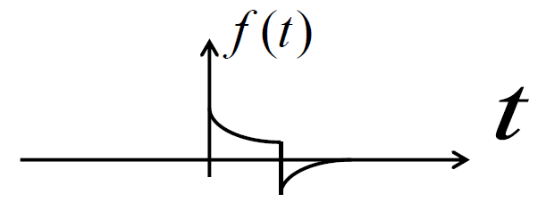
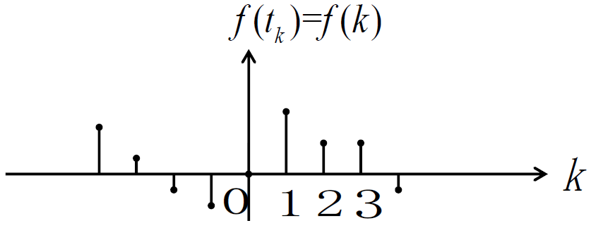
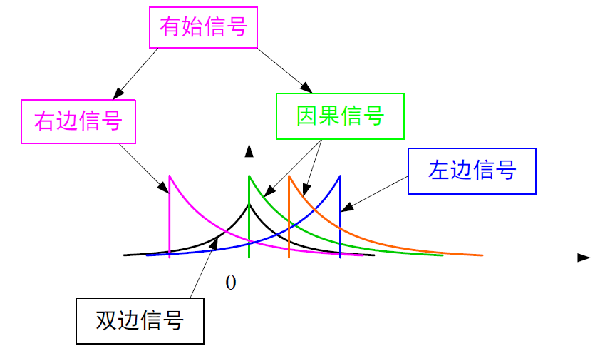
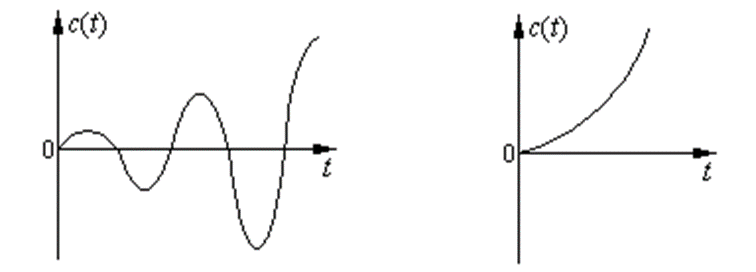
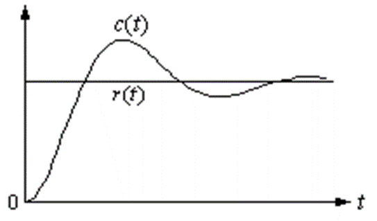
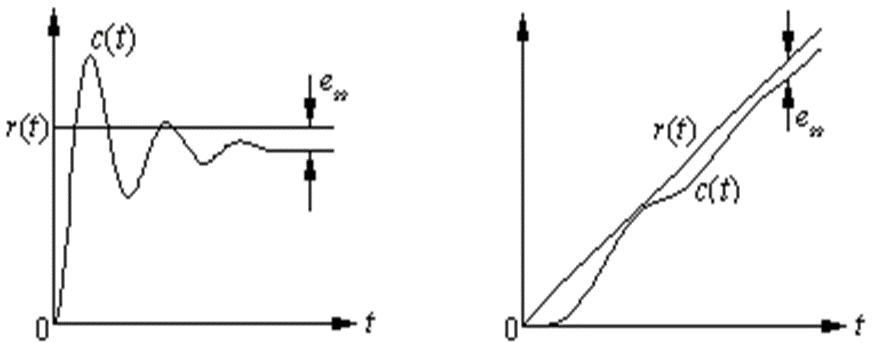

笔者在本学期选了《信号与系统》和《自动控制原理》两门课，准备以此巩固（因为非常菜，不如说是弥补）自己的数学功底并学习控制算法的基础理论，因此同步记录本系列笔记。本系列博文参考杨学志《通信之道——从微积分到5G》总结，笔者也是初学，如有疏漏敬请指正

> 本部分参考教程
>
> https://www.cnblogs.com/kaleidopink/p/14295479.html
>
> https://zhuanlan.zhihu.com/p/37493919

# 信号与系统与自动控制0【概论】

信号与系统是自动控制原理的数学基础，研究的具体对象是信号，侧重于信号本身的特性，以及怎么处理信号。为了研究连续信号，引入了傅立叶变换、拉普拉斯变换等数学工具；为研究离散信号，采用z变换。其目的是从信源、信道、信宿三个方面去优化、实现目标，比如减小失真、减小信号发射功率、提高信道容量、提高信噪比等。而自动控制原理侧重于系统的特性及控制系统的设计，研究的具体对象是系统的特性，以及怎么设计系统。为研究系统的性质，引入波特图、奈奎斯特图、根轨迹、相平面图等等分析方法，其中也要用到傅立叶变换、拉普拉斯变换、z变换这些数学工具。根本目的是运用这些方法设计控制器，使其满足特定参数要求如相角裕量、幅值裕量、响应速度、稳态误差等。

## 信号和系统的概念

系统没有一个严格的定义，各个学科中都有自己研究、定义的系统。化学中描述系统*为一定范围内或同类的事物按照一定的秩序和内部联系组合而成的整体*。数字信号处理中，系统表示*能加工、变换数字信号的实体*。热力学中描述*系统由大量微观粒子组成，并与其周围环境以任意方式相互作用着的宏观客体*。这里给出钱学森先生的定义：*系统是由相互作用相互依赖的若干组成部分结合而成的，具有特定功能的有机整体，而且这个有机整体又是它从属的更大系统的组成部分*

信号与系统中所研究的系统是抽象的——**只要一个事物有输入，有输出，并且输入输出之间有联系，就可以称为系统**。很多对信号与系统有研究的人都说“*万物都是信号，万事都是系统*”——不同学科研究的东西，从发动机到半导体，从悬挂到天线，都可以抽象成系统。信号与系统就是研究系统输入输出之间变化规律的学科

**系统的输入和输出，如果可以用数来定量描述，就可以称为信号**，这里的输入和输出可以是任何物理量（比如电压电流、压力、温度、位移、速度等），但一定要能用数来表示，并且是要能随时间变化的——从数学角度说，就是一个以时间为自变量的函数`f(t)`，这是为了将系统抽象成数学模型。

换句话说，信号与系统就是在给一个物理过程建数学模型。如果和另一个学科作类比，信号与系统很像数学物理方程。数学物理方程中把一切物理现象都按照方程的固定格式抽象成微分、偏微分、差分方程，建立一套统一的模型去处理，并在此基础上归纳出一套运算方法；信号与系统也是如此，只不过它不死板地根据方程给物理过程分类，处理的对象也是更广阔更实际的事物和现象——最常用的（考试里面能见到的）就是两大类：**电路**、**机械**，将具有特殊功能设备的输入量和输出量抽象成信号，把这个设备自身抽象成系统，为这些东西建立一套统一的模型，并借助数学工具进行定量的运算

说完了信号与系统，我们再来看标题的另一部分——自动控制

开头提过，信号与系统是自动控制原理的数学基础，**在信号与系统、信息论的理论基础上完成对系统的分析与控制，这便是自动控制原理了**。信号与系统有一点“工科中的理科”的意味，而自动控制原理则是纯粹的工科。自动控制原理是自动控制技术的基础理论，**自动控制是指在脱离人的直接干预下，利用外加的设备或装置，使机器、设备或生产过程中的某个工作状态或参数按照预定的规律执行**。即利用控制器，操作被控对象中的某个被控量趋于给定量的过程。

> 我们往往要对某个事物进行管理、控制，这个事物可以是电路中的电流、电压，或是一个机械阀门的开关，甚至是一个国家的粮食供应，这个需求引发了19世纪控制论的出现，但最早的*控制论*是非常理想化的，企图以一个统一的模型来实现对万事万物的控制，而没有考虑实际情况——社会科学和自然科学不能一概而论。随着早期控制论的失败，控制理论逐渐分成社会科学和自然科学两支思想，其中一支演变成了前苏联的市场经济控制论（代表就是著名的OGAS计划），并被现代宏观经济学所吸收；另一支则在20世纪基础物理和电路理论发展的基础上演变成了20世纪40年代的*经典工程控制论*（代表作《控制论》，由维纳发表在1948年）或者说**经典控制理论**。20世纪60年代后，随着宇航技术发展，经典的控制论演变成为**现代控制理论**。20世纪80年代以来，由于大规模集成电路、航空航天机械制造、精密仪器产业的发展，现代工程控制论进一步发展，衍生出自动控制原理、数字信号处理等基础学科，并在21世纪的移动通信大发展背景下催生了3G、4G、5G通信，目前的**智能控制理论**仍在发展过程中。

前面我们从抽象地描述了信号、系统的定义，而这里我们暂且将视角限制在电路（或者说信息技术）领域，给信号和系统一套相对精准的定义。我们把用约定方式组成的符号统称为**消息**（Message），消息有让人们的知识状态发生变化的能力，这凭借的是消息中有意义的内容，也就是**信息**（Information）。而**信号**是信息的一种物理体现，它一般是随时间或位置变化的物理量，这个物理量通过以约定方式发生变化来传达信息。

> 电路中，我们*约定*使用5V电压来表示数字“1”的信息，用0V电压表示数字“0”的信息，我们让它以1Hz的频率发生*变化*，并每1s*采集*一次导线上的电压，比如我们采集4次得到“5V-5V-0V-5V”，于是我们就可以知道，导线另一端的器件向我们发送了“1101”的信息。

**系统**的基本作用是对输入信号进行传输和处理，将其转换为所需要的输出信号——这是信号与系统中对系统的基础定义，它隐含了一个条件：我们事先已经了解了系统的作用，要去探究它作用的规律。而自动控制原理中，我们要更好地设计并利用系统，这就引入了自动控制中至关重要的概念：**闭环控制**。这里我们先不探讨具体知识点，接着往下说。

系统往往可以用一个黑箱表示，我们可以尝试打开这个箱子解析内部结构，从而得到系统如何处理输入信号得到输出信号，这被称为**演绎法**；也可以不去管这个黑箱，直接给他输入各种确定值的信号，测量它的输出，从而得到系统如何根据输入信号得到输出信号，这被称为**归纳法**

特别地，在使用归纳法时，我们使用**e(t)**来表示输入信号，称为**激励**（Excite）；使用**r(t)**表示输出信号，称为**响应**（response），用T/F来表示系统，也就是激励与响应之间的关系
$$
r(t)=T[e(t)]
$$

一般来说，信号与系统中，我们对于系统的细节是不明晰的，但能够直接获取到信号特征，因此常常使用*归纳法*反推系统特征；而自动控制原理中需要构建一套符合需求的系统，因此可以使用*演绎法*来明确系统从输入到输出的每一步

我们通常可以使用如下三步来完成系统的归纳法分析：

* **建立系统的数学模型**，把系统的工作状态表达成数学形式
* **求解系统方程**
* 对所求得的数学结果进行物理解释，**赋予物理意义**

> 下面和之后章节的内容中，默认探讨信号、系统性质的部分使用信号与系统的定义，探讨系统功能、系统分析方法、自动控制的部分使用自动控制原理的定义，必要时会加以注释

### 信号的分类

首先来探讨信号。信号可以表示一个时间的函数，在信号分析中信号和函数二词是通用的，于是我们就能把信号进行数学抽象。

根据函数的形式，我们可以将信号分为

* **确定信号**：一个确定的时间函数，给定一时间值，一定有一个确定函数值与之对应，即`y=f(t)`
* **随机信号**：不是一个确定的时间函数。当给定某一时间值时，其函数值并不确定，而只知道此信号取某一数值的概率，即`P=f(t)`

**确定信号不含有信息，随机信号含有信息**，可见随机信号很有用（我们在通信原理中要研究随机信号），但它非常复杂，要涉及概率论的大量原理，因此我们要先研究确定信号

确定信号又可以分为

* **周期信号**：依一定时间间隔周而复始且无始无终的信号
* **非周期信号**：在时间上不具备周而复始特性的信号

周期信号有周期性：
$$
f(t)=f(t+nT),n=\cdots,-1,0,1,\cdots
$$
上述关系的最小T（或整数N）称为信号的**周期**

周期信号的周期性为我们分析信号带来了方便：分析一系列信号的过程被简化成分析一个周期信号的过程，我们后面很多推导都建立在周期信号的基础上。而为了让非周期信号也能适用于周期信号的结论，我们可以认为**非周期信号的周期趋近于无穷**

> **实际中不存在无始无终的理想周期信号，只要在相当长的时间内符合周期变化规律，就认为是周期信号**

于是我们把研究范围又缩小到了周期信号，周期信号也可以继续细分：

* **简谐周期信号**：只含有一个频率分量的周期信号
* **非简谐周期信号**：含有多个频率分量的周期信号

这里的分类方法基于**傅里叶变换**，后面还会有它的重要理论推导，这里就不再赘述。

> 不认识傅里叶变换的去看一下高数和复变函数

这就从*数学概念*上把信号分类完毕喽，下面再根据信号的*实际形态*来分类：

* **连续时间信号**：在某一时间间隔内，对于一切时间值，除若干不连续点外，函数都能给出确定的函数值。它的时间变量是连续的
* **离散时间信号**：只在某些不连续的规定瞬时给出函数值，其它时间没有定义的信号。它的时间变量是离散的

直观来看，下面这样的就是连续时间信号

下面这样的是离散时间信号

没错，分别对应着研究连续函数的微积分和研究离散函数的离散数学，我们在分析这两种信号时要分别用到二者提供的“API”

我们还能够根据信号的起始时间来划分：

* **因果信号**：又称为**有始信号**。$t<0$或$t_k<0$时，函数值为0的信号。也就是说该信号从0开始有效（或者说出现）。如果$t_k<0$即$t<t_0,t_0<0$时函数值为0，这样的因果信号被称为**右边信号**。右边信号相当于一般的因果信号向左平移一段距离$t_0$
* **左边信号**：在$t<k$时（左边），函数值不为0；在$t\ge k$时，函数值为0的信号
* **双边信号**：在$t=0$两侧，函数值均不为0的信号

这里引出因果信号，实际上是为后面的*因果系统*作铺垫

因果信号带来了“顺序”，也就是信号总是从0时刻或者能够变换成从0时刻发生。我们很难想象现实生活中有这样的信号：从宇宙大爆炸之前就一直在发生，而到现在的某个时间突然没了。或许这样的比喻有点突兀，但这就说明了因果信号名称中“因果”的关键性——*有原因且能引起某些结果的信号*

最后，我们能从能量上划分信号：

* 能量有限信号：简称**能量信号**。能量有限，平均功率为0的信号
* 功率有限信号：简称**功率信号**。能量无限，平均功率有限的信号

我们用下面的公式衡量**电信号的能量**：信号在**全部时间**内消耗于1欧姆电阻上的总能量
$$
E=\int^{+\infin}_{-\infin} \abs{f(t)}^2 dt
$$

> 其他信号的能量也可以用类似的方式推导出来

用下面的公式衡量**电信号的功率**：信号在**单位时间**内消耗于1欧姆电阻上的总能量
$$
P=\overline{f(t)^2}=\lim_{T \rightarrow \infin} \frac{1}{2T} \int^{+T}_{-T} \abs{f(t)}^2 dt=\lim_{T \rightarrow \infin} \frac{1}{T} \int^{\frac{T}{2}}_{-\frac{T}{2}} \abs{f(t)}^2 dt
$$
对于离散信号，只需要把积分改成求和
$$
E=\sum^{\infin}_{k=-\infin} \abs{f(t)}^2,P=\lim_{N \rightarrow \infin} \frac{1}{2N+1} \sum^{N}_{k=-N} \abs{f(t)}^2
$$
于是能够得到能量信号的判别式
$$
P=\lim_{T \rightarrow \infin} \frac{1}{2T} \int^{+T}_{-T} \abs{f(t)}^2 dt=\lim_{T \rightarrow \infin} \frac{1}{T} \int^{\frac{T}{2}}_{-\frac{T}{2}} \abs{f(t)}^2 dt=0
$$
功率信号判别式
$$
E=\int^{+\infin}_{-\infin} \abs{f(t)}^2 dt = \infin
$$
能量信号和功率信号在后面对系统响应的分析中会发挥作用，它们指示了信号的强度，会间接影响系统响应的强度

**一个信号如果是能量信号，则其一定不是功率信号，反之亦然**

### 系统的分类

信号与系统中为方便起见，一般只讨论*电路系统*，而在自动控制原理中所涉及的系统就多种多样了，后面再对自动控制相关理论作阐述，这里先从理论部分介绍系统的分类

> 电路系统指的是处理电信号电路的各种组合

任何系统都满足下面的框图

系统从外界输入**激励信号**（Excitation），输出**响应信号**（Response），这在开头已经提到过。为了表示激励信号与响应信号之间的关系，我们使用右箭头$\rightarrow$，例如框图中的系统可以表示为$e(t)\rightarrow r(t)$

信号与系统研究的系统有四种主要分类：

**线性系统**（Linear System）：同时满足齐次性和叠加性的系统

**非线性系统**（Nonlinear System）：不同时满足齐次性和叠加性的系统

> 这里提到了线性的含义：线性=齐次性+叠加性
>
> 系统的齐次性即系统激励变化倍增，响应倍增同样值
> $$
> 若e(t)\rightarrow r(t),则ke(t)\rightarrow kr(t)
> $$
> 系统的叠加性即同一个系统在两个不同输入叠加的情况下输出的响应也会是两个独立响应的叠加
>
> 若
> $$
> e_1(t)\rightarrow r_1(t),e_2(t)\rightarrow r_2(t)
> $$
> 则有
> $$
> e_1(t)\pm e_2(t)\rightarrow r_1(t)\pm r_2(t)
> $$
> 综合起来可以得到**线性系统的判别条件**
> $$
> 若e_1(t)\rightarrow r_1(t),e_2(t)\rightarrow r_2(t),恒有k_1 e_1(t)\pm k_2 e_2(t)\rightarrow k_1 r_1 (t) \pm k_2 r_2(t),那么该系统是线性系统
> $$
> 非线性系统没有叠加性（但可能有齐次性），并且具有传递性：只要系统中有一个子系统（或者说部件）是非线性的，那么整个系统就是非线性系统

**时变系统**（Time-varying System）：系统参数随时间变化的系统

**时不变系统**（Time-invariant System）：系统参数不随时间变化的系统，又被称为**定常系统**

> 这里的时变系统对应了系统的**时变性**或**时不变性**，**这个性质描述了系统本身是否会随着外加激励变化而变化**，即
> $$
> 若e(t)\rightarrow r(t),恒有e(t-t_0) \rightarrow r(t-t_0),那么系统是时不变系统
> $$

对应前面介绍过的信号分类，还能分出：

**连续时间系统**：激励信号与响应信号都是连续时间信号的系统

**离散时间系统**：激励信号与响应信号都是离散时间信号的系统

**因果系统**：输入输出信号之间满足因果关系的系统

**非因果系统**：输入输出信号之间不满足因果关系的系统

**信号与系统中研究的主要是连续线性非时变系统**，或者说**连续线性时不变系统**（**LTI**，Linear Time Invariant system）。对于LTI系统，我们会使用**线性常系数常微分方程**来描述其数学特征，这样的方程是最具有普遍性、最简单的，因此在描述其他系统时我们也可以借鉴一部分结论

> 线性系统使用线性方程描述，非线性系统需要使用非线性方程描述
>
> 时变系统用变系数方程描述，非时变系统用常系数方程描述
>
> 连续时间系统用微分方程描述，离散时间系统则用差分方程描述
>
> 因果系统难以用数学模型称呼，但理解起来很容易：当且仅当系统有激励时，才会出现响应。即因果系统的响应信号不会出现在输入激励信号以前的时刻，系统的输出仅与当前、过去的输入有关，与将来的输入无关，因果系统是“物理可实现的”

二阶线性常系数微分方程的标准形式如下
$$
\frac{d^2 r(t)}{dt^2}+a_1 \frac{d r(t)}{dt}+a_0 r=b_2 \frac{d^2 e(t)}{dt^2}+b_1 \frac{d e(t)}{dt}+b_0 e(t)
$$
而二阶线性常系数差分方程标准形式如下
$$
u(k+2)+a_1 y(k+1) +a_0 y(k)=b_2 e(k+2)+b_1 e(k+1)+b_0 e(k)
$$
需要指出，综合前面LTI系统的诸多特性，我们可以推导出下列性质，这对我们分析系统很重要

这两个性质分别称为**线性-时不变性**和**微分-积分特性**。描述了LTI系统具有线性和时不变性（这是两个不同的概念），而且不会导致信号提前或延迟，也就是具有**因果性**

> 如果要判断一个系统是否具有线性和时不变性，可以将齐次性、叠加性和时不变性的关系分别代入方程的两边，观察方程是否成立

## 常见的信号与系统实例

我们已经简单介绍过了信号和系统的概念与分类，下面再说明一些常见的信号、系统实例

### 几种典型信号

* 指数信号

    一般的指数信号用指数函数表示

    

    也有单边指数信号，作为指数信号的因果信号特例

    

* 正弦信号

    函数形式表现为正弦函数（或平移过的正弦函数）

    

    正弦信号是周期信号，存在$T=\frac{1}{f}=\frac{2\pi}{\omega}$

    而工程中经常遇到的是单边衰减正弦信号

    

    这也是正弦信号的因果信号特例之一

* 复指数信号

    以复指数函数描述的信号，也具有周期性

    

    因为其与三角函数的对应关系（复变函数里面讲过，后面也会提及），三角函数常用下面的公式表述
    $$
    f(t)=Ae^{-jn\omega t}
    $$

    > 注意：工程中（复变函数论中）常常使用`j`来代替`i`表示虚数

    其周期性表现为函数可以傅里叶变换成三角函数形式，如下所示
    $$
    Ke^{(\sigma +j\omega) t}=Ke^{\sigma t}e^{j\omega t}=Ke^{\sigma t}(cos\omega t + jsin\omega t)=Ke^{\sigma t}cos\omega t + jKe^{\sigma t}sin\omega t
    $$
    它无法在实数域内描述，只能在复平面上描述

* 抽样信号

    这是一个经常在工程中使用的信号，这里仅提一下

    它具有$t=\pm \pi,\pm 2\pi,\cdots$时，函数值为0的特征

    

    也可以表示为
    $$
    sinc(t)=\frac{sin\pi t}{\pi t}=Sa(\pi t)
    $$
    有特性
    $$
    \int_0^\infin Sa(t)dt = \frac{\pi}{2},\int_{-\infin}^{+\infin} Sa(t)dt = \pi
    $$
    

### RCL无源网络

基于KVL、KCL、欧姆定律（拓扑约束和元件约束）来构成电路各个元件上的电压和电流的关系。我们要研究的信号往往是某个元件的电学量

下面几个公式是最常用的

* 电阻
    $$
    u_R(t)=Ri_R(t)
    $$

    $$
    i_R(t)=\frac{u_R(t)}{R}
    $$

* 电容
    $$
    u_C(t)=\frac{1}{C}\int_{-\infin}^t i_C(\tau)d\tau
    $$

    $$
    i_C(t)=C\frac{du_C(t)}{dt}
    $$

* 电感
    $$
    u_L(t)=L\frac{di_L(t)}{dt}
    $$

    $$
    i_L(t)=\frac{1}{L}\int_{-\infin}^t u_L(\tau)d\tau
    $$

此外还经常使用节点电压法或回路电流法来获得系统中各关键量之间的对应关系

### 放大器有源网络

基于虚短、虚断

### 力学机械

力学机械系统基于牛顿定律，主要解析方法是列出牛顿第二定律方程后化简中间变量
$$
F(t)=ma(t)
$$
其中
$$
a(t)=\frac{dv}{dt}=\frac{d^2x}{dt^2}
$$
有时候我们还会遇到带阻尼（弹簧）的力学机械系统，这时候就需要胡克定律
$$
F(x)=Kx
$$
或者阻尼定义式
$$
f(t)=B\frac{dx(t)}{dt}
$$

### 热现象

凡是能将热量从一种物质传递到另一种物质的系统，称为热力系统，一般基于泊松方程推导热力系统和热现象相关的数学描述

$$
\nabla^2 \phi = f
$$
也就是
$$
\frac{\partial \phi ^2 }{\partial x^2}+\frac{\partial \phi^2 }{\partial y^2}+\frac{\partial \phi^2 }{\partial z^2}=f(x,y,z)
$$
当且仅当f(x,y,z)=0时，泊松方程退化为拉普拉斯方程，表示无热源情况下热力系统的演化
$$
\nabla^2 \phi = 0
$$

## 自动控制原理

这一节主要结合信号与系统中的系统理论讲述自动控制的基本概念。我们讨论的系统既包括机械系统也包括电控系统，但总的来说往往包含以下部分

**被控对象：** 它接受控制量并输出被控量

**测量装置：** 它把被控对象的被控量检测出来

**比较装置：** 它把测量信号与给定信号比较，得到偏差 

**计算装置：** 可以进行复杂运算，决定系统性能的好坏 

**放大装置：**  经过计算处理的信号通常是弱信号，不能驱动被控制对象，由它进行放大

**执行装置：**  它推动被控对象的被控量发生变化

自动控制系统与一般的系统有很大区别，但也遵循一般系统的规律，因此**可以用信号与系统的结论分析自动控制系统**。

自动控制系统应该具有三种基本功能：

* **测量**
* **比较和分析**
* **执行**

参与控制的信号应该分别来自三条输入：

* **给定量**
* **干扰**
* **被控量**

### 自动控制系统的分类与特点

自动控制系统也是系统，自然能够用之前所说的分类方法进行描述。而对于实际使用，控制系统一般分成两大类：**开环控制系统**和**闭环控制系统**。开环控制系统是指一个输出只受系统输入控制的没有反馈回路的控制系统；闭环控制系统指把控制系统输出量的一部分或全部通过一定方法和装置反送回系统的输入端，然后将反馈信息与原输入信息进行比较，再将比较的结果施加于系统进行控制，避免系统偏离预定目标的控制系统。

下面图片是一个典型的**开环控制系统**：特点是*控制装置与被控对象之间只有顺向作用而没有反向联系，系统的输出量不会对系统的控制作用产生影响*

一些工厂的自动化流水线就采用这样的控制，其优势是比较简单，需要控制的只是被控对象的某个或某些被控量，需要测量的也仅仅是给定值；但是整个系统的抗干扰能力差，不能用于精密的工作中

下面的图片是一个典型的**闭环控制系统**：*无论什么原因使被控量偏离期望值而出现偏差时，必定会产生一个相应的控制作用去降低或消除这个偏差*

可见二者之间的区别就在于是否将被控量通过测量回路引回输入端——是否存在**反馈**

开环控制系统还可以细分成**按给定值操作**和**按干扰补偿**两种自动控制方法，前面图片中的是按给定值操作的开环控制系统，下图展示了按干扰补偿的开环控制系统

它具有相对简单的结构，因为没有预先输入的给定值，因此常常用于“维稳”——恒定速度、恒定角度等等需要保持同一状态不变的情况中常用这种方式。还有一个显而易见的问题：只能对可测干扰加以补偿——这个干扰必须能够捕捉，如果存在不可测的微小扰动就很难应对了

同样，闭环控制也有两种细分：**按偏差调节**的闭环控制系统和**复合控制系统**

之前已经说过按偏差调节的闭环控制系统。它能够很好的修正干扰带来的偏差，并且因为引入了被控量，还能够有效避免不可测干扰的影响；但是引入反馈带来结构复杂的问题，同时如果反馈设计不合理，控制系统可能出现*振荡*，导致系统无法正常工作

下图是符合控制系统的结构图

相比按偏差调节的闭环控制系统，它又加入了对干扰的测量，这样能够解决干扰修正滞后的问题，精度提高；不过复杂度和成本又提升了一截

对于自动控制系统，还可以按照变量的数目进行分类

* **单变量系统**：不包含扰动输入的话只有一个输入和一个输出的系统，即单输入-单输出的系统
* **多变量系统**：具有多个输入和多个输出变量的多输入-多输出系统，单变量系统可以视为多变量系统的特例

### 控制系统的性能要求

1. **稳定性**

    当系统受到干扰后，系统的输出$r(t)$可能出现*增幅振荡*或*单调增长*现象，这种现象称为**不稳定现象**，出现不稳定现象的系统称为**不稳定系统**

    **系统稳定是系统工作的基本条件**。自动控制系统绝对不能是不稳定系统。下面两个图片描述了不稳定系统可能的输出信号，其最大特点就是*不收敛*

    

    > *关于为什么会出现这样的图像*
    >
    > 由于一般的控制系统都含有一个或多个储能元件或者惯性元件，这类元件的能量不可能发生突变。因此从被控量偏离期望值再到控制量做出反应，需要一定的延缓时间，这个过程称为**过渡过程**。当控制量已经回到期望值而使偏差为零时，执行机构本应立刻停止，但由于过渡过程的存在，使得控制量反向变化，如此反复进行，导致被控量在期望值附近来回摆动，整个过程呈现振荡形式。如果这个振荡是逐渐减弱的，即控制量最终会回到期望值，我们称这个系统是稳定的；如果振荡逐渐增强，我们称这个系统是不稳定的。

2. **动态性能指标**

    当系统输入信号$e(t)$为*阶跃函数*时，其输出信号$r(t)$称为阶跃响应。阶跃响应的具体内容会在下一章说明，这里只要理解成一个*t>0时值为1，t<0时值为0*的输入信号即可

    动态性能指标就是描述**在控制系统稳定的前提下阶跃响应的快慢**。我们总是希望**响应越快越好**、**超调量越小**越好。

    

    > 前面提到，虽然稳定系统最终会回到稳定状态，但是这个回到稳定状态的快慢对于一些系统来说是非常关键的。一般从控制开始，到系统的输出量在期望值的一定误差范围内来回摆动的时间，我们称为**调节时间**。这个时间一般可以用来反映系统调节的快慢。而在调节过程中，一般振荡都会有个最大振幅，最大振幅一般也对于一些系统来说也非常重要，我们用来这个最大振幅与期望值的差与期望值的比值来反映系统的这个性质，称为**超调量**。

3. 稳态误差

    系统的期望输出与实际输出之差称为**误差**。误差的稳态分量称为**稳态误差**，表示到达平衡状态时的系统精度。我们希望系统的稳态误差越小越好，这样系统在完成调节后的实际输出能够更接近期望输出

    

    稳态误差也和输入信号类型有关，因此在计算稳态误差前一定要明确系统的输入信号是什么形式
    
    > 稳定系统最终会趋于稳定，但这是在期望值的允许误差范围内——即使在很大的时间尺度上，最终输出量也难以与期望值完全一致。我们将无穷的时间尺度下，最终输出量与期望值之差称为**稳态误差**，**稳态误差为无穷大的系统一定是不稳定系统**。

## 常见的控制系统实例

下面分别给出两个闭环控制系统的实例

### 位置随动系统

### 温度控制系统

