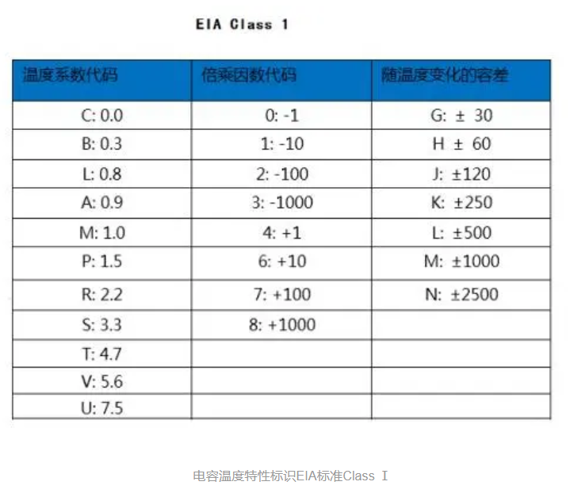
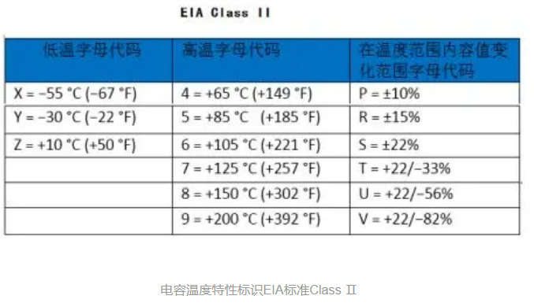
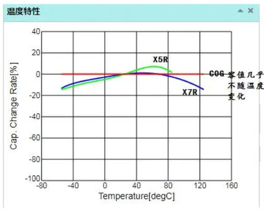
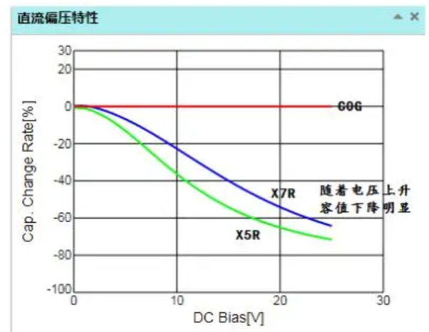

# 嵌入式可靠性基础6【国家标准】

达到国家标准是嵌入式可靠性设计的最基本要求，国标限制了某一类产品的最低安全规格，如果产品无法达到要求，很有可能造成严重后果，轻则产品无法出售或被退回，重则可能危害用户安全

为了满足国家标准，工程师应当了解自己产品所处领域的国标条例，并从中总结与自己工作有关的部分，从而让设计满足标准的要求

对于消费电子产品，最常用到的国标就是《**GB8898-音频、视频及类似电子设备安全要求**》和《**GB4943信息技术设备的安全**》。这两个国标手册可以在eetop上下载到

本章主要在整体层面上说明安规的重要性，同时介绍一些安规相关的知识

## 器件基础知识拾遗

在开始前，先来复习一下一些基础器件和可靠性有关的规格知识

### 电阻

电阻失效一般是由于物理失效或热失效，物理失效即电阻受到内外力断裂，热失效就是电阻通过电流引起发热超过自身散热能力导致烧毁。先来看贴片电阻的尺寸

如上图所示，我们一般使用英制尺寸来指明电阻物理大小

贴片电阻、电容、电感的尺寸大都是统一的，可能有些贴片电容、电感具有自己的特殊封装（比如排电容、穿心电感）。以0805封装为例，08代表`0.08 inch`，05代表`0.05 inch`，根据`1 inch = 25.4mm`，可以发现0.08封装器件尺寸`2mm x 1.25mm`，也就是对应公制尺寸2012。一般来说贴片器件都要制造成扁长方体，因此高度应当小于1.25mm。0603、0402等器件也都按此规则确定尺寸

电阻的尺寸和规格不仅仅决定了其能够承受的最大电流，也影响到其能耐受的电压。如果耐压过低，采用薄膜工艺制造的电阻很有可能发生击穿现象；对于电容、电感来说其外形尺寸还会影响特征频率，在高频电路中尤为明显。

> 说句题外话，制造中常用的mil单位正好是inch的千分之一，即`1 mil = 0.001 inch`

### MLCC的规格

电容的分类暂且略过，这里主要提一下片式多层陶瓷电容器MLCC的规格

参照国际电工技术委员会（IEC）和美国电子工业联合会（EIA）标准，根据MLCC容值随温度变化的规律，对陶瓷MLCC电容分为两个类别：I类和II类，I类使用顺电陶瓷制成，II类由强介铁电陶瓷作基材。I类MLCC使用的EIA规格查找表如下所示

I类MLCC在电子产品上不太常用，不过其中C0G、U2J两个指标电容也可以在产品上看见。

> 根据上表，容值随温度变化大小为：温度系数代码 x 倍乘因数代码 ± 随温度变化容差，单位是ppm/K
>
> 因此C0G的含义就是0±30ppm/K，U2J表示容值随温度变化为-750±120ppm/K

II类MLCC规范就比较常见了，查找表如下

、

工业中常用的X5R电容就表示工作温度在-55~+85℃，整个温度范围内容值变化为±15%

由于I类MLCC使用的介质材料介电常数比较低，导致它们的容值普遍低于II类MLCC，这也就是为什么工业上I类MLCC不太常见的原因了。

> 同样容值的I类和II类MLCC，II类MLCC可以做得更小，符合当前电子产品微型化趋势

不过在一些需要高可靠性的场合下，我们能看到对C0G电容的要求

如上图，I类MLCC容值几乎不随温度产生变化，因此适用于高温/低温场景下高精密设备

X5R、X7R电容在外加直流电压时，随着外电压增大，材料介电常数会变小，导致电容值变小，而I类电容不会出现这样的情况，如下图

同样，C0G在交流电压下不会产生很严重的容值偏移

> 对于高电容（hi-cap）器件，即C值以uF为单位的MLCC，其直流偏置效应也是需要考虑的重要因素。
>
> 直流偏置是基于施加的直流电压而导致电容降低的效应。在额定电压下，电容有可能下降到标称值的20%左右。使用I型MLCC有助于避免直流偏置效应，但这会带来产品成本的提高

I型MLCC还在ESR、Q值、发热量上具有明显优势，因此在高可靠性领域I型是比II型更具优势的

### MLCC的老化现象

MLCC还存在**老化现象**。老化现象会导致MLCC的容值随着时间的推移而损失，在每个对数尺度差距下的损失大约在1%到6%之间，MLCC的容值越高且内层越薄，MLCC就越容易老化

> 很多用了许多年的服务器，电路已经出现了MLCC的严重老化，这时候MLCC的指标只能满足最低运行要求，可能无法满足整个系统启动时的高负荷，因此这样的服务器一旦关机就有可能再也重启不了

特别地，MLCC器件的老化是可逆转的，只需要进行适当加热（放置在+150°C温度下1小时，然后静置24小时），即可焕发新生

### 为什么高压情况下不使用MLCC

我们经常看到在服务器电源上会使用到巨大的电解电容，这时候自然而然有一个想法：如果换成高压MLCC堆叠是不是可以把高功率电源的尺寸降到最低？

理论上是可行的，MLCC在性能上要远远优于电解电容，而随着现在制造工艺的提升，高压大容量MLCC也成为可能。但有两个致命的问题：成本和可靠性

大容量MLCC往往非常昂贵，对于服务器电源这种非军工非科研用途的设备来说是负担不起的

另外MLCC在长期使用中，会出现老化和容值偏移现象，在外加高压时尤为明显，在长期使用中的稳定性不如电解电容——很多时候电解电容即使漏液也不会出现太大的容值偏移或耐压降低。此外，大型MLCC外壳非常脆，容易随PCB老化出现微小形变甚至断裂，一旦断裂或击穿就会发生短路失效，在大功率环境下极其容易引发明火。

综上所述，在高压高功率环境下往往要避免使用MLCC

### 电感

电感的3个重要参数：温升电流、饱和电流、自谐振频率

寄生电阻是电感在直流下（或谐振时）呈现的阻抗，它与电感封装热阻共同决定了温升电流。**温升电流**用$I_{rms}$表示，即加电流后，电感器件自我温升温度不超过40℃时的电流。如果负载电流超过温升电流，将导致电感迅速升温，若外界散热措施不到位极有可能导致器件烧毁

**饱和电流**是指在外加电流下器件电感值下降到原来的30%的电流，用$I_{sat}$表示。实际电感不可避免地会出现磁损，随着外加电流的增大，磁损也会增大，表现在电路中就是电感下降，本应作为无功功率存在的电流会转换成有功功率使电感升温。如果负载电流超过饱和电流，电感将几乎呈现为阻性，导致阻抗减小、发热剧增，同样可能导致器件烧毁；即使散热措施到位，饱和后的电感也不能够作为正常的器件使用，这时电感被视为*失效*

> 饱和电流的定义与电感工艺和磁芯材料有关。使用无气隙的铁氧体材料制成的电感一般具有较为陡峭的磁滞回线，有些厂家会将其衰减10%时对应的外加电流定为饱和电流；对于硅钢片等磁材料磁芯电感，会适当放宽饱和电流要求。这里的30%是指电路中常见的铁粉磁芯电感

因此，我们在电路设计中应当取饱和电流和温升电流的最小值作为电感工作电流，同时因为电感长期工作在高频电路中，一般**取80%降额**作为能够使用的电感工作电流

**自谐振频率**是指电感感抗达到最大的频率点，用SRF表示。当电流频率低于SRF时，感抗随频率增加而增加；当频率等于SRF时，电感感抗达到最大值；电流频率高于SRF，感抗随频率增大而减小。

不同于电容在低于自谐振频率区间才能正常使用；电感必须工作在自谐振频率附近。如果外加电流频率远低于电感自谐振频率，那么电感将呈现阻性，RMS电流只会导致电感升温；如果频率远高于自谐振频率，电感将呈现容性，

## 电路安规

## 电源安规

电源类产品的国家标准称为电源安全规范，即电源安规。每个国家都有不同的安全标准，比如我国的3C认证，过不了安规检测的产品是不合格的，不允许上市销售

### 爬电距离

安全距离包括**电气间隙**、**爬电距离**和**绝缘穿透距离**

电气间隙是指两相邻导体或一个导体与相邻电机壳表面*沿空气*测量的最短距离；爬电距离指两相邻导体或一个导体与相邻电机壳表面沿*绝缘表面*测量的最短距离；绝缘穿透距离是指设备在正常工作时可能承受的最大电压，超过这个最大电压后，此绝缘体不再绝缘时的厚度。

对工作电压小于交流50V（71V交流峰值）或直流70V时，无厚度要求；加强绝缘厚度最小应为0.4mm

> 爬电是指由于导体周围的绝缘材料被电极化，导致绝缘材料呈现带电的现象，出现爬电时的带电区半径即爬电距离。

一般常用的规范如下

很多具有空间限制的产品中，能够满足电气间隙而不能满足爬电距离，这时候就要考虑在PCB上**开槽**——在两个器件之间最近的地方设计槽孔，相当于将爬电距离拉大

