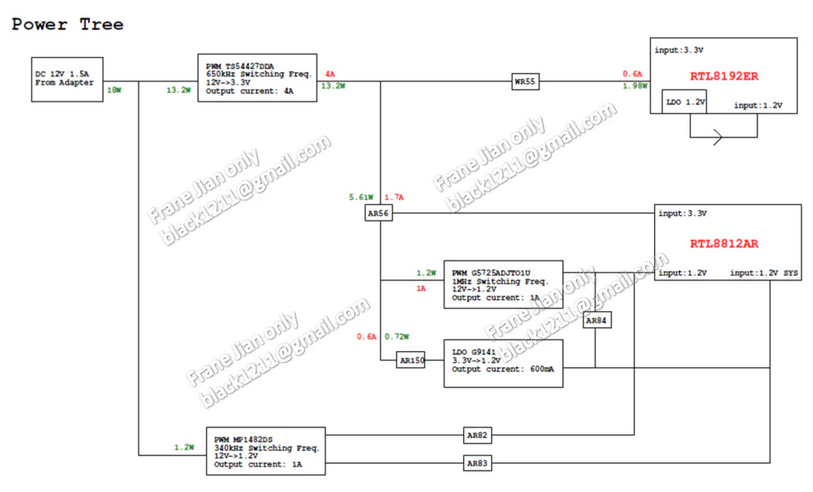

# 电源完整性分析笔记1【概论】

**电源完整性**（Power Integrity，**PI**）指电源波形的质量，研究的是**电源分配网络**（Power Distribution Network，**PDN**）或者说功率分配网络，并从系统供电网络综合考虑，消除或者减弱噪声对电源的影响。

电源完整性的设计目标是把电源噪声控制在一个很小的容差范围内，实时响应负载对电流的快速变化，从而为芯片提供干净稳定的电压，并为其他信号提供低阻抗的回流路径。

> 良好的PDN设计能够使硬件系统运行地更稳定，从而保障嵌入式系统可靠性。

传统上说，电源的产生与转化（比如LDO、DC-DC等拓扑电源电路）中源端部分（称为源端**电压稳压模块**Voltage Regulator Module，**VRM**）是电源工程师来确定的，电源工程师在设计过程中会进行相关的电源可靠性设计与测试，比如耐压余量，耐电流余量，保护设计（过压、过温、过流等）；但随着电路越来越集成化、高速化，电源功率提供端和消费端之间的回路和拓扑也越来越容易受到外界噪声干扰，进而影响高频芯片的工作，同样各种芯片自身会产生噪声反馈回源端，于是*更关注电源路径及终端*的电源完整性分析开始出现。

**PI分析将PDN作为分析目标**：从VRM经过电源路径（多层板的同平面走线或经过过孔转换的多平面走线）到达终端，最终流向使用芯片或经过线缆到使用设备的过程。PI是与SI有交集的相似领域，二者都使用高频信号理论，但电源路径与信号路径是有区别的：PDN中一个电源路径可以在一个节点分成多个路径或转换成多个电源，终端挂载多个元器件，可以理解为一对多；而信号路径只能一对一

PI分析的优化目标是让PDN受到合适的管控，保证各个终端和干路的返回电流不相互重叠、不发生地弹，即尽量避免**同步开关噪声**（Simultaneous Switch Noise，**SSN**）。

> 同步开关噪声是大量的芯片同步切换时产生的瞬态电流在电源或地平面上产生的大量噪声现象
>
> SSN对PI产生的影响主要表现为地反弹/电源反弹（Ground Bounce/Power Bounce）现象（地弹现象）

## 电源完整性面对的挑战

随着芯片片上门电路数量增加、翻转速率增高，电源完整性的设计面临着非常大的挑战。主要表现在下面两方面：

1. 芯片功耗不断增大，导致**电源电流不断提升**：大型的CPU/GPU、FPGA、AI芯片的内核电压，最大电流甚至超过100A，大电流如果出现较大纹波将导致产生极大的电磁干扰，影响周围芯片乃至片外环境
2. 芯片工艺提升，导致**电源电压不断降低**：内核电源的电压从广泛使用的1.2V降低到1.0V、0.9V、0.8V甚至更低的0.75V，IO传输电压也在向高频差分低压转变，芯片能够接受的电源抖动越来越小

作为嵌入式系统中最复杂的互连结构，PDN包含从VRM到众多负载的互联网络及其上的所有有源无源器件，使得PI设计不再是单纯的芯片供电问题，而是影响系统性能和可靠性的重要因素

PI设计需要满足三个基本指标：

* 为芯片提供稳定的供电：芯片能够接受的电源纹波是有限的，必须控制在一个很小的容差范围内
* 为信号提供低阻抗、低噪声的参考回路：一些高速接口必须进行SI-PI联合仿真才能保障可靠性
* 面向EMC的PDN设计：电源噪声是重要的EMI辐射源，设计不好会产生EMI问题

## 终端电源分类

嵌入式系统的终端芯片主要使用到两类电源：**IO电源**（IO电压）和**Core电源**（核心电压）。IO电源为芯片间的接口信号传输提供功率，而Core电源为芯片内部处理器的运行提供功率

对于IO电路，其驱动器和接收器分别在两个芯片上，信号通过PCB走线进行连接，此时PCB板上的**IO电源不仅为驱动电路和接收电路供电，而且还会作为驱动器和接收器之间信号传输的返回路径**。由于驱动和接收位于不同的芯片上，封装电感的存在会让PDN的返回作用更加明显

内核电路位于同一个芯片内部。由于尺寸很小，寄生参数也都很小（尤其是作为高频信号返回路径的寄生电感参数）。PCB上的Core电源供电的作用主要就是为内核电路系统提供稳定的供电，即使作为信号的返回路径，由于尺寸太小也几乎没有体现传输线效应，对内核电路的数据传输不会产生太大影响。然而处理器的内核一般工作频率都会远高于外部IO，并且信号通路被“藏”到密闭的硅片上，这就导致Core电源问题往往会影响处理器指令的执行，导致电源**异常难以定位**；另外片上往往使用**低压大电流**，需要PDN的阻抗尽可能低，并尽可能抑制电源噪声；最后，主控处理器的功耗会受到软件算法、IO交互等多方面影响，Core电源的电流具有很大的**不确定性**

### PDN对信号传输的影响

不管是Core电源还是IO电源，一般都会用到CMOS或MOS推挽拓扑作为前级驱动或后级接收电路。VDD和GND作为电源地平面连接了驱动器和接收器的电源供给，G极连接点称为输入节点（IN），D极连接点称为输出节点（OUT），二者通过片上导线或板级互联（可统称为**传输线**）连接。驱动器输出高电平时，驱动器上管导通，电源平面通过驱动器上管和传输线对接收器的栅电容进行充电；驱动器输出低电平时，驱动器下管导通，接收器的栅电容通过传输线和驱动器下管向地平面进行放电。信号的传输过程和PDN系统密切相关——**信号传输过程就是不停从电源平面获得电荷并向地平面释放电荷的过程**。在这个过程中，**无论是拉电流还是推电流都会反过来在电源地平面（即PDN上）产生电压波动，同时PDN的电压波动也会影响信号的传输过程**

随着高速数字系统中信号速率的提高，PDN上的电源噪声会更容易通过供电电压的波动在晶体管输出信号时产生噪声、也会通过信号线和PDN之间的耦合直接作用到信号线上；高速信号翻转产生的噪声（SSN，会在后面介绍）通过PDN耦合到其它敏感电路引起抖动和噪声容限减小

### 同步开关噪声

VRM需要通过PDN网络和用电IC连接，从而提供Core电源。而PDN通常会有不同程度的寄生特性（PI分析中主要关心影响电流的寄生电阻和影响噪声的寄生电感），使得PDN电流在IC的VDD和GND端会表现出DC压降和AC时变电压波动（纹波）问题。这对芯片中的晶体管电路的正常工作都是有害的——供电电压过高可能导致晶体管的损坏，而供电电压降低又会使芯片的工作频率降低、性能下降，我们可以得到下列关键问题：

- IC供电端之间电压的降低将减慢或阻止晶体管切换状态，使芯片工作频率降低
- IC供电端之间电压的升高可能导致芯片内部电路损坏，引发可靠性问题
- 泄漏到静态晶体管中的电压波动和来自临近信号线的串扰可能使传输路径远端的静态晶体管电路产生错误的开关切换
- 多个晶体管同时开关时会导致芯片瞬间用电量增大会产生**同步开关噪声SSN**，导致驱动器输出波形退化，令信号时序裕量减小，对于时钟信号还可能导致信号边沿不单调引起时序容限错误

前两个问题可以归结为**直流问题：终端设备需要稳定的电压输出**

PDN中存在串联电阻，一旦DC电压产生就会出现压降，我们通常称为**IR压降**（IR Drop）。当电流发生波动时，压降也会随之波动，从而影响终端设备的识别
$$
V_{IR}=I\times R
$$
IR压降总与传输线的电阻和负载电流有关

后两个问题我们将其称为**交流问题：PDN中的交流分量会导致噪声影响信号通路**

当交流电流通过电源路径时，PDN上也将产生电压降，与IR压降不同，这个压降会随着频率发生变化。电源路径的不同、终端IC的工作频率不同，造成的压降变化是不同的，这就导致输出稳定电压到终端的难度很大，我们所要做的只能是保证电压的变化在一定的范围之内，即**噪声容差**
$$
V_{F}(f)=I(f)\times Z(f)
$$
PDN上的阻抗会受到频率的影响，芯片消耗的电流也会受到频率影响，进而导致交流压降是频率的函数

针对噪声容差可以获得下面的变形式：
$$
Z_{PDN}(f)<\frac{V_{ripple}(f)}{I(f)}=Z_{target}(f)
$$
即**从终端IC看向PDN的阻抗要小于PDN最大阻抗**（等于芯片电压噪声容差与PDN电流的比值）

SSN主要是伴随着器件的多个IO（CMOS或MOS推挽结构）同时开关而产生的电源和地的噪声。I/O开关速度越快，瞬间电流变化越快，在电流回路上产生的噪声越大。当信号从低电平切换到高电平时，需要从PDN吸收功率，但因为我们的互连设计只能保持在噪声容差之内，PDN阻抗导致电流不能立刻到达芯片引脚。因电源阻抗而产生压降的过程就是电源噪声产生的过程

由SSN导致的压降可以用下式描述
$$
V_{SSN}=N\times L_{loop}\times \frac{di}{dt}
$$
其中N代表同步开关的IO数量，$L_{loop}$代表电流回路寄生电感

> 减小SSN的方法
>
> * **减小信号的电源和地平面的阻抗**：阻抗越小，同样强度噪声对信号造成的干扰越小
> * **减小电源和地的回路电感**：和上面的方法思路类似，更小的电感可以让回路接收到的噪声更小
> * **合理分配芯片的信号、电源和地引脚的数量比值**：在无法控制Core电源SSN的情况下，适当减少芯片数量和连入电路IO数量可以一定程度上减少IO电源SSN，增加电源和地引脚数量可以减小回路分布电感，也能抑制SSN
> * **在芯片电源和接地引脚附近添加合理的去耦电容**：通过去耦电容抑制来自单一芯片的SSN

## 噪声抑制

在较高频率系统中，Core电压需求一般可以通过电源地平面对来满足，需要注意的就只有IR压降；但如果光靠电源地平面对来提供用电芯片的IO电源需求是远远不够的，需要不同频率特性的电容器逐级的传递电流来抑制SSN。

> 上面一节从噪声角度描述了SSN，但是SSN也意味着终端功率负载的高速变化
>
> **抑制SSN和提供IO电源在PDN规划角度是等价的，保持PDN系统的功率充足、传输稳定和提供Core电源也是等价的**

电源-地平面对的寄生电容非常小，其实是能够提供IO翻转所需要的高频电流，但正因为电容量小，能够存储的电荷不足，因此还**需要高频的陶瓷电容为电源地平面对提供电荷**，需要**中频电容为高频电容提供电荷**，**低频的大容量储能电容为中频电容提供电荷**，这样的树状电容结构既是逐级从VRM到终端IC之间的电荷输送又是在进行电源的滤波

如果这一电荷配送网络的设计不妥，就会导致IO翻转所需的电流得不到满足，即*IO电源不完整*，SSN问题随之而来。IO翻转产生的电源噪声泄露到电源参考平面、地参考平面上，同时电源噪声也会反映在相应的IO Buffer/IO CMOS上产生信号完整性问题

> 学过计组中存储层次结构的读者可能会联想到Cache-Memory-Disk这种经典结构就是为了尽可能优化成本、速率、容量之间的不可能三角。从PI角度来说，寄生电容-高频电容-中频电容-低频电容结构是为了缓解高频和大容量之间的矛盾——只不过高频而大容量的电容本身就不存在，电容树结构和存储层次结构之间的本质区别就在于此

### 电源噪声

电源噪声的来源主要有几个方面：

- 供电电源本身的噪声
- 用电芯片IO电路翻转所产生的电源噪声
- 其它信号、大噪声电源的噪声耦合

前两个方面的噪声控制主要是采不同频段的电容进行滤波。实际电容会存在寄生参数，这就导致其有一定的作用频率；电容器和IO电路的距离决定了供给电荷所需的时间，也就是决定了电容器向CMOS传送电荷的频率，而电容本身具有的频率特性要求只在其**自谐振频率附近**才有很低的阻抗，能够起到较好的滤波效果。

结合上面两点，不难理解**越是高频的电容越应该布局在距离IO电路近的位置，很多芯片封装内还会自带IO滤波电容；中频电容可以放置得稍远一些，布局在PCB板上芯片周围的位置；而低频电源的布局位置影响已经不是很大**。这就涉及到PDN的Layout原则，会在后面章节中详细介绍

对于来自于其它信号、电源的噪声耦合，主要通过控制不同电源之间以及电源和信号之间的隔离度来实现

### 返回路径

信号在传输过程中的电流路径不仅和传输信号路径有关——其返回电流是通过电源或者地平面回流到驱动器的，地平面或电源平面上信号返回电流的路径被称为**返回信号路径**，简称**返回路径**

由于PDN的性能关系到信号传输的返回路径，因此PI和Sl是不可分割的。以往在做低速信号分析时往往把SI、PI分开考虑，即把信号路径和返回路径分开考虑。如果能分别把信号路径和PDN的性能设计到最优也能够最大程度的保证系统的性能，但是这样的仿真分析实际上没有考虑到SI和PI之间的相互作用，对一些高速接口进行分析时很可能得到过于乐观的结果而导致系统设计的失败。

在进行高速接口的SI分析时我们始终要保持对信号参考平面以及为该接口供电的PDN系统的警惕，不能简单地假设电源绝对处于稳定状念

## 电源树

电路系统设计过程中，需要前期评估元件所需供电参数，并评估PCB参考平面和供电路径。开发者要预先根据相关规范或标准制定一个**电源树**（Power Tree）

很多嵌入式系统的初始供电电压都比较高，常见的48V、24V、12V等；有时候整个系统会采用市电乃至高压直流、三相电等供电，先经过开关电源处理转变成48V加载到PCBA。我们这里主要讨论48V以下的弱电情形——系统主电源一般噪声比较大，很多时候纹波都在3V~5V，需要经过DC-DC变换器转换为IC器件工作需要的低压电源。一些大电流供电会采用开关电源或隔离电源进行转换，开关电源本身会有自己的开关频率，前级的电源噪声也会影响到开关电源的输出。控制电源芯片的噪声输出需要设计好电源芯片的输入和输出滤波电路以及电源本身的反馈环路，这一情况我们也要在电源树设计中加以考虑，通过层层降压、滤波来将PDN上的噪声降到最低

以一个48V供电的数模混合工控系统为例。48V供电通过一个工业电源接口加到电源板，先通过一个MOS推挽拓扑的开关电源降到12V，可以为电机供电；12V还会通过XT60接口连接到数字/模拟控制板，经过一个DC-DC buck电路降压到5V，用于部分传感器和ADC/DAC/OPAMP供电，5V供电会用一个PMIC或多个LDO转出3.3V、1.8V、1.0V等等分支电压提供给主控芯片。上面这一整套拓扑就是典型的电源树结构，开发者要列出各个分支所需电流的多少，为后面**PDN规划**提供参考标准，同时给出可行的PCB**参考平面参数**。**检查**的时候还要从终端IC向前反推，保证没有遗漏的支路。一款产品经常会有大量不同种电压，每个电压的目标阻抗随着频率是改变的，这个时候还需要**对路径进行频段分类**，将不同目标阻抗的电源路径隔离开以避免干扰

一个示例电源树的设计如下图所示，至少要写清所有子系统/模块/芯片的输入电压及电流，每个升降压节点VRM的参数，从而确认功率消耗（Power Consumption）是否符合需求

> 为了保障硬件可靠性，往往还要计算PDN参数的**裕量**（Margin），常见的裕量为20%~50%
>
> 这可以保证汲端（Sink，吸收功率的终端IC）能得到它所需的功率，同时在瞬间电流抽载（比SSN功率更大的情况）时，可以提供功率变动的裕量，还能尽可能覆盖IR压降产生的损失
>
> 著名的瑞士干酪现象是IR压降导致导电路径负载的一大隐患：参考电源平面被来自BGA封装或是较密集的过孔分割成碎片，不能够提供足够低的阻抗，使得IR压降在某一电源平面突增的现象被称为**瑞士干酪（Swiss Cheese）现象**

### PDN、电源树与Layout

为了确定板级PDN的设计目标阻抗，可以先找出**上限频率**，即找出**PCB的阻抗开始超过目标阻抗时的频率点**。一旦超过上限频率，公式
$$
Z_{PDN}(f)<\frac{V_{ripple}(f)}{I(f)}=Z_{target}(f)
$$
不被满足，就会导致来自VRM的功率不能以PDN电流的形式立刻到达芯片引脚，从而引起PI问题

对于PDN电源路径，我们可以用一个简单的RLC串并联网络来描述。我们知道在低频时，RLC电路的阻抗取决于理想电容，在高频时则取决于理想电感。而理想电阻决定了RLC的最低阻抗，因此我们在分析时将PDN路径阻抗分为电感和电容的两个部分。

**其上限频率即为理想电容或理想电感的固有频率**，在这一频率下，传输线会表现为感性或容性，通过合理规划，可以让系统的噪声被等效电感或等效电容全部滤除
$$
Z=2\pi fL=\frac{1}{2\pi fC}
$$
注意区分截止频率——**截止频率等同于目标阻抗的谐振频率**，一旦发生谐振，PDN路径等效于只存在电阻，电源噪声和SSN将畅通无阻地加在传输线上，这是我们不想看到的
$$
f=\frac{1}{2\pi \sqrt{LC}}
$$

那么如何在PDN设计中考虑到这些参数呢？这就要通过电源树规划、Layout和器件选型了。

### 电感选型与Layout

电感方面考虑**封装引脚、过孔和扩散电感**等共同作用

封装引脚串联在芯片焊盘到电路板焊盘之间，可能有数百个电源-地平面对。根据器件封装IO数量的不同，封装引脚电感是变化的，不过*一般不超过1nH*。

过孔及电源平面、地平面上运送电流过程中的扩散电感共同决定了回路电感，这是路径中最大的不稳定项，往往要通过物理仿真进行设计

过孔与过孔之间、参考平面之间、表层传输线之间也都存在*回路寄生电感*，某些高频情况下也需要加以考虑

> PDN设计中一般不会引入额外的电感，因为感性增大将会使得不同回路之间出现噪声电流传输并导致潜在的过压隐患（电感会对高速变化的电流施加强反向电压），寄生电感就成为了一个“敌人”
>
> 我们要尽可能避免电感耦合导致

### 电容选型与Layout

PDN设计中的电容是抑制电源噪声和SSN的重要环节

电容可以从**摆放位置、电容容值/个数、反谐振**三个方面来考虑

由于存在不同的容值、封装、耦合半径，所以摆放的位置（布局）需要考虑，这涉及到**电容滤波半径**。电容器的相关组合也很关键，在通常的板级应用中，**密集地使用较少个数的不同容值的电容器（而不是使用相同容值的电容器）往往能使阻抗最低**

我们之前提到过电容树状结构可以有效抑制SSN，其实还有一个原因：**反谐振**。电容容值不同，自谐振频率也不同，因此电容之间并联会让其出现一个新的特性：将所有并联电容看成一个大的RLC串联网络，整个网络阻抗的峰值称为**并联谐振峰值**，它发生在**并联谐振频率**（ Parallel Resonant Frequency，**PRF**）处。如果PRF正好位于PDN的上线频率附近，那么对于PDN反而是有害的，这时候如果再添加一个自谐振频率介于它们之间的电容器，就可以把PRF拉低，满足PI需求

> 注意：当采用多个电容并联来满足容值要求时，最好采用同封装和制造工艺的电容进行并联，因为它们的寄生参数是相似的，很难造成不可预测的影响

电容器组合对PDN阻抗曲线的影响，在很大程度上取决于摆放在PCB板上位置（尤其是中高频电容）

在电源树规划中，我们计算的都是产品规格或者设计规范里给出的峰值电流附加一定裕度。实际应用中，满载的情况出现机率很小。所以消费类产品在成本的限制之下，往往会给出不同配置的产品。低配版本会减小MLCC的使用种类和数量——**通过优化PI来降低产品成本也是PI分析的关键之一**

> 片式多层陶瓷电容器（Multi-layer Ceramic Capacitors，MLCC）是最常见的中高频电容工艺，也是PI设计中高频部分最常接触的布局目标
>
> 铝电解电容和钽电容则是最常见的低频电容工艺，PI设计中往往要和它们的滤波半径打交道

## 参考资料

https://blog.csdn.net/qq_29476769/article/details/126417163

https://www.jianshu.com/p/574465623c20
