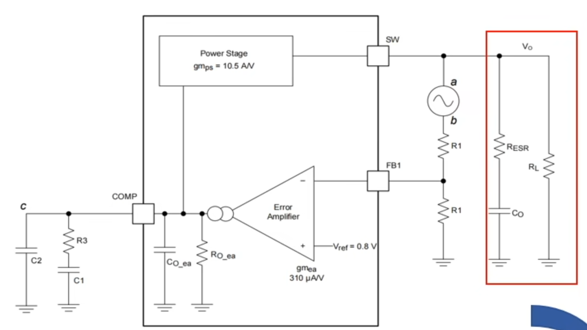

# 电源系统设计3【从自控原理到闭环控制】

前面两部分中，我们已经了解了电源电路的基础，使用到目前为止学到的理论已经能够基本胜任从MCU到单板SoC的电源设计了，但很明显我们对电源本身的控制理论理解还不够深入：一个boost电路是怎么从输出端获得反馈并修改PWM占空比的？一个全桥拓扑中的MOSFET死区时间怎样确定得刚刚好？这就要用到自动控制原理相关的知识了。

在本篇中，不会对自控原理的基础知识过多赘述，如果有需要的读者可以参考笔者的自控原理系列博文。

## 电源稳定性

对大部分电源来说，获得高的电源抑制比PSRR永远是其第一要务：**任何电源的首要目标就是提供一个稳定、准确的输出电压，而不应该受到外部变量的影响**。一个理想的稳定电源模型就是电压跟随器——输出电压总和参考电压保持一致——不过理想的电压跟随器还是需要用到一个稳定的参考电压，并且高精度、高带宽的电压跟随器往往有着非常小的驱动电流，于是工程师退而求其次，选择建立一个**闭环高增益系统**来实现输出电压跟随

这个系统的工作特征大致如下：

1. 采集输出电压反馈
2. 将反馈与参考值进行比较得到误差
3. 整个系统被设置为具有高增益，并且具有尽量小的稳定裕量
4. 误差被系统抑制

这样，我们的电源问题就变成了自动控制问题。

回顾经典闭环系统，我们有闭环等效的开环传递函数
$$
G_{cl}(s)=\frac{G(s)}{1+G(s)H(s)}
$$
其中**G**和**H**分别是系统**前向**通路传递函数和系统**反馈**环节传递函数

对于电源系统，我们需要一个非常大的前向增益G来输出足够的功率，还需要一个增益小于1的分压器充当反馈网络H，注意到H不是接近于0但G往往非常大，于是能够假设$G(s)H(s)\gg 1$，得到电源闭环系统传递函数
$$
G_{ps}=\frac{1}{H(s)}
$$
发现整体传递函数与G无关了！而且甚至和所有影响G的参数（比如输入电压、环境温度等）无关，而是完全由反馈网络的传递函数H(s)决定

> 熟悉自控原理的读者会发现这个假设其实就是深度负反馈条件。**电源系统就利用了深度负反馈来抑制从上级电源传来的噪声干扰**

### 电源稳定性

通过上面的近似，我们成功将复杂的闭环电源系统化简成了对反馈系统传递函数的精心设计。然而要确保整个系统的稳定性仍然是一个挑战。

电源系统的高增益意味着它能够对反馈网络中的任何微小扰动做出响应，扰动会以系统带宽的速度在闭环中传播，扰动幅度还随着每个周期迅速增加或衰减，不过由于之前的闭环假设，我们只需要关心反馈网络带来的扰动，基本不需要关心上级电源的扰动，这个扰动往往只和阻容分压网络或误差放大器的误差电压有关，通常很小

> 需要注意：这里的增益不是单纯的“放大”，而是包含了放大（$Gain>1$）和抑制（$Gain<1$）两种含义

现在电源被分成了两部分：**功率电路**和**控制电路**。

功率电路用于处理负载电流，其开关函数是大信号偏移，完全可以近似成一个占空比相关但不依赖于电源开关频率的*非线性*双态开关；主、辅输出滤波器都被认为是功率电路的一部分，但它们是与频率相关的*线性*模块；控制电路一般包括控制反馈网络增益的误差放大器模块和用于控制PWM占空比的脉宽调制器模块

部分电源为了提供对输入电压变化的快速响应，还引入*前馈模块*，这个模块会将电源电压输入到控制电路，从而提供误差放大器所需的比较电压和脉宽调制器所需的工作电流。由于这个模块可以被归入前递回路，因此电源稳定性分析一般不会考虑该模块

### 小信号分析

有一个经常被忽略的控制理论概念：*线性非时变系统*

开关电源很明显不是一个LTI系统，乍一看我们没有办法直接用经典控制、现代控制还是什么智能控制，但**系统在开关频率时的非线性特征很难影响到低频下的系统特征**——在大信号工作点附近，系统的小信号特征是可以近似为线性系统特征的

> **状态空间平均法**是一个很经典的电源分析方法。使用该算法可以平均电路中主电容、主电感对电路传递函数的影响。电源功率电路是工作在低频下的，也正是状态空间平均法的使用条件

## 电源控制模式

## 电源环路补偿网络

  为了保证电源环路稳定，需要满足两个重要的条件：

* 60°>相位裕度>45°
* 幅值裕度<-10dB

当总的环路相移为360°时，增益小于0dB就表示输出在衰减，但考虑到元器件参数分布和大信号跳变时系统非线性等因素，一般将环路相移为180°时增益小于-10dB的情况视作稳定

### 相位补偿

由于开关电源输出端存在一个大电容，这就导致相位裕度很难满足要求。为了解决这个问题，我们通常会在输出端到地之间引入补偿网络，这就是**相位补偿网络**

## Buck电路的闭环建模实例

## PWM控制算法

