# 电路设计从入门到弃坑16【数字电路概论】

数字电路源于抽象的数学。早在十八世纪，机械式的计算器就已经出现，它们的数学原理和现代计算机进行数学计算时的原理是很类似的。所有数字系统的用途都是统一的：通过机械齿轮、光学系统、电信号、红石或者灵能——帮助人类处理数据（完成某种运算）。数字电路的作用仅仅是把当时低效、慢速的机械零件替换成更高速的的继电器、真空管、分立式三极管乃至74门电路——当进入集成电路时代以后，大规模集成电路、CMOS、HDL、UVM的出现才让数字电路区别于其他事物成为“信息时代的代表性产物之一”

**数字量**：在幅度上离散的物理量；描述数字量的信号称为**数字信号**

最早的数字电路使用电子管和继电器实现，体积庞大；而随着晶体管和集成电路的出现，现在的数字电路设计已经形成了一条完善的产业链，从上游的设计-验证，再到下游的生产、封测，每个环节都有着自己独有的设计方法和实现思路。本系列不讨论数字集成电路设计（毕竟笔者也没学到这块），只讨论基础的板级数字集成电路设计和一部分HDL知识

在谈论数字电路之前，应该先了解数字电路的数学原理——数制、离散化、布尔代数这一系列抽象的学科

> 注意：文中部分图片来自老师的ppt，所以有部分水印见谅，在后续更新中会陆续修改

## 数制

按照进位规则进行计数，即进位的制度，称为**数制**

**基数**（radix）：一个数制所包含的数字符号的个数

计算机和生活中常见的基数有2、8、16、10，钟表计时也采用12、24、60的基数

也就对应了0、1；0、1、2、3、4、5、6、7；0、1、2、3、4、5、6、7、8、9、A、B、C、D、E、F；0、1、2、3、4、5、6、7、8、9这些**数码**（），数码就是组成一个数字能使用的符号

一个数的大小由它的数码大小和数码所在的位置决定，数码所在的位置称为“**权**”（weight），由基数的乘方表示。以小数点为界，小数点左边第一个数码的权为D^0^，第二个数码权为D^1^，小数点右边第一个数码权为D^-1^，第二个数码权为D^-2^，以此类推

* 二进制，基数2：0101.010 按权展开：$0*2^3+1*2^2+0*2^1+1*2^0+0*2^{-1}+1*2^{-2}+0*2^{-2}$
* 八进制，基数8：107.56 按权展开：$1*8^2+0*8^1+7*8^0+5*8^{-1}+6*8^{-2}$
* 十进制，基数10：49.09 按权展开：$4*10^1+9*10^0+0*10^{-1}+9*10^{-2}$
* 十六进制，基数16：8A63.00 按权展开：$8*16^3+A*16^2+6*16^1+3*16^0+0*16^{-1}+0*16^{-2}$

**数字电路中惯例使用二进制，因为使用电路高低电平和是否导通来对应二级制中的0和1比较方便**

任意r进制都可以按权展开为
$$
(N)_r=\sum_{i=-m}^{n-1}k_i r^i
$$
其中k为数码，r为基数

### 二进制、八进制、十进制、十六进制互化

**二进制（Binary）用B表示（bin）**

**八进制（Octal）用O表示（oct）**

**十六进制（Hexadecimal）用H表示（hex）**

**十进制（Decimal）用D表示（dec）**

首先说一下二进制-八进制-十六进制之间的转化，因为它们之间完成转化的步骤很简单：

**三位二进制位等于一位八进制位，按权展开得到数码即可**

**四位二进制位等于一位十六进制位，按权展开得到数码即可**

>$$
>(01\ 001)_B=(1 1)_O \\
>(0100\ 1010)_B=(4 A)_H \\
>(37)_O=(011\ 111)_B \\
>(FF)_H=(1111\ 1111)_B
>$$

然后是各个进制化为十进制的方法：

**直接按权展开后算出结果即可**

> $$
> (1 1)_O =1*8^1+1*8^0=(9)_D\\
> (4 A)_H=4*16^1+A*16^0=(74)_D \\
> (011\ 111)_B=0*2^5+1*2^4+1*2^3+1*2^2+1*2^1+1*2^0= (31)_D\\
> (10.010)_B=1*2^1+0*2^0+0*2^{-1}+1*2^{-2}+0*2^{-2}=(2.25)_D
> $$

十进制转换成任意进制则需要辗转相除法配合连乘法：

**将十进制数的整数部分除以r取余数，直到商为0，将余数逆序排列，得到r进制的整数部分；将十进制的小数部分乘以r，取出乘积的整数部分，剩下的小数继续乘r，直到满足精度，将乘积的整数部分顺序排列得到r进制的小数部分**

但是一般来说只要先转化成二进制小数，就可以根据二进制数得到对应的八进制和十六进制数了

或者可以采用直观的记法：*先除得整数部分数码，然后把从上到下得到的结果，按照从小数点向左排列的方式写到结果的整数部分；再乘得小数部分数码，然后把从上到下得到的结果，按照从小数点向右排列的方式写到结果的小数部分*

### 常见的二进制代码

代表信息的数码称为**代码**

常见的二进制代码有以下几种：

1. 8421BCD码（二-十进制码，Binary Coded Decimal）

    看着很高端，实际上就是用四位二进制对一位十进制数进行编码——更简单的理解就是把十六进制前十个数取出来，然后用0000、0001、0010、0011......这样依次排列的二进制数给它们编码，采用0000~1001这十个二进制数即可

    其实也有其他的BCD码，比如2421、5421、4221、余3码等等

    > 2421、5421、4221、8421BCD码都是有权码，余3码是偏移码，由8421BCD码+3后得到
    >
    > 余3码各组数中两数互为反码，这是他的最大特点

    由于8421BCD可以直接和十进制完成转换，所以现在的2-10进制译码器大都采用8421BCD码实现，这也是最常用的BCD码。但是**8421码不能直接转换成二进制码，而是要先转换成十进制，再从十进制转回二进制**

2. 格雷码（Gray Code）

    格雷码的任意两个相邻码之间只有一位不同，因此它是一种循环码，可以保证它在传输过程中引起的误差较小，常用于高速通信

3. ASCII码

    这个算是老生常谈了，不再赘述

### 二进制原码、补码、反码表示法

**原码**：二进制数本身

**反码**：对原码逐位取反，等于n位最大数（n个1）与与其源码之差

**补码**：将反码最低位+1，将二进制数低位（包括小数部分）的右边第一个1保持不变（包含此1），向左逐位取反可以直接从原码获得补码

反码的反码是原码；补码的补码是原码

### 带符号二进制数

在二进制数最高位之前加一个**符号位，0代表正数，1代表负数**，就可以表示带符号的二进制数了

二进制的原码、反码、补码中**正数**均表示为**0加原码（二进制数本身）**

负数则是：**符号位1加原码；符号位1加反码；符号位1加补码**

> 37的二进制数为100101，原码、反码、补码表示均为0100101
>
> -37的二进制表示则为
>
> 原码：1100101
>
> 反码：1011010
>
> 补码：1011011

### 带符号二进制数的运算

数字电路中的**减法**运算可以用**补码相加**来完成；**乘法**运算则用**加法搭配移位**实现

**先将两数化为补码形式，然后相加，再对结果求其补码就能得到原来两数相减的结果**

**乘法中则使用左移n位代表乘2^n^，右移n位代表除2^n^**

### 偏移码

**双极性码**：能够表示信号的幅值和极性的代码

**偏移码**将带符号二进制数的补码的符号位取反得到

带符号位的原码、反码、补码、偏移码都是偏移码

## 布尔代数

1846年，乔治布尔创立了布尔代数，从此数字逻辑有了独有的分析和设计方法。布尔代数中的变量只有0和1两种取值，布尔代数中也存在函数，称为**布尔函数**，它的输入变量可以有多个，输出变量只有一位。

布尔代数最基本的三个运算就是“与或非”

**与**运算也称逻辑乘，两个输入都是1才输出1，$F=A·B$

**或**运算也称为逻辑加，只要有一个输入是1就输出1，$F=A+B$

**非**运算也称为取反运算，输入0则输出1，输入1则输出0，$F=\overline A$

由这三个基本运算可以得到更复杂的逻辑运算，如与非、或非、与或非

其中有两个比较常见的运算

**同或**：输入相同则输出1，$F=A\odot B$

**异或**：输入不同则输出1，$F=A\oplus B$

布尔代数中还有一些基本定理：

* **交换律**：$A \cdot B=B \cdot A,A+B=B+A$
* **结合律**：$A(BC)=(AB)C,A+(B+C)=(A+B)+C$
* **分配律**：$A(B+C)=AB+AC,A+BC=(A+B)(A+C)$
* **0-1律**：$1\cdot A=A,1+A=1,0 \cdot A=0,0+A=A$
* **互补律**：$A \cdot \overline A=0,A+\overline A=1$
* **重叠率**：$A \cdot A=A,A+A=A$
* **还原律**：$\overline{\overline{A}}=A$
* 反演律（**摩根定理**）：$\overline {AB}=\overline{A} + \overline{B},\overline{A+B}=\overline{A}\cdot\overline{B}$
* 摩根定理推论：若$\overline {AX}=\overline {A}+\overline{X}$，$X=BC$，则有$\overline{ABC}=\overline{A}+\overline{B}+\overline{C}$

这些基本定理一定要记好，在化简逻辑电路时很常用

布尔代数基本规则：

* **代入规则**：任何一个逻辑代数等式中，如果等式两边出现的某一变量都用同一个逻辑函数代替，则等式依然成立

* **反演规则**：设F为逻辑函数，如果将该函数表达式中所有的*与*换成*或*、*或*换成*与*，*0*换成*1*，*1*换成*0*，*原变量*换成*反变量*，*反变量*换成*原变量*，则所得逻辑函数就是原函数$F$的反函数，记作$\overline F$

    对于反函数，恒有$\overline{\overline{F}}=F$，且反演过程中要保证运算优先顺序不变，不是单一变量上的反号保持不变

    > 例题：已知$F=A(B+\bar C)+CD$，求$\bar F$
    >
    > $\bar F=(\bar A + \bar B C)(\bar C + \bar D)$
    >
    > 可以通过摩根定理验证

* **对偶规则**：若F为逻辑函数，将其中所有的*与*换成*或*、*或*换成*与*，*0*换成*1*，*1*换成*0*，就可以得到F的对偶式，记为$F'$，若F成立，则其对偶式也成立，恒有$(F')'=F$

    > 例题：已知$F=A(B+\bar C)+CD$，求$F'$
    >
    > $F'=(A+B\bar C)(C+D)$
    >
    > 和反函数不同，对偶式不变换原变量和反变量

    使用对偶规则可以将要证明的公式数减少一半

布尔代数常用定律：

* **吸收律**：$A+AB=A,A(A+B)=A$
* **合并律**：$AB+\overline{AB}=A,(A+B)(A+\overline B)=A$
* **冗余定理**：$AB+\overline{A}C+BC=AB+\overline{A}C$，$(A+B)(\overline{A}+C)(B+C)=(A+B)(\overline{A}+C)$
* **冗余定理推论**：$AB+\overline{A}C+BCDE=AB+\overline{A}C$
* **反相分配律**（反变量吸收律）：$A+\overline{A}B=A+B,A(\overline{A}+B)=AB$
* $A\odot B=\overline{A \oplus B}$，$A\oplus B=\overline{A \odot B}$
* $A\oplus A =0,A\oplus \overline{A}=1,A\oplus 0=A,A\oplus 1=\overline{A}$
* 若$A\oplus B =C$，则$A\oplus C =B,B\oplus C =A$
* 若$A\oplus B \oplus C=0$，则$A\oplus B \oplus 0=C,C\oplus B \oplus 0=A$
* 若$A\oplus B \oplus C=D$，则$A\oplus B \oplus D=C,A\oplus C \oplus D=B,B\oplus C \oplus D=A$

由上面的推导可知：多变量异或运算中，运算结果至于变量为1的个数有关，与变量为0的个数无关，若有奇数个变量为1，则结果为1；若有偶数个变量为1，则结果为0

上面的定理一般会用就行，证明思路就是一环套一环，通过前面的基本定理证明后面的推广定理

后面进行逻辑函数化简时还会用到

## 布尔函数

布尔函数就是逻辑值的函数，也称为逻辑函数，它以逻辑变量作为输入，以运算结果作为输出

**任何组合逻辑电路都可以用特定的布尔函数描述，而布尔函数与真值表、逻辑图、波形图、卡诺图等价**——这正是FPGA、CPLD等可编程逻辑器件的基础原理

### 描述布尔函数

布尔函数可以使用逻辑表达式、组合逻辑电路图、卡诺图的形式进行描述

### 逻辑表达式

使用逻辑运算符描述逻辑函数的表达式就是逻辑表达式

形如`F=AB+CD+A+C`的式子就是逻辑表达式

> 逻辑表达式千奇百怪，一万个工程师眼里有一万个逻辑函数
>
> 因此需要确定一个标准的逻辑表达式来方便化简，为了找到这个标准的表达式，人们制定出两种标准：最小项、最大项
>
> **最小项**又称为**标准与项**，与项是指原变量及其反变量的逻辑乘（与运算）项，而标准与项就是指**由n个变量组成的n变量函数中的与项里，每个变量都以原变量或反变量的形式出现一次，且只出现一次**，因此n变量逻辑函数中最多由2^n^个最小项
>
> 
>
> 当ABC取某一组值时，只有一个最小项值为1，其他都等于0；变量取值相同的任意两个最小项乘积为0；全体最小项的和为1
>
> 使用$m_i$的形式对最小项进行编号，**i**为**使某一最小项为1时，变量取值二进制数对应的十进制数**
>
> **原变量用1表示，反变量用0表示**，严格按照字母排序取值得到变量对应的二进制数
>
> **最大项**又称**标准或项**，正好和与项对偶，**n变量组成的或项中，每个变量都以原变量或反变量的形式出现一次，且只出现一次，此或项为最大项，也称为标准或项**
>
> 
>
> 和与项不同的地方就在于**取使某一最大项为0时，变量取值二进制数对应的十进制数作为i**，使用$M_i$表示最大项
>
> 还需要特别注意：**最大项中原变量取0，反变量取1**
>
> **最大项和最小项互为反函数**，将变量取反、或与交换以后就能得到相对的项；且**不在最小项中出现的编号，一定会在最大项编号中出现**
>
> 你肯定看不懂上面这段东西，因此这里摘录四道例题和对应的答案，尝试对照看几遍，再重新读一下上面的文字，如果你懂了，那就继续往下看；如果你没有懂，不要尝试继续阅读，返回数电教材重新翻阅最大项、最小项相关的内容并对照习题答案进行学习
>
> 例题A：
>
> 有$\overline{A}B\overline{C}=1$，写出其编号
>
> 答案：ABC：010，有(010)~2~=(2)~10~，得到编号为m~2~
>
> 例题B：
>
> 直接写出A、B、C、D四个变量组成的表达式最小项中m~1~、m~5~、m~13~项
>
> 答案：m~1~=$\overline{A}\overline{B}\overline{C}D$、m~5~=$\overline{A}B\overline{C}D$、m~13~=$AB\overline{C}D$
>
> 例题C：
>
> 写出A、B、C变量组成表达式最大项中的M~2~、M~4~
>
> 答案：M~2~=$A+\overline{B}+C$，M~4~=$\overline{A}+B+C$
>
> 例题D：写出变量A、B、C、D组成表达式最大项中的$A+B+\overline{C}+D$对应的编号
>
> 答案：已知0 0 1 0，可得(0010)~2~=(2)~10~，答案为M~2~

对于布尔函数表达式，有两种标准写法：**标准或与式**、**标准与或式**

与或式是逻辑变量先与后或构成的逻辑表达式，如下所示

$F(A,B,C,D,E,F)=ABC+\overline{C}D+A\overline{CD}EF+E\overline{F}$

**标准与或式是指与或式中每一项都是最小项**

标准与或式可以用$F=\sum m(1,2,...,i)$表示，括号里的数字表示最小项的序号

或与式和与或式正好相反：逻辑变量先或后与形成的逻辑表达式为或与式，如下所示

$F(A,B,C,D)=(A+C)(\overline{B}+D)(\overline{A}+C+D)$

**标准或与式是指或与式中每一项都是最大项**

标准与或式和标准或与式是同一种逻辑关系的两种表述方式

标准或与式可以用$F=\Pi M(1,2,...,i)$表示

#### 真值表

以表格的形式列出一个逻辑关系中所有可能的输入和输出值，每一个输入的所有可能取值按二进制数大小排列在左侧；对应的输出列在右侧。这样的表格称为**真值表**

> 异或门真值表如下
>
> 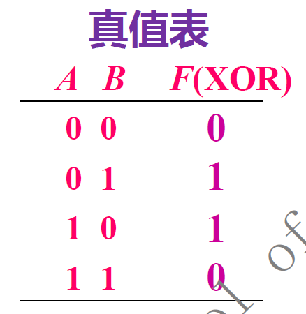
>
> 从真值表上就能看出异或门具有**比较两输入是否相异**的功能

#### 组合逻辑电路图

与门

> 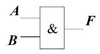

或门

> 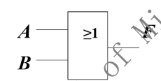

非门

> 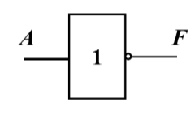
>
> 用圆圈表示取反，同时方框里写1

或非门

> 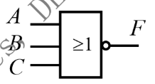

与或非门

> 
>
> 由两个与门和一个或非门组成，表达式~(AB+CD)

异或门

> 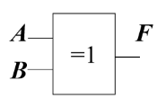
>
> 记忆方法：同或门里面有个=，表示“同”；而另一个带有=1的就是异或门了

同或门

> 

逻辑电路图仅仅是为了描述逻辑关系，用类似电路图的形式表述，并不是实际意义上的电路。真正的电路还包括耦合器件、供电电路等部分。同时逻辑电路符号分为**IEEE标准**和国家标准（**IEC标准**），上面的符号都是IEC标准的表述。常见的IEEE标准器件符号表示如下

> 或门
>
> 
>
> 非门
>
> 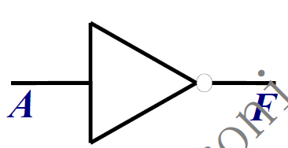
>
> 与门
>
> 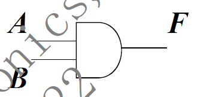
>
> 异或门
>
> 
>
> 同或门
>
> 
>
> IEEE符号的特点就是用圆弧三角形或普通的三角形表示门；如果输出端带有圆圈则表示“取反”，输入端带有圆圈表示“低电平有效”（这一点和IES标准一样）

除了一般的逻辑门外，逻辑电路图还常常用于表示特殊的门电路

* 三态门

    除了具有一般的门电路功能外，还可以进行”使能“操作

    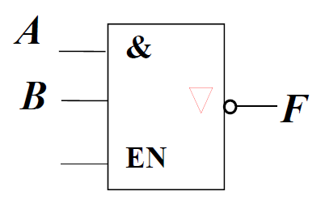

    图中标EN的输入端表示**使能**端：当EN=1时，逻辑门功能正常（在示例中表现为与非门）；当EN=0时，输出**高阻态**，一般用**Hi-Z**或**z**表示，高阻态下，输出端对后续电路表现为无干扰、无扇出，也就是说呈现输出电阻无穷大的状态。如果EN标志前面加上了圆圈则表示低电平有效的使能端，EN=1时输出高阻态，EN=0时正常工作

* OC门

    OC门即Open Collector Gate*集电极开路*门电路：它可以用于实现**线与**逻辑

    

    这种门电路的基础特性是输出侧**上拉电阻**（pull-up resistor）连接的电压不一定需要使用与输入侧同样的电压，而可以是用更低或更高的电压来代替。因此集电极开路电路有时用于连接不同工作电位或用于外部电路需要更高电压的场合

    > 上拉电阻是对电阻工作状态的描述：电阻工作在信号线和电源之间，并且让信号线在无外加驱动时呈现高电平状态，这样的电阻称为**上拉电阻**；反之，跨接在信号线和地之间，让信号线在无外加驱动时呈现低电平状态的电阻称为**下拉电阻**

    可以把多个OC门的输出连接到同一条线上，从输出端向里看，OC引脚在输出高电平时呈现高阻态，输出低电平时接地，因此如果所有的输出都在高阻抗状态，该线（以及下游的上拉电阻）将输出一个高电平的状态；但如果至少一个OC门输出处在低电平（即逻辑  0，接地），那么对应的OC门会吸收来自驱动源（也就是上图所示Ec）的电流并将输出线拉到低电平。因此OC门通常用于连接多个器件的总线，使得该总线的逻辑是同一时刻仅有单个设备输出有效信号（指低电平），进而让一个正在驱动总线的设备不会和其他不活动的设备互相干扰——如果不使用OC门输出，那么不活动（输出低电平）的设备将把总线电压拉回低电平，造成**亚稳态**。

    > 数字电路的亚稳态是一种很危险的情况，在亚稳态下我们无法预测电路的输出，相关内容会在后续介绍

* 传输门TG（Transmission Gate）

    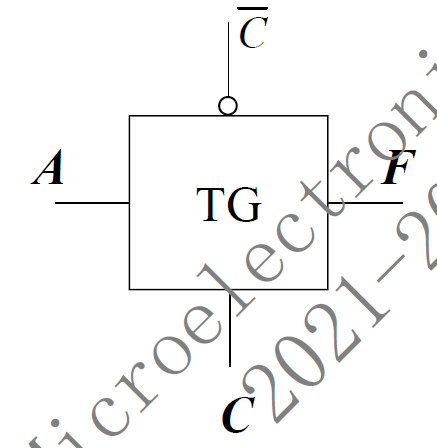

    如上图所示，C表示传输控制端，当C=1，~C=0时，F=A，信号可以通过；否则A、F各自对外呈现高阻态

    传输门实质上表示了数字电路中的开关（Switch）

#### 波形图

波形图常用于描述复杂的组合逻辑电路或各种时序逻辑电路

往往需要一个时钟信号作为控制信号

依次让各个输入输入信号变化（出现一个周期的脉冲），观察输出波形，就可以得到电路的特性

下图是或门的波形图

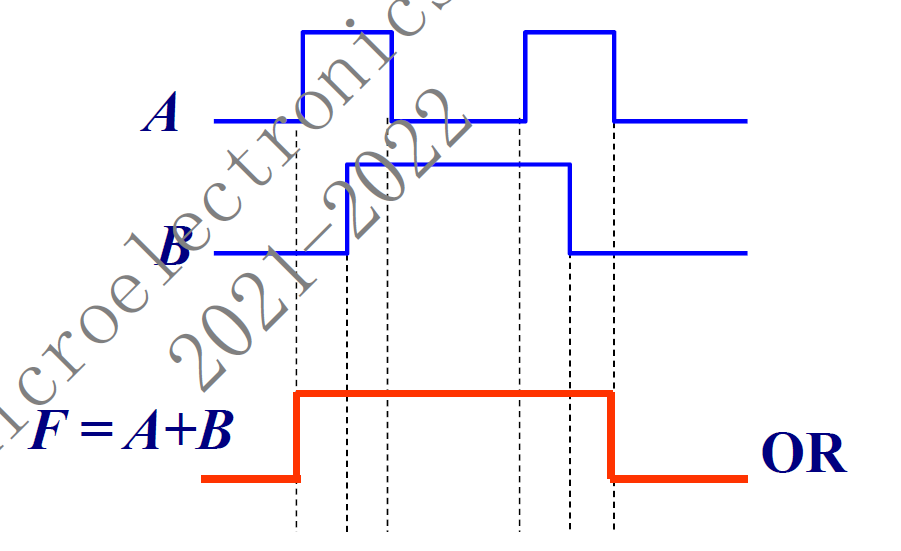

#### 卡诺图

**卡诺图**是一个由逻辑函数输入的组合构成的表格，可以给出所有可能组合的输入所对应的输出值

如下图所示

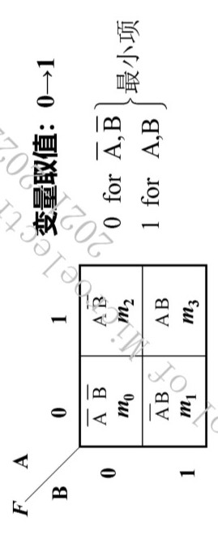

每个小格代表一个二进制输入的组合，n变量的卡诺图中有$2^n$个小格, 每个小格表示一个最小项

按照以下步骤书写卡诺图：

1. 画出表格

    

    需要注意：卡诺图横竖方向排序需要按照8421BCD码的顺序排列，因为8421BCD码是循环码，这样可以反映逻辑的对称性进而方便化简。总体上卡诺图需要遵循*几何相邻*（位置相邻）和*逻辑相邻*（只有一个变量变化）规律

2. 填入变量

    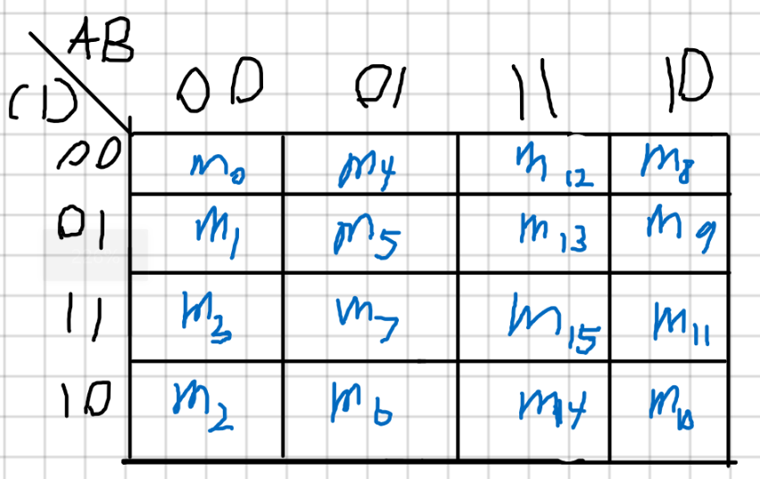
    
    一般用到的卡诺图都在四变量以内——如果用的五变量或更多变量的卡诺图，可以使用计算机解决
    
3. **如果填入数据为最小项，则将对应格标1，其他格标0；如果是最大项则将对应格标0，其他格标1**

    因为一个最简逻辑函数里面的项不是最大项就是最小项，所以正好能填满卡诺图

#### 引入变量卡诺图（VEM，Variable Entered Map）

上面说过超过5个变量时可以用计算机求解，但是手算也不是不行——这就需要扩展卡诺图定义为VEM了

引入变量卡诺图是将一个n变量的函数分离出一个变量填入剩下n-1个变量的卡诺图中，这样卡诺图的面积就得到了化简

**一般来说取最后一个变量作为引入变量**

**圈变量时需要把相同的变量圈出来**

### 布尔函数的化简

当一个逻辑函数中包含的项达到最少，且每一项中的变量也不能减少时，称该逻辑函数已经达到**最简**

实际电路中，尤其是组合逻辑电路，所使用的逻辑门数量越多，电路延时越大，硬件开销越多，因此应该在搭建电路之前完成布尔函数的化简工作，此后再使用逻辑门电路完成搭建就可以提高效率

> 实际设计工作中这一项往往交给EDA工具实现，这样一来似乎设计人员的设计水平就和使用EDA工具的水平正相关了，实际上很多EDA工具并不是那么智能，因此设计人员就需要在电路时序不好的时候进一步针对性优化

化简一个逻辑函数有以下方法：

1. 公式法

    常常使用摩根定理、吸收律等方法减少逻辑变量数目

    吸收律和反变量吸收律是最常用的，可以很好解决式子里面的多余变量

    > 吸收律的解释：两个逻辑变量A、B进行运算，如果B还额外和A或~A进行了组合，可以直接忽略它组合的那个A或A非
    >
    > **吸收律**：$A+AB=A,A(A+B)=A$
    >
    > **推广的吸收律**：$AB+A\bar B=A,(A+B)(A+\bar B)=A$
    >
    > **反相分配律**（反变量吸收律）：$A+\overline{A}B=A+B,A(\overline{A}+B)=AB$

    摩根定理常用于化简有一个长非号括住的表达式，经常和吸收律结合使用，把长或与式削成短与或式

    > **摩根定理**：$\overline {AB}=\overline{A} + \overline{B},\overline{A+B}=\overline{A}\cdot\overline{B}$
    >
    > 摩根定理的形象解释：拆掉非号，里面第一层或变与；与变或。该规律可以推广到任意数量的变量

    冗余定理是第三常用的化简方法，核心思路是利用**冗余项**对逻辑函数进行化简

    冗余项是指在复杂的表达式中多余的那些项，*冗余项并不影响逻辑表达式的结果*

    > 冗余定理本质上是指表达式里的冗余项可以删去而不影响表达式的结果，有两种用法：一个是在式中引入冗余项，另一个是消去式中的冗余项。使用的关键在于找出冗余项都是什么或者说哪几项是冗余项
    >
    > **冗余定理**：$AB+\overline{A}C+BC=AB+\overline{A}C$，$(A+B)(\overline{A}+C)(B+C)=(A+B)(\overline{A}+C)$
    >
    > **冗余定理推论**：$AB+\overline{A}C+BCDE=AB+\overline{A}C$

    反演规则和对偶规则就好像是解偏微分方程时候用的傅里叶变换或者拉普拉斯变换，先把不好化简的式子进行一次反演/对偶，就可以避开难化简的部分，尤其常用于化简或与式

    > 对偶规则就好像拉普拉斯变换，通用性高，但是因为不能把变量的非号消去，处理一些式子的时候效率不高
    >
    > 反演规则就类似傅里叶变换，当式子里面出现大量带非号或者看着可以凑出摩根定理的子式的时候可以使用
    >
    > 利用两个规则把原式变换为$F'$或$\bar F$后化简，再对偶/反演回去得到F即可

    异或公式和它的推论则常用于化简带异或号的式子

    > **异或的定义**：$A \oplus B=A\bar B+\bar A B$
    >
    > **异或同或转换**：$A \oplus B=\overline{A \odot B}$
    >
    > **常用公式**：$A\oplus A =0,A\oplus \overline{A}=1,A\oplus 0=A,A\oplus 1=\overline{A}$

2. 卡诺图法

    1. 普通卡诺图

        如果是要化简为与或式，就要在画好的卡诺图里面找1，遇到1个、2个、4个、8个...$2^n$个一组的就圈出来，然后找到对应不变的变量，它就是对应的最小项；化为或与式同理，只不过要找0

        > 直接文字叙述百分百看不懂，这里来加一个示例说明
        >
        > 首先把真值表/逻辑函数/逻辑电路转换成卡诺图
        >
        > 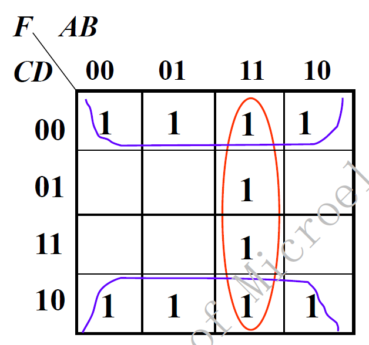
        >
        > 然后找到其中1个、2个、4个或8个一组的“1”，圈出来
        >
        > 发现对应红圈有AB都不变，为11，CD都变，所以写一个AB到结果里面
        >
        > 对应紫圈有D不变，为0，A、B、C都变，所以写一个$\overline D$到结果里面
        >
        > 得到$F(A,B,C,D)=\overline D+AB$

        **圈1或0的规则**：

        * **尽可能多地把相邻矩形的$2^n$个1圈在一起，逻辑相邻和形式相邻都视为变量相邻**
        * **消去变化的变量，留下不变的变量。如果是1则写原变量，是0写反变量，组成每个与项（圈1找与或式的情况下）；如果是0则写原变量，是1写反变量，组成每个或项（圈0找或与式的情况下）**
        * **每个圈里至少有一个别的圈没圈过的1或0**
        * **保证所有1或0都被圈到，可以重复圈**
        * **与或式圈1，或与式圈0**

    2. 随意项卡诺图

        *随意项*实际上就是上面提到的*冗余项*，在卡诺图里面用X或φ表示随意项，在逻辑函数里则使用d()的形式写出冗余项，括号内是冗余项对应的最小项编号

        **化简时，根据需要可以把φ当作1或0，但不能同时既当1又当0**，达到结果最简的目标即可

    3. 引入变量卡诺图

        变量超过5个时，采用引入变量卡诺图方法化简逻辑函数

        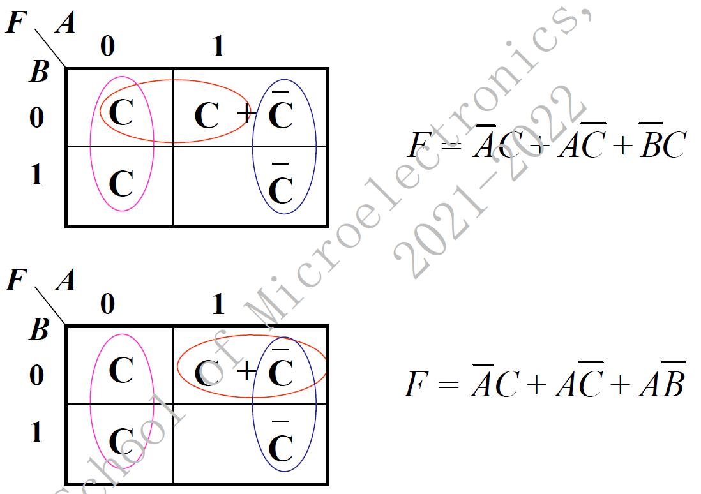

        需要注意：如上图所示，引入变量卡诺图决定的逻辑函数化简后不是唯一的

