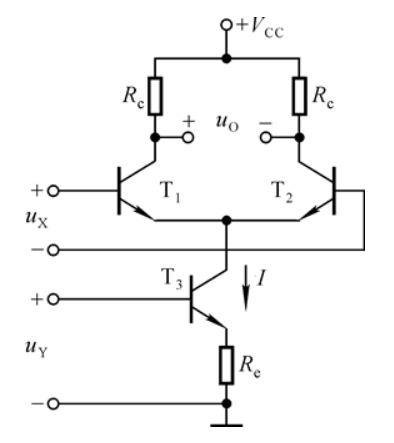
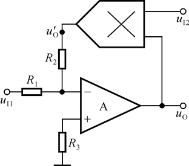
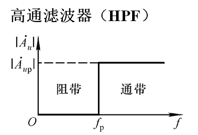
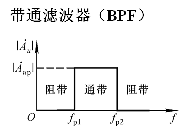
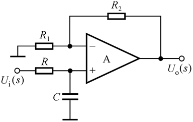
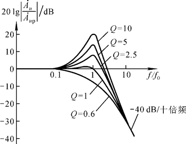
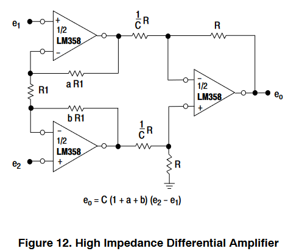

# 电路设计从入门到弃坑8【集成运算放大器的应用】

这一部分主要在上一篇博文的基础上说明集成运放在“运算”和“放大”方面的应用。至于运放在信号处理方面的应用，笔者将其放到了模拟信号部分

## 集成运放的性能指标

* 开环差模增益$A_{od}$
    $$
    A_{od}=\frac{\Delta u_o}{\Delta(u_P -u_N)}
    $$
    若实际电压放大倍数为$A_u$

    则$A_{od}=20lg|A_u|$

* 差模输入电阻$r_{id}$
    $$
    r_{id}=\frac{\Delta(u_P -u_N)}{\Delta i_P}
    $$

* 共模抑制比$K_{CMR}$
    $$
    K_{CMR}=20lg|\frac{A_{od}}{A_c}|
    $$

* 输入失调电压$U_{IO}$：使输出电压等于零时在输入端需要加的补偿电压

    对应有输入失调电流$I_{IO}$和它们的温漂

* 最大共模输入电压$U_{IC_{max}}$：能正常放大差模信号时容许的最大共模输入电压

* 最大差模输入电压$U_{ID_{max}}$：如果输入超过此值，输入级差分管会损坏

* 上限截止频率$f_H$

* 下限截止频率$f_L$

* 转换速率$SR$：描述运放对大信号的反应速度
    $$
    SR=\frac{du_O}{dt}|_{max}
    $$

## 放大电路

很多传统教材中都把比例运算电路归属于运算电路，但是针对运放的本质特性，笔者决定将两个比例运算电路单独划分为“放大电路”应用（参考了《模拟电子系统设计指南（基础篇）》的章节安排），主要以二者为例介绍理想运放的分析方法

之前已经介绍了理想运放的概念，这里来定量推导出理想运放的性质

### 理想运放

定义理想运放的输入级满足以下条件：

* 输入阻抗无穷大
* 无限接近甚至能超过电源所能提供的输入电压范围
* 差分增益无穷大
* 共模电压抑制比无穷大
* 信号带宽无穷大
* 失调电压、偏置电流、失调电流无穷小或可忽略

对应实际运放的输入级就有缺点：

* **运放输入级存在一定带宽限制**
* **运放电源供电电压对运放输入和输出电压范围有很大影响**

定义理想运放的输出级满足以下条件：

* 输出阻抗无穷小
* 无限接近甚至能超过电源所能提供的输出电压范围
* 信号失真无穷小或可忽略
* 信号带宽无穷大

同样，**实际运放的输出级难以达到上面所说的信号带宽和输出电压范围要求**

通过上面的两个理想定义，可以推导出理想运放的基本特点：

* **开环增益无穷大**
* **输入电阻无穷大**
* **输出电阻为0**

由于输入阻抗无穷大，可知输入端没有负载效应，输入同相输入端和反相输入端的电流均为0，存在**虚断**现象
$$
I_N=I_P=0
$$
理想运放的输出阻抗为0，因此在输出端没有负载影响，可以得到$U_o=A_{ol}V_d$，其中$V_d$是运放同相输入端和反相输入端电压之差。当运算放大器工作在线性区时，要求$V_o$必须是一个有限的电压值，有$V_o=\frac{V_o}{A_{ol}}$，又因为理想运放的开环放大倍数$A_{ol}=\infin$，则$V_d=0$，表示运放的差模输入电压非常小，两个输入端近似等电位，存在**虚短**现象
$$
U_N=U_P
$$
于是我们推导出了理想运放的最基本方程，以后所有理论推导都需要基于**虚短虚断等效**

除此之外，再来复习一下叠加定理：一个线性电路中，如果同时存在多个电源，则任意一支路的电流或电压，等于这个电路中各个电源分别单独作用时，在该支路中产生的电流或电压的代数和

在计算运放的输出$u_o$与多个输入$u_{ik}$关系时，常常要忽略其他$u_i$并在计算最后把结果相加

**集成运放的一般关系式可以描述为$u_o=f(u_i)$**

**集成运放在工作在线性工作区有前提条件：引入负反馈**。此时候有$u_o=A_{od}(u_P-u_N)$

对于同相放大电路，有$A_{od}=1+\frac{R_f}{R_t}$

对于反相放大电路，有$A_{od}=-\frac{R_f}{R_t}$

这正是将同相/反相比例运算电路归类为放大电路应用的原因

### 实际运放

实际的运放中，很多参数都与理想参数有着差距。回顾上一篇博文对LM358的介绍，我们来仔细看一下运放的参数

1. **供电电压$V_S$**

    市面上能买到的所有运放都可以使用单电源或双电源供电，但根据型号不同供电电压也有所不同

    就LM358来看，可以使用3到32V的单电源供电，或是压差在3~32V的双电源供电

    

2. **输入偏置电流$I_B$**

    与理想运放的虚断不同，实际运放流入反相端和同相端的电流不为0，存在输入偏置电流（Input Bias Current，IBC）
    $$
    I_B = \frac{I_{B+} -I_{B-}}{2}
    $$
    定义两个电流的差为输入偏移电流（Input Offset Current，IOC）
    $$
    IOC=I_{B+}-I_{B-}
    $$
    实际运放应当保障该参数尽可能小，越小的输入偏置电流代表着运放的输入阻抗越大

    

    可见LM358的IOC可以达到nA级别

3. **噪声$V_n$**

    实际运放的噪声来自白噪声和$1/f$噪声两部分，其中白噪声与频率无关，而$1/f$噪声与频率有关

    噪声的单位是$nA/\sqrt{Hz} @1kHz$，这个1kHz就是针对$1/f$噪声设计的单位，不同频率下的噪声可能会有所不同

    > 安森美的LM358数据手册里面没有收录噪声，因此这里换了TI的手册
    >
    > noise、noise density都代表噪声
    >
    > 噪声的单位实际上是电压密度，在频率上积分得到噪声电压

    

    噪声是固有、随机且无法被消除的，是由集成电路制造过程中器件特性和电路工艺导致的电压偏差导致。我们希望器件的**噪声越小越好**。当放大小信号时，噪声会让放大后的信号失真，因此必须选用低噪声运放

4. **静态电流$I_Q$**

    运放在没有负载情况下的待机电流被称为静态电流，本质上是运放中晶体管建立静态工作点时消耗电源功率对应的电流。在低功耗场合要关注该指标，选择低功耗的运放

    > 安森美的LM358依旧没有标出，换用TI的数据手册

    

5. **输入失调电压$V_{OS}$**

    理想运放具有虚短特性，同相端、反相端电压相等。但实际运放中同相端和反相端难免会出现失配，因此产生了一个固有电压差，称为**输入失调电压**

    一般希望这个参数越小越好

    通用运放和精密运放往往用这个参数作为参考划分：$V_{OS}>1mV$的运放是通用运放，$V_{OS}<1mV$的运放是精密运放

    > TI比较特殊，会把某些$1mv \ge V_{OS} \ge 0.5mV$但其他性能相对差的运放也归类为通用运放

    

    我们发现LM358的$V_{OS}=2mV$，因此它被划分成通用运放

6. **增益带宽积GBW（GBP）和压摆率（SR）**

    当运放在小信号（$V_{PP}<1$）下工作时，可以近似把运放的带宽和增益的乘积看作定值，称为**增益带宽积**（Gain Bandwidth Product，GBP或Gain BandWidth，GBW）

    在选择运放的带宽时，要注意
    $$
    GBP > K*Gain *f
    $$
    其中系数K是10~100之间的系数，Gain是运放的开环放大倍数$A_{op}$，f是信号的频率。该式表示GBP应该比开环放大倍数乘信号频率的10到100倍更大，才能将输入信号不失真地放大

    对于需要高Q值的Sallen-key结构运放拓扑，需要使用高GBP的运放：当Q>1时，增益带宽积至少为$GBP>100*Gain*Q^3 *f_c$

    **压摆率**（Slew Rate，SR）又称为电压转换速率，定义是在单位时间内电压升高的幅度，一般单位有V/s、V/ms、V/us、V/ns。

    一般我们用它来衡量运放在某一频率下输出大幅度信号的能力。**压摆率不变时，输出信号幅度越大，运放能输出的信号频率上限就越小**。

    为了保证输入信号不失真，至少有
    $$
    SR \ge 2\pi fV_{opp}
    $$
    其中$V_{opp}$表示最大输出电压摆幅（峰峰值），单位为V；f表示输入信号的频率，单位为MHz

    > 假设如果要把最大电压为1V，频率为1MHz的正弦波放大6倍（$V_{opp}=6 - (-6)=12$），那么需要
    > $$
    > SR \ge 2*\pi * 1 * 12 =75.35
    > $$

    如果需要将高频信号放大很多，也就是f和$V_{opp}$都大的情况，就需要选择SR大的运放。一般来说驱动级运放和高速运放都要求SR较大

    > 这里还是选用了TI的数据手册，TI把GBW、SR、相位裕度、Tor、Ts都归为了频率响应

    

    这两个参数是选择运放最重要的两个指标

    结合GBP和SR可以计算出运放在输出最高频率信号时幅度的最大值

7. **开环电压增益$A_{VOL}$**

    这是运放最基本的参数。理想运放具有无穷大的开环电压增益，但实际运放的增益还是有限的。LM324的开环电压增益典型值大约是100V/mV，这也是大部分通用运放的参数

    

8. **输入电压范围**

    理想运放可以接收任意幅度的电压输入，但实际运放存在一个输入电压范围，超过最大值的输入信号将会导致器件损坏，而低于最小值的输入信号可能无法被放大

    

    一般来说输入电压会被分成共模电压和差模电压

    共模电压输入范围一般是由运放的制造工艺和用途决定的。工控、大功率环境下的运放会有更高的输入信号。而差模信号输入范围一般是由运放内部电路结构决定的

    如果差模电压输入范围在0到VCC电压，也就是能够达到单电源供电压差的话，这样的运放被称为**轨到轨**（rail-to-rail）运放

    > 注意，这并不是轨到轨运放的严格定义，只是轨到轨运放的一个特征

    对于非轨到轨运放，信号源用GND作为参考，当输入小信号或信号中直流分量（共模分量）小的时候，相当于输入逼近GND电源轨，如果不满足输入条件，运放将不能正常工作

    > 轨到轨实际上指的是信号能够任意地接近GND电源轨（**负电源轨**）或者VCC电源轨（**正电源轨**）
    >
    > 这样的器件能够为我们应用带来方便，应用也越来越广泛

9. **输出电压范围**

    与输入电压范围限制类似，运放的输出电压也是有一定范围的

    在数据手册中，输出电压范围可能会用两种方式标明，一种是像安森美一样的

    

    用高压限和低压限来标明

    也可能是像TI一样

    

    使用Output Swing来标明

    **对于轨到轨运放，输出电压是可以任意接近GND或VCC的；但非轨到轨运放，在输出电压和VCC、GND电压之间存在着一个压差，这也是我们识别轨到轨运放的一个方法**

    LM324就是一个典型的非轨到轨运放：可以看到它在VCC=5V的情况下，存在
    $$
    V_{OH}=3.5V(max),V_{OL}=5mV(min)
    $$
    从TI的数据手册中可以发现，运放输出到正电源轨存在一个摆幅在1.35V到1.5V之间的电压；运放输出到负电源轨存在一个摆幅在100mV到0.75V之间的电压

    > 可以看一下另一个经典的轨到轨运放OPA354，它的输出电压到电源轨之间的压差仅有10mV到20mV，如下图所示
    >
    > 

    这里给出**轨到轨运放的定义**：输入电压和输出电压可以与电源电压非常接近，几乎达到电源电压输入输出的运放。轨到轨运放分为输入轨到轨**RRI**、输出轨到轨**RRO**、输入输出轨到轨**RRIO**三种，目前市面上的主流轨到轨运放都支持输入输出轨到轨

    虽然轨到轨运放很方便使用，不需要为信号留出高压供电裕量和低压供电裕量，很适合在低压供电、小信号放大的场景下使用；但轨到轨电路设计比较复杂，价格比非轨到轨运放高一点点，在成本极度敏感应用中需要考虑一下，同时轨到轨电路会受到输出电流影响，**如果输出电流过大，会让输出电压达不到电源轨**

10. **短路电流$I_{SC}$**

    输出短路电流表示运放在输出端短路到地时能提供的最大推电流或灌电流，表征了运放的驱动能力

    

    上图是安森美提供的datasheet，下图是TI的

    

    一般来说通用运放都有着几十mA的输出短路电流，而功放一般能够承受数百mA到数A的输出电流

11. **输入阻抗和开环输出阻抗**

     实际运放的输入阻抗不是无穷大的，因此部分厂商会在数据手册中标明运放的输入阻抗

     > TI和安森美都没有给出LM324输入阻抗的参数，就不给参考了，感兴趣的读者可以自行查找OPA211的数据手册，尝试自行找到输入阻抗信息

     在高频小信号电路中，往往要让运放的输入阻抗远远大于信号源的内阻，这样才能够实现信号的精密采集

     理想运放假设输出阻抗为0，但实际上开环输出阻抗是一个比较小的值，LM324的开环输出阻抗如下图所示

     

     现在很多器件的开环输出阻抗已经能够做到几欧

12. **共模抑制比CMRR和电源抑制比PSRR**

     共模抑制比CMRR表征了运放抑制输入共模信号的能力，有些厂商会直接标出，有些厂商会使用共模抑制量（单位dB）的形式给出

     电源抑制比则表征了输出电压受电源电压影响的程度，该值越大，表示输出信号受到供电扰动越小

     

### 反相比例运算电路

对于上述电路，存在
$$
i_f=i_R=\frac{u_i}{R} \\
u_o=-i_f R_f=-\frac{R_f}{R} u_i \\
R'=R//R_f
$$
电路通过引入**电压并联负反馈**来保证运放工作在线性区

对于该电路，还需要额外注意$R_f$虽然能够有效反馈，但是会导致部分噪声杂波被引回输入端放大，进而对整个电路系统带来较大*噪声*，**$R_f$决定了反馈深度，而反馈深度越深也就是$R_f$越大，系统噪声干扰越大**，所以可以改进这个电路为**T型反馈网络反相比例运算电路**

在这个电路中，有
$$
i_2=i_1=\frac{u_1}{R_1} \\
u_M=-\frac{R_2}{R_1}u_i \\
u_o=u_M -(i_2+i_3)R_4 \\
i_3=-\frac{u_M}{R_3} \\
u_o=-\frac{R_2+R_4}{R_1}(1+\frac{R_2//R_4}{R_3})u_i
$$
这个大式子肯定记不住，我们不妨来讨论一下分析的逻辑：整体电路就是个反向比例运算电路，但是在反馈网络部分进行了改变。首先看孤零零的$u_P$，发现它通过R5直连地，于是根据虚短特性得到
$$
u_P=u_N=0
$$
随后就能直接得到
$$
i_1=i_2=\frac{u_i-0}{R_1}=\frac{u_i}{R_1} （虚断导致流入负端的电流为0）
$$
也就是上面*第一个式子*

接下来发现好像没什么可分析的了，这时候就需要发散思维，引入一个新变量让计算更简单——如果你对电路原理的节点电流法比较熟悉，那么肯定直接想到在M点使用KCL：$i_2+i_3=i_4$

于是挨个列写方程
$$
i_2=-\frac{u_M}{R_2} \\
i_3=-\frac{u_M}{R_3} \\
i_4=\frac{u_M-u_o}{R_4}
$$
不难发现这里已经推出了上面*第四个式子*

考虑之前得到的$i_1=i_2=\frac{u_i}{R_1}=-\frac{u_M}{R_2}$

可以计算$u_M$
$$
u_M=-\frac{R_2}{R_1}u_i
$$
这就是上面的*第二个式子*了

发现似乎并没有推出什么新东西，于是回到节点电流法
$$
i_4R_4=u_M-u_0=(i_2+i_3)R_4 \\
u_o=u_M -(i_2+i_3)R_4
$$
这就得到了*第三个式子*

四个式子联立带入节点电流法解得答案。

> 这个推导思路似乎不太连贯，因为这个推导基于“有什么用什么”的逻辑（很多情况下实际问题就是需要多猜，但这个题目显然就不适合这样一边碰壁一遍写方程的思路）
>
> 还有另一个较为连贯的逻辑：以M点电位为基础
>
> 虚断虚断特性对应运放本身的性质，而整个系统可以分成两部分：运放和反馈网络。不难想到将整个反馈网络看作一个独立子系统进行求解，于是就能很自然地发现节点电流法对系统R2、R3、R4最有效，设置$u_M$也就很自然了。求解出子系统的性质也就是节点电流法方程后，直接有
> $$
> -\frac{u_M}{R_2}-\frac{u_M}{R_3}=\frac{u_M-u_o}{R_4}
> $$
> 综合已经得到的公式
> $$
> i_1=i_2=\frac{u_i}{R_1} \rightarrow u_M=-\frac{R_2}{R_1}u_i
> $$
> 求解方程组就可以直接得到答案了

### 同相比例运算电路

这个电路引入了**电压串联负反馈**，由下式确定它的放大特性
$$
u_o=(1+\frac{R_f}{R})u_i
$$
对于这个电路，存在两种特例情况

如上图，左边表示$R=\infin$；右边表示$R=\infin且R_f=0$

在这两种情况下都可以确定$1+\frac{R_f}{R} \rightarrow 1$，进而有
$$
u_o=u_i
$$

> 如果只有$R_f=0$时候会怎么样？如果你问了这个问题，说明还没有掌握反馈网络的灵魂
>
> 反馈网络决定了运放的$A_{od}$，而我们在上面通过虚短虚断特性推导出的同相比例运算电路表达式里面的$\frac{R_f}{R}$是来自对反馈网络的抽象，而在下面的这个特例里面，只要求$1+\frac{R_f}{R} \rightarrow 1$这个条件——也就是只要满足这个条件的电路拓扑都可以有$u_o=u_i$的表达式，所以说只有$R_f=0$的时候，也存在$u_o=u_i$
>
> **为了实现目标而引入反馈网络，而不是为了反馈网络去强行规划一个目标**。在设计电路的时候使用这个思路，分析电路的时候也应该依靠这个思路，先把握电路拓扑的应用目标（也就是所谓的识别电路），再对应确定每个元件的取值

## 运算电路

### 反相求和运算电路

### 同相求和运算电路

### 加减运算电路

### 积分运算电路

### 微分运算电路

### 对数运算电路

### 指数运算电路

### 乘法/除法运算电路

一般来说可以通过下面的拓扑结构实现乘法/除法运算电路

但实际上乘法运算电路用不到运放——只需要几个三极管就可以构成模拟乘法器了

上图称为**变跨导型模拟乘法器**，有表达式
$$
u_o=\frac{R_c}{2U_TR_e}u_Xu_Y
$$
实际使用中一般会在多方面进行改进，不会简单使用这个拓扑。在电路中常常用下面的符号表示

理想情况下k值是不会变化的
$$
u_o=ku_Xu_Y
$$
可以将两个输入端连接到同一个输入电压来获得乘方运算

$$
u_o=ku_i^2
$$
如果对正弦波使用这个电路，除了电压乘方外还会让信号二倍频

$u_o=2kU_i^2(1-cos2\omega t)$

将这个电路倒置在反相比例运算电路的反馈网络中，可以实现除法运算

但是需要注意：要求k值和$u_{i2}$值是同极性的，否则会导致输出不正确甚至损坏设备
$$
u_o=-\frac{R_2}{R_1}\frac{u_{i1}}{ku_i2}
$$
可以将$u_{i2}$接入$u_o$处实现开方运算
$$
u_o=\sqrt{-\frac{R_2}{kR_1}u_i}
$$

> 不难发现：**若集成运放的负反馈通路中为某种运算电路，则整个电路实现其逆运算**
>
> 对于开方电路是这样，对于上面的那些运算电路也是这样
>
> 这是因为运放的负反馈网络属性可以描述为
> $$
> -\frac{R_f}{R} <-^{负反馈}-> A^{-1}(B)
> $$
> A表示反馈网络拓扑的电压输出与输入之间的关系

## 有源滤波器

在电路原理里面已经介绍过基于RLC串并联网络的滤波电路，这种基于无源器件的电路被称为**无源滤波电路**

基于有源器件的滤波电路就是**有源滤波电路**了

理想的滤波电路呈现阶跃函数$\delta(t-t_0)$的特性

但是实际的滤波电路往往存在过渡带-通带-阻带三个区域。

> 无源滤波电路会受到负载的影响，当负载感抗/容抗较大的情况下或信号频率非常高/非常低的情况下，负载会影响滤波器的带宽和有效频率；而**有源滤波器可以通过负反馈进行自我调节**，从而不受或很少受负载的影响
>
> 对于一般的无源滤波器，存在
>
> 空载时
> $$
> A_u=\frac{1}{1+j\frac{f}{f_p}}
> $$
> 带载时
> $$
> A_u=\frac{A_{up}}{1+j\frac{f}{f_p}} \\
> A_{up}=\frac{R_L}{R+R_L} \\
> R为滤波电路内阻
> $$

滤波电路的特性可以通过两种频率特性描述，分别是**幅频特性**和**相频特性**

相频特性一般通过**波特图**的形式描述

幅频特性一般通过电压放大倍数-信号频率图的形式描述

> 上面的内容在之后的频率响应章节会仔细介绍，这里简单说明一下定义。
>
> **幅频特性**：电路的$A_u(f)$函数
>
> **相频特性**：电路的$\phi(f)$函数
>
> **波特图**是一种使用对数坐标系反映电路频率响应的标准图示

四种滤波电路的幅频特性如下所示：

* **高通滤波器**HPF

    

* **低通滤波器**LPF

    

* **带通滤波器**BPF

    

* **带阻滤波器**BEF

    

有源滤波器中，常常**使用电压跟随器隔离滤波电路与负载电阻**，因此可以达到滤波参数不随负载电阻变化的特点。同时可以实现电信号放大，更能滤出需要使用的信号频段。但是它也存在缺点：**无源滤波电路可用于高电压大电流**；而**有源滤波电路是信号处理电路，输出电压和电流的大小受有源元件自身参数和供电电源的限制**

### 同相输入低通滤波器

有传递函数
$$
A_u(s)=(1+\frac{R_2}{R_1})\frac{1}{1+sRC}
$$
可见它属于一阶电路

具有上图这样的幅频特性
$$
A_u=\frac{A_{up}}{1+j\frac{j}{j_p}} \\
f_p=\frac{1}{2\pi RC}
$$
对上述电路改进为二阶如下

幅频特性

$$
(1+\frac{R_2}{R_1})\frac{1}{1-(\frac{f}{f_0})^2+3j\frac{f}{f_0}} \\
特征频率f_0=\frac{1}{2\pi RC} \\
截止频率 f_p \approx 0.37f_0
$$
这个电路虽好，但是它的过渡带太拉跨了，于是我们进行下面的改进，引入一个稍弱的正反馈，制成**压控电压源二阶LPF**

这回的图像就舒服多了

### 反相输入低通滤波器

这个电路就是在积分运算电路基础上改进而来

具有幅频特性
$$
A_u=-\frac{R_2}{R_1}\frac{1}{1+j\frac{f}{f_0}} \\
f_p=f_0=\frac{1}{2\pi RC} \\
A_{up}=-\frac{R_2}{R_1}
$$

### 高通滤波器、带通带阻滤波器的对偶性

高通滤波器与低通滤波器对偶，将LPF的电阻电容互换后即可得到一阶HPF、简单二阶HPF、压控电压源二阶HPF电路等

带通滤波器只要使用LPF和HPF组合即可

* LPF与HPF**串联**得到**带通滤波器**
* LPF与HPF**并联**得到**带阻滤波器**

还可以将**低通环节加在负反馈通路来实现高通**，本质上和之前讲述的逆运算实现一样。但是这样制成的滤波器一般称为**状态变量型滤波器**

> 很多时候运算电路和有源滤波器的拓扑结构很像，但是一定要记住：运算电路针对信号时域进行变换；有源滤波器针对信号频域进行变换

