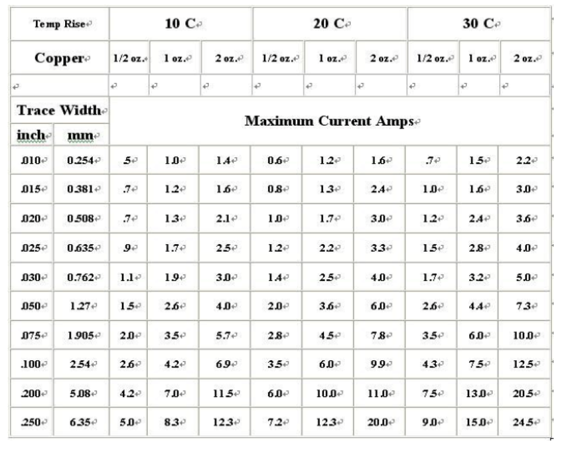
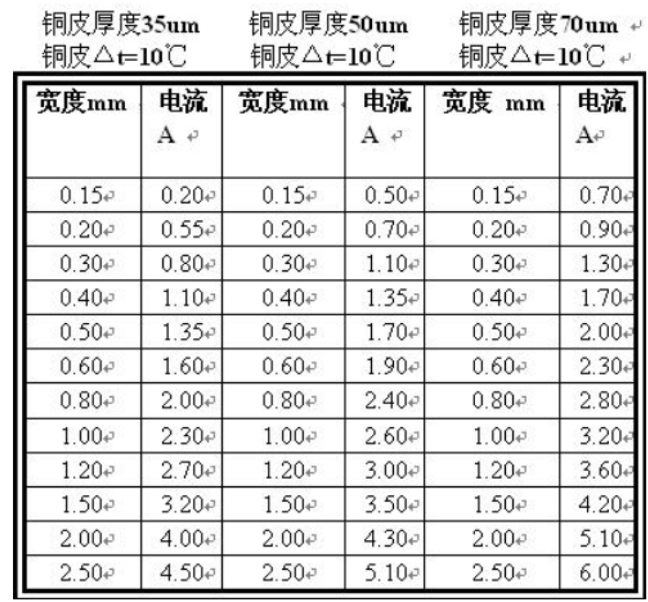
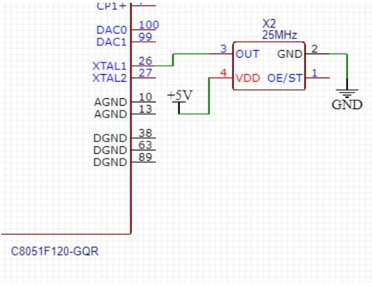

# 基本原则

1. 尽可能保持外围电路简单，能用集成电路就不用分立元件
2. 具有一定电磁兼容性，能够低于周围电磁场干扰，并能较少影响周围环境
3. 系统具有可测试性，可以通过引出测试点、调试接口等方式实现
4. 电路设计与选型统筹兼顾，着重于某一方面，但不能让其他电路性能受损

# 模拟数字混合电路

**电路特性**：数字电路的频率高，模拟电路的敏感度高

高频的信号线应尽可能远离敏感的模拟电路器件。由于数字信号一般为矩形波，带有大量的谐波。如果电路板中的数字地与模拟地没有从接入点分开，数字信号中的谐波很容易会干扰到模拟信号的波形。当模拟信号为高频或强电信号时，也会影响到数字电路的正常工作。存在问题的根本原因是，无法保证电路板上铜箔的电阻为零，在接入点将数字地和模拟地分开，就是为了将数字地和模拟地的共地电阻降到最小

> 在板内，数字地和模拟地实际上是分开的，只是在PCB与外界连接的接口处有一点短接

对于低频模拟电路，除了加粗和缩短地线之外，电路各部分采用**一点接地**是抑制地线干扰的最佳选择，主要可以防止由于地线公共阻抗而导致的部件之间的互相干扰。而对于高频电路和数字电路，由于这时地线的电感效应影响更大，一点接地会导致实际地线加长而带来不利影响，这时应采取**分开接地和一点接地相结合**的方式。另外对于高频电路还要考虑如何**抑制高频辐射噪声**。

模拟地/模拟电源与数字电源通过电感/磁珠单点连接

**设计技巧**：两个地起不同的名字，分别辅铜，最后可以**用一个10uH电感（最大不超过100uH）或0欧姆电阻连起来**，模拟部分的器件尽量集中，放置在与其它板子接口的附近，减小信号衰减。先对模拟地敷铜，然后对整个板敷数字地。模拟地和数字地间的串接可以采用四种方式：用磁珠连接；用电容连接；用电感连接；用零欧姆电阻连接，一般情况下用零欧电阻或磁珠是最佳选择

**磁珠**采用在高频段具有良好阻抗特性的铁氧体材料烧结制成，专用于抑制信号、电源线上的高频噪声和尖峰干扰，还具有吸收静电脉冲的能力。磁珠有很高的电阻率和磁导率，等效于电阻和电感串联，但**电阻值和电感值都随频率变化**。它比普通电感有更好的高频滤波特性，在高频时呈现阻性，所以能在相当宽的频率范围内保持较高的阻抗，从而提高调频滤波效果。**磁珠对高频信号才有较大阻碍作用**，它在低频时电阻比电感小得多

铁氧体磁珠不仅可用于电源电路中滤除高频噪声，还可广泛应用于其它电路，其体积可以做得很小。特别是在数字电路中，由于脉冲信号含有频率很高的高次谐波，也是电路高频辐射的主要根源，所以可在这种场合发挥磁珠的作用。在电路中只要导线穿过它即可。当铁氧体对低频电流几乎没有什么阻抗，而对较高频率的电流会产生较大衰减作用

**干扰三要素**：1. 干扰源（$\frac{di}{dt}$， $\frac{du}{dt}$大的地方就是干扰源）；2. 干扰传播路径（通过导线的传导和空间的辐射等）；3. 敏感器件（ADC、数字IC、AMP等容易被干扰的器件）

## 抗干扰设计原则

* 抑制干扰源：减小$\frac{di}{dt}$， $\frac{du}{dt}$

  基本方法：

  1. 在干扰源回路串联电感或电阻
  2. 给电机加滤波电路，减小电容、电感引脚长度
  3. 在大电感旁边增加续流二极管
  4. 在继电器接点两端并接火花抑制电路（RC串联电路，电阻一般选几K到几十K，电容选0.01uF）
  5. 电路板上每个IC的VCC和GND引脚间要并接一个0.01μF~0.1μF高频电容，以减小IC对电源的影响；电容布线应尽量粗短、靠近电源端
  6. 布线时避免90度折线，减少高频噪声发射
  7. 可控硅两端并接RC抑制电路，减小可控硅产生的噪声
* 切断干扰传播路径：切断传导干扰、减小辐射干扰

  基本方法：

  1. 要给单片机电源加滤波电路或稳压器，以减小电源噪声对单片机的干扰（可以利用磁珠、电阻和电容组成π形滤波电路，尽量不要用LC滤波）
  2. 如果单片机的I/O口用来控制电机等噪声器件，在I/O口与噪声源之间最好加隔离（增加π形滤波电路）
  3. 晶振与单片机引脚尽量靠近，用地线把时钟区隔离起来，晶振外壳接地并固定
  4. 电路板合理分区，尽可能把干扰源与敏感元件远离，最好用地线把数字区与模拟区隔离，数字地与模拟地要分离，最后在一点接于电源地，单片机和大功率器件的地线要单独接地，以减小相互干扰
  5. 在单片机I/O口，电源线，电路板连接线等关键地方使用抗干扰元件如磁珠、磁环、电源滤波器，屏蔽罩，可显著提高电路的抗干扰性能
* 提高敏感器件的抗干扰性能

  提高敏感器件的抗干扰性能是指从敏感器件这边考虑尽量减少对干扰噪声的拾取，以及从不正常状态尽快恢复的方法

  基本方法：

  1. 布线时尽量减少回路环的面积，以降低高频辐射感应噪声，防止仪器处于强磁场中时产生感应电流
  2. 如果只是低频电路，则应避免地线环路；高频时，可通过磁珠把模拟和数字地一点共地
  3. 不要有无用的大面积铜箔
  4. 电源线和地线要尽量粗，降低噪声对地阻抗压降，抑制耦合噪声
  5. 单片机闲置的I/O口不要悬空，要接地或拉高；IC的闲置端在不改变系统逻辑的情况下接地或接电源
  6. 对单片机使用电源监控及看门狗电路
  7. 在速度能满足要求的前提下，尽量降低单片机的晶振和选用低速数字电路
  8. IC器件尽量直接焊在电路板上，少用IC座

## 布线技巧

以下内容转自知乎https://www.zhihu.com/question/33455263/answer/1697154500

4层板从上到下依次为：信号平面层、地、电源、信号平面层

6层板从上到下依次为：信号平面层、地、信号内电层、信号内电层、电源、信号平面层

6层以上板(优点是：防干扰辐射)，优先选择内电层走线，走不开选择平面层，**禁止从地或电源层走线**(原因：会分割电源层，产生寄生效应)

多电源系统的布线：如FPGA+DSP系统做6层板，一般至少会有3.3V+1.2V+1.8V+5V，**3.3V**一般是主电源，**直接铺电源层**，通过过孔很容易布通全局电源网络；5V一般可能是电源输入，只需要在一小块区域内铺铜。且尽量粗，越粗越好；1.2V和1.8V是内核电源，布局时尽量将1.2V与1.8V分开，并让1.2V或1.8V内相连的元件布局在紧凑的区域，使用铜皮的方式连接

电源与地线靠近走线，注意减小回路面积，这样能降低电磁干扰

因为电源网络遍布整个PCB，如果采用走线的方式会很复杂而且会绕很远，使用**铺铜皮**的方法是一种很好的选择

**邻层之间走线采用交叉方式**

晶振离芯片尽量近，且晶振下尽量不走线，铺地网络铜皮

连接器上信号的排布对布线的难易程度影响较大，因此要**边布线边调整原理图上的信号**(但**千万不能重新对元器件编号**)

# 纯模拟电路

## 走线宽度和PCB电流之间的关系

**111经验公式：1oz铜厚下1mm线宽走线可以通过1A电流**

可以参考下表设置合适的线宽

### 一些参考资料

https://www.chinafix.com/thread-1202715-1-1.html

https://zhuanlan.zhihu.com/p/405439815?utm_medium=social&utm_oi=1032708635453005824

https://www.zhihu.com/question/65689467

https://bbs.21ic.com/icview-319938-1-1.html

## 三极管基极旁路的作用

## 直流稳压电源设计

直流稳压电源电路一般由变压、整流、滤波、稳压四部分组成。

变压器一般选用市电隔离变压器即可，功率足够大就能用

### 整流

整流电路将交流电压变成脉动直流，它主要有半波整流（半桥）、全波整流（全桥）方式，可以由整流二极管构成整流桥堆来执行，常见的整流二极管有IN4007、IN5148等，桥堆有RS210、DB104等

对于桥式（一般使用全桥）整流电路，

每只二极管或桥堆所承受的最大反向电压为$U_{RM}=\sqrt{2}U_1$

每只二极管的平均电流为$I_{D(AV)}=\frac{1}{2}I_R=\frac{0.45U_1}{R}$

### 滤波

滤波电路将脉动直流滤除纹波，变成纹波小的直流，常见电路有RC滤波、KL滤波、π型滤波等，常用RC滤波电路

RC滤波电路中，RC放电时间常数应满足$RC=\lambda T/2$

其中$3\le \lambda \le 5$，T为输入交流信号周期

### 稳压

滤波电路输出电压经稳压后才能输出较稳定的电压。常见的稳压电路有三端稳压器、串联式稳压电路等

市面上大多数**三端固定式正压稳压器**均命名为78系列，引脚为IN、OUT、ADJ/GND。该系列稳压器有过流、过热和调整管安全工作区保护，可以防止过载损坏。名称中*78后面的数字代表稳压器输出的正电压数值*（一般常用05、09、12、15、20、24等），78前面冠以不同的英文字母为系列代号。78系列稳压器最大输出电流分100mA、500mA、1.5A三种，以插入的字母（可能在78前也可能在78后）来表示。插入L表示100mA；插入M表示500mA；不插入字母表示1.5A。此外，78（L、M）××的后面往往还附有表示输出电压容差和封装外壳类型的字母。常见的封装形式有TO-3金属、TO-92小型塑封和TO-220的中型塑封，其中金属封装形式输出电流可以达到5A，一般来说在弱电设计中不常用

实际应用中，芯片输入、输出端与地之间除分别接大容量滤波电容（100uF以上）外，通常还需在芯片引出脚根部接小容量（0.1µF~10µF）电容Cin、Cout到地，用于**抑制芯片自激振荡**、**滤除高频杂波**，Cout还有压窄芯片的高频带宽，**减小高频噪声**的功能。Cin和Cout的具体取值依照datasheet定

而负电压稳压器一般命名为79系列，和78系列除了输出伏电压外其他参数一样

还有三段可调式稳压器，品种繁多，如正压输出的317（217/117）系列、123系列、138系列、140系列、150系列；负压输出的337系列等

一般调压输出电路公式为$U_O=1.25(1+\frac{R_p}{R_i})$

其中R~p~为电位器，接在ADJ脚与地之间，R~i~为反馈电阻，接在输出与ADJ之间，一般取值为120～240Ω，**输出端与调整压差为稳压器的基准电压**（典型值为1.25V），流经电阻R1的泄放电流为5～10mA

负压输出的LM337系列除了输出电压极性、引脚定义与LM317不同外，其他特点都相同

### 正负输出稳压电源

正、负输出稳压电源能同时输出两组数值相同、极性相反的恒定电压，一般使用输出电压极性不同的两片集成稳压器接在相同的**两路**滤波电路输出端

注意==输出部分一定要接入钳位二极管和电容==，否则容易造成电流倒灌

### 斩波调压电源电路

MC33063A/MC34063A/MC35063A是单片DC/DC变换器控制电路，只需配用少量的外部元件，就可以组成升压、降压、电压反转DC/DC变换器。电压输入范围为3~40V，支持调压输出且输出开关电流可达1.5A、工作频率可达100kHz，内部参考电压精度为2％

其内部包含1.25V基准电压、反向输入比较器、开关管驱动电路、振荡器（由外部定时电容驱动，使用锁存器辅助输出的数字器件）

主要用于制作升压、降压DC/DC变换器、电压反转式DC/DC变换器

详细内容参考datasheet即可

### 常见电源IC

以下内容整理自https://zhuanlan.zhihu.com/p/258490483

#### DC/DC降压

* TPS54541，输入电压4.5V\~42V，输出电压可设置为0.8V\~41V，最大输出电流5A
* TPS54140，输入电压3.5V\~42V，输出电压可设置为0.8V\~39V，最大输出电流1.5A
* TLV62569，输入电压2.5V~5.5V，输出电压最低0.6V、最高到输入电压，最大输出电流2A,芯片体积很小
* MP2451，输入电压3.3V~36V，输出电压最低0.8V、最高0.8倍输入电压，最大输出电流0.6A
* MP2269，输入电压3.3V~30V，输出电压最低0.8V，最大输出电流1A，芯片体积很小
* LTC3370，4路输出，输入3.3V或5V，输出最低0.8V，最高与输入电压一样，最大输出电流总共8A，可以给4路各自分配0-4A

#### DC/DC升压

boost芯片的参数里，有一个跟buck有很大的区别，就是输出电流，boost的原理决定了其输出电流分为充电和放电两个阶段，充放电是否连续、占空比的大小、等效负载电阻的大小，共同决定了输出电压和电流的大小，因此**boost芯片根据输入和输出电压的不同，其连续输出电流值是不同的**，因此**只有“开关电流”这个参数能用于大致的估计**，这个参数如何估计和计算，对新手来说还是太复杂了，建议大家**直接通过datasheet中的图表确认其实际的电流输出能力**。

* TPS61085A，输入电压2.3V到6V，输出电压2.8V到18.5V
* TPS61390，输入电压2.5 V to 5.5 V，输出电压最高85V
* TPS61040，可用于LCD屏背光的升压芯片，输入电压5V，boost输出电压10.4V，用于LCD背光二极管电源
* CAT4237，野火开发板的液晶屏背光的升压芯片

#### LDO

LDO的效率只能用悲剧来形容，所以一般只用于单片机开发板或测试电源

LDO使用起来非常简单，电压、电流、纹波、发热等参数匹配，直接使用就可以了

* LM1117，输入电压2.6V到15V，输出电压1.25V到13.8V，最大输出电流0.8A，还有固定电压输出的版本，1.8V, 2.5V, 3.3V, 5V
* LY1117A，参数类似于LM1117，国产，非常便宜
* AMS1117，参数类似于LM1117，效率似乎要高一些，但是贵

# 纯数字电路

## 通用的MCU电路设计

## 板级信号传输设计

下面的“nW”代表n倍线宽

### 避免直角走线

1. 带来寄生电容
2. 线宽变宽，会带来阻抗连续，产生反射
3. 产生天线效应，可能导致EMI
4. PCB生产中可能产生“酸角问题”

最好使用圆弧（半径大于3W）走线或者45度角走线（外侧大于2W，内侧1W）

### 避免走线出焊盘的方法

1. 达到1倍线宽后再拐弯
2. 直接连接焊盘（这种方法不建议在芯片上使用，会带给检察人员困扰）

### 一转多走线出现锐角的解决办法

1. 直接连接
2. 使用钝角走线

### 走线不能太接近边缘的原因

PCB打样时使用大板拼板或使用V割方法，可能导致边缘走线被意外割断

### 走线基本技巧

顶层和底层之间应当正交走线

当PCB布线受到结构限制，难以避免出现平行布线，特别是在信号速率较高时，应考虑用**地平面**隔离各布线层，用地线隔离各信号线

走线间距遵循3W原则（导线之间的相互干扰可以降低70%）或10W原则（高速走线，相互干扰可减少98%）

3W原则：导线与导线之间的间距应该大于3倍的导线宽度

在电源和地等网络走线时尽量采用树形走线

高速线走线时，走线长度不能等于波长的整数倍，整数倍的情况会产生谐振，导致电磁辐射产生

### 地线回路原则

1. 地线构成的环面积应该尽可能小，较少对外辐射
2. 数字地和模拟地进行隔离，在接口处用隔离电感连接

### 铺铜原则

1. 可以使用铺铜代替锐角走线
2. 焊盘应该全部被铺铜盖住，不应出现半个焊盘
3. 铺铜不应出现锐角铜片
4. 面积过小的铺铜会产生空框现象，这种情况需要换用更大的铜片
5. 大面积的铺铜需要添加接地过孔，从而起到散热和防止焊接时爆皮

### 关于滤波电容

滤波电容最好放在电源和地之间

并联滤波电容会导致负载容性增大

### 基本布局技巧

器件与板子边缘的距离应保持5mm左右。相同的器件距离在0.3mm左右，不同的器件距离0.13*h+0.3mm（h是周围器件的高度差），手工焊接的板子应该预留出更大的空间

在板子边缘的元器件和板子边缘保持平行，以免在切割时受力后变成虚焊

热敏器件不应该放置在热量较大的区域；电解电容也离热源越远越好，有可能会存在电解液被烤干的情况

电源、USB、串口等器件需要放置在板子边缘，要注意放置的位置能保证焊接后可以使用

### 焊盘布局技巧

焊盘需要留有最小0.2mm的焊环，过孔应该留有最小0.15mm的焊环，为了给金属化过程留下附着点

焊盘上不应留过孔，会导致焊接时焊锡流入孔洞，产生虚焊

焊盘/过孔中间的孔大小应该符合PCB厂家加工的工艺能力，不能太小

不要让过孔大小=孔径大小

### 低速布线

在低速电路中，直角走线、平行布线是可以接受的——但是相对应**千万不要把这个习惯代入高速电路中**

垂直布线是相邻信号层的走线之间要相互垂直来减少相互之间互感引起的串扰，但是在小规模（20条以下并排走线）、低速（100MHz以下）时，相邻信号层的垂直布线与否影响不大；在高速乃至射频（数GHz）的电路中，走线之间才会发生空穴谐振，导致严重的串扰，这就是高速电路采用多层板的目的

直角布线往往也仅对高速电路起效——但是除非电路板工作在几十GHz的高速状态下，引线走直角是完全可以接受的，上世纪电路板工艺不足时也往往在500MHz以下的电路中使用直角走线，事实证明这对信号完整性影响微不足道

不过个人认为低频板最好不要使用直角布线，一是为了增加走线物理强度——带有圆边和钝角的走线在使用过程中很难因为磕碰发生卷边翘起等极端损坏，但直角走线就可能发生这种情况（事实上作者就遇到过）；二是为了美观——直角太尖锐会破坏电路整体外观，也与芯片排列不协调；三就是让电路有容错余地，如果在硬件Debug过程中涉及到高频影响，不会导致莫名其妙的问题

整个布线应该以电路板的速度为最优先——如果电路速度要求不大但布线数量多工期紧张，完全可以适当放弃布线优化原则以换取更快的布线速度和更少的迭代优化次数

## 高频电路

### 使用网络分析仪测试天线性能

网络分析仪接入天线后，会显示一个V型曲线，表示天线在各频率的驻波比

将网分仪跳到回波损耗功能，可以测试天线的具体回波损耗，某频率对应回波损耗越小，表示该频率下天线性能越好

在进行天线阻抗匹配时，通常可以用网分仪进行辅助

天线阻抗匹配过程就是使用Π型或P型LC匹配网络优化天线驻波比和回波损耗的过程，阻抗匹配不一定需要，但是加入阻抗匹配后，往往能让天线性能得到优化

### 有源晶振和无源晶振

无源晶振本质上就是一个经过封装的石英晶体，他无法凭空产生震荡

有源晶振本质上是一个集成电路，内部封装了石英晶体和外围器件，相当于一个振荡器

无源晶振和有源晶振的等效电路如下

* 无源晶振

* 有源晶振

无源晶振不仅需要两个匹配电容，还需要接入器件的XTAL_IN和XTAL_OUT脚——器件内部包含了必要的施密特触发器和大电阻（有时候也会在片外电路上加入一个1MΩ的电阻用作匹配），从而让晶振起振

而有源晶振则是典型的“集成电路”，需要供电和接地，同时往往有一个脚是NA空脚或者是使能端，一般在封装上会永远一个点标志或者一个缺角来标识出来，正对着的则是OUT引脚，这个引脚用于输出振荡波形给XTAL_IN

有源晶振引脚具备方向性，一定要找对电压输入脚，贴反极易导致有源晶振内部金属引线遭受强电流而熔断，造成有源晶振被烧毁而停振

可以把有源晶振看成一个简单的时钟发生器

