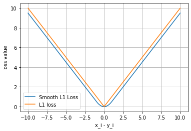
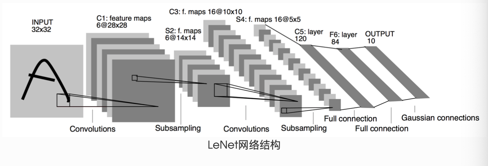

==**本系列博文主要根据开源的[thorough-pytorch](https://github.com/datawhalechina/thorough-pytorch)项目编写，感谢datawhalechina团队的dalao们分享学习经验**==

# PyTorch训练模型

一个神经网络的典型训练过程如下：

1. 定义包含一些可学习参数（或者叫权重）的**神经网络**
2. 在输入**数据集**上迭代
3. 通过网络**处理**输入
4. 计算**损失函数**`loss`（输出和正确答案的距离）
5. 将梯度**反向传播**给网络的参数
6. **更新权重**（一般使用简单的规则，如`weight = weight - learning_rate * gradient`）

下面来分别介绍其中的关键流程在PyTorch上的实现

## 损失函数

损失函数可以被理解成模型训练结果的负反馈，即数据输入到模型当中产生的结果与真实标签的评价指标，模型可以按照损失函数的目标来做出改进

通过`torch.nn`可以调用PyTorch中内置的损失函数，也可以自行搭建模型的损失函数

### 二分类交叉熵损失函数

使用下面的函数计算二分类任务时的**交叉熵（Cross Entropy）**

在二分类中，label是0或1中的一个，因此对于进入交叉熵函数的输入为概率分布的形式

```python
torch.nn.BCELoss(
    weight=None, #每个类别的loss设置权值
    size_average=None, #为True时，返回的loss为平均值；为False时，返回的各样本的loss之和
    reduce=None, #为True时，loss的返回是标量
    reduction='mean'
)
```

一般来说，input为sigmoid激活层的输出，或者softmax的输出

计算公式如下：
$$
\ell(x, y)=\left\{\begin{array}{ll}
\operatorname{mean}(L), & \text { if reduction }=\text { 'mean' } \\
\operatorname{sum}(L), & \text { if reduction }=\text { 'sum' }
\end{array}\right.
$$

### 交叉熵损失函数

上面二分类交叉熵损失函数的推广

```python
torch.nn.CrossEntropyLoss(
    weight=None, 
    size_average=None, 
    ignore_index=-100, #忽略某个类的损失函数
    reduce=None, 
    reduction='mean'
)
```

计算公式如下：
$$
\operatorname{loss}(x, \text { class })=-\log \left(\frac{\exp (x[\text { class }])}{\sum_{j} \exp (x[j])}\right)=-x[\text { class }]+\log \left(\sum_{j} \exp (x[j])\right)
$$


```python
loss = nn.CrossEntropyLoss()
input = torch.randn(3, 5, requires_grad=True)
target = torch.empty(3, dtype=torch.long).random_(5)
output = loss(input, target)
output.backward()

print(output)

"""
输出
tensor(2.0115, grad_fn=<NllLossBackward>)
"""
```

### L1损失函数

用这个函数计算得到结果与真实标签之间差值的绝对值

```python
torch.nn.L1Loss(
    size_average=None, 
    reduce=None, 
    reduction='mean' #计算模式，默认求平均
)
```

其中reduction可以选择三种模式：

* none：逐个元素计算
* sum：所有元素求和
* mean：加权平均

计算公式如下：
$$
L_{n} = | x_{n}-y_{n}|g)
$$

### MSE损失函数

使用下面的函数计算得到结果与真实标签之间差值的平方

```python
torch.nn.MSELoss(
    size_average=None,
    reduce=None, 
    reduction='mean' #和上面的L1Loss一样
)
```

计算公式如下：

$$
l_{n}=\left(x_{n}-y_{n}\right)^{2}
$$

### 平滑L1损失函数

```python
torch.nn.SmoothL1Loss(
    size_average=None, 
    reduce=None, 
    reduction='mean', 
    beta=1.0
)
```

是L1的平滑输出，能够减轻离群点带来的影响

计算公式如下：
$$
\operatorname{loss}(x, y)=\frac{1}{n} \sum_{i=1}^{n} z_{i}
$$
其中，
$$
z_{i}=\left\{\begin{array}{ll}
0.5\left(x_{i}-y_{i}\right)^{2}, & \text { if }\left|x_{i}-y_{i}\right|<1 \\
\left|x_{i}-y_{i}\right|-0.5, & \text { otherwise }
\end{array}\right.
$$

```python
loss = nn.SmoothL1Loss()
input = torch.randn(3, 5, requires_grad=True)
target = torch.randn(3, 5)
output = loss(input, target)
output.backward()

print('SmoothL1Loss损失函数的计算结果为',output)

"""
输出
SmoothL1Loss损失函数的计算结果为 tensor(0.7808, grad_fn=<SmoothL1LossBackward>)
"""
```

通过可视化两种损失函数曲线来对比平滑L1和L1两种损失函数的区别


```python
inputs = torch.linspace(-10, 10, steps=5000)
target = torch.zeros_like(inputs)

loss_f_smooth = nn.SmoothL1Loss(reduction='none')
loss_smooth = loss_f_smooth(inputs, target)
loss_f_l1 = nn.L1Loss(reduction='none')
loss_l1 = loss_f_l1(inputs,target)

plt.plot(inputs.numpy(), loss_smooth.numpy(), label='Smooth L1 Loss')
plt.plot(inputs.numpy(), loss_l1, label='L1 loss')
plt.xlabel('x_i - y_i')
plt.ylabel('loss value')
plt.legend()
plt.grid()
plt.show()
```




可以看得出来，对于smoothL1来说，在0这个尖端处，过度更为平滑。

### 余弦相似度

计算公式：

$$
\operatorname{loss}(x, y)=\left\{\begin{array}{ll}
1-\cos \left(x_{1}, x_{2}\right), & \text { if } y=1 \\
\max \left\{0, \cos \left(x_{1}, x_{2}\right)-\text { margin }\right\}, & \text { if } y=-1
\end{array}\right.
$$
其中,
$$
\cos (\theta)=\frac{A \cdot B}{\|A\|\|B\|}=\frac{\sum_{i=1}^{n} A_{i} \times B_{i}}{\sqrt{\sum_{i=1}^{n}\left(A_{i}\right)^{2}} \times \sqrt{\sum_{i=1}^{n}\left(B_{i}\right)^{2}}}
$$

这个损失函数应该是最广为人知道的，即**对于两个向量做余弦相似度**，如果两个向量的距离近，则损失函数值小，反之亦然。

这个函数可以有效确定向量之间推广的欧式距离

```python
torch.nn.CosineEmbeddingLoss(
    margin=0.0, 
    size_average=None, 
    reduce=None, 
    reduction='mean'
)
```

### 其他损失函数

PyTorch内部支持了大量损失函数，可以查阅官方文档或本教程的原版repo了解详细内容，这里仅列举如下

* 目标泊松分布的负对数似然损失

    ```python
    torch.nn.PoissonNLLLoss(
        log_input=True, 
        full=False, 
        size_average=None, 
        eps=1e-08, 
        reduce=None, 
        reduction='mean'
    )
    ```

* KL散度（相对熵）

    ```python
    torch.nn.KLDivLoss(
        size_average=None,
        reduce=None, 
        reduction='mean', 
        log_target=False
    )
    ```

* MarginRankingLoss

    ```python
    torch.nn.MarginRankingLoss(
        margin=0.0, 
        size_average=None, 
        reduce=None,
        reduction='mean'
    )
    ```

* 二分类损失函数

    ```python
    torch.nn.SoftMarginLoss(
        size_average=None, 
        reduce=None, 
        reduction='mean'
    )
    ```

* 多标签边界损失函数

    ```python
    torch.nn.MultiLabelMarginLoss(
        size_average=None, 
        reduce=None, 
        reduction='mean'
    )
    ```

* 多分类的折页损失

    ```python
    torch.nn.MultiMarginLoss(
        p=1, 
        margin=1.0, 
        weight=None, 
        size_average=None, 
        reduce=None, 
        reduction='mean'
    )
    ```

* 三元组损失

    ```python
    torch.nn.TripletMarginLoss(
        margin=1.0,
        p=2.0, 
        eps=1e-06, 
        swap=False, 
        size_average=None, 
        reduce=None, 
        reduction='mean'
    )
    ```

* HingEmbeddingLoss

    ```python
    torch.nn.HingeEmbeddingLoss(
        margin=1.0, 
        size_average=None, 
        reduce=None, 
        reduction='mean'
    )
    ```

* CTC损失函数

    ```python
    torch.nn.CTCLoss(
        blank=0, 
        reduction='mean', 
        zero_infinity=False
    )
    ```

## PyTorch的优化器

深度学习的目标是通过不断改变网络参数，使得参数能够对输入做各种非线性变换拟合输出，从本质上讲就是一个复杂函数去寻找最优解

有以下两种方法计算深度神经网络的系数：

1. 暴力穷举一遍参数，这种方法的实施可能性为0
2. BP+优化器逼近求解。

优化器**根据网络反向传播的梯度信息来更新网络的参数**，从而降低损失函数计算值，这样就使得模型输出更加接近真实标签

PyTorch提供`torch.optim`优化器框架，包含了一下几种优化器

+ torch.optim.ASGD
+ torch.optim.Adadelta
+ torch.optim.Adagrad
+ torch.optim.Adam
+ torch.optim.AdamW
+ torch.optim.Adamax
+ torch.optim.LBFGS
+ torch.optim.RMSprop
+ torch.optim.Rprop
+ torch.optim.SGD
+ torch.optim.SparseAdam

以上这些优化算法均继承于`Optimizer`类，基类定义如下：

```Python
class Optimizer(object):
    def __init__(self, params, defaults):        
        self.defaults = defaults #优化器的超参数，以字典形式保存
        self.state = defaultdict(dict) #参数的缓存
        self.param_groups = [] #管理的参数组，以列表形式保存，其中每个元素都是字典

	def zero_grad(self, set_to_none: bool = False):
        """
        清空所管理参数的梯度
        Pytorch张量的梯度不自动清零，所以每次反向传播后都需要清空梯度
        """
    	for group in self.param_groups:
        	for p in group['params']:
            	if p.grad is not None:  #梯度不为空
                	if set_to_none: 
                    	p.grad = None
                	else:
                    	if p.grad.grad_fn is not None:
                        	p.grad.detach_()
                    	else:
                        	p.grad.requires_grad_(False)
                    	p.grad.zero_()# 梯度设置为0
                        
	def step(self, closure):
        """
        执行一步梯度更新，同时更新参数
        """
    	raise NotImplementedError
        
	def add_param_group(self, param_group):
        """添加参数组"""
    	assert isinstance(param_group, dict), "param group must be a dict" #检查类型是否为tensor
		params = param_group['params']
        if isinstance(params, torch.Tensor):
        	param_group['params'] = [params]
    	elif isinstance(params, set):
        	raise TypeError(
                'optimizer parameters need to be organized in ordered collections, but '
				'the ordering of tensors in sets will change between runs. Please use a list instead.'
            )
   		else:
        	param_group['params'] = list(params)
    	for param in param_group['params']:
        	if not isinstance(param, torch.Tensor):
            	raise TypeError(
                    "optimizer can only optimize Tensors, "
					"but one of the params is " + torch.typename(param)
                )
        	if not param.is_leaf:
            	raise ValueError("can't optimize a non-leaf Tensor")

    	for name, default in self.defaults.items():
        	if default is required and name not in param_group:
            	raise ValueError(
                    "parameter group didn't specify a value of required optimization parameter " +
                    name
                )
        	else:
            	param_group.setdefault(name, default)

    	params = param_group['params']
    	if len(params) != len(set(params)):
        	warnings.warn(
                "optimizer contains a parameter group with duplicate parameters; "
				"in future, this will cause an error; "
				"see github.com/pytorch/pytorch/issues/40967 for more information", 
                stacklevel=3
            )

		param_set = set()
    	for group in self.param_groups:
        	param_set.update(set(group['params']))

    	if not param_set.isdisjoint(set(param_group['params'])):
        	raise ValueError("some parameters appear in more than one parameter group")

        self.param_groups.append(param_group) #添加参数
        
	def load_state_dict(self, state_dict):
        """加载状态参数字典，可以用来进行模型的断点续训练，继续上次的参数进行训练"""
	
	def state_dict(self):
        """获取优化器当前状态信息字典"""
```

在使用过程中还需要注意：每个优化器都是一个类，要先进行实例化

### 训练和评估

在完成上一篇博文的设置和本篇博文上述部分的了解后就可以正式加载数据训练模型了

**训练**状态下模型的参数应该支持反向传播的修改；如果是验证或**测试**状态，则不应该修改模型参数。在PyTorch中模型的状态设置非常简便，如下的两个操作二选一即可：

```python
model.train() #训练状态
model.eval() #测试状态
```

训练时不需要再使用PyTorch内置的迭代器处理数据集，只要使用for循环读取DataLoader中的全部数据即可，代码如下

```python
for data, label in train_loader:
```

注意要根据模型特征定义损失函数，这里使用预先定义的criterion

```python
loss = criterion(output, label)
```

需要注意：**开始新一批次训练时，应当先将优化器的梯度置零**：

```python
optimizer.zero_grad()
```

随后就要将数据放到CPU/GPU上进行后续计算，这里以使用Cuda的GPU加速为例

```python
data, label = data.cuda(), label.cuda()
output = model(data)
```

将损失函数loss反向传播回网络，同时使用优化器更新模型参数

```python
loss.backward()
optimizer.step()
```

这样一次训练就完成了

测试的流程基本与训练过程一致，不同点在于：

- 需要**预先设置torch.no_grad**，以及**将model调至eval模式**
- **不需要**将优化器的**梯度置零**
- **不需要**将损失函数loss**反向传播**
- **不需要更新优化器**

一个完整的训练过程如下所示：

```python
def train(epoch):
    model.train()
    train_loss = 0
    for data, label in train_loader:
        data, label = data.cuda(), label.cuda()
        optimizer.zero_grad()
        output = model(data)
        loss = criterion(label, output)
        loss.backward()
        optimizer.step()
        train_loss += loss.item()*data.size(0)
        
    train_loss = train_loss/len(train_loader.dataset)
		print('Epoch: {} \tTraining Loss: {:.6f}'.format(epoch, train_loss))

```

对应的，一个完整的验证过程如下所示：

```python
def val(epoch):       
    model.eval()
    val_loss = 0
    with torch.no_grad():
        for data, label in val_loader:
            data, label = data.cuda(), label.cuda()
            output = model(data)
            preds = torch.argmax(output, 1)
            loss = criterion(output, label)
            val_loss += loss.item()*data.size(0)
            running_accu += torch.sum(preds == label.data)
            
    val_loss = val_loss/len(val_loader.dataset)
    print('Epoch: {} \tTraining Loss: {:.6f}'.format(epoch, val_loss))
```

## 示例

下面以LeNet手写数字识别的PyTorch实现为例将这两篇的内容综述一遍



```python
import torch
import torch.nn as nn
import torch.nn.functional as F
import torch.optim as optim
from torchvision import datasets, transforms
import torchvision
from torch.autograd import Variable
from torch.utils.data import DataLoader
import cv2

class LeNet(nn.Module):
    """
	LeNet实现
	"""
    def __init__(self):
        super(LeNet, self).__init__()
        self.conv1 = nn.Sequential(nn.Conv2d(1, 6, 3, 1, 2), #卷积层C1到S2
                                   nn.ReLU(), #激活层
                                   nn.MaxPool2d(2, 2)) #池化层

        self.conv2 = nn.Sequential(nn.Conv2d(6, 16, 5), #卷积层C3到S4
                                   nn.ReLU(), #激活层
                                   nn.MaxPool2d(2, 2)) #池化层

        self.fc1 = nn.Sequential(nn.Linear(16 * 5 * 5, 120), #全连接层S4到C5（同时也是卷积层）
                                 nn.BatchNorm1d(120), #批标准化层
                                 nn.ReLU()) #激活层

        self.fc2 = nn.Sequential(
            nn.Linear(120, 84), #全连接层C5到F6
            nn.BatchNorm1d(84), #批标准化层
            nn.ReLU(), 激活层
            nn.Linear(84, 10)) #全连接层F6到OUTPUT

    def forward(self, x):
        """
        前向传播函数
        """
        x = self.conv1(x) #卷积操作1
        x = self.conv2(x) #卷积操作2
        x = x.view(x.size()[0], -1) #对参数实现扁平化（便于后面全连接层输入）
        x = self.fc1(x) #通过全连接层进行最后的分类
        x = self.fc2(x) #全连接层输出
        return x

"""
预览数据集
"""
# 下载训练集
train_dataset = datasets.MNIST(root='./num/', #用于指定数据集在下载之后的存放路径
                               train=True, #指定在数据集下载完成后需要载入的那部分数据:True 载入训练集；False 载入测试集
                               transform=transforms.ToTensor(), #用于指定导入数据集需要对数据进行哪种变化操作
                               download=True) #需要程序自动下载
# 下载测试集
test_dataset = datasets.MNIST(root='./num/',
                              train=False,
                              transform=transforms.ToTensor(), 
                              download=True)

batch_size = 64 #建立一个数据迭代器

#装载训练集
train_loader = torch.utils.data.DataLoader(dataset=train_dataset, #用于指定我们载入的数据集名称
                                           batch_size=batch_size, #设置每个包中的图片数据个数
                                           shuffle=True) #在装载的过程会将数据随机打乱顺序并进打包
#装载测试集
test_loader = torch.utils.data.DataLoader(dataset=test_dataset,
                                          batch_size=batch_size,
                                          shuffle=True)

#实现单张图片可视化
images, labels = next(iter(train_loader))
img = torchvision.utils.make_grid(images)

img = img.numpy().transpose(1, 2, 0)
std = [0.5, 0.5, 0.5]
mean = [0.5, 0.5, 0.5]
img = img * std + mean
print(labels)
cv2.imshow('train_loader', img) #查看图片

key_pressed = cv2.waitKey(0)

"""
训练网络
"""
LR = 0.001
device = torch.device('cuda' if torch.cuda.is_available() else 'cpu') #使用GPU的Cuda核心进行运算
net = LeNet().to(device) #将数据传输到GPU

criterion = nn.CrossEntropyLoss() #损失函数使用交叉熵
optimizer = optim.Adam(net.parameters(), lr=LR) #优化函数使用 Adam 自适应优化算法

epoch = 1

if __name__ == '__main__':
    for epoch in range(epoch):
        sum_loss = 0.0
        for i, data in enumerate(train_loader):
            inputs, labels = data
            inputs, labels = Variable(inputs).cuda(), Variable(labels).cuda()

            optimizer.zero_grad() #将梯度归零

            outputs = net(inputs) #将数据传入网络进行前向运算

            loss = criterion(outputs, labels) #得到损失函数

            loss.backward() #反向传播

            optimizer.step() #通过梯度做一步参数更新

            # print(loss)
            sum_loss += loss.item()
            if i % 100 == 99:
                print('[%d,%d] loss:%.03f' %
                      (epoch + 1, i + 1, sum_loss / 100))
                sum_loss = 0.0
    
    """
    测试网络
    """
    net.eval() #将模型变换为测试模式
    correct = 0
    total = 0

    for data_test in test_loader:
        images, labels = data_test
        images, labels = Variable(images).cuda(), Variable(labels).cuda()
        output_test = net(images)
        _, predicted = torch.max(output_test, 1)
        total += labels.size(0)
        correct += (predicted == labels).sum()
    print("correct1: ", correct)
    print("Test acc: {0}".format(correct.item() /
                                 len(test_dataset)))

    """
    保存模型
    """
    torch.save(net.state_dict(), "./cnn_mnist_model.pt")
    dummy_input = torch.randn(1,1,28,28)
    net.cpu() #保存为onnx之前，先将model转为CPU模式
    torch.onnx.export(net, (dummy_input), "./net_mnist.onnx", verbose=True)
```
