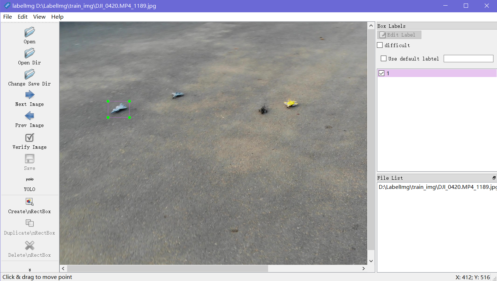

# 在嵌入式平台部署神经网络

很多AI算法部署在服务器端，依托密集计算资源，通过云服务的形式提供给用户使用，但是一些高实时性的应用也需要使用到AI算法。尤其在与机器视觉相关的工控、科研领域，一个设备的体积或成本受限，因此它搭载的算力也有限——最极端的情况下能动用的硬件资源只有一个CPU主频200MHz、内存2M、Flash空间仅有数百KB，还不一定带有FPU/DSP的MCU。于是嵌入式计算平台分化出两个流派：

## 提高性能

> 在体积有限的情况下，同一张电路板上塞下更多、性能更高的控制芯片，这就意味着更多的计算资源
>
> ~~力大砖飞~~

通过将芯片做得更小、将更多芯片集成在同等体积的电路板上，可以直接提升嵌入式设备的性能。通过在嵌入式设备中部署带有硬件加速器的SoC、高性能CPU、具有通用计算能力的FPGA乃至专门设计的ASIC，可以让嵌入式设备更好的运行某个算法，实现预期功能。同时也可以选择使用多张电路板利用设备的三维空间，集成更多主控芯片——虽然略显笨拙，但是相比换用主控，这个解决方案成本更低且相对容易开发。最直接的一个例子就是近些年来各大厂商接连推出具有硬件加速外设的MCU芯片，并针对人脸识别、嵌入式图像处理、语音识别等领域推出专用算法优化方案，这既是面对摩尔定律逐渐失效趋势下的无奈之举，也是抢占嵌入式AI市场这片蓝海的决策

## 分层分工

> 一个芯片不够实时，那就再加一个
>
> ~~分工明确~~

使用多个芯片组成系统来弥补单芯片算力有限的问题，这种思路常常用于处理高实时性应用。一个例子就是使用ROS控制的机器人——往往会搭载至少两个主控芯片，其中一个芯片（一般是主频达到500MHz以上的SoC）可以运行嵌入式Linux系统甚至使用一套单板计算机方案运行真正的ubuntu，并在其上搭载ROS实现高性能需求的算法；Linux通过板级总线与一个高实时性的MCU（一般是主频相对较低但拥有更多外设的SoC）通信，用于收取传感器数据、分发控制数据、实现闭环控制等目的。

本系列博文会在笔者学习嵌入式AI计算的基础上探讨在嵌入式设备上部署AI应用并实现实时计算的方法

目前笔者接触过的嵌入式AI平台有如下几个，简单介绍一下他们的特性：

* Nvidia Jetson系列

    > 老黄出品的嵌入式AI计算卡，其实是一个带了**GPU**和**Cuda**的单板计算机，只不过性能有**亿**点高

    因为Cuda优秀的生态支持（基于python的pyTorch、Cupy、TensorRT一条龙服务），在边缘计算领域优势很大，几乎占了嵌入式深度学习市场的全部份额

    算力和硬件资源如下：

    * nano：不到500G FLOPs，双核A57，4G内存，128核Maxwell架构GPU
    * TX2：约1.3T FLOPs，四核A57，8G内存，256核Pascal架构GPU
    * NX：约21T FLOPs，六核老黄自研ARM，8G内存，384核Volta架构GPU，cv和深度学习硬件加速
    * AGX：约32T FLOPs，八核老黄自研ARM，32G内存，512核Volta架构GPU，cv和深度学习硬件加速

* 华为Atlas 200计算模块

    内置昇腾310 AI处理器，可以在端侧实现图像识别、图像分类等，性价比非常高；不过生态支持方面不是很完善

* ESP32系列

    > 来自国产之光乐鑫的WiFi/BLE SoC，因为**性价比很高**所以也可以用来硬跑CV算法，本身其实没有什么硬件加速

    相比其他面向嵌入式AI的MCU最强特点就是生态好：刚发布就接入了Arduino社区，随后还支持了MicroPython，把很多Arduino用户都变成了ESP-IDF（ESP32的官方SDK）用户，开源多年导致开源社区规模很大，乐鑫最早可能只是想搞一个高性价比的智能家居SoC，万万没想到性价比太高导致有人拿它做超低成本人脸识别（我脑补的）。随后推出了ESP-WHO人脸识别库和一个ESP-DL深度学习库，随着ESP32-S3出现又弄出来一套ESP-NN神经网络库

    除了SDK相比stm32不太好用以外没有什么缺点

    主要型号如下：

    * ESP32：集成WiFi/BLE基带的SoC，最低40MHz、最高240MHz主频的Xtensa架构（使用Tensilica授权高度定制的CPU架构）CPU。SoC不带FLASH，需要外加SPI FLASH；自带最少4MB最多16MB的SRAM，可以满足很多嵌入式AI算法的需求

        > ESP32的性价比高到离谱，导致现在每出一个新MCU都要和ESP32对比一下性价比。

    * ESP32-S2：移除了蓝牙功能，增加了USB-OTG，可以用来实现USB摄像头wifi图传

    * ESP32-S3：在ESP32基础上增加了用于加速神经网络计算和信号处理等工作的向量指令。通过ESP-DSP和ESP-NN库使用这些向量指令，可以实现高性能的图像识别、语音唤醒和识别等应用

* K210

    > 又一个国产之光嘉楠的产品，全称堪智K210。他家原来是卖矿机的，后来有钱了开始造芯片。
    >
    > 搞创新总比挖矿好！

    算力1T FLOPs（快赶上TX2了），双核RISC-V 64位CPU，没有MMU（很神奇，没有MMU就不能跑Linux，所以它不算高性能SoC？），**带有硬件加速KPU**，可以跑人脸识别、yolo目标检测，能给tensorflow、pytorch等写的算法做硬件加速

    挺好的芯片，但是官方支持太拉跨，全靠开源社区撑，和ESP8266（ESP32的前身）刚出时候一样

    有个公司给这个芯片配了MicroPython环境和IDE，能用和opencv、pytorch类似的语法在上面写CV应用，还能快速部署桌面端pytorch、tensorflow等开发的神经网络算法。

    从去年就听说要出一个重量级能跑linux的K510，到现在也没货在卖，不知道能不能行

* STM32

    > 我知道这是MCU，但是也没人说MCU不能跑CV/NN啊

    大名鼎鼎的MCU系列，搞嵌入式的人入门必学。因为新产品STM32H7系列出来以后，成本相对低、性能猛、外设多、带DSP、FPU、大内存，直接就能硬跑简单的神经网络了，经典算法更是流畅得一批

    目前已经有成熟的OpenMV可用，依旧是MicroPython，但是搭配ARM官方的CMSIS-NN库用来跑NN

    主要可用的型号就是STM32H7xx，尤其是H743，面向多媒体领域，跑图像相关应用还是很快的

    不过因为**没有硬件加速资源，跑网络速度非常慢**（1~3帧）；相对的，官方支持到位，ST还提供X-Cube-AI扩展包，能直接把写好的模型转化到STM32裸机上运行；也可以搭配RT-Thread之类的RTOS实现模型移植

* FPGA

    > 不会真有人不用python改verilog吧！？

    所有的FPGA都能用来跑CV应用或神经网络——只要有能力用verilog写算法就行

    做出了速度能快到极致——这可是真正针对算法的专用硬件加速，堪比ASIC

    不过目前也只有Xilinx和Altera两家有完善的生态支持——能用HLS写或者通过调IP实现简单的加速，起码C++比verilog写算法亲民多了。如果上FPGA，用户需要考虑就是有没有能力开发出来

    一个比较火的产品就是Zynq（Altera家也有对标的cyclone-v，甚至国内的高云、复旦微也有类似的嵌入CPU硬核的产品），在ARM核上跑linux，在FPGA上做硬件加速，一个芯片能解决原来一块开发板的问题

## 部署流程

这里以k210上部署基于YOLOv3的神经网络模型为例介绍流程

本例中使用了基于YOLOv3的目标检测模型来进行部署

笔者使用了来自sipeed的框架

### 采集训练集

首先需要要采集要检测目标的图像，然后使用LabelImg工具标注数据集

`Open Dir`设置保存有标注图像的目录；`Change Save Dir`设置保存标注数据的目录

在标注前注意左下角的数据格式，对于YOLO要使用YOLO格式

**使用快捷键w标注，ctrl+d可以复制当前方框，快捷键d是下一张图，a是上一张图，按空格将当前图片设置为已标记过**

**Ctrl+鼠标滚轮可以缩放大小**

一般来说至少要标记100张以上的图片，训练出的模型才能比较有效

> 实测500张都搂不住，yolov3/4/5(n)至少要千张图片才能实现比较理想的识别效果

### 训练模型

将标注好的数据按照YOLO格式制作成数据集，根据要求放在指定位置

根据[教程]()里的步骤即可开始训练

需要注意**在此之前跑一下官方的例程，测试自己的环境是否配好**

一般来说需要耗费30min到1h，最后得到一个.pt文件

### 模型格式转换

### 部署

