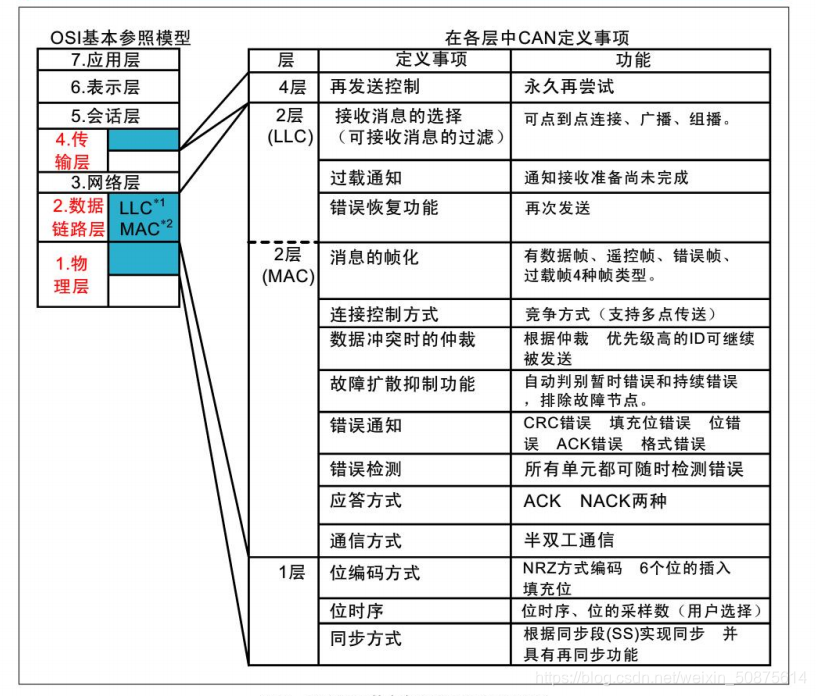
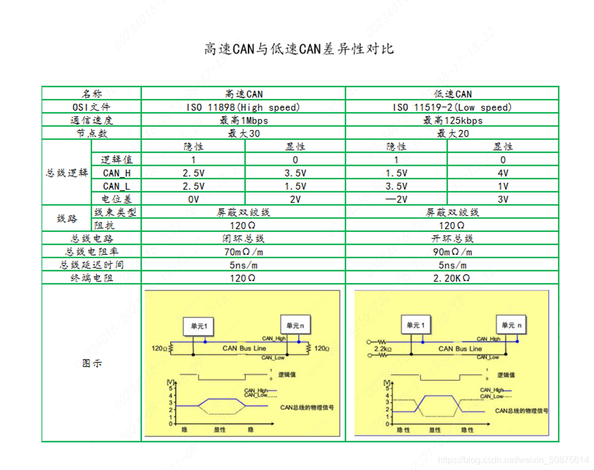
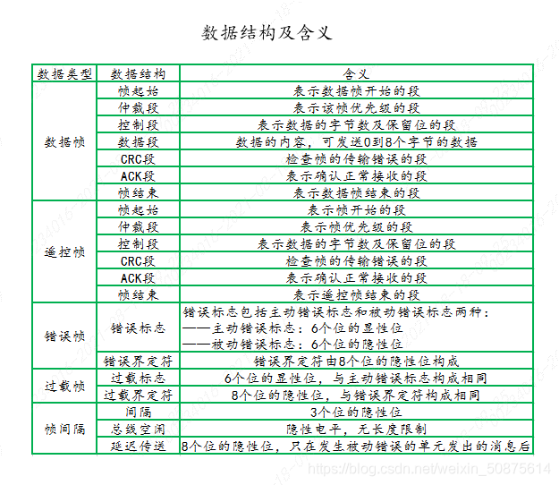
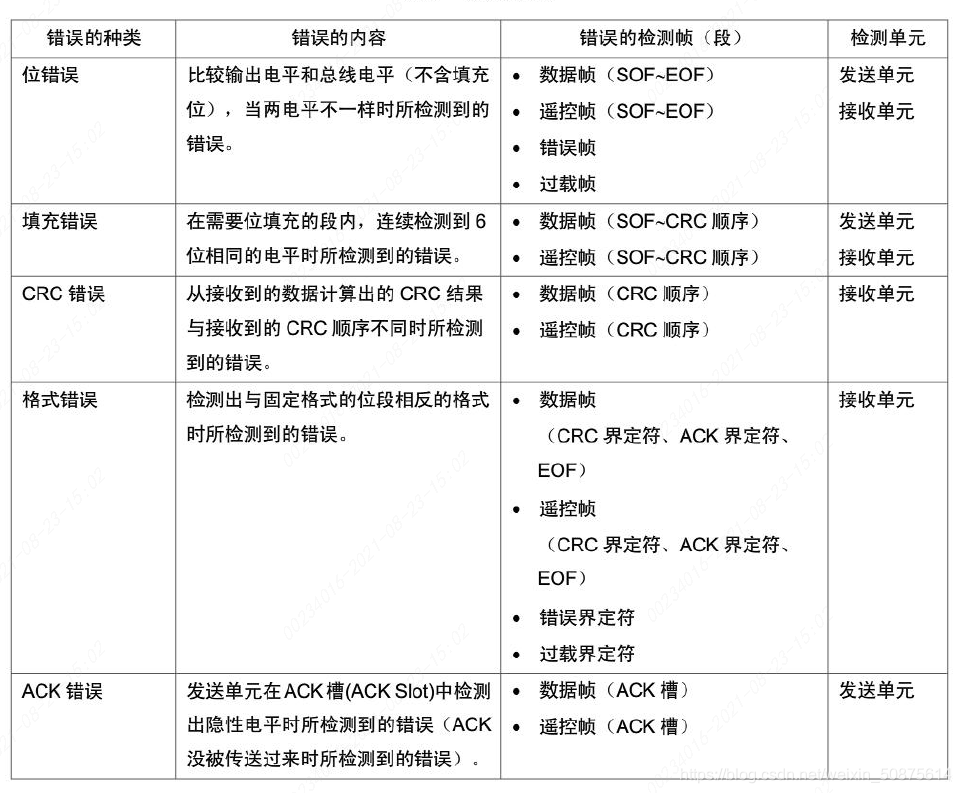
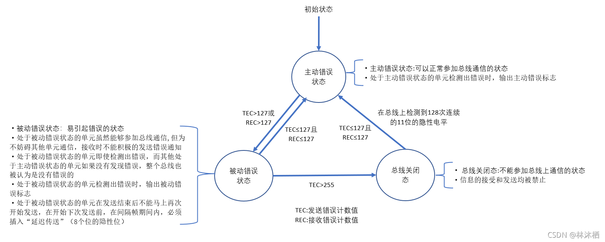
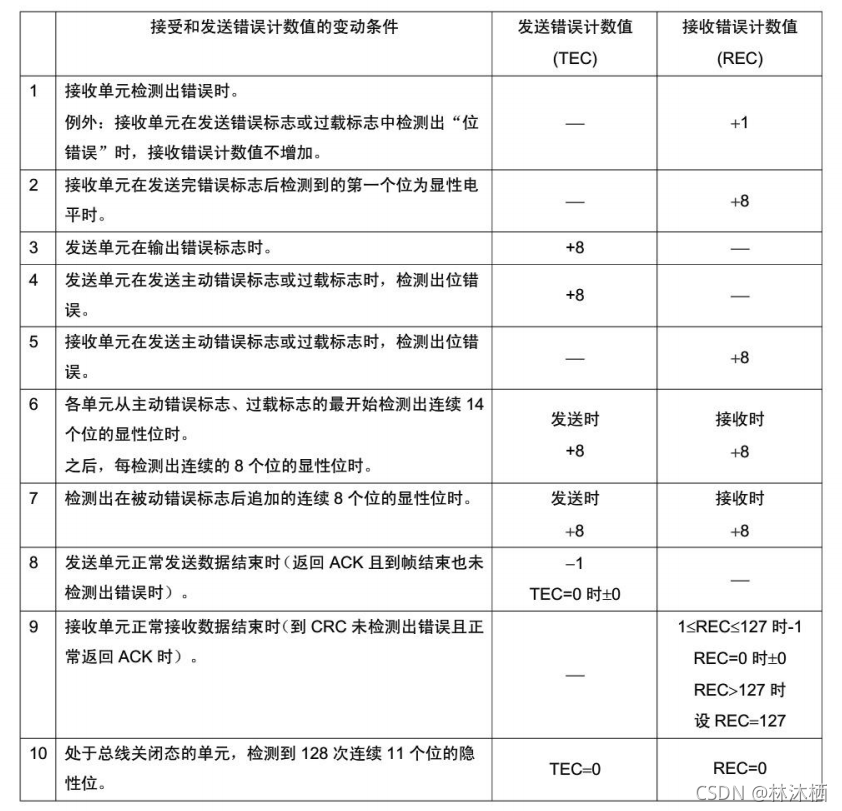
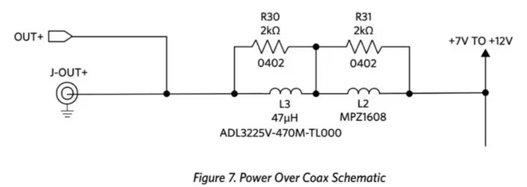

# 水下机器人技术3.5【水下通信】

## 无线电水下通信

##  基于电介质的水下通信

### RS485

### J1939/CAN

**J1939**协议栈首次发布于1994年，专门设计用于车载总线通信场景。在2000年首次发布顶级文件后，**CAN**总线协议正式成为J1939标准的一部分。水下机器人通信和汽车通信相似度很高，因此可以基于J1939协议栈实现内部总线互联

在2001年后，J1708和J1587协议栈也被J1939协议栈取代，直到现在，J1939协议栈一直是电动汽车内部模组通信、充电桩内部通信的首选

与CAN总线标准不同，J1939规定了从物理层到应用层的ISO七层模型全部层级，由一系列子标准组成：

* J1939：串行控制和车辆通信网络的建议实现
* J1939/11：物理层（CAN总线规范-屏蔽双绞线、40m距离、250kbit/s、最多30个ECU、ISO11898）
* J1939/13：板外诊断连接器
* J1939/21：数据链路层
* J1939/31：网络层
* J1939/71：车辆应用层
* J1939/73：应用层诊断
* J1939/81：网络管理

> 最讨厌的一集：所有J1939文档都需要付费购买才能下载；国标文档免费但不全面

目前开源项目[Open-SAE-J1939](https://github.com/DanielMartensson/Open-SAE-J1939/tree/main)实现了全套的J1939协议栈，并且是免费的（MIT协议）

当然，除了J1939外，CAN总线是可以单独在水下机器人中使用的。CAN总线规范覆盖了ISO七层协议中的物理层和数据链路层，同时还说明了一部分传输层的功能

一个CAN链路由四个主要部件构成

* **CPU/MCU**：负责产生和接收数据
* **CAN控制器**：把CPU传入的数据格式化成标准的数据格式，承担数据传输过程中的总线仲裁、错误校验、过载通知等数据链路层功能
* **CAN收发器**：将CAN控制器传入的信息编码为CAN规定的差分电平信号，是CAN协议的物理层
* **互联线**：CAN总线使用双绞线，通过CAN_H和CAN_L两根线传输

在发送过程中，CPU会将二进制数据直接送入CAN控制器内的TX-FIFO，之后CAN控制器会从FIFO中读出数据并对其进行打包处理，生成CAN规定的数据链路层格式，并将标准数据包发送给CAN收发器，加载到总线上；接收时则会逆向进行，首先由CAN收发器读入CAN总线上的电平信号并转换成编码传给CAN控制器，CAN控制器对接收到的数据进行解析，确定数据是否可用，如果出错则将其抛除；解析出的ID数据会通过过滤器的黑名单、白名单，如果确定是需要的数据，则将对应数据传入RX-FIFO，等待CPU从FIFO中接收数据

对于CAN的物理层，目前分为ISO 11898和ISO 11519两种协议，11898代表**低速CAN总线**，11519代表**高速CAN总线**，同样的时间内高速CAN可以进行更多次的电平转化、传输更多的数据。ISO 11898是最常见的CAN接口，也是J1939采用的物理层。

二者的基本差别如下图所示

根据功能不同，CAN协议规定了5种帧类型

* **数据帧**：用于传输数据的帧
* **遥控帧**：用于接收单元向具有相同ID的发送单元请求数据的帧
* **错误帧**：用于检测出错误时向其他单元通知错误的帧
* **过载帧**：当一个节点正在忙于处理接收的信息，可以通过发送过载帧来通知其他节点暂缓发送新报文
* **帧间隔**：用于将数据帧、遥控帧和前面的帧分离开的帧

每种帧的结构如下图所示

数据帧

遥控帧

错误帧

错误帧比较特殊，只要触发下面5种错误之一（多种错误也可能同时发生），就会发送错误帧

有几种情况不比较特殊，包括

* 在仲裁段输出隐性电平，但检测出总线为显性电平时，将被视为仲裁失利
* 在仲裁段作为填充位输出隐性电平时，但检测出总线为显性电平时，将被视为填充错误
* 发送单元在ACK段输出隐性电平，但检测到总线为显性电平时，将被视为其他单元的ACK应答
* 输出被动错误标志（6个隐性位）但检测出显性电平时，将遵循错误标志的结束条件，等待检测出6个相同位的值（显性或隐性），并不视为位错误
* 即使接收单元检测出EOF（7个位的隐性位）的最后一位（第8个位）为显性电平，也不视为格式错误
* 即使接收单元检测出数据长度码（DLC）中9-15的值，也不视为格式错误

在识别出错误后，如果错误种类是CRC错误，那么会在ACK界定符后的下一位开始输出错误标志；否则就从检测出错误的下一位开始输出错误标志

在输出错误帧时，我们将错误标志分为主动错误标志和被动错误标志，它们发送的电平是不一样的，我们应当如何区分主动还是被动呢？在CAN协议中，对主动还是被动，是有明确的定义的，其原理是内置一个计数值，根据计数值的大小来划分

按照计数值的规则，总线除了主动错误和被动错误状态之外，还存在一种总线关闭态，这三者之间可以相互转化

在CAN中每种错误都对应着固定的分数，触发此错误，就会在原有的基础上加上此错误所对应的分数，从而计算出TEC和REC计数值，如下图所示

过载帧

帧间隔是用于分隔数据帧和遥控帧的帧。数据帧和遥控帧可通过插入帧间隔将本帧与前面的任何帧（数据帧、遥控帧、错误帧、过载帧）分开。过载帧和错误帧前不能插入帧间隔。

### 工业以太网/EtherCAT

以太网传输带宽大、效率高，是当今数据的常见传输方式。但由于其七层结构，在发明之初的很长时间内都无法应用在高实时性要求的工控领域。但随着类似CAN总线这类现场总线技术的兴起，工程师也在探索在以太网基础上构建高实时性的现场总线。这样的技术在近年得到广泛应用，这就是**工业以太网**。

工业以太网的**物理层和数据链路层是基于IEEE802.3标准**，也就是电介质网线-网络变压器-PHY电路或者光纤连接；在**网络层和传输层则采用TCP/IP协议**。这和普通以太网没有任何区别，但在高层协议上就出现了不同：工业以太网只定义**应用层**，省略了会话层和表示层，从而简化复杂的网络包处理；有的工业以太网协议还定义了**用户层**，这和实际需求有关

工业以太网具有下列特点：

* 高实时性：避免路由器、使用交换机、全双工通信、VLAN等手段保障实时性
* 高可靠性：专门针对线缆、接口及屏蔽等方面作出设计，符合工业环境的需求；容错能力更强
* 高可用：通常通过冗余技术以提高网络的可用性，包括端口冗余、链路冗余、设备冗余、环网冗余

这些特点还不足以应对实时性要求非常高的场合，只能保障恶劣环境下以太网传输质量。因此在实时控制领域，基于工业以太网演化出了**实时以太网**。实时以太网有三类实现：

* 基于TCP/IP协议：通过修改调度策略、数据帧优先级、交换机等手段来保障传输实时性，和简单的工业以太网差别不大
* 基于标准以太网：修改网络层和传输层，对于过程数据采用专门的协议进行传输
* 修改以太网标准：保留以太网的物理层实现，采用专门的数据链路层硬件来处理数据，保障实时性，同时通过不同的帧类型来提高确定性

最后一种方案的实时以太网实现是比较常见的，这就是**EtherCAT**

EtherCAT由德国倍福公司在2003年开发，是一种基于主从模式的网络协议栈，一个**主站**可以连接多个**从站**。它和普通以太网的最大区别在于*物理层*、*数据链路层*和*网络层*。此外EtherCAT还支持多种工业以太网的应用层协议（COE协议，SOE协议等） 

普通以太网的MAC芯片与CPU（在SoC内部）基于片上总线通信，从CPU处拿到IP数据报后，为报文添加目标MAC地址、源MAC地址、协议类型和FCS等，随后通过RMII/RGMII将数据传输到物理层芯片PHY，也就是网卡。网卡会将并行数据编码转换成串行数据后通过RJ45接口或者SFP光口发送出去。

普通以太网和EtherCAT主站都采用这样的结构；但EtherCAT从站就不一样了。**它采用专门的ASIC来执行网络层、数据链路层、物理层的功能**，这个ASIC被称为**ESC**。传统以太网的IP协议在ESC中以硬件方式实现，通过硬件加速有效地降低了传输延时。EtherCAT的传输过程和*地铁*有些类似，一条报文会包含很多不同从站的数据，经过某个从站时执行数据交换，从站相当于担任了交换机的作用。数据的传输采用**移位同步**的方法进行，某个从站得到对应地址数据的同时，数据帧传送到下一个设备，延迟时间为纳秒级，这让EtherCAT的实时性相对高

一个EtherCAT帧可以包含多条EtherCAT报文，每条报文都服务于一块最大4GB的特定内存区域，数据顺序不依赖于网络中以太网端子的物理顺序，可以任意编址，因此能够实现从站之间的广播。EtherCAT还支持将报文封装为UDP/IP数据报，甚至通信还可以通过路由器跨接到其他子网中

介绍完背景知识，我们可以看一下EtherCAT在水下机器人中是怎样应用的：EtherCAT主设备完全可以使用普通的PC或者带千兆/百兆以太网的移动端平台，正好对应了ROV的上位机控制台；而从设备一般使用MCU（或其他SoC）搭配ESC芯片来实现。由于EtherCAT数据链路层的功能全部交给了ESC芯片，可以通过配置ESC来减轻网络控制压力，这样性能羸弱的MCU就能正常“上网”了。甚至，如果给ESC芯片外挂一个EEPROM或者Flash，把芯片初始化寄存器配置保存进去，就无需MCU配置ESC。这样的特点正好符合ROV下位机的需求

> 在水下机器人中，工业以太网常常作为CAN总线的延申出现

对于开发者来说，可以简单地把EtherCAT分为两层：**数据链路层**和**应用层**。所有通信都由主站发起并控制——报文由主站发出，然后像地铁一样依次通过各个从站，每个从站都被认为是串联起来的，会按照目前串联的位置顺序对数据进行发送；每到一站，数据就被从站控制取下；当数据帧到达最后一站后就会按原路返回

> 这在网线上看就像是TX线上承载了出发的数据帧，RX线上承载了返回的数据帧。每个从设备都有两个以太网口，一个口对接上一个设备，一个口对接下一个设备，对应连接的两条网线在本地被连成了一条网线

EtherCAT帧格式如下图所示

以太网帧头被保留，其中帧类型改成了EtherCAT专有的`0x88A4`，后面的内容则与一般的以太网帧大相径庭。对于开发者来说，不需要费力处理除了第三行数据段（EtherCAT数据-子报文-数据）以外的内容，只有数据段是属于应用层的，其他部分都交给ESC芯片自动处理

除了专门的数据帧格式，EtherCAT也支持嵌入了UDP/IP格式的数据帧格式，在这种情况下EtherCAT数据段会让出28个字节给UDP/IP段使用，如下图所示

### RovLink

### 电力线载波PLC及其变体

### GMSL和FPD-Link III

**GMSL**（Gigabit Multimedia Serial Links，千兆多媒体串行链路）是Maxim公司推出的一种高速串行接口，适用于音视频和控制信号的传输

通信介质支持*同轴电缆*及*屏蔽双绞线*，使用50Ω同轴电缆或者100Ω屏蔽双绞线（STP）时，传输距离可达15m。低成本双绞线的高频衰减很严重，造成接收信号出现明显的*码间干扰*。GMSL使用**发送预加重**和**接收均衡**来提升链路的信号完整性，抵抗线缆带来的信号衰减，并使用**Jitter Filter PLL**清除输入时钟上的抖动，提高链路可靠性

GMSL是一种基于SerDes的高速串行总线技术，多用于汽车自动驾驶所需的高速高带宽低延迟视频传输。摄像头除了对外发送图像像素数据外，还会发送像素时钟、行同步、场同步时钟，此外还需要收发控制信号、接收供电，因此需要使用并行总线传输数据，传统的并行信号总线即DVP。并行总线在高速数据传输过程中是不占据优势的，而HDMI、MIPI这些总线则基于SerDes技术将并行的图像数据和时钟信号串行化后通过更高频率进行传输。

GMSL支持Power Over Coax（**POC**，同轴供电）功能——信号频谱被分为三个频段：**供电**、**反向信道数据**、**前向信道数据**，如下图所示

通过滤波将确切的频段分配至对应的电路输入。供电频率最接近直流，采用串联电感构建滤波器的低通特性，并将反向信道和前向信道带宽内阻抗提升至1kΩ。由于数据通道采用50Ω端接，20倍的阻抗提升足以耦合直流电压且滤除高频成分。双向数据通道为AC耦合，通过收发机输入端串联电容实现

GMSL 2采用了比一般8Gb10b编码效率更高的**9b10b**编码，芯片支持MIPI D-PHY v1.2，最高速率可到2Gbps，前向链路速率高达6Gbps，反向链路速率可达187.5Mbps；在GMSL 3中，数据速率最高可达12Gbps

值得注意的是，**反向链路通常被配置为兼容I2C协议或UART协议**，从而让主设备能够配置图像传感器

大部分GMSL芯片支持自适应均衡（AEQ）、回声消除、扩频功能，可以在双向通信时提高信号完整性

**FPD-Link III**是TI公司推出的FPD-Link（Flat Panel Display Link）传输技术的第三代。其前身是最早由NI于1996年推出的高速数字视频接口FPD，目前专利归属于TI。FPD最开始用于笔记本电脑、平板电脑、显示器中GPU输出到显示面板的连接，属于第一个大规模应用LVDS的总线标准。在Maxim推出GMSL同时，TI也对FPD进行了改进以适应车载市场的需求，于是就有了FPD-Link III

FPD的前两代都采用LVDS，属于高速差分并行总线；**FPD-Link III则停止使用LVDS，仅使用CML处理串行化的高速信号**，实现了同一对差分线上的双向信号传输

> **CML**（Current Mode Logic，电流模式逻辑）电路主要靠电流驱动，也是所有高速数据接口形式中最简单的一种，它的输入与输出的匹配集成在芯片内部，基本不需要外部端接
>
> 
>
> 输出信号的高低电平切换是通过共发射极差分对的开关控制的，差分对的发射极到地的恒流源典型值为16mA
>
> 
>
> CML输出晶体管工作在放大区，因此CML比采用饱和状态操作的CMOS、LVDS信号拥有更快的开关速度，加上CML输出电路中的恒流源具有较小的开关噪声，信号的上升时间和下降时间小，因此CML理论极限速度可达10Gbit/s。CML实际上也可以很好地迁移到CMOS工艺，因此可以很方便地集成到现有芯片，具有高速、相对低功耗、电路简单的特点

下图是GMSL2和FPD性能对比，可供参考

总的来说还是GMSL 2性能更强，其在车机上也更常见

GMSL/FPD芯片往往成对使用：一个串行器对应一个解串器。串行器将不同的并口数据协议（MIPI、LVDS等）转换成串行，在解串端数据可以被转换成其他类型的并行协议

在车载领域，GMSL和FPD的图像传输链路类似，都是由下列这些步骤组成的

* 图像传感器输出RAW/DVP/MIPI-CSI，串行器IC会接收信号并对数据进行串行化，将数据整理成包的形式
* 串行器IC通过同轴电缆将数据包发送出去
* 解串器IC接收到同轴电缆上传来的数据包，对数据进行并行化发给FPGA或带ISP的SoC
* SoC内部对数据进行算法处理得到RGB或YUV格式的图像数据
* SoC直接连接车载终端或其他显示设备，将图像数据显示出来；抑或是将处理好的数据发送给车机AI芯片，通过AI算法实现自动驾驶相关功能

而在ROV中，我们主要处于两个困难决定采用GMSL/FPD：

* 并行总线线束量过多，而穿舱螺栓或水密接插件不具备足够数目的插针（高密度接插件成本过高且可维护性低）
* 其他类型总线容易受到干扰，传输距离过近（以并行总线和USB为代表）

ROV中穿舱件接入同轴线或双绞线远比MIPI/DVP至少十余根连接线要方便；GMSL/FPD的抗干扰特性使得其在长距离传输中比USB（尤其是USB3.0）总线可靠性高得多；在设计AUV时，往往需要考虑基于视觉的导航系统，GMSL/FPD的高速高带宽低延迟特性让它成为了舱外主摄像头接入主控舱的不二之选

但很显然，这两种总线并不适合作为上位机-下位机通信的选择

## 声学通信

## 光通信

