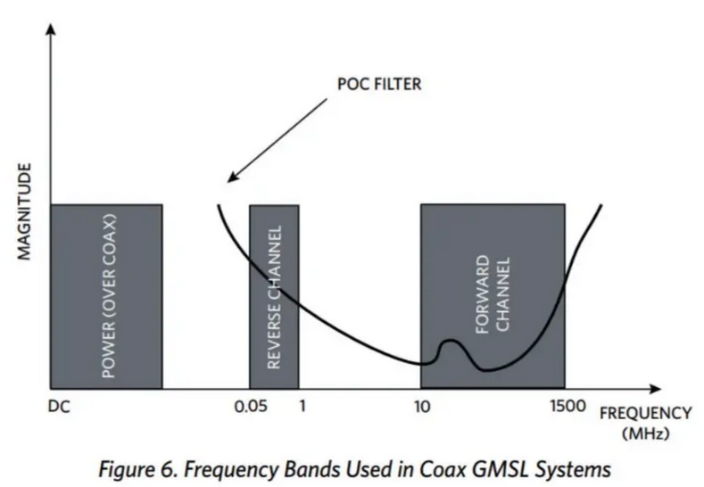
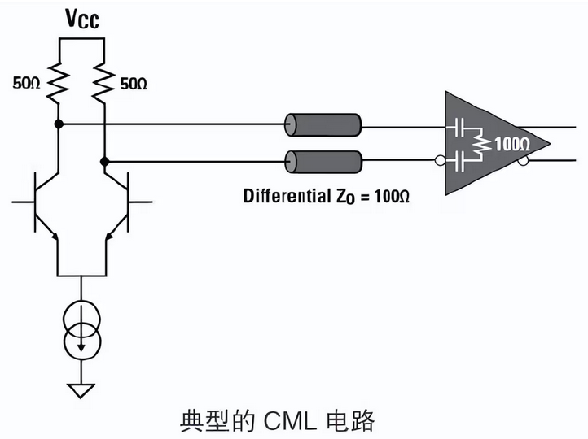
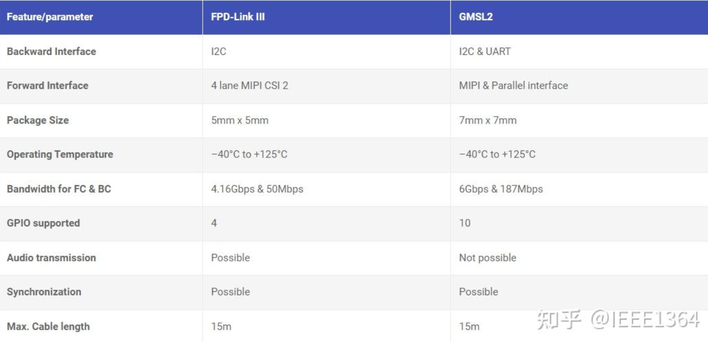

# 水下机器人技术3.5【水下通信】

## 无线电水下通信

##  基于电介质的水下通信

### RS485

### J1939/CAN

**J1939**协议栈首次发布于1994年，专门设计用于车载总线通信场景。在2000年首次发布顶级文件后，**CAN**总线协议正式成为J1939标准的一部分。水下机器人通信和汽车通信相似度很高，因此可以基于J1939协议栈实现内部总线互联

在2001年后，J1708和J1587协议栈也被J1939协议栈取代，直到现在，J1939协议栈一直是电动汽车内部模组通信、充电桩内部通信的首选

与CAN总线标准不同，J1939规定了从物理层到应用层的ISO七层模型全部层级，由一系列子标准组成：

* J1939：串行控制和车辆通信网络的建议实现
* J1939/11：物理层（CAN总线规范-屏蔽双绞线、40m距离、250kbit/s、最多30个ECU、ISO11898）
* J1939/13：板外诊断连接器
* J1939/21：数据链路层
* J1939/31：网络层
* J1939/71：车辆应用层
* J1939/73：应用层诊断
* J1939/81：网络管理

> 最讨厌的一集：所有J1939文档都需要付费购买才能下载；国标文档免费但不全面

目前开源项目[Open-SAE-J1939](https://github.com/DanielMartensson/Open-SAE-J1939/tree/main)实现了全套的J1939协议栈，并且是免费的（MIT协议）

### 以太网

### 电力线载波PLC及其变体

### GMSL和FPD-Link III

**GMSL**（Gigabit Multimedia Serial Links，千兆多媒体串行链路）是Maxim公司推出的一种高速串行接口，适用于音视频和控制信号的传输

通信介质支持*同轴电缆*及*屏蔽双绞线*，使用50Ω同轴电缆或者100Ω屏蔽双绞线（STP）时，传输距离可达15m。低成本双绞线的高频衰减很严重，造成接收信号出现明显的*码间干扰*。GMSL使用**发送预加重**和**接收均衡**来提升链路的信号完整性，抵抗线缆带来的信号衰减，并使用**Jitter Filter PLL**清除输入时钟上的抖动，提高链路可靠性

GMSL是一种基于SerDes的高速串行总线技术，多用于汽车自动驾驶所需的高速高带宽低延迟视频传输。摄像头除了对外发送图像像素数据外，还会发送像素时钟、行同步、场同步时钟，此外还需要收发控制信号、接收供电，因此需要使用并行总线传输数据，传统的并行信号总线即DVP。并行总线在高速数据传输过程中是不占据优势的，而HDMI、MIPI这些总线则基于SerDes技术将并行的图像数据和时钟信号串行化后通过更高频率进行传输。

GMSL支持Power Over Coax（**POC**，同轴供电）功能——信号频谱被分为三个频段：**供电**、**反向信道数据**、**前向信道数据**，如下图所示

通过滤波将确切的频段分配至对应的电路输入。供电频率最接近直流，采用串联电感构建滤波器的低通特性，并将反向信道和前向信道带宽内阻抗提升至1kΩ。由于数据通道采用50Ω端接，20倍的阻抗提升足以耦合直流电压且滤除高频成分。双向数据通道为AC耦合，通过收发机输入端串联电容实现

GMSL 2采用了比一般8Gb10b编码效率更高的**9b10b**编码，芯片支持MIPI D-PHY v1.2，最高速率可到2Gbps，前向链路速率高达6Gbps，反向链路速率可达187.5Mbps；在GMSL 3中，数据速率最高可达12Gbps

值得注意的是，**反向链路通常被配置为兼容I2C协议或UART协议**，从而让主设备能够配置图像传感器

大部分GMSL芯片支持自适应均衡（AEQ）、回声消除、扩频功能，可以在双向通信时提高信号完整性

**FPD-Link III**是TI公司推出的FPD-Link（Flat Panel Display Link）传输技术的第三代。其前身是最早由NI于1996年推出的高速数字视频接口FPD，目前专利归属于TI。FPD最开始用于笔记本电脑、平板电脑、显示器中GPU输出到显示面板的连接，属于第一个大规模应用LVDS的总线标准。在Maxim推出GMSL同时，TI也对FPD进行了改进以适应车载市场的需求，于是就有了FPD-Link III

FPD的前两代都采用LVDS，属于高速差分并行总线；**FPD-Link III则停止使用LVDS，仅使用CML处理串行化的高速信号**，实现了同一对差分线上的双向信号传输

> **CML**（Current Mode Logic，电流模式逻辑）电路主要靠电流驱动，也是所有高速数据接口形式中最简单的一种，它的输入与输出的匹配集成在芯片内部，基本不需要外部端接
>
> 
>
> 输出信号的高低电平切换是通过共发射极差分对的开关控制的，差分对的发射极到地的恒流源典型值为16mA
>
> 
>
> CML输出晶体管工作在放大区，因此CML比采用饱和状态操作的CMOS、LVDS信号拥有更快的开关速度，加上CML输出电路中的恒流源具有较小的开关噪声，信号的上升时间和下降时间小，因此CML理论极限速度可达10Gbit/s。CML实际上也可以很好地迁移到CMOS工艺，因此可以很方便地集成到现有芯片，具有高速、相对低功耗、电路简单的特点

下图是GMSL2和FPD性能对比，可供参考

总的来说还是GMSL 2性能更强，其在车机上也更常见

GMSL/FPD芯片往往成对使用：一个串行器对应一个解串器。串行器将不同的并口数据协议（MIPI、LVDS等）转换成串行，在解串端数据可以被转换成其他类型的并行协议

在车载领域，GMSL和FPD的图像传输链路类似，都是由下列这些步骤组成的

* 图像传感器输出RAW/DVP/MIPI-CSI，串行器IC会接收信号并对数据进行串行化，将数据整理成包的形式
* 串行器IC通过同轴电缆将数据包发送出去
* 解串器IC接收到同轴电缆上传来的数据包，对数据进行并行化发给FPGA或带ISP的SoC
* SoC内部对数据进行算法处理得到RGB或YUV格式的图像数据
* SoC直接连接车载终端或其他显示设备，将图像数据显示出来；抑或是将处理好的数据发送给车机AI芯片，通过AI算法实现自动驾驶相关功能

而在ROV中，我们主要处于两个困难决定采用GMSL/FPD：

* 并行总线线束量过多，而穿舱螺栓或水密接插件不具备足够数目的插针（高密度接插件成本过高且可维护性低）
* 其他类型总线容易受到干扰，传输距离过近（以并行总线和USB为代表）

ROV中穿舱件接入同轴线或双绞线远比MIPI/DVP至少十余根连接线要方便；GMSL/FPD的抗干扰特性使得其在长距离传输中比USB（尤其是USB3.0）总线可靠性高得多；在设计AUV时，往往需要考虑基于视觉的导航系统，GMSL/FPD的高速高带宽低延迟特性让它成为了舱外主摄像头接入主控舱的不二之选

但很显然，这两种总线并不适合作为上位机-下位机通信的选择

## 声学通信

## 光通信

