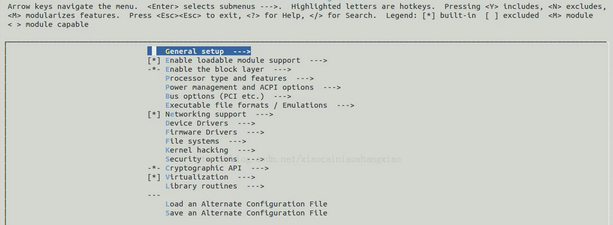

本篇内容根据《C程序设计新思维》编写，作者水平有限，难免存在疏漏和错误，有问题请指出

# C与POSIX的历史

**C、UNIX、POSIX的存在是紧密相连的**

C和UNIX都是在20世纪70年代由贝尔实验室的设计，而贝尔有一项与美国政府达成的协议：贝尔将不会把自身的研究扩张到软件领域，所以UNIX被免费发放给学者进行研究、重建；UNIX商标则被在数家公司之间专卖。在这个过程中，一些黑客们改进了UNIX，并增加了很多变体，于是在**1988年IEEE建立了POSIX标准**，提供了一个类UNIX操作系统的公共基础

### POSIX

规定了shell script如何工作、常用的命令行工具如何工作、能够提供哪些C库等等

除了微软的Windows系列操作系统，**几乎所有操作系统都建立在POSIX兼容的基础上**

特别地，加州大学伯克利分校的一些黑客们对UNIX进行了几乎翻天覆地的改进（重写UNIX的基础代码），产生了伯克利软件发行版（Berkeley Software istribution）BSD——苹果的MacOS正建立在这一发行版上

### GNU

GNU工程即GNU's Not UNIX工程，由笔者很敬佩的理查德斯托曼主持开工，大多数的Linux发行版都使用了GNU工具（这就是为什么Linux的全称是GNU/Linux），GNU工程下所有软件都是“自由软件”（想了解自由软件或“Free Software”的详情，推荐阅读理查德斯托曼传记《若为自由故》），这就意味着GPL！

GNU工程下属的GNU C Compiler就是为大家所熟知的C编译器gcc

## K&R C

由Dennis Ritchie和Ken Thompson以及其他的开发者共同发明的**最原始的C标准**

## ANSI C89

更被人所熟知的名字是简称“**ANSI C**”，这个版本是C的第一个成熟、统一的版本

在ANSI C成为主流这段时间内，分离出了C++

当下的POSIX规定了必须通过提供C99命令来提供C编译器

## ANSI C99

吸收了**单行注释、for(int i=0;i<N;i++)格式**等源自C++特性的ISO标准化版本

## C11

在2011年新定义的版本，做出了泛型函数、安全性提升等**“离经叛道”的改变**

GCC以光速支持了这个标准

# C开发环境搭建

C开发环境=包管理器+C库+C编译器+调试器+代码编辑器+C编译器辅助工具+打包工具+shell脚本控制工具+版本控制工具+C接口

看上去很复杂，实际上也很复杂=)

为什么不用IDE呢？当你用C开发某些小众嵌入式设备程序时就明白了（包括但不仅限于目前的MIPS、xtensa、RISC-V、你自己花三年用verilog写出来的CPU（可能还莫名其妙移植了一个操作系统和对应的C编译器，也许会有这样的dalao吧）），IDE？TMD！

## 包管理器与编译环境

> IDE？狗都不用！真男人都是记事本+编译器！

### 包管理器

每个系统都具有不同的软件包组织方式，所以你的软件很可能被安装在某个犄角旮旯，这就需要包管理器来帮助安装软件；虽然说很奇怪，但windows下也有包管理器

安装完包管理器后，就能用它安装gcc或clang这种编译器、GDB调试器、Valgrind内存使用错误检测器、Gprof（一个运行效率评测软件）、make工具、（如果你很nb还可以安装cmake工具）、Pkg-config（查找库的工具）、Doxygen（用于生成程序文档的工具）、你喜欢的文本编辑器（包括但不仅限于Emacs、Vim、VSCode、Sublime、记事本），除此之外，还能安装一些跨平台的IDE（虽然不太推荐，但eclipse就是最大众的选择，XCode需要有钱人才能买得起（指苹果电脑），Code::blocks在win下工作有点拉跨），还有必要的git工具、autoconf、automake、libtool，以及最重要的增加程序猿B格的Z shell、oh-my-zsh

包管理器还能管理C库，用一些新C库（libcURL、libGLib、libGSL、libSQLite3、libXML2），你可以实现很炫酷的现代C语言开发以及防止重新造轮子

对于一个包管理器，常会提供供用户使用的包和供开发者使用的包，在安装时应该选择带有-dev或-devel的包

### 包管理器的安装

在Linux下，包管理器分为两大阵营：

* Debian系的apt
* Red hat系的yum

目前而言，两边其实都很好用、易上手，不过根据程序猿的性格不同，选择yum的程序猿多少沾点（我使用apt，就是要引战！），另外还有一个叫的Arch的发行版，因为我一直没有能把它安装上，所以不知道那个`pacman -S`是什么东西

在Windows下，微软很nt（逆天，指微软很厉害）地提供了方便的软件安装方式：让你的C盘变红。不过Windows还是勉为其难地提供了一个POSIX兼容的东西——Cygwin是许多自由软件的集合，最初由Cygnus Solutions开发，用于各种版本的Microsoft  Windows上，运行UNIX类系统。Cygwin的主要目的是通过重新编译，将POSIX系统（例如Linux、BSD，以及其他Unix系统）上的软件移植到Windows上，可以在Cygwin网站上下载包管理工具，配合一个终端（Terminal）即可实现在Win下进行Linux开发（虽然很蛋疼）。安装方法参考百度（笑）

微软最近还开发了一个叫WSL（Windows Subsystem of Linux，最新版本是跑在windows自带虚拟机Hyper-V上的WSL2）的东西，这个东西可以让你在windows下进行不完全的linux使用（用的发行版是ubuntu），笔者目前使用的就是这个软件，安装很方便——开启Hyper-V和虚拟化、打开Microsoft应用商店搜索WSL点击下载安装即可，不过所有东西就被塞进了C盘。

### 搭建C编译器并执行编译

在POSIX环境下，一切都很方便，apt install能解决一切问题，想安装什么就`sudo apt install xxx`

非POSIX环境下，可以使用MinGW来实现标准C编译器和一些基础工具，或者使用很好用的WSL

可以使用命令行下的编译器执行编译：

1. 设置一个变量，代表编译器使用的编译选项
2. 设置变量代表要链接的库，一般要分开指出编译时和运行时链接的库
3. 设置一个使用这些变量来协调编译的系统

完整的gcc编译器命令如下：

```shell
gcc test.c -o test -lm -g -Wall -O3 -std=gnu11
```

该命令告诉编译器通过程序中的#include包含库函数，并告诉链接器通过命令行中的-lm链接库文件

-o用于指定输出文件的名字，否则会得到一个默认的a.out作为可执行文件名

-g表示加入调试负好，如果没有这个选项，调试器就不会显示变量或者函数的名字

-std=gnu11是gcc的特有选项，允许使用c11和POSIX标准的代码；同理可以使用-std=gnu99来使用c99标准

-O3表示优化等级为3级，尝试已知的所有方法去建立更快的代码

-Wall用于添加编译器警告

#### Windows下的编译

微软顽强地抗拒C语言，所以一般在Windows下编译c程序都使用MinGW或cygwin环境，在这些环境中编译后可以得到Windows本地的二进制代码（当然也可以使用宇宙第一IDE VS，在此不讨论）

但伴随的缺点就是缺少使用体验很爽的C库！

### 链接函数库

安装编译器后，链接工具会被自动安装好

GCC可以自动完成优化-编译-链接一条龙

连接函数库之前需要注意的就是路径：编译器需要知道在哪个目录去查找正确的头文件和目标文件。典型的库存放位置可能有三种：

* 由操作系统预定义某个目录来安装操作系统需要的库文件
* 本地系统管理员可能会准备一个用于安装包的目录
* 用户从操作系统给出路径中查询到库并具有使用权限

使用以下命令行来指定头文件搜索目录

```shell
gcc -I 头文件所在目录 需要链接的.c文件名 -o 生成的.o文件名 -L 某个库所在的目录
```

参数-I用于添加指定的路径到头文件的搜索路径范围内，编译器会在这个路径范围内搜索放在代码中用`#include`指定的头文件

参数-L用于添加指定的路径到库的搜索路径范围内

注意：**最原始的依赖库放在参数最后面，引用了很多库且被当前编译文件引用的子库紧跟在-L之后**

因为链接器的工作方式是：

1. 查看-L参数后的第一个目标，将其中无法解析的函数、结构体、变量记入一个列表，然后查看下一个目标
2. 在下一个目标中寻找未知元素列表中的项目并删去已经得知的项目或继续添加未知元素
3. 重复上述过程，直到搜索完最后的文件
4. 如果仍存在为解析的符号，则终止运行并报错

正是因为这种工作方式，很多时候安装依赖库的顺序和编译的顺序不当就会导致“玄学错误”

以上方式就是常规的静态库链接方式，当然现在的软件没什么用静态库的了，嵌入式软件倒是个例外（不过也有些RTOS在嵌入式设备上应用了动态链接极制）。共享库用于动态链接，使用以下Makefile参数来告诉编译器从哪里寻找共享库来进行动态链接

```shell
LDADD=-L libpath: xxxxxx -Wl,-R libpath: xxxxxx
```

-L参数告诉编译器到哪里找到库来解析符号

-Wl参数从编译器传递后面的路径到链接器，链接器会将给定的-R嵌入到所连接的库的运行时搜索路径

## Makefile简介

> Make工具就是天！——沃·兹基硕德

Make工具是一个可以自动执行编译、链接等工作的程序，它也有POSIX标准化，需要通过读入Makefile作为指令和变量，很多嵌入式开发（包括交叉编译和底层软件编译）都要和它打交道

一般来说使用gcc编译一个文件需要像下面这样：

```shell
gcc hello.c -o hello.o
```

对于几个文件的编译还算简单，但是如果是一个很大的工程，包含了数不清的文件，每个文件都互相依赖，那么写shell script就会很绝望了；使用makefile就会让编译工作轻松一点

最小的Makefile如下所示

```makefile
P=helloworld
OBJECTS=
CFLAGS = -g -Wall -O3
LDLIBS=
CC=c99

$(P):$(OBJECTS)
```

现在一般都使用GNU Make工具（GNU：没错还是我），需要将编写的Makefile命名为`Makefile`并将其与.c文件放在同一目录下，在命令行中输入

```shell
make
```

就可以进行自动化编译了

当然可以在后面添加参数`-jn`其中n表示你使用的cpu线程数——这就是多线程编译，可以提高编译速度；但是相对应的就不会生成每个.c文件对应的warning，并且会自动在第一个error处停下，并且不会告诉你error发生在哪里，所以如果是第一次编译请不要使用这个参数

### make语法

makefile的语法有两种流派：POSIX型和C shell型，现在的makefile大多使用POSIX型或其近似的语法；而CMake工具的cmakelist则选择了类似C shell的语法

make和shell一样使用\$指代变量的值，但shell要求使用`$var`，make则要求使用`$(var)`形式

```makefile
$(P):$(OBJECTS) #相当于program_name=
```

有以下几种方法让make工具识别变量：

* 调用make之前在shell中设定变量并使用export命令导出
* 将export命令写入shell启动脚本中，就可以在启动shell时自动完成变量加载
* 在一个命令前放置赋值操作，这将把变量设置为一个环境变量
* 在Makefile的头部设定变量
* 在命令行中使用make指令后接要设置的变量，这些变量会独立于shell作为make工具的变量存在

在C代码中可以使用getenv函数获取环境变量信息，这需要调用stdlib.h库

make工具也提供了一些内置的变量，如下所示：

* $@

  返回完整的目标文件名（目标文件就是从.c文件中编译得到的.o文件）

* $*

  返回不带文件名后缀的目标文件

* $<

  返回触发和制作该目标文件的文件的名称

Makefile的标准形式如下：

```makefile
target:dependencies
	script
```

输入命令`make target`时，对应的target就会被调用，检查dependencies是否是较早（target文件比dependencies更新）的文件，如果检查通过则运行所有的dependencies，结束后再运行target部分的脚本；如果检查不通过则对script的处理会被暂停

Makefile基本上就是目标target、依赖dependencies、脚本script三者所组成的一系列规则。make工具就是根据Makefile的规则决定如何编译和链接程序或者执行其它操作（包括但不仅限于自动下载远程程序、解压缩包、打补丁、设定参数、编译并将软件安装到系统中指定位置等）

### Make的本质

在编写小工程，特别是只有不多文件的情况下，在shell里使用gcc就可以了，如果工程数量继续增长，自行编写Shell Script也很简单；但是如果是依赖条件复杂的大工程，直接使用编译器就会很繁琐，这时候通常使用**构建工具**来辅助

> 构建工具 (software construction tool)  是一种软件，它可以根据一定的规则或指令，将源代码编译成可执行的二进制程序。这是构建工具最基本也是最重要的功能。实际上构建工具的功能不止于此，通常这些规则有一定的语法，并组织成文件。这些文件用来控制构建工具的行为，在完成软件构建之外，也可以做其他事情。

Linux的内核、Linux上运行的大多数Qt软件、洗衣机的主控、ESP32的底层文件......都是用Make工具完成构建的，这是历史最为悠久的开源构建工具，但是正因如此它的语法比较混乱，且不被Windows支持（除非使用上文提到的Cygwin环境）。除此之外，只要外部条件稍微变化一些，就需要修改软件的Makefile。为了让安装软件更加容易，程序员开发出了几个神奇的生成工具：Ninja、Automake、SCons、CMake。利用这些改善过的工具，编程者只需要写一些预先定义好的宏，提交给程序自动处理，就会生成一个可以供Make工具使用的Makefile文件，再配合使用工具产生的自动配置文件configure即可产生一份符合GNU-Makefile规定的Makefile；或者直接通过自己独有的软件编译方式对工程进行生成。

## Ninja简介

除了Make工具外，Ninja也是一个自动化编译的构建工具。它由Google的一名程序员开发，通过将编译任务并行化大大提高编译速度

它并不使用Makefile，而是用一套自己组织的`.ninja`脚本

现在Android Studio等都选用了Ninja作为编译工具，也有许多嵌入式设备厂商自己的SDK使用了ninja

ninja的安装方法和make一样

```shell
sudo apt install ninja
```

或者可以从github上拉取最新版本的ninja源码，然后自行编译安装

只不过make支持POSIX标准，可以直接在linux上运行；但是ninja需要事先安装一些依赖，具体情况可以参考[官网](https://ninja-build.org/)

这里不多介绍ninja的使用方法

## SCons简介

SCons是另一套由Python编写的开源构建系统，它和Make、Ninja一样可以生成脚本进行快速编译，但是SCons有一个最厉害的地方：**它使用的是python脚本，能够使用标准的Python语法编写构建工程**

详情可以参考[官网](https://www.scons.org)

SCons的脚本称为*SConscript*，支持多种编译器，包括但不仅限于gcc、clang，甚至支持很多公司专有的交叉编译工具

它的安装也比较简单：

```shell
sudo apt install python #安装依赖——这玩意是用python写的
sudo apt install scons
```

直接在程序目录使用下面的指令就可以轻松完成很多原本需要Makefile写很多才能完成的任务

```shell
scons #相当于make
scons -c #相当于make clean

# 上面的就是个开胃菜，和make没差很多；下面才是scons的神奇之处
touch SConstruct
vim SConstruct #新建一个SCons脚本
Program('testPro1', Glob('*.cpp')) #写完以后直接保存退出
scons #直接回到shell来一个执的行，testPro1就构建完毕了
```

除了直接使用`scons`命令生成外，SCons还支持一些扩展功能

RT-Thread就将它扩展为了keil MDK/IAR/VS/CubeIDE工程生成器：

```shell
scons --target=xxx #生成某个IDE的工程
```

SConscript还能执行一些方便的内置函数

```cmake
GetCurrentDir() #获取当前路径
Glob() #获取当前目录下的所有文件，支持在里面使用表达式匹配
Glob('*.c') #获取当前目录下的.c文件
Split(str) #将字符串str分割成一个列表
```

具体的SCons使用还要更复杂一些，所有使用方法都可以参考官网或者使用到SCons的SDK说明，即用即查，不需要特意学习

## Automake简介

Automake是正统的GNU软件，它用来生成Make构建系统。

这是一个套娃：gcc/clang是编译器，或者说构建工具；Make/Ninja/SCons是构建系统；Automake/CMake则是**生成构建系统的系统**

## CMake简介

CMake是比Automake更常用一些的系统，它通过读取`CMakeLists.txt`中的规则来构建编译系统

它的脚本格式大致如下：

```cmake
cmake_minimum_required(VERSION 3.9) #注明需要的cmake工具版本
project(HelloWorld) #工程名
set(CMAKE_CXX_STANDARD 11) #设置要使用编译器版本
add_executable(HelloWorld main.cpp) #指定源文件

#下面是负责程序安装的指令
install(TARGETS HelloWorld DESTINATION bin) #指定将生成的程序文件安装到/usr/local/bin
install(FILES HelloWorld.h DESTINATION include) #指定将库文件保存到/usr/local/include
```

在shell中使用

```shell
mkdir build #惯用方式，将所有生成的文件保存至build目录
cd build
cmake .. #对上一级也就是工程项目主目录执行cmake，前提是CMakeLists.txt保存在工程项目主目录
#所有生成的文件会被保存到build目录，包括Makefile
make #执行make
```

就可以完成所有编译任务

**它可以将Makefile的编写完全转化成CMakeLists的编写**，虽然看上去多此一举，但实际上增强了编译时的可靠性和程序的可移植性

## Kconfig简介

> 半个可视化也是可视化——伽利略（？）

一般来说一个工程完全可以依靠CMake-Make-GCC的工具链完成编译，但实际上很多与c语言打交道的底层程序需要适配各种不同的情况，这就需要使用**代码模块化**思想：将一套代码分成多个模块以适应不同情景

最典型的就是Linux内核了：有的设备是嵌入式的，有的设备是高性能的，有的设备带摄像头、网口，有的设备只有WiFi，有的设备自带一堆硬件加速器，有的设备使用RISC-V架构——而Linux内核需要针对这些情况进行优化，因此它使用了“宏内核”思想，内核接管一切驱动程序的管理，将底层所有设备归类交给不同的驱动程序管理。这时Linux的内核编译就需要事先确定目标设备上都有什么，预先选好要加入工程的组件再生成源代码（这也使用了C预编译器的一部分功能）

负责灵活配置编译单元——说人话就是*从一堆预先写好的代码里挑选出合适的代码*的工具就是**Kconfig**

Kconfig工具生成CMakeList的设置参数；之后调用`make menuconfig`配置`.cmake`文件用于将Kconfig生成的参数赋值给CMake变量、`.mk`配置文件用于保存make工具的编译变量、`.h`文件用于提供C语言的编译基础；再然后使用CMake工具生成Makefile；最后使用Make工具进行编译，就可以生成一个bin文件了

这里着重强调一下Kconfig的使用——因为它是Linux内核编译的最重要辅助工具之一——在编译内核时，需要用到`make menuconfig`指令，而这个指令并没有直接调用make、cmake工具，而是先借助Kconfig工具打开一个蓝色的配置菜单界面，如下所示



这个蓝色的菜单可以说是最经典的多级菜单程序，但这里我们不说多级菜单的实现，仅仅谈它使用的脚本工具**Kconfig**

使用**config**语句定义一组新的配置选项

```c
config CONFIG_A
    bool "Enable MyConfig"
    select SELECTED
    default y
    help
    My Config
```

**bool**表示配置**选项的类型**，每个config菜单项都要有类型定义，变量有5种类型：`bool`布尔，也就是二选一（y或n）、`tristate`三态，也就是三选一、`string`字符串，也就是用户从给出的一堆字符串里选择一个、`hex`十六进制，也就是用户要选择一个十六进制数、`int`整型，也就是用户需要选择一个整数，需要注意：这里的*用户选择*是不严谨的，实际上==选项类型决定了Kconfig会生成什么样的#define语句提供给C源代码==；**"Enable MyConfig"**表示该**选项的名称**；**select**表示如果当前配置选项被**选中**，则SELECTED就会被选中；**default**后面跟的参数表示配置选项的**默认值**；help后面跟的语句会作为帮助信息提供给用户

使用**menu/endmenu块**来生成一个菜单，这个菜单里面可以包含复数个config语句，也可以包含子菜单

使用**if/endif块**来实现条件判断

使用**menuconfig**语句表示带菜单的配置项，也就是可展开的菜单

使用**choice/endchoice**语句将多个类似的配置选项组合在一起，供用户选择一组配置项，也就是“弹窗”子菜单

使用**comment**语句定义帮助信息，这些东西会出现在界面第一行

使用**source**语句读取另一个文件中的Kconfig文件

## 以上软件的组织架构

### 半可视化编译配置工具

Kconfig

#### 构建工具生成器

CMake

Automake

##### 构建工具

Make

Ninja

SCons

## 调试器GDB

GDB是目前最常用的调试器（没有之一），它支持多平台、多目标的调试过程。

调试器，顾名思义就是用于调试程序的软件。它能够给出底层的变量变化和回溯的信息，同时可以追踪内存和寄存器中数值的变化，一般的调试器可以提供**断点**功能和**追踪**功能。编译时，在gcc指令后加入-g参数即可启用调试功能，不过这会导致程序变大一些

gdb可以直接在命令行模式中使用，但是一般来说各种代码编辑器和IDE会将gdb嵌入，并提供可视化的调试功能，下面是一些使用命令行模式gdb时会用到的指令

```shell
gdb <file> # 使用gdb调试文件

#--下面会进入gdb命令行--
(gdb) r # 正常执行程序直到遇到错误或断点
(gdb) l # 显示运行到的那一行代码
(gdb) l <部分代码> # 显示以某行为中心的部分代码
(gdb) b <部分代码> # 在某行代码处打断点
(gdb) p <变量/指针> # 输出某变量/指针的值
(gdb) bt # 列举出堆栈帧
(gdb) info threads # 获取程序使用线程列表
(gdb) n # 重复单步运行程序
(gdb) b <行号> # 在某一行打断点
(gdb) r # 重新开始一个循环
(gdb) c # 继续运行程序直到完成当前循环或运行到return
(gdb) disp <变量> # 将某变量的变化在调试过程中自动显示
(gdb) <Enter> # 重复上一步命令
(gdb) f <帧号> # 查看某一帧
```

任何函数都会在内存中占据一个空间，称为函数**帧**，函数帧会使用特殊的数据结构保存与这个函数有关的所有信息，gdb则可以直接查阅堆栈帧并获取信息。

现在的调试过程已经基本不需要使用gdb的命令行模式了（除非是对跑在某些极少有人使用的、没有开源社区提供gdb调试工具的莫名其妙的cpu上的程序），VSCode、Sublime、Vim、Emacs里面都内置了gdb的（半）图形化调试。只需要知道如何打断点、单步调试、查看汇编等基本操作就可以进行有效调试了