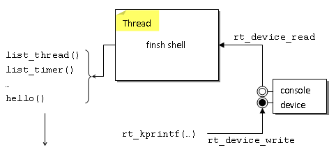
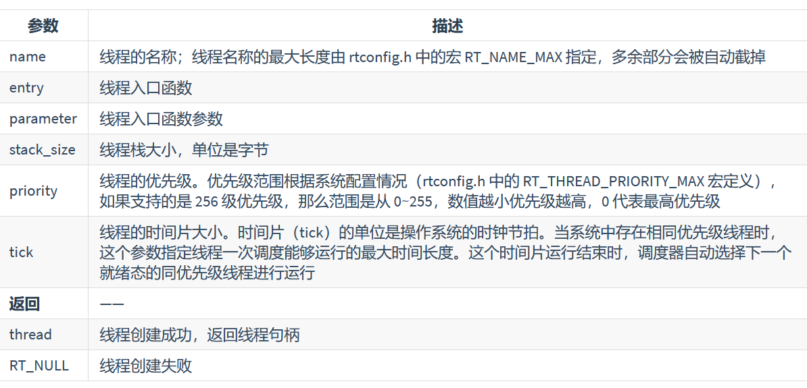

# 使用C语言进行嵌入式开发


## 交叉编译器


## 串口工具


### Minicom简介

minicom是在linux环境下常使用的串口工具，它提供了命令行中访问串口的功能


### Putty简介

Putty是一个多平台兼容的虚拟命令行软件


## 调试工具OpenOCD


### JTAG接口协议


### STM32的JLINK


### OpenOCD


## 嵌入式C语言编码推荐规则

注意：==**这里的所有编码规则都只是个人推荐！请一定要选择适合自己的统一易读的编码风格！不要被随意影响！**===

### 一般规则

1. 使用C99标准

   虽然C11支持了一些对开发者友好的新特性，但是C11的某些特性在特殊的交叉编译器上可能难以实现，为了保证代码统一性，目前还是应该使用旧一代的C99标准

   而且更重要的，可能不是所有人都熟悉C11标准，使用C99这个大部分国内院校教授的C标准有助于工作对接

2. 每个缩进使用4个空格，不要混用tab和空格

   主要为了在各个代码编辑器下实现统一规范的代码样式

3. 在关键字和左括号之间使用一个空格，在函数名和左括号之间不使用空格

   有助于区分函数和关键字（某些代码编辑器并没有函数/关键字高亮——不针对keil）

   ```c
   /* 示例 */
   if (t != 0)
   {
   	int32_t a = sum(1,4); 
   }
   ```

4. 尽量不在变量/函数/宏中使用下划线或前缀，除非有意保留统一的编码格式或用于头文件编译

   C语言和库的保留参数，懂得都懂

5. 可以适当使用前缀标注特殊的变量性质

   例如`interrupt_LED_ON`表示一个用于中断服务函数和主程序通信的全局变量

   但注意风格一定要统一！

6. 采用统一的分行大括号或同行大括号，不要混杂使用

   ```c
   for (i=0;i<N;i++)
   {
       p++;
   }
   //文件内采用统一格式
   for (i=0;i<N;i++){
       
   }
   //不要两种格式混用，否则可能会被打
   ```

7. 对于一般的变量，使用驼峰命名或下划线命名或其他适合规范的命名法，**一定不要使用汉语拼音！一定不要使用汉语拼音！一定不要使用汉语拼音！**

   例如`HelloWorld`、`test_parameter`

   杜绝`xiaozhanbihu`、`cha_bu_duo_de_le`这种诡异的东西

8. 在合适的地方采用空格拉大代码间距

   ```c
   /* 示例 */
   for (i = 0; i < N; i++)
   {
       a = 3 + 4;
       p++;
   }
   ```

   这个规范可用可不用，但注意一旦使用了这个格式化方法，一定要保持整个文件都用！否则代码会*很丑*！

9. 逗号之后使用单空格拉大间距

   ```c
   test(1, 5);
   ches(p, q, *r);
   ```

   在调用库函数的时候适合使用这个规则，有助于增加代码可读性和美观程度

10. 不要初始化静态和全局变量为`0`或`NULL`

    编译器会自动完成静态变量、全局变量的初始化工作，不显式写出是为了保证静态变量可以被很明显地看出来

11. 静态变量、全局变量、宏要大写

    非常重要的一条规则

    这些变量通常都是用于线程/函数/任务之间通信或用于指示系统资源或到处都要用的重要变量，一定要明显标明

    有些代码编辑器还会针对大写变量进行高亮

12. 声明要按照以下顺序

    * 结构体
    * 枚举
    * 整数和无符号数
    * 浮点数
    * 函数

13. 尽量在块/函数的开头声明局部变量

    有助于读者快速判断自己需要寻找的变量

14. 尽量在for循环内部声明计数变量

    ```c
    /* 示例 */
    for (int i=0;i<N;i++)
    {
        p--;
    }
    ```

15. 尽量使用`<stdint.h>`中定义的整数类型

    这是为了保证嵌入式设备中的变量位数确定，这个规范非常重要，通常可以避免一些恶性bug

    char、float、double是例外，因为char是4字节，float、double不是整数，所以可以不管

16. 不使用`<stdbool.h>`库，应分别使用1和0表示真假

    干嵌入式，连1和0都搞不明白就别干了（无慈悲）

17. 如果是接手他人代码，应该保持原有代码风格

    除非你自己用自己的代码风格重写一遍

18. `if else`语句应该单独成行并保持大括号

    ```c
    /* 示例 */
    if (a)
    {
        
    }
    else if (b)
    {
        
    }
    else
    {
        
    }
    ```

19. switch语句中的break应和case保持相同的缩进

    这个规范有助于避免忘记写break

    ```c
    switch (k)
    {
        case 1:
            abc;
        break;
        case 2:
            def;
        break;
        dafault:
        break;
    }
    ```

20. `do-while`语句孩子能够的while应和do部分的右大括号在同一行

    ```c
    do
    {
    	p++;    
    } while (k);
    ```

### Linux风格的代码规范

1. 使用doxygen注释格式

   其实个人编写的代码并不需要这个，但是如果在大工程或是团队协作中使用这个注释风格将会对工作交接（尤其是后期编写文档和展示PPT）很有帮助

2. 所有注释使用`/* */`，即使是单行注释

   对于需要特殊注明的语句使用`//`

3. 不一定要扔掉`goto`语句

   `goto`在单函数内进行条件返回的情况很好用

   但是要注意：对应的标记不论周围代码缩进如何，总保持不缩进状态

   ```c
   /* 示例 */
   void Test(void)
   {
       xxx;
       xxx;
       
       if (i)
       {
       	xxx;    
   FLAG: //不要缩进
           yyy;
       }
       
       yyy;
       xxx;
   	
       if (j)
       {
           goto FLAG; //这里使用了goto
       }
       
      	return;
   }
   
   ```

   goto代码旁边最好也通过注释显式强调

4. 使用<>尖括号来引用C标准库的头文件，使用""双引号来引用自定义头文件

5. 使用以下指针风格

   ```c
   /* 示例 */
   int* p; //C++风格指针，用于声明很简单的指针
   float *check_pointer; //C风格指针，用于一般指针的声明
   
   uint8_t *t = (uint8_t*)check_pointer; //指针强制类型转换
   ```

6. 使用以下风格的注释

   ```c
   /* 示例 */
   
   //多行注释
   /*
    * comment
    * comment
    * comment
    */
   
   /**
    * comment
    * comment
    * comment
    * comment
    */
   
   //单行注释
   /*
    * comment
    */
   ```

7. 普通函数固定采用下划线命名法，对结构体进行操作的函数固定采用驼峰命名法，结构体变量应固定采用驼峰命名法

   这是为了和C++的对象和方法统一风格

8. 函数返回值独立成行

9. 所有局部指针变量声明在同一行，用逗号隔开

   这个是Linux编码的一个风格，可用可不用

10. 结构体使用typedef再命名后可以使用`_t`后缀，但是原有的结构体名称不能使用后缀

11. 应该使用C99的结构体初始化风格，避免使用C11风格的初始化器

    主要用于保持代码风格统一和简洁易读

12. 函数句柄应该使用`_t`后缀

13. 大括号一定要保持良好缩进

14. 空while循环、do-while循环都要包含花括号，空for循环要用分号结束

    ```c
    while (1) {}
    do {} while (1)
    for (;;) ;
    ```

### 个人常用有助于避免bug的编码习惯

1. 使用指针后加入对指针非空的检查

   ```c
   /* 示例 */
   int* p;
   
   p=(int*)malloc(sizeof(int));
   if (p == NULL)
   {
       return -1;
   }
   ```

2. 调用有提供返回值检查的库函数后对返回值进行检查，如果出错就返回报错信息

3. 分清前增量和后增量的差别

4. 使用`size_t`作为长度或大小指示变量

5. 在自己写的库里多使用`const`保证不会被nt误用函数

6. 多使用括号和`sizeof`来避免计算顺序和变量长度问题

7. 头文件的变量一定要用extern声明并在对应的.c文件中定义

8. 头文件中最好使用C++检查来警惕有人把C库放进C++里调用

9. 如果没有对算法部分的优化或特殊考量，千万不要使用递归函数！

10. 定义宏函数时可以使用以下保护方法

    * 加入圆括号保护变量和结果
    * 使用do...while(0)保护多语句
    * 不要使用分号结尾

11. 对宏语句和预处理语句不要进行缩进！

12. 文件末尾留下一个空行

    用于应对某些讨厌的编译器/IDE报错

13. 在头文件中包含许可证

    在个人项目中能保护自己的版权，在大型项目中能够保护自己和同伙的版权

14. 使用`#program once`或`#ifndef`保护头文件

15. 头文件应该只声明公共变量/结构体/枚举/函数

16. 避免重复包含

17. 千万不要包含.c文件！

### Doxygen

这是一个为所有函数、结构或其他代码段落添加描述的辅助系统

使用Doxygen可以直接通过代码中的注释输出API文档。基本语法如下所示：

1. 由两个星开始的代码注释会被Doxygen解析，但带一个星号的注释会被忽略

   ```c
   /** 会被解析的注释内容  */
   /* 不会被解析的注释内容 */
   ```

2. 注释应放在函数和结构体前面

3. 文件头部需要使用以下格式

   ```c
   /** \file */
   ```

   否则文件不会被Doxygen解析

4. 使用`\param`来输入参数

   使用`\return`来列出返回值

   使用`\ref`来指向其他文档元素（包括函数和文件）的交叉参考

   （这其实是对LaTex的模仿）

5. 可以使用`@`来替代`\`完成上述设置（对JavaDoc的模仿）

使用指令`doxygen -g`来获得一个配置文件

STM32的标准库、HAL库和LL库，RT-Thread的源码，lwIP的源码等都遵循了Doxygen原则，很多基于Eclipse的IDE也都内置了Doxygen格式化器。一个典型的Doxygen文档如下所示（摘自STM32F407标准库）

```c
/**
  ******************************************************************************
  * @file    stm32h7xx_hal_gpio.c
  * @author  MCD Application Team
  * @brief   GPIO HAL module driver.
  *          This file provides firmware functions to manage the following 
  *          functionalities of the General Purpose Input/Output (GPIO) peripheral:
  *           + Initialization and de-initialization functions
  *           + IO operation functions
  *
  @verbatim
  ==============================================================================
                    ##### GPIO Peripheral features #####
  ==============================================================================
  [..] 
  Subject to the specific hardware characteristics of each I/O port listed in the datasheet, each
  port bit of the General Purpose IO (GPIO) Ports, can be individually configured by software
  in several modes:
  (+) Input mode 
  (+) Analog mode
  (+) Output mode
  (+) Alternate function mode
  (+) External interrupt/event lines

  [..]  
  During and just after reset, the alternate functions and external interrupt  
        lines are not active and the I/O ports are configured in input floating mode.
     
  [..]   
  All GPIO pins have weak internal pull-up and pull-down resistors, which can be 
        activated or not.

  [..]
  In Output or Alternate mode, each IO can be configured on open-drain or push-pull
        type and the IO speed can be selected depending on the VDD value.

  [..]  
  All ports have external interrupt/event capability. To use external interrupt 
        lines, the port must be configured in input mode. All available GPIO pins are 
        connected to the 16 external interrupt/event lines from EXTI0 to EXTI15.

  [..]
  The external interrupt/event controller consists of up to 23 edge detectors 
        (16 lines are connected to GPIO) for generating event/interrupt requests (each 
        input line can be independently configured to select the type (interrupt or event) 
        and the corresponding trigger event (rising or falling or both). Each line can 
        also be masked independently. 
       以下省略 
  *
  ******************************************************************************
  */ 

/**
  * @brief  Initializes the GPIOx peripheral according to the specified parameters in the GPIO_Init.
  * @param  GPIOx: where x can be (A..K) to select the GPIO peripheral.
  * @param  GPIO_Init: pointer to a GPIO_InitTypeDef structure that contains
  *         the configuration information for the specified GPIO peripheral.
  * @retval None
  */
void HAL_GPIO_Init(GPIO_TypeDef  *GPIOx, GPIO_InitTypeDef *GPIO_Init)
{
  uint32_t position = 0x00;
  uint32_t ioposition = 0x00;
  uint32_t iocurrent = 0x00;
  uint32_t temp = 0x00;
  EXTI_Core_TypeDef * EXTI_Ptr = EXTI_D1; 


  /* Check the parameters */
  assert_param(IS_GPIO_ALL_INSTANCE(GPIOx));
  assert_param(IS_GPIO_PIN(GPIO_Init->Pin));
  assert_param(IS_GPIO_MODE(GPIO_Init->Mode));
  assert_param(IS_GPIO_PULL(GPIO_Init->Pull));

  /* Configure the port pins */
  for(position = 0; position < GPIO_NUMBER; position++)
  {
    /* Get the IO position */
    ioposition = ((uint32_t)0x01) << position;
    /* Get the current IO position */
    iocurrent = (uint32_t)(GPIO_Init->Pin) & ioposition;

    if(iocurrent == ioposition)
    {
      /*--------------------- GPIO Mode Configuration ------------------------*/
      /* In case of Alternate function mode selection */
      if((GPIO_Init->Mode == GPIO_MODE_AF_PP) || (GPIO_Init->Mode == GPIO_MODE_AF_OD))
      {
        /* Check the Alternate function parameter */
        assert_param(IS_GPIO_AF(GPIO_Init->Alternate));
        
        /* Configure Alternate function mapped with the current IO */
        temp = GPIOx->AFR[position >> 3];
        temp &= ~((uint32_t)0xF << ((uint32_t)(position & (uint32_t)0x07) * 4)) ;
        temp |= ((uint32_t)(GPIO_Init->Alternate) << (((uint32_t)position & (uint32_t)0x07) * 4));
        GPIOx->AFR[position >> 3] = temp;
      }

      /* Configure IO Direction mode (Input, Output, Alternate or Analog) */
      temp = GPIOx->MODER;
      temp &= ~(GPIO_MODER_MODER0 << (position * 2));
      temp |= ((GPIO_Init->Mode & GPIO_MODE) << (position * 2));
      GPIOx->MODER = temp;

      /* In case of Output or Alternate function mode selection */
      if((GPIO_Init->Mode == GPIO_MODE_OUTPUT_PP) || (GPIO_Init->Mode == GPIO_MODE_AF_PP) ||
         (GPIO_Init->Mode == GPIO_MODE_OUTPUT_OD) || (GPIO_Init->Mode == GPIO_MODE_AF_OD))
      {
        /* Check the Speed parameter */
        assert_param(IS_GPIO_SPEED(GPIO_Init->Speed));
        /* Configure the IO Speed */
        temp = GPIOx->OSPEEDR; 
        temp &= ~(GPIO_OSPEEDER_OSPEEDR0 << (position * 2));
        temp |= (GPIO_Init->Speed << (position * 2));
        GPIOx->OSPEEDR = temp;

        /* Configure the IO Output Type */
        temp = GPIOx->OTYPER;
        temp &= ~(GPIO_OTYPER_OT_0 << position) ;
        temp |= (((GPIO_Init->Mode & GPIO_OUTPUT_TYPE) >> 4) << position);
        GPIOx->OTYPER = temp;
      }

      /* Activate the Pull-up or Pull down resistor for the current IO */
      temp = GPIOx->PUPDR;
      temp &= ~(GPIO_PUPDR_PUPDR0 << (position * 2));
      temp |= ((GPIO_Init->Pull) << (position * 2));
      GPIOx->PUPDR = temp;

      /*--------------------- EXTI Mode Configuration ------------------------*/
      /* Configure the External Interrupt or event for the current IO */
      
      if((GPIO_Init->Mode & EXTI_MODE) == EXTI_MODE)
      {
        /* Enable SYSCFG Clock */
        __HAL_RCC_SYSCFG_CLK_ENABLE();

        temp = SYSCFG->EXTICR[position >> 2];
        temp &= ~(((uint32_t)0x0F) << (4 * (position & 0x03)));
        temp |= ((uint32_t)(GPIO_GET_INDEX(GPIOx)) << (4 * (position & 0x03)));
        SYSCFG->EXTICR[position >> 2] = temp;
     
        /* Clear EXTI line configuration */
        temp = EXTI_Ptr->IMR1;
        temp &= ~((uint32_t)iocurrent);
        if((GPIO_Init->Mode & GPIO_MODE_IT) == GPIO_MODE_IT)
        {
          temp |= iocurrent;
        }
        EXTI_Ptr->IMR1 = temp;

        temp = EXTI_Ptr->EMR1;
        temp &= ~((uint32_t)iocurrent);
        if((GPIO_Init->Mode & GPIO_MODE_EVT) == GPIO_MODE_EVT)
        {
          temp |= iocurrent;
        }
        EXTI_Ptr->EMR1 = temp;
             
        /* Clear Rising Falling edge configuration */
        temp = EXTI->RTSR1;
        temp &= ~((uint32_t)iocurrent);
        if((GPIO_Init->Mode & RISING_EDGE) == RISING_EDGE)
        {
          temp |= iocurrent;
        }
        EXTI->RTSR1 = temp;

        temp = EXTI->FTSR1;
        temp &= ~((uint32_t)iocurrent);
        if((GPIO_Init->Mode & FALLING_EDGE) == FALLING_EDGE)
        {
          temp |= iocurrent;
        }
        EXTI->FTSR1 = temp;
      }      
    }
  }
}
```

Doxygen生成的文档如下所示（摘自RT-Thread）



