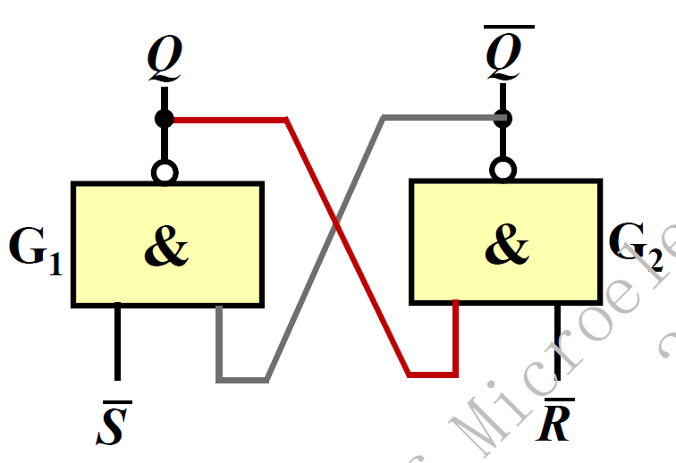
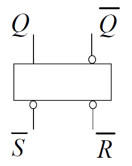

# 电路设计从入门到弃坑19【时序逻辑电路】

时序逻辑电路中使用触发器作为基本逻辑单元，它的特点就是**具有记忆功能**，能够根据当前输入和过去的输入决定当前的输出

**触发器**是能储存一位二进制信息的基本单元，具有0和1两个稳态，并且在输入信号消失后能实现状态保持

## 基本触发器RS-FF

最简单的触发器常称为**锁存器**（Latch）

两个与门交错相连就能得到它

电路符号表示如下

