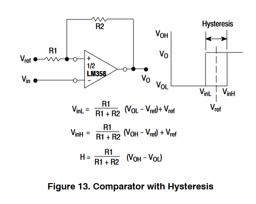
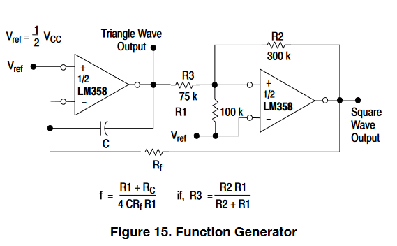

# 电路设计从入门到弃坑8【集成运算放大器的应用】

这一部分主要在上一篇博文的基础上说明集成运放在“运算”和“放大”方面的应用。至于运放在信号处理方面的应用，笔者将其放到了模拟信号部分

## 集成运放的性能指标

* 开环差模增益$A_{od}$
    $$
    A_{od}=\frac{\Delta u_o}{\Delta(u_P -u_N)}
    $$
    若实际电压放大倍数为$A_u$

    则$A_{od}=20lg|A_u|$

* 差模输入电阻$r_{id}$
    $$
    r_{id}=\frac{\Delta(u_P -u_N)}{\Delta i_P}
    $$

* 共模抑制比$K_{CMR}$
    $$
    K_{CMR}=20lg|\frac{A_{od}}{A_c}|
    $$

* 输入失调电压$U_{IO}$：使输出电压等于零时在输入端需要加的补偿电压

    对应有输入失调电流$I_{IO}$和它们的温漂

* 最大共模输入电压$U_{IC_{max}}$：能正常放大差模信号时容许的最大共模输入电压

* 最大差模输入电压$U_{ID_{max}}$：如果输入超过此值，输入级差分管会损坏

* 上限截止频率$f_H$

* 下限截止频率$f_L$

* 转换速率$SR$：描述运放对大信号的反应速度
    $$
    SR=\frac{du_O}{dt}|_{max}
    $$

## 放大电路

## 运算电路

