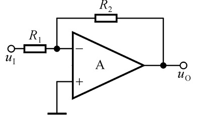
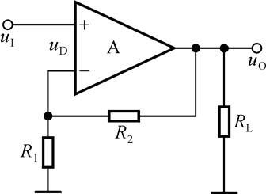
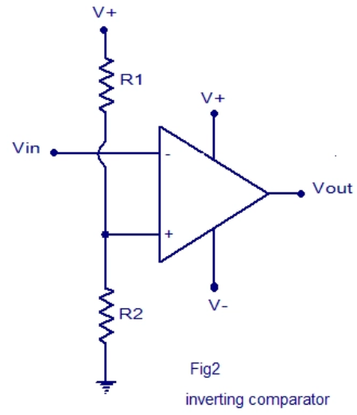
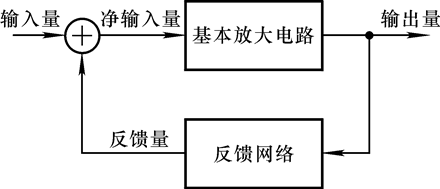
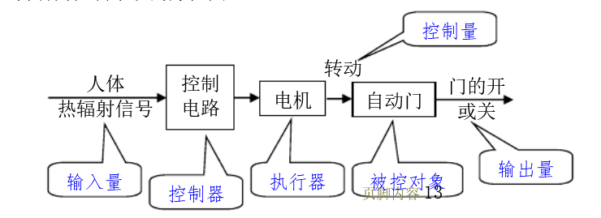
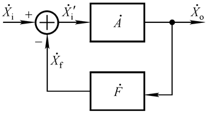
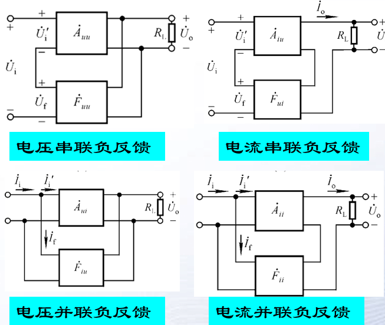

# 电路设计从入门到弃坑9【电路中的反馈】

**放大电路输出量的一部分或全部通过一定的方式引回到输入回路，影响输入，称为反馈**

## 反馈的分类和判断

对于反馈，最基本的分类方式就是根据反馈调节信号的方向：是*增强*输出信号还是*削弱*输出信号，从反馈的结果判断，**凡反馈的结果使*输出量*的变化减小的为负反馈，否则为正反馈，或者凡反馈的结果使*净输入量*减小的为负反馈，否则为正反馈**；此外，一个反馈回路总有输入端和输出端，可以将一个具有单输入单输出端的简单反馈回路看作一个单输入单输出反馈网络。**如果反馈输入端与电路系统输出端直接相连，则称为电压反馈；如果反馈输入端与电路系统输出端不直接相连**（比如隔了一个电阻）**，则称为电流反馈；如果反馈输出端与电路系统输入端直接相连**（运放的正相和反相输入端由于虚短可视为相连）**，则称为串联反馈；如果反馈输出端与电路系统输入端不直接相连，则称为并连反馈**

上面的定义并不是反馈分类的真正定义，但是对于一般的反馈回路使用它们进行判断已经相对准确了

除了针对*反馈调节结果*、*反馈输入端形式*、*反馈输出端形式*进行分类，还可以区分直流反馈和交流反馈：**直流通路中存在的反馈称为直流反馈，交流通路中存在的反馈称为交流反馈**

或者可以从系统的分割角度分类：**只对多级放大电路中某一级起反馈作用的称为局部反馈，将多级放大电路的输出量引回到其输入级的输入回路的称为级间反馈（或称总体反馈）**

如上图中R3引入局部反馈，R4引入级间反馈

### 判断正负反馈

按照定义判断：凡反馈的结果使输出量的变化减小的为负反馈，否则为正反馈；或者凡反馈的结果使净输入量减小的为负反馈，否则为正反馈

这里要注意判断的是**净输入量**

> **当反馈应用于运放系统时，净输入量指的是集成运放两个输入端的电位差或两端各自的电流**
>
> **当反馈应用于分立元件系统时，净输入量指的是从BJT的b极或MOSFET的g极输入的电流或电压**

使用**瞬时极性法**可以判断反馈性质：

首先假设Xi的瞬时极性，之后依次分析电路中关键支路量的极性并最终得到Xo极性

随后**只根据**Xo极性从反馈回路逆推得到Xf的极性

> 需要明确一点：**反馈量仅取决于输出量**

存在两种情况：

**反馈量Xf增强净输入量Xi'：正反馈**

**反馈量Xf削弱净输入量Xi'：负反馈**

### 判断交直流反馈

**看通路**：看反馈存在于直流通路还是交流通路

如果反馈回路中没有滤波元件，则是交流反馈；如果存在滤波元件，则是直流反馈

### 判断电压电流反馈

使用**输出置零法**判断：令输出电压为0，若反馈量随之为0，则为电压反馈；若反馈量依然存在，则为电流反馈

如下图所示，将$u_o$置零后等效为接地（所以说一般可以输出接地实现置零），发现反馈等效为接地，也就是不再有反馈回路，说明引入了电压负反馈

或者可以直接用开头的简化定义：如果反馈输入端与电路系统输出端直接相连，则称为电压反馈；如果反馈输入端与电路系统输出端不直接相连（比如隔了一个电阻），则称为电流反馈

> 这个定义看似很不准确，但是在大多数情况下是可以应用的——将输出置零后，反馈输入端与电路系统输出端直接相连的回路一定会等效为接地；而反馈输入端与电路系统输出端不直接相连的回路，则有很大概率是引入了采样电阻，通过这个电阻引回电流反馈
>
> 该方法可以相对准确地判断电压反馈，进而通过反证法判断电流反馈

在复杂的分立元件电路中，就只能使用输出置零法，再从输出端一步步推导回输入端了。也有一些例外的电路，会有着明显的采样电阻，这种电路就可以直接判断

### 判断串联并联反馈

**在输入端，输入量、反馈量和净输入量以电压方式叠加，为串联反馈；以电流方式叠加，为并联反馈**

开头给出的简单定义也是在部分诠释这个定义

上面这个电路引入了电压*并连*负反馈

下面的电路引入了电压*串联*负反馈

### 电压电流反馈的性质

基本性质：**引入电压负反馈稳定输出电压，引入电流负反馈稳定输出电流**

> 电压负反馈本质上是将输出端的电压信号进行采样后送到输入端；电流负反馈同理
>
> 线性系统输入量过大，一定会导致输出过大。此时，负反馈将信号采样送到输入端，这个信号能够抑制输入量的过大，于是就稳定了输出。在这个过程中，输出端采样的类型决定了控制输入量的类型，进而又决定了稳定输出量的类型

### 串联并联反馈的性质

## 深入了解反馈环路

没有反馈的电路常被称为**开环**网络，如下图所示

这就是一个常见的电压比较器电路，它的输入和输出部分相互独立

而引入了**反馈网络**的电路被称为**闭环**网络

无论是放大电路还是其他的电机控制电路、传感器控制电路，抑或是更抽象的控制算法，甚至是一个门把手，都可以视为一套**控制系统**，**输入量**（模拟信号、变量和人手）会进入这个控制系统，控制系统对信号进行处理后变成**输出量**，对物理世界或数字信号的控制会在这个过程中完成

一般的控制系统都是开环系统：门把手接收来自人手的力学量输入，通过把手轴把垂直的力转化成力矩，再让力矩通过弹簧转化成横向的力传递给门闩，最后门闩输出一个横向的力——门就打开了，在这个过程中不存在反馈的过程，所以说手的动作并不会因为门打开的速度太慢而加快；如果在此之上引入“人眼”这个“反馈”，就不一样了：如果人手的力太小，不足以打开门，人眼从门闩“接收到门未打开的信号”，于是加大手的力度，使得门能更快打开，这就形成了一个闭环系统

人眼在这个过程中的“观察”可以被总结成**采样**

换一个例子：自动门的控制系统方框图如下所示

这就是一个典型的开环控制系统

对应于放大电路，就是具有相似控制过程的**开环放大电路**。可以联想到基本放大电路都是开环的放大电路，一个独立的运放也是开环的

现在我们从广义控制系统回到放大电路中，可以发现**放大电路中的输入量和输出量总是电信号，控制器和执行器都由集成运放或分立半导体放大电路实现，被控对象则是电信号的参数**。

> **放大电路输出量的一部分或全部通过一定的方式引回到输入回路，影响输入，称为反馈**

再回头看反馈的定义，可以发现：

* 放大电路主体拓扑决定控制器和执行器的实现
* 反馈电路主体拓扑决定反馈回路的实现
* 直流和交流反馈类型确定了输出量的形式
* 串联和并联反馈类型确定了输出量返回输入回路的多少
* 电压和电流反馈类型确定了输出量通过什么方式引回输入回路
* 正负反馈类型确定了输入量如何被影响
* 局部和级间反馈类型限制了反馈网络的作用域

### 反馈网络

一般来说只要是能改变电信号的电路就能作为反馈网络，但是对于**闭环放大器**电路，至少需要保证两点：

* **不使用正反馈网络**
* **反馈级数不会过大**

> 正反馈网络会导致这样的现象：
>
> 一个放大电路供电电压+-3V，接收信号1mV，理论上要放大100倍到100mV，但是由于正反馈的存在，电路在上电几乎瞬间就达到了3V的输出
>
> 一个放大电路供电电压+-3V，未接入任何信号，理论上不会存在输出，但是因为上电瞬间，输入端收到了微弱的电磁波形成电流，又因为存在正反馈，输出电压开始呈指数上升，在几秒之内达到了3V
>
> 放大电路是绝对不能使用正反馈的——我们宁愿电路开环也不想让放大电路变成一个“电源”
>
> 而过深的负反馈级数可能会导致这样的现象：
>
> 上电后电路平稳运行，但是当周围出现强磁场或雷击或其他什么扰动时，输入端出现了一个高频尖峰，正好这个尖峰的谐波由于寄生电容进入了反馈回路，虽然对放大器放大的低频信号没有什么干扰，但是针对高频谐波相当于原来的反馈回路并联了一个电容，于是负反馈系数减小，正反馈系数增大，电路满足1+AF=0的起振条件，发生了*针对这个高频尖峰信号的自激振荡*，如果负反馈深度不够的话问题还不大，这个尖峰被放大一会后就会因为衰减而自行消失，但是深度负反馈下，谐波反馈递增速率大于衰减速率，最后输出信号就会叠加一个高频谐波，这就使得整个放大电路产生问题

这里补充一下反馈系数的概念：
$$
\dot{F}=\frac{\dot{X_f}}{\dot{X_o}}
$$
这个式子在任何闭环系统中生效

反馈系数决定了反馈的**深度**。反馈系数大于*一定程度*的反馈系统称为深度反馈。习惯上会将深度反馈系统分为深度正反馈和深度负反馈。在运放电路中一般都会引入深度负反馈；在震荡电路中一般会引入深度正反馈

在上述的闭环系统中还存在两个量

* 基本放大倍数$\dot{A}=\frac{\dot{X_o}}{\dot{X_i'}}$（注意这个是Xi'，带撇）：表示主线性系统A的放大倍数
* 闭环放大倍数$\dot{A_f}=\frac{\dot{X_o}}{\dot{X_i}}$：表示整个闭环系统的放大倍数

对于负反馈网络，存在闭环放大倍数的一般表达式
$$
\dot{A_f}=\frac{\dot{A}}{1+\dot{A}\dot{F}} \\
\dot{A}\dot{F} \gt 0 （限制电路引入负反馈）
$$
其中$\dot{A}\dot{F}$表示环路放大倍数

**当$|1+\dot{A}\dot{F}|>>1$时，存在$\dot{X_i} \approx \dot{X_f}$，净输入量可以忽略不计，整个电路的输出都近似由反馈回路决定。这就是上面所说的深度反馈状态。引入负反馈（$\dot{A}\dot{F} \gt 0$）时，就是深度负反馈**

一般地，A、F、Af的符号都相同

*利用反馈系数，可以方便地估算深度负反馈状态下放大电路的放大倍数*

| 反馈组态 | 反馈情况         | $A_{uf}$或$A_{usf}$              | 与负载关系       |
| -------- | ---------------- | -------------------------------- | ---------------- |
| 电压串联 | 采样电压反馈电压 | $A_{uf}=\frac{1}{F_{uu}}$        | 与负载无关       |
| 电压并联 | 采样电压反馈电流 | $A_{usf}=\frac{1}{F_{iu}R_s}$    | 与负载无关       |
| 电流串联 | 采样电流反馈电压 | $A_{uf}=\frac{R_L'}{F_{ui}}$     | 与负载呈线性关系 |
| 电流并联 | 采样电流反馈电流 | $A_{usf}=\frac{R_L'}{F_{ii}R_s}$ | 与负载呈线性关系 |

### 正负反馈

### 采样

在采样的分析理念下，可以将四种反馈组态拓扑如下区分

### 反馈叠加

串联反馈和并联反馈本质上是针对反馈和输入叠加点的电压和电流反馈的分类。**串联反馈是将反馈网络处理过的信号以电压形式叠加到输入信号上；并联反馈是将反馈网络处理过的信号以电流形式叠加到输入信号上**

串联负反馈能够将一定电压叠加到净输入端，等效为系统的输入电压被抬高，而电流不变，可得输入等效电阻增大。定量计算得增大到原来的1+AF倍；并联负反馈则会将等效输入电阻减小到原来的1/(1+AF)。电压负反馈能够稳定输出电压，也就是说在电流增大时电压近似不变或电流减小时电压也对应减小，可得电压负反馈让等效输出电阻减小到原来的1/(1+AF)；电流负反馈则会将等效输出电阻增大到原来的1+AF倍

四种类型的负反馈具有以下特点

| 负反馈类型 | 并联反馈                   | 串联反馈                   |
| ---------- | -------------------------- | -------------------------- |
| 电流反馈   | 增大输出电阻，减小输入电阻 | 增大输出电阻，增大输入电阻 |
| 电压反馈   | 减小输出电阻，减小输入电阻 | 减小输出电阻，增大输入电阻 |

所有类型的负反馈都会导致通频带展宽到原来的1+AF倍
$$
f_{bwf}=(1+AF)f_{bw}
$$
同时放大电路得非线性失真也会被抑制到原来的1/(1+AF)

### 稳定的负反馈与自激振荡

