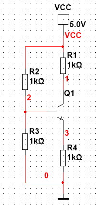
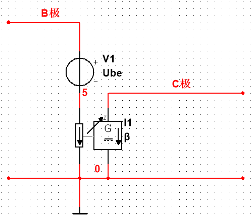
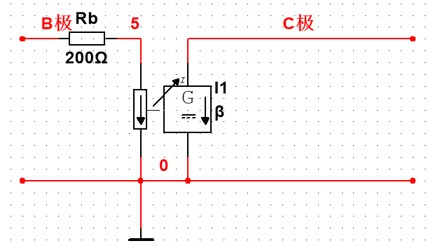

# 电路设计从入门到弃坑2【三极管理论分析】

按理说结束对基本半导体器件介绍后就应该进入放大电路的环节

但是在讨论放大电路之前，需要先了解三极管在放大区的工作特性——这一点在之前的介绍部分做的不是很详细，本篇作为补充（其实是重点）部分

### 三极管放大区工作特性

1. 输入特性

    三极管的U~BE~和I~B~之间的关系称为三极管的**输入特性**，描述了随BE结电压变化，b极电流的“输入”大小变化

    一般来说U~BE~>0.7V，也就是高于三极管导通电压时，I~B~才会出现，随后I~B~会呈现指数变化。这是由于U~BE~决定了b极能吸引到的电子数，U~BE~增大，电流也就会增大

    当考虑U~CE~时，会发现**随着U~CE~增大，I~B~曲线右移**，但是**U~CE~增大到1V以上后，曲线右移就会变得不明显**。这是因为U~CE~决定了从e极发射的电子总量，而U~BE~决定了能通过b区的电子量，电子总量增加，自然被吸引到b极的电子数量增加，b极电流相应增加，但是当e极所有电子都被发射出去以后——也就是发射的电子“饱和”了——不管怎么增加U~CE~，被b极吸引到的电子数目也不会有太大增加

    

2. 输出特性

    三极管的**输出特性**指的是U~CE~与I~C~之间的关系

    如下图所示，三极管的输出特性是一个很经典的模型

    

    > 理解了这个模型，就可以说理解了三极管

    先看I~B~恒定的情况下，选取其中I~B1~曲线，可以看到随U~CE~升高，I~C~迅速变大，这就体现了U~CE~控制电子发射总量。对应上一篇文章中提到过的电子管，就可以把U~CE~理解成“灯丝电压”，是I~C~主要的影响量（**根据KCL，I~E~=I~C~+I~B~，但是由于I~B~本来就很小，所以I~C~≈I~E~**），当U~CE~增大到某种程度后，I~C~就不再变化了，这是因为e极能释放的电子数已经达到了上限

    再看跟随I~B~变化的情况：I~B~=0区域以下被分成了“**截止区**”，这就对应了三极管截止工作状态；I~B~达到最大，也就是U~BE~≥U~CE~后，I~C~同样受到了限制，无法再进一步增大，这就是“**饱和区**”

    而模拟电路中最关注的就是放大，放大就要靠三极管工作在放大区。这个区域内，具有一个铁律：
    $$
    I_C=\beta I_B
    $$
    其中$\beta=\frac{\Delta i_C}{\Delta i_B}$，这个参数仅由三极管结构和制造工艺决定（三极管固有性质）

    同样地，可以获得更精确的三极管电流公式：
    $$
    I_E=I_C+I_B=(\beta+1)I_B
    $$
    通常三极管的β值都在几百，不过在实际电路中会通过外部条件限制β来让三极管工作在合适的状态

3. 温度特性

    三极管是半导体器件，说到半导体就必须提温度特性了

    **温度升高，β值升高，导致I~B~不变时BE结电压U~BE~下降；或者U~BE~不变时I~B~升高**

    就因为这个性质，需要在后续的放大电路中引入==补偿电阻（温度反馈电阻）==，相关内容会在下一篇涉及

    同时，温度升高会导致三极管导通电压U~BE(ON)~降低，反向饱和电流I~CBO~增大。从图像上看，就是输入特性曲线左移，反向特性曲线下移。原理很简单，温度升高，PN结的温度漂移影响更加明显，导致更低的be结电压就能让三极管导通；同时截止电流会随温度漂移变大，这个过程和二极管的温度特性类似

4. 性能参数

    **本部分内容的重点！**看懂了三极管的性能参数，才能看懂datasheet，进而设计放大电路并对放大电路的参数进行规划。下面提到的参数都是基本放大电路中经常使用的，一些针对特定电路的参数会在之后的博文中介绍。

    三极管电流放大倍数**β值**：$\beta=\frac{\Delta i_c}{\Delta i_b}=\frac{I_c}{I_b}$，也可以用半导体物理的公式逆向计算

    > 注意：很多人认为β值是用半导体物理的公式推导出来的，但实际上上面这个式子就是它的定义式，半导体物理反用了这个参数来进行计算

    β值、α值关系：$\alpha=\frac{\Delta i_C}{\Delta i_E}=\frac{\beta}{1+\beta}$

    **饱和管压降$U_{CES}$**：临界饱和电压，放大区与饱和区的边界电压，当三极管越过这个压降时就从放大区进入了饱和区。对于小功率管来说，大概是0.7V左右，对于大功率管来说，可以达到2~3V。

    > 实际工程中并不会严格按照这个压降来确定放大区和饱和区，不过只要根据这个参数算出静态工作点该在的位置，就可以从理论上保证不会出现饱和失真了

    **be结电阻$r_{be}$**：上一篇提到过的b极e极之间的寄生电阻，可以用$r_{bb'}$进行计算

    **输出漏电流$I_{CEO}$**：c极和e极之间的漏电流，也称为穿透电流，指基极断开时C、E间加电压测得的电流

    > 这个电流是因为发射区的自由电子在不加基极电压时候会自发的穿越基区到达集电区形成

    最大工作频率$f_T$：使β=1的信号频率，当信号大于该频率时，三极管将不能正常工作（大概率直接烧毁，因为高频的信号会让三极管工作在开关状态，发热巨大）

    最大集电极电流$I_{CM}$：三极管放大工作状态下集电极输出（流入）的最大电流
    
    CE结击穿电压$U_{(BR)CEO}$：三极管能允许的CE脚之间最大电压
    
    最大集电极耗散功率$P_{CM}$：集电极会存在用于发热的耗散功率，当三极管c极功率达到最大时，耗散会达到最大

## 三极管电路模型

上面的部分介绍了三极管放大区的工作特性。简单梳理一下逻辑：**我们想要使用三极管对信号进行控制，那么就只能让三极管保持在放大区工作，如果出现三极管截止或者饱和的情况，都会导致电路无法实现应有的功能，这就产生了两个基本的失真：截止失真和饱和失真；随后，因为三极管是半导体器件，自然要考虑温、声、光、压、电几方面的内部不稳定因素——声音、光线、压力这三个不稳定因素都被三极管外部的塑料封装消除了，我们需要考虑的就剩下温度和电磁这两个干扰因素——先解决温度，让三极管拥有不受温度变化干扰的能力，解决方法是在放大电路中引入补偿电阻，或者从根本上改变电路结构来保证稳定性；最后是电磁干扰，这个因素是最麻烦的，因为很多电源本身就“脏”，带着各种各样的高频低频脉冲，甚至三极管自己的放大过程如果出现问题，也会在输出端生成尖峰——注意，这个尖峰是被放大了几百倍的，因此后续电路对于这样的干扰就更为难了，不过我们可以通过组合多个三极管、二极管，搭建复合的电路来抑制这种干扰。**学习模电中放大电路的思路就应该按照上述逻辑进行。实际电路中很可能还会考虑更多因素，通过引入更复杂的反馈、耦合控制机制可以消除这些东西，不过这都是更需要经验的工作了，笔者也只是个想分享一下知识的菜b，不再班门弄斧。

回到正题，分析放大电路之前，需要先了解三极管的理想电路模型（下一篇还会介绍更加准确、能用于高频的三极管EM小信号模型）

三极管电路模型分为大信号模型和小信号模型，这里的大和小是相对的概念——放大电路中电源信号一般常用3.3V、5V、9V、18V、24V乃至60V，而需要放大的信号往往只有1V、0.3V、0.02V、0.001V乃至更低，有些微弱信号甚至只有μA级别的电流，因此**放大电路中的直流信号被称为大信号，交流信号称为小信号**

### 大信号模型

放大电路中，三极管存在一个直流回路和一个交流回路，其中直流回路拓扑如下所示

这里先不介绍该电路的结构和分析方法，只由此引出该怎么对三极管进行抽象建模。

首先我们能看到四个电阻——他们被称为**偏置电阻**，为提供三极管合适的静态工作点。萌新读者暂时不用理会专有名词，这些会在下一篇详细介绍。可以看到三极管作为一个节点接入电路，恒有
$$
I_E=I_B+I_C \\
I_C=\beta I_B
$$
第一个方程是电路的拓扑约束，第二个方程则是元件约束。为了抽取三极管的重点特性，我们一定要将β拿出来，因为没有这个东西，三极管的放大功能就无法描述。该怎么建模？答案是流控电流源——它正好符合元件约束的方程。此外，需要注意拓扑约束不能逾越，C极和B极要共地隔离。

常用的三极管直流大信号等效模型如下所示：b、e之间是一个等效压降，即Ube——be结压降（硅0.7；锗0.3）；c、e之间是一个流控电流源，它的大小I~C~=βI~B~

这里和上面的分析不一样，因为它引入了结压降U~be~，不过也很好理解——半导体结压降特性在二极管等效模型中也有用到，如果你的电路供电电压很高的话其实也可以直接忽略。

以后遇到放大电路的直流信号分析，直接把这个模型套上去就可以把模电变成电路原理了！

### 小信号模型

三极管小信号模型的分析相对更简单一点——上面说了因为三极管的元件约束决定了它需要保留β；因此对于交流信号，β在所难免，不过这里把结压降扔了，因为结压降是针对直流而言的固定，对于一个交流信号，更常用“阻抗”进行描述——把所有电阻、电容、电感全部抽象成“输入阻抗”、“输出阻抗”、“寄生阻抗”就行了！如下图所示，R~b~就是一个be结寄生阻抗的等效。在半导体物理中还有一个公式专门计算它：
$$
R_{b} \approx R_{bb'} + (1+\beta) \frac{U_T}{I_{EQ}}，其中U_T \approx 23mV
$$

遇到交流信号分析时，直接将这个模型带入就可以了

### 三极管高频等效模型简介

> 想看高频？
>
> 别想了！下一篇再说!

## 三极管偏置

**在阅读以下内容之前，强烈建议刚接触模电的新手先去阅读传统教材的放大电路部分，再对本教程的下一篇进行粗略阅读，至少掌握放大电路的基本拓扑结构**，==否则可能会根本读不懂==

这部分内容其实应该放在放大电路部分讲，本教程将三极管偏置条件放在这里的原因是它更接近让三极管保持在放大区的一个性质，并且使用理论分析就可以得到很好的效果，而不需要放大电路设计经验或者什么玄学因素。

三极管的偏置设计讲究两个基本要求：

1. 三极管能干活——保证三极管工作在放大区
2. 三极管偏置电阻尽量少且能耗低

### 理论计算

为了满足上述两个要求，就需要根据规定的最大不失真输出电压$U_{OM}$设计电路，避免出现截止失真和饱和失真，根据下面的公式可以比较好地实现目的
$$
I_{CQ} \ge I_{CM}+ I_{CEO}\\
U_{CEQ} \ge U_{OM}+U_{CES}
$$
其中$I_{CEO}$表示CE结漏电流，$I_{CM}$表示最大集电极电流，

上面的电路分别说明：

* C极静态工作电压不小于CE结漏电流+最大集电极电流。这样就能保证三极管不出现截止失真
* CE极静态工作电压要不小于最大不失真输出电压+CE结饱和管压降（由U~OM~计算式反推而来）。这样可以保证三极管不出现饱和失真

### 偏置电路设计方法

