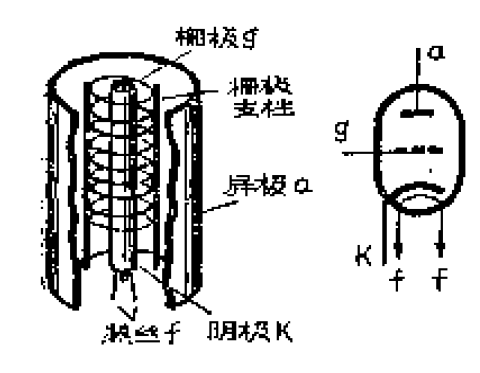

# 基础晶体管

## 真空管

在半导体材料之前，人们都使用电子管或者说真空管对电路进行操控，现代的半导体技术实质上还是采用了真空管的原理，只不过因为半导体材料可以在硅片上进行制造，大大缩小了电路体积——但是它们的基本原理是相似的

现在真空管已经被市场淘汰，剩下的也不过成了爱好者们的玩具，不过理解真空管有助于了解二极管、三极管等基本的晶体管在电路中起到的作用

电子管主要分为：二极管、三极管、五极管、束射管、复合管等，听上去和半导体器件很相似

二极管是其中最简单的，它中间装有两个电极，一个是由金属丝制成用于发射电子的阴极，另一个是接收电子的屏极。给阴极通电，电流会将金属加热，管内已经被抽成了真空，因此金属丝就能发射电子，屏极则负责将这些电子接收。

在屏极接高电势，阴极接低电势时，屏极会主动吸引阴极发出的电子。一般来说二极管的加热部件是独立的，围绕在阴极周围，如下图所示（图b为电路符号，K为阴极，a为屏极，两个f表示加热部件）

因此实际上会有很多（效率懂得都懂，但是当时能用就行）电子从阴极到达屏极；反之在屏极接低电势，阴极接高电势时，电子的发射会被抑制——这就造成了二极管具有**单向导电性**

基于PN结的二极管实际上也是起到单向导电性的作用，只不过由于引入了半导体技术，它的功能更加丰富、复杂了（实际上前人们也使用了很多方法改进真空管让它们做到现在半导体二极管的功能——毕竟第一台电子计算机都是用真空管制造的）

容易看出，这个大二极管具有一个致命的问题：功耗大得离谱，这玩意实际上就是个电灯泡——工作时常常能达到外壳100多度，用手摸一下就能烫熟的那种......这就是真空管的通病了：它们都需要使用额外的电热丝来让金属发出电子，而半导体管则不需要这些

再来看三极管：

它中间多了一个栅极g——这个称呼也被保留到了后来的场效应管中——可以通过控制栅极来实现控制阴极-屏极电流，这也是双极结型晶体管和场效应管的共同原理和要达到的目的：**用一个电流/电压控制另一个电流/电压**

值得指出的是：真空三极管的很多特性与专有名词被移植到了晶体三级管上，如果学完了三极管/晶体管再来学另一个，会感到很熟悉

真空管中还有一个较三极管更复杂的分支——五极管。他在三极管的栅极和屏极之间插入另外两个电极，于是栅极被分成了*控制栅极*、*帘栅极*和*抑制栅极*，这个器件主要用于减少的真空三极管中超大寄生电容和超量漂移电流的影响，从而能够实现“**高频开关和放大**”（在当时确实是高频）的开关，第一台电子计算机中也大多用了五极管配合继电器进行开关

最后需要提的就是束射管（至于复合管嘛，管如其名），它就是高中物理里面大名鼎鼎示波管的父类——通过将高速电子流打在荧光屏上实现显示功能，通过周边的电磁铁来控制显示的位置

不过束射管还有很多其他变种，辉光管、荧光管等上世纪苏联时代的遗产都是束射管的成员，它们大都利用加热器-金属灯丝-荧光材料/电子射线的原理进行发光显示信息，可以说是现代发光二极管的鼻祖了

利用这些晶体管，前人们也制造出了放大器、振荡器、线性电源乃至开关电源等设备，其耐用性甚至能把一部分使用现代技术的设备打趴下。比起教科书中从半导体物理直接讲起，个人认为晶体管这种”朴素“的老古董更能体现模拟电路的本质——**通过支路量操控支路量，从而实现模拟电信号的变换**

而真空管中的几个基本元件的性质也会在晶体管元件上得到体现

* 二极管——单向导电与反向击穿
* 三极管——电流放大与开关控制

## 二极管

> 我再用真空管，我就是个参加空降兵部队！——肖克利（我不知道他说没说过）

简单了解过真空管，我们再来看看现代半导体科技的结晶，**晶体管**

首先要谈的就是二极管了。不过要看懂现代半导体科技，就要从它们的基础——半导体材料开始。由于本篇的重点在于半导体器件，所以这里仅进行笼统的概括。我们先从二极管的物理基础PN结看起。

### 二极管就是PN结

半导体材料（硅/锗）的单质都是很难导电的，因为其中的电子和空穴浓度相等，即使外加电压，也会很快形成电流的动态平衡；然而这种平衡容易随着外界环境改变而改变，通过向纯净的半导体材料中掺入受控量的N型杂质和P型杂质，可以分别得到**N型半导体**和**P型半导体**，这种技术称为**掺杂**

> N型杂质就是氮族元素（IVA族），它们的最外层电子数为5；P型杂质则是硼族元素（IIIA族），它们的最外层电子数为3
>
> 显而易见，N型杂质的掺杂会导致自由电子数量增多，半导体的载流子为多子，即自由电子，这就是为什么它被称为**N**egative；相反地，P型杂质的掺杂会导致空穴数量增多，半导体的载流子为多子，即空穴，这也是为什么它被称为**P**ositive
>
> 使用能带理论可以解释多子导电：导带中的电子就是载流子，能够导电；而空穴作为电子反向移动（跃迁）的等效，也可以等效地导电。相关内容可以参考《半导体物理》教材或本博文的参考书《模拟电子系统设计指南（基础篇）：从半导体、分立元件到TI集成电路》

幼儿园的小朋友都知道，半导体材料的导电性容易受到外界温度、光照等因素影响。这是因为在特定温度热平衡的条件下，对特定的半导体材料，电子浓度$n_o$和空穴浓度$p_o$的乘积始终为常数，公式如下：$n_o * p_o = n_i^2$

> 电子在核外的量子分布状态成为**状态密度**；电子的能量分布称为**费米函数**
>
> 费米函数可以表明电子占据特定允态能级的概率，而它的值是由当前温度T和**费米能级**$E_F$决定的，表达式如下：
> $$
> f(E)=\frac{1}{1+e^{(E-E_F)/kT}}
> $$
> 当T=0K时，可以发现所有低于费米能级的允态能级会被填充；高于费米能级的允态能级则会空出
>
> 当T有一个大于0K的确定值时，上式就存在一个极限值，并且填充态和空态之间出现了过渡，随着温度升高，这个极限值会逐渐降低，这就导致**导带中热平衡的电子浓度会随着导带能级与温度变化而变化**，表达式如下
> $$
> n_0=N_Ce^{-(E_C-E_F)/kT}
> $$
> 参数$N_C$表示导带中的有效态密度函数，它的值仅由半导体材料的有效质量和温度确定

根据上式不难得出：在温度稳定的条件下，半导体材料的本征浓度为常数

一般地，把两种不同的体系合二为一时，载流子可以互相流动；但是热平衡的时候一定会形成统一的费米能级，这是因为出现了载流子浓度交换，因此可以**把掺杂的过程看作使费米能级变化进而改变导带宽度的过程**；由此也可以推断出光照和温度也会让导带宽度变化，进而影响半导体材料导电性

说完了P型和N型半导体，终于能谈到PN结了——二极管归根结底就是一个封装起来的PN结，通过控制PN结的物理性质就可以制造出不同种类的二极管

PN结的物理性质十分复杂，这里我们只讲*简化的PN结模型*

在一个晶格内，将P型和N型半导体连接在一起就形成了PN结，电子会从N区扩散到P区，空穴会从P区扩散到N区，因此在二者的接触区附近，电子和空穴会复合抵消，将其称为**耗尽区**或**空间电荷区**——在特定温度的热平衡条件下，不施加额外能量，电子或空穴是不能通过PN节的；同时由于在结的两侧存在相反的电荷，这就建立了一个穿越PN结的电场

当没有给PN结施加额外能量时，耗尽区会阻挡电流形成，不过仍然会存在微弱的电流穿过耗尽区，根据方向分为**正向扩散电流**和**反向漂移电流**；如果在外部对PN结两端施加正向电场，使得耗尽区内电场被抵消，空穴和电子就能够自由流动，在此过程中耗尽区越厚，所需要施加的外部能量就越大

> 想象一种极端情况，将P型半导体的掺杂浓度提升到极限，甚至将其换成金属，那么电子便会自由地从P区向N区扩散，但是随着扩散，P区的电子浓度会逐渐变低，反而会形成一个从N区到P区的势垒，这一过程是动态平衡，这个势垒就是大名鼎鼎的肖特基势垒，利用贵金属和N型半导体就可以制成*肖特基二极管*，它的原理和结型二极管十分相似，但是最后的产物完全不一样：加正向电压时肖特基势垒会变窄而导致其内阻减小，这一性质导致它具有正向压降低的优点

虽然二极管耗尽区的这个电场（一般称为内建势垒或内电场）很强，能抑制多子的运动，但是P区的少子电子会因此漂移到N区；N区的少子空穴也会穿过PN结到达P区，二者引起的电流分别称为正向扩散电流和反向漂移电流，二者大小相等、方向相反

因此，PN结也就是二极管的最根本、最基础特性就是**单向导电性**

### 从伏安特性出发

回想一下真空管时代我们都用真空二极管干了什么？拿它单向导电和反向稳压！当年肖克利老爷子准备了一份真空管的伏安特性，然后对着面前的硅片就开始研究：怎么让这破玩意弄得像真空管一样？我们也先从伏安特性出发，理解二极管的性质

* 正偏曲线

  二极管的P极接高电势、N极接低电势，即**正偏**，在这个情况下二极管的伏安特性曲线近似于指数函数

### 特性

1. 单向导电性
2. 反偏稳压性
3. 反偏变容性
4. 温度敏感性
5. 耗尽电容
6. 扩散电容

### 电路应用

## 三极管

三极管又称**双极结型晶体管**，也就是所谓的**BJT**（Bipolar Junction Transistor）

特别地，“晶体管”——Transistor实际上是贝尔实验室对跨导变阻器（Transconductance Varistor）的简称

### 三极管与二极管

### 一点简单的原理

### 很多复杂的性质

## 场效应管

场效应管（FET，Field Effet Transistor）和三极管一样，同属于晶体管大家族，其中比较常用的就是MOSFET金属氧化物半导体场效应管（Metal Oxide Semiconductor Field Effect Transistor），它常常以互补金属氧化物半导体（CMOS，Complementary Metal Oxide Semiconductor）的形式出现在数字集成电路中，下面对它进行简单的介绍

### 电场效应

### 平衡投入产出比

### 小号继电器

### 功率半导体器件

