# 三维重建1【计算摄影基础】

本系列博文旨在构建从底层CMOS传感器硬件到顶层算法的三维重建全栈知识架构，但重点在于图像信号处理和三维重建算法。希望能记录自己在学习三维重建过程中学到的知识，并为各位读者指明学习方向，抛砖引玉。

主要框架参考[Yvon Shong](https://www.zhihu.com/people/yvonshong/posts)和[Wang Hawk](https://www.zhihu.com/people/hawk.wang/columns)的博文撰写，其他参考资料包括《智能传感技术课程PPT》、冈萨雷斯《数字图像处理》

让我们从基础知识开始，首先来看看现代数码相机是怎样获得一张照片的

## 计算摄影概览

现在一个相机可以大致分成三个部分：**镜头**、**传感器**、**控制电路**。物体上传来的入射光穿越相机镜头进入传感器，传感器集成了读出电路，可以把光信号转化的电信号发送到主控SoC，最后交给相机内的图像处理系统转换成最终的RGB图像，并存储起来或者显示在LCD上

镜头是一个独立的大部件，它可以和相机机身分开，镜头处理光学部分，机身处理电学部分。因此这里先抛开镜头，来看看电信号是怎样被采集、传输、转换的

光信号首先进入绿色框表示的光电传感器，由CCD或CMOS器件转换成电信号

## 摄影光学基础

### 小孔成像

> 笔者觉得自己的讲述实在不如原文来得好，这里直接放上来自https://zhuanlan.zhihu.com/p/95059112的文段

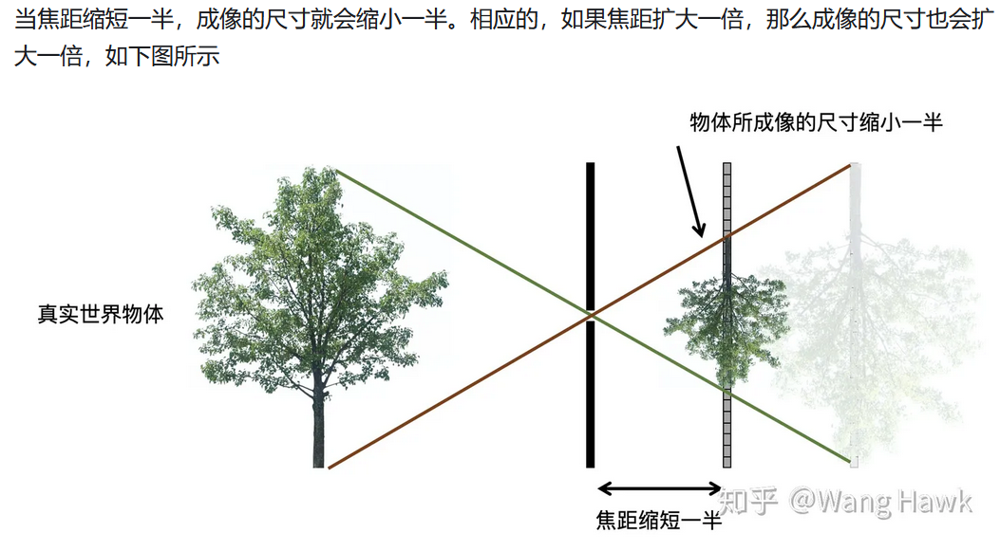

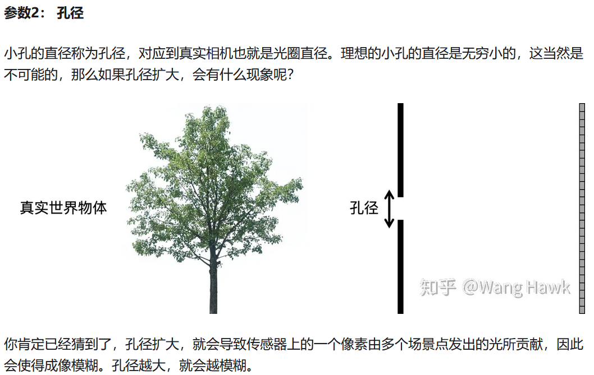

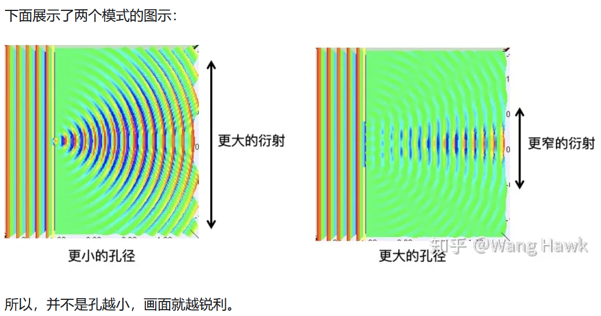

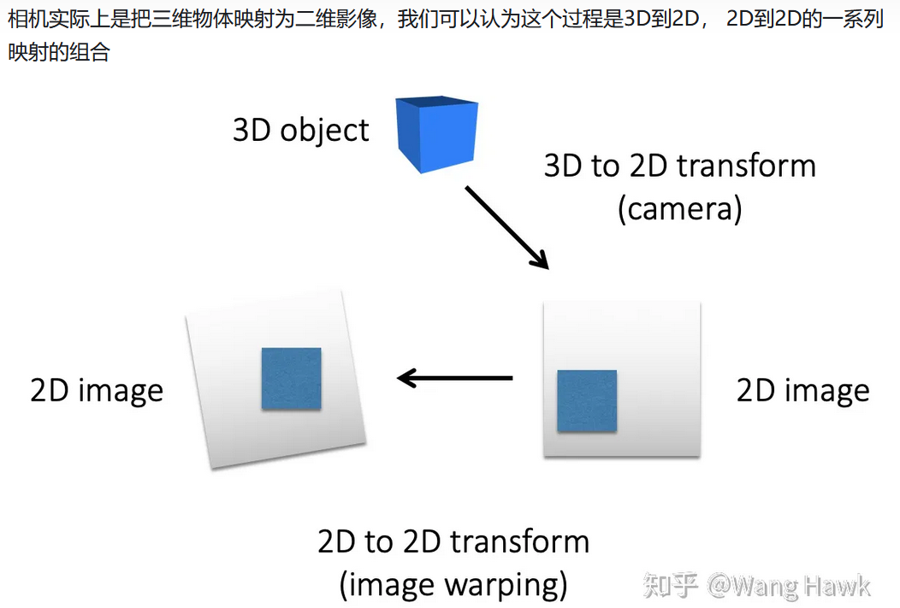

> 好的，原文就放到这里。原文后面还有大量关于小孔成像一般性原理的介绍，笔者决定讲其修改后放到后面的部分介绍

### 镜头

理想的小孔可以很好地成像，但通过上面的介绍我们已经知道，具有一定尺寸的真实世界的小孔会产生产生光的衍射（小孔太小）或同一个像点的光会来自于多个物点（小孔太大），二者都会导致成像模糊，让图像噪声很大。因此只有在两者之间某个平衡的尺寸，才能让成像既比较清晰，又具有较低的噪声。

我们可以用**薄透镜模型**来实现这个要求。薄透镜模型是一种简化的镜头模型，它是现实中设计非常良好的镜头组的模拟。它有两个关键的假设：

* **穿过光心的光线会直线传输**
* **平行光穿过镜头后，会汇聚到焦平面上的一点上**

如果一个物点发出了一束光穿过薄透镜，那么

* 穿过光心的光线会直线传播
* 其他光线会汇聚到焦平面的一点（焦点）

如果是从一个平行于镜头的平面上发出的光线穿过薄透镜，那么

* 所有光线汇聚在同一个平面

于是有薄透镜成像公式
$$
m=\frac{f}{D'-f}
$$
且
$$
\frac{1}{D'}+\frac{1}{D}=\frac{1}{f}
$$
其中m是*放大倍数*

为了

我们通过不同的凹凸透镜的组合，距离的调整，可以得到不同的镜头组。

使用镜头组便能够在现实世界中实现”小孔成像映射“，将物体的像投射到CMOS/CCD表面。常见的镜头组如下图所示

1. **长焦**镜头：长焦镜头的焦距比较长，要比感光器件的对角线大得多，可以把远处的景物拍得较大。

    目前常见的焦距有135mm、150mm、200mm 、250mm 、300mm、500mm、1000mm等，可分为中长焦镜头（焦距150mm以内，视场角在20°左右）、长焦镜头（焦距150mm到300mm之间，视场角在10°左右）、超长焦镜头（焦距300mm以上，视场角在8°以内）三种

2. **标准**镜头：标准镜头的视场角从40°到55°，常见的焦距为45mm、50mm、55mm、58mm等。

3. **广角**镜头：广角镜头焦距一般大于25mm，视场角在90°以内；超广角镜头的焦距在16~25mm之间，视场角在 90°~180°之间

4. **鱼眼**镜头：当焦距小于16mm，视场角超过180°，则称为鱼眼镜头

    > 目前世界上最大的鱼眼镜头视场角可达220°，这种镜头的第一片透镜像鱼眼一样突出在外面，形状像金鱼眼睛

5. **微距**镜头：为了对距离极近的被摄物也能正确对焦而设计的镜头，其镜片被拉伸得更长，从而让光学中心尽可能远离感光元件。微距镜头的外形细长，像一根笔杆一样

6. **移轴**镜头：能通过改变镜头组相对于成像平面的光轴，来改变观察到景物的透视关系的镜头

7. **折返**镜头：用来实现非常超长焦距的镜头。光线入射后会经过一次或者几次反射再到达成像元件从而减小镜筒长度

### 光的度量

**光通量Φ**：单位时间内由光源所发出或由被照射物体所吸收的光能，单位是流明lm

亮度L：光源在给定方向上单位面积单位立体角内的光通量，单位坎德拉每平方米cd/m^2

**光强I**：光源在给定方向上单位立体角内的光通量，单位坎德拉cd。亮度对发光面积分就可以得到光强

**照度E**：每单位面积吸收可见光的光通量，单位勒克斯lx。可以用入射光通量除以被照射物体的受光面积得到（E=Φ/S）

**曝光量H**：像平面的照度与曝光时间的乘积，即照度对时间积分，H=∫Edt。曝光量的倒数**S**=1/H被称为**感光度**

### 曝光三要素

相机传感器的三个重要参数：**光圈**、**快门**、**ISO**决定了曝光量和成像效果，它们被称为”曝光三要素“

孔径

曝光时间

感光度

快门是照相机中控制曝光时间长短的装置,  我们通过调节快门开闭时间长短，和开启的空隙大小来调节曝光量。

在快门速度的标示序列中可以看到，如1/4、1/8、1/15、1/30 、1/60、1/125等。不难看出，它们之间是倍数关系，是指几分之一秒的曝光时间，因此通过快门的曝光量也是呈倍数关系。

快门根据开启的方式分为**全局快门**和**卷帘快门**

三要素中，除了光圈（曝光孔径）、快门（曝光时间），还有一个是成像元件的感光度，在摄影中我们用感光度的国际标准ISO指代

感光度ISO代表感光速度的标准，代表胶卷使用的颗粒，CCD或者CMOS感光元件的感光速度，数值越高就说明该感光材料的感光能力越强。从公式我们可以看出，感光度越高，对曝光量，光的积分通量的要求就越少。

通俗一点就是衡量胶卷需要多少光线才能完成准确曝光的数值。胶卷上标的100、200、400，数字表示的就是感光度。数值增大，胶卷对光线的敏感程度也越大，ISO 200的胶卷的感光速度是ISO 100的两倍，换句话说在其他条件相同的情况下，ISO 200胶卷所需要的曝光时间是ISO  100胶卷的一半。而使用高ISO的颗粒噪声带来的噪点也相对的大。

数码相机的感光器件是使用了CCD或者CMOS，对曝光多少也有相应要求，也就有感光灵敏度高低的问题。

而数码相机的本质其实是一个光电反应，光电反应本身具有逸出功（最小激活能量），光通过镜头打在CMOS/CCD传感器上，ISO描述了最小需要多少的曝光量，才能使得该传感器颗粒被激活，然后通过AD转换，把光电反应的模拟信号转换成数字信号成像。

这也就相当于胶片具有一定的感光度一样，数码相机厂家为了方便数码相机使用者理解，一般将数码相机的CCD/CMOS的感光度（或对光线的灵敏度）等效转换为传统胶卷的感光度值，因而数字照相机也就有了感光度的说法。胶片相机只能通关替换不同颗粒材质的胶片来改变ISO，而数码相机的感光元件是不变的，而数码相机是如何实现调节ISO的呢？

**数码相机的ISO本质上就是模拟信号的增益**，如今的数码相机普遍采用了电子信号放大增益技术，与ISO数值相对应的是模拟信号放大增益值，比如设定在标准值时（无增益）提供等同ISO100（原生ISO）的增益幅度。数码相机的感光元件属于主动元件，存在暗电流，普通模式下设置了截止电流，并不会使用到存在噪声干扰的部分，当环境光线黯淡时，CCD/CMOS的输出电平较低，使用高感光度模式，放大器也按相应的ISO数值加大增益幅度，噪声也相应放大，而传感器在工作中一定受到不同程度的周边电路和本身像素间的光电磁干扰，这些背景噪声和干扰反映到图像上就是随机的杂点。

个别厂商提供了另一种解决方案，即对两个像素的感光信号进行叠加，便可获得原来两倍的感光度。但这种工作方式也有其缺陷，只适合较小的影像模式，因为像素数在处理中减半了。在获得高ISO的同时与成像相关的像素数也会成倍缩减，为了保证成像尺寸原本的影像信息会被扩大，噪点就这样产生了。

还有另一种高ISO数值的解决方案是合并像素后感光，采用把数个像素点当成1个像素点来进行感光的方式，多个像素点有更多曝光量，从而提高感光速度。该工作方式对高像素机型较有优势，但噪点的产生比前两种来的更为明显。因为减少了感光像素，所以在白平衡过程中只有进行像素插值才能得到完整的影像。

虽然高ISO在噪点方面还是令我们有这样那样的担忧，但为了获得更高的快门速度和更明亮的画面，这也算是一种不增加成本的折中解决方法。低ISO值适合营造清晰、柔和的图片，而高的ISO值却可以补偿灯光不足的环境。

光圈与快门对曝光的控制光圈和快门是调整和控制曝光量的装置，它们是倍增或是倍减的关系，**这种关系可以通过不同的组合来得到相同的曝光量**。例如说，光圈F8、1/30秒为正确曝光值时，如果用光圈f5.6、1/60秒，或是f11、1/15秒来组合，它们所得到的曝光量也是一样的。而ISO也是呈倍数关系，来控制曝光量。这样，摄影师可以根据自己的目的来选择光圈，快门速度和 ISO。

虽然他们都能控制曝光量，但是各自有不同的特点。

光圈越大，进光口径越大，进光量越多，景深越小。 

快门越慢，进光时间越长，进光量越多，运动的景物越容易糊； 

感光度越高，对光线的感应能力越强（对信号的放大程度越高），噪点越多。

在了解了曝光值EV与光圈、快门速度的关系之后，我们就很容易理解曝光补偿的原理。曝光补偿的目的就是让相机依照你的意图，**在自动曝光算法结果的基础上，手动修正曝光**。

使用光圈优先模式 Av 档需要手动确定需要的光圈， ISO  可以手动调节，但快门速度完全是由自动曝光算法决定的，如果这个时候自动曝光算法出的结果不满足需求，就可以应用曝光补偿。曝光补偿通常是以 EV  为单位度量的（相对曝光值），衡量的是增量，即在当前相机决定的曝光基础上如何进行微调。

在光圈优先 Av 模式，将曝光补偿设置为+1EV（增加一档），相机不能控制光圈，只能控制快门。为了实现增加一档的曝光，相机将把快门速度降低一档，相应曝光增加一档。

快门速度优先 Tv 模式下的情况与此类似。快门速度固定，曝光补偿 +1EV，则是光圈加一档。

一些相机在手动模式下设置了自动 ISO 功能，既当你在手动模式下设置曝光补偿时，相机将通过自动调整感光度来实现曝光补偿。

由于自动曝光算法，可以简单的理解为根据当前进光量的18%左右，为中阶灰，来相应的显示其他进光量的亮度响应值。

但是当在极端情况，被摄主体本身反射率过高或过低。比如雪地，黑炭，相机自带的自动曝光算法普遍失效，因为当前画面完全黑或者完全白，自动曝光算法会认为全黑/全白也是中阶灰，这个时候就需要进行**白加黑减。**拍摄白色物体的时候，需要增加曝光量，越白越加。反之，拍摄黑色物体，为了让黑色更纯，应该减小曝光量，越黑越减。

同样的，当我们在沙滩、雪地、阳光充足或白色背景前拍摄，因为环境使得光线反射变强，相机测光产生的偏差特别大，这时候需要增加曝光来避免主体偏暗；黑色背景前拍摄时，就该降低一些曝光值，以此避免主体曝光过度。

## CMOS和CCD传感器基础

> 美国科学家威拉德·博伊尔和乔治·史密斯1969年共同发明了CCD图像传感器。二人在2009年被共同授予诺贝尔物理学奖。CCD自1970年问世以来，因其独特的性能而发展迅速，开创了数字影像时代

CCD是最早一代图像传感器结构，其造价相对高、成像效果相对好。以前高端设备会采用CCD，而中低端产品才会采用CMOS；而现在的CMOS工艺传感器已经和CCD传感器有相当的性能了，同时造价低廉，因此大多数消费级和工业摄像机已经采用了CMOS传感器（虽然在有特殊要求的高端领域还是需要使用CCD）

CCD传感器的结构和CMOS传感器大同小异，二者最主要的区别还是在于工艺，就让我们从CCD开始讲起

### CCD

电荷耦合器件（Charge Couple Device，**CCD**）是一种基于MOS的大规模集成电路光电器件，其基本结构如下图

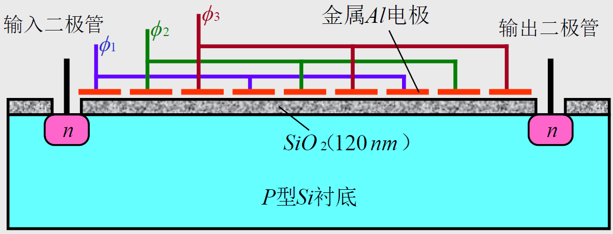

其由大量**MOS光敏源**构成，实际上就是在单个NMOS或PMOS的基础上将沟道拉长、尺寸做宽并以矩阵形式构造密集排布的栅极Contact，每个栅极小岛由独立的Metal层引出（引出方式在后面讨论）。每个金属-氧化物-半导体接触都相互独立，但又靠的足够近以至于耗尽区边缘相邻，这样的排布会带来特殊的反型层（或者说耗尽区），如下图所示

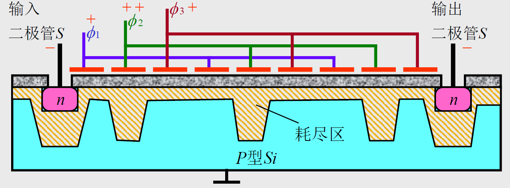

每个耗尽区对带负电的电子而言都是一个势能很低的区域，称为**势阱**。以基于PMOS的CCD为例，半导体内的少子（在这里是电子）就会被吸引到MOS栅氧接触界面，让耗尽区带负电，这样的势阱被称为**表面势阱**。

当光照射在硅片上时（光子穿过硅结构），光电效应导致半导体硅产生光生电子空穴对，其中光生电子会被附近的势阱吸收，空穴则会被排斥出耗尽区，且**势阱内吸收的光生电子数量与入射到该势阱附近的光强成正比**。存储了电荷的势阱被称为**电荷包**

对于MOS光敏元，我们通常用**量子效率**衡量其光电转化性能，即转换的电子数量与入射的光子数量的比值。当不断改变入射光的强度时，MOS光敏元转换出的电子数量也会发生改变这就构成了**响应函数**——在正常工作状态下，它通常是一个**线性**函数。电荷包的最大容量被称为**满阱容量**。由于硅晶体声子只能与有限数量、固定波长的光子发生吸收碰撞来让电子跃迁，**满阱容量基本上是像素面积而不是体积的函数**，这正好能用来反映入射光的强度信息。不难联想到，当MOS光敏元转换出的电荷让电荷包达到满阱容量时，势阱会饱和，吸收更多光子转换出的电荷会让表面势阱发生扩散，这被称为**过曝**；而在没有光线入射或入射光非常少时，MOS光敏元不会在其下方势阱中积累电荷，但是P衬底中的电子分布是动态且随温度变化的（况且硅晶体中总会出现缺陷导致电子空穴对不均衡的情况），因此总会有部分电子进入到势阱中，就相当于入射光信号被*噪声*淹没了，我们使用**暗电流**来评估电荷产生的电流强度。因此，在光线过强或光线过暗的情况下，**势阱饱和与暗电流导致响应函数不再线性**。

> 在后面会由ISP努力修正这些问题

容易理解，这样的CCD就成矩阵地构造了大量MOS光敏源，每个光敏源就能够表示一个像素的信息。当大量MOS光敏源被排列起来，就可以采集入射光成像的信息了

> 请注意，两个有源区之间的沟道长度和器件宽度是有极限的，因此需要排列大量上述结构组成CCD。其实最简单的方法就是构造由三个或四个独立栅极构成的CCD光敏元，再将其排列起来，这样虽然会损失一些面积（光敏元之间需要隔开并构造有源区），但会让接收到的光信号质量最好

实际上除了上面所说的**光注入法**，还可以通过**电注入法**来产生二维排列信息。在下图中，在第一个栅极旁扩散N区，这就形成了一个PN结，当在N区加正向偏压时，PN结耗尽区的电子会经耗尽层边沿进入Φ1势阱，并通过表面势阱相邻的边沿向Φ2、Φ3扩散。如果施加的只是一个时间极短的正脉冲IGΔt，那么几乎不会发生扩散，Φ1处存储了IDΔt这么多的电荷

CCD的基础结构带来了一个问题：**其将光信号转换成电荷信号**而不是电压/电流信号，这导致它需要一个**读出电路**来把图像信息从MOS光敏元的一个个电荷包中输出到器件外。我们一般选用读出移位寄存器来“转移图像”，从外界看来就是让CCD输出幅度与电荷包成正比的电脉冲序列

> 这样转移电脉冲序列的控制方法非常类似步进电机，相同地，也被分成两相、三相、四相控制方式，通过向CCD的*栅极组*施加特定的序列电压脉冲，就可以逐次把电荷转移出去。这里以三相控制为例，如下图所示
>
> 
>
> 经过一个时钟脉冲后，电荷从前一级转移到下一级的同号电极下
>
> 
>
> 这样电荷就完成了在CCD内部的转移

移位寄存器也是由MOS工艺制造的，只需要在其表面涂敷遮光材料就可以保证不受光照干扰了

当然，不可能让CCD产生的电荷信号直接输出。如果你学习过电荷型传感器的基本原理就能明白，电荷信号是静态的，需要转换成电流或电压才能被外界获取。因此CCD的输出方式也分成**电流输出型**和**电压输出型**两种

还是以PMOS衬底的CCD为例，通过在衬底上扩散N有源区就可以形成PN结，我们可以构造下列结构

其中OG是CCD单个光敏元最外层的一个栅极，当在其上加正向偏压形成沟道，再往PN结的N区施加高电势（PN结反偏），就会在N区下形成深势阱，远比电荷包的势阱强度大，而OG下方的沟道则会直接导通，让电荷从通路形成电流从而再负载电阻RL上输出与电荷成正比的电压。

把MOS光敏源阵列、移位寄存器、输出电路制造在同一个P/N衬底上，这就是**CCD固态图像传感器**了（下面统称为CCD），其中MOS光敏源被统称感光部分，负责将入射光的空间分布转换成与光强成正比、大小不等的电荷包空间分布；移位寄存器和输出电路把电荷包依次转移出来并对外输出成电脉冲序列

### CCD的分类

根据光敏元排列不同，CCD可以分成**线型**和**面型**两种；根据结构不同，又可以分成单沟道CCD、双沟道CCD、帧转移结构CCD、行间转移结构CCD等。

**单行**线型CCD结构如下图所示，MOS光敏元直线排列，移位寄存器和光敏元间有一个**转移控制栅**。每次采集结束后，转移控制栅会让电荷包向对应的移位寄存器转移，同时以高频率在移位寄存器上施加脉冲，就可以把电荷信号串行输出了。此外还有**双行**结构的线型CCD，原理大同小异，只不过一次可以转移两行电荷数据；同理也可以构造出多行结构的CCD

线型CCD需要用逐行扫描的方式才能获得一幅二维图像，因此主要用于**光学扫描**和测试领域，在工控领域（尤其是工厂产品质量检测）也有应用，

面型CCD就会更复杂一点。

线转移的面型CCD由一个两相驱动的行扫描信号发生器控制。光敏元排布成二维阵列感光区，在信号采集完毕后按行依次输出，每行的输出方式都和线型CCD一样，只不过在行扫描信号发生器的控制下，每行的数据会被依次读出

> 比如一个5行5列的感光区，首先5个脉冲信号是第一行的所有电荷输出；第5~10个脉冲信号是第二行所有电荷输出，以此类推

其特点是有效感光面积大、转移速度快，但每行电路都比较复杂，在读出时难免会产生电荷损失，引起图像模糊

帧转移型CCD加入了一个存储器阵列，用于将每帧二维图像的输出暂存，所有曝光后，光敏元产生的信号被统一转移到存储器阵列中，这样避免了行扫描发生器的复杂设计，还提高了光敏元密度，但仍不能解决图像模糊的问题

**行间转移**CCD则是目前应用最多的结构，面阵CCD和CMOS大都采用该结构。光敏单元和垂直转移寄存器交替排列，转移控制栅可以受到统一控制也可以分开受控，每一列转移控制栅被施加高电压后，就相当于对应一列的MOS光敏元信息被保存，也就是曝光结束，这样可以形成“卷帘快门”和“全局快门”的效果。当对应列的信号采集结束后，垂直转移寄存器内会填充满光生电荷包对应信号，再被依次输出。

这个结构导致感光单元密度下降、设计复杂，但图像更加清晰

面型图像传感器主要用于获取二维的图像信息，大量用于**可见/不可见光图像采集**和处理

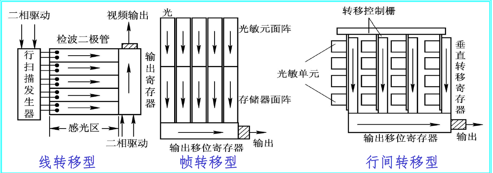

所有CCD电荷信号被变成电压/电流信号输出后，对应每个像素信号都不足以被外部电路按照标准电压进行变换处理，**需要在输出端口串联精密放大器进行放大处理**，尤其要保证放大器的带宽（为了保障在曝光时间间隔能够完成对图像的读出，读出电路的时钟信号频率要比曝光频率高得多）和噪声（防止图像产生色偏）都要非常小，这使得整个传感器的**功耗大**、**面积大**。此外，在制造过程中，只要出现一个像素结构的异常就会导致传感器感光单元全部报废，因此**CCD良品率始终不高**

一个经典行间转移面型CCD芯片的全局结构如下图所示，可以看到在光敏单元输出部分串接了运放

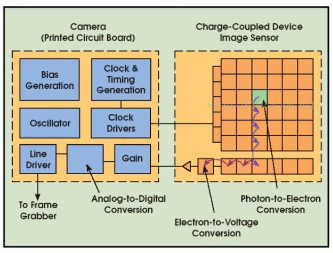

在图中左侧部分，增益调节（Gain）和ADC被统称为**模拟前端**（Analog Front End，**AFE**），在CMOS传感器中也有类似的结构，我们会在下面讨论。而Line Driver则是CCD传感器的数字部分，它负责将传感器的输出信号整理成标准电平和时序以适应统一的图像传感器协议（比如DVP、MIPI等），或者让采集到的原始数据直接以串行输出（RAW）

### CMOS

见文知意，CMOS之所以叫CMOS，就是因为它是基于CMOS（互补金属氧化物半导体）工艺制造的。其采集光信号再转变成电荷包的过程和CCD一模一样，使用的也是MOS光敏元，但在这里它可以采用被称为**光电二极管**的标准单元设计，因此非常容易加入CMOS大规模集成电路中。

光电二极管看起来很像CCD部分介绍的电注入法结构，由一个栅极和一个N有源区构成。版图上光电二极管的尺寸会做的很小，这就导致每个光敏元产生的电荷都非常微小，还会由于沟道长度和单元间距产生漏电问题，需要搭配外部供电才能很好地工作，因此CMOS的基本像素单位被称为**有源像素传感器**（Active Pixel Sensor，**APS**）。结构如下图所示

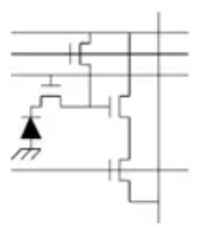

在曝光前，先对光电二极管进行**充电**：在栅极施加反向偏压，让P衬底中的多子（空穴）集中在势阱；随后进行**感光**，让晶格吸收光子产生电子和空穴进行配对，形成光电流；完成感光后，光生电荷就等于初始状态的电荷减去当前势阱内容纳的电荷，由于栅极电容不变，也就等于初始状态的电压减去当前电压，这就建立了从电荷到电压的映射关系。这时候只需要让光电二极管**放电**，把电压信号输出，让后续电路处理即可。因为是电压信号，每个APS信号输出就不能使用沟道了，必须使用*模拟开关*（实际上就是一个工作在线性区的且经过设计放大倍数接近1的CMOS三态门）才行

由于每个APS产生的电信号都比CCD的MOS光敏元产生的信号更加微小，因此**每个像素都被分配了独立的信号放大器**。这样的结构就让像素信号在输出前就被放大到了可以接受的程度（CCD受到结构限制，无法采用类似的方法来减小对精密放大器的依赖），这又让放大器的**带宽要求降低**了。同时，由于信号被放大，还有多个行列开关同步控制，CMOS图像传感器的**读出速度**要比CCD**快**很多。同时，CMOS工艺还能受到摩尔定律带来的红利，让CMOS传感器的**集成度变高**、工艺要求下降，**成本**也就**低**了不少。

然而，CMOS有一个致命的缺点：**固定噪声大**。CCD传感器使用统一的运放，“一夫当关”导致所有输出信号的噪声都是相同的，一致性很好；CMOS采用每个像素独立的运放，这就让每个像素输出信号的噪声依赖于对应运放的噪声——读者可以考虑这样一个情形：每个电阻的噪声都是1ppm，100个串联电阻带来的噪声会是多少呢？图像的信息是连续的（虽然人眼不一定能区分得出来），每个像素和相邻像素的噪声都可以视为“串联的结果”

答案是100ppm。不难想象，各个放大器不一致会带来**大固定噪声**。这便是当前CMOS还没有完全替代CCD工艺的主要原因

此外，CMOS的感光部件面积也被APS外围器件和放大电路挤占了，同时受到CMOS工艺的影响，光电二极管不会被给出太大的片上面积，**受光率**要远远**小**于CCD

> 除此之外，CMOS和CCD还有区别：
>
> * CCD制造全局快门的成本很低，只需要使用单一信号控制的转移控制栅在同时对光敏元信号读出即可；而CMOS每个光敏单元都需要使用独立的外部供电管和模拟开关管理信号读出，因此主要以卷帘快门为曝光方式，**全局快门的面积开销更大**。
> * CCD的读出电路需要外加12/18V的高电压才能驱动电荷移动，其耗电量为CMOS的8到10倍，高驱动电压还要求更精密的电源线路设计和耐压强度，这对整个器件的设计都有影响；但CMOS采用主动采集，且传输电压信号，这让其**整体功耗低得多**

在CCD作为主流的年代，生产成本高、集成度差、能耗高是其三大弊端；随着CMOS技术的兴起，固定噪声、低灵敏度则一直困扰着它。不过随着半导体技术的发展（摩尔定律），CMOS特征线宽越来越小，同样面积上能做的电路越来越多，这样留给APS的面积也就越来越大，比例越来越高

> CMOS是典型的模拟混合电路，也正是于此原由

总的来说，CMOS替代CCD已经是业界趋势，随着CMOS工艺的发展，其弊端也能够被更好地抑制。不过目前几乎所有的线型图像传感器都采用**单行或双行CCD架构**；面阵型图像传感器则采用**行间转移CMOS架构**，可见CCD还不是那么容易退出市场，CCD工艺的基础设计思想则已经贯彻在了现代CMOS器件之中。

而随着半导体技术的发展，更多新设计被应用在CCD和CMOS上，这让二者的固有问题都得到了部分缓解，下面介绍一些能够在现代图像传感器上被广泛使用的设计

### MEMS构件和堆叠设计

CCD和CMOS都依赖MOS光敏元或者说光电二极管，它在感光的状态下只能输出表示当前位置光强（灰度值）的信息，并不能输出彩色信号，怎样才能获得彩色信号呢？

目前最普遍的方法就是**拜尔阵列**（Bayer）：这是由四个APS构成的排列，每个APS只负责处理一种颜色的光，通过在上面覆盖**MEMS滤光片**可以很好地实现这一需求，四个滤光片按“红绿绿蓝”（RGGB）组成的2x2单元格排列起来。于是整个感光单元的排布就像下图

这样我们便能得到传感器对不同颜色光的响应情况。至于为什么拜尔阵列使用RGGB排布，这就要先从人眼对光线的敏感度特征说起

通常的光源都由多个波长的光组成，每种光的功率都不一样。如果画出每种波长的功率和它的波长之间的关系，我们可以得到光源的**功率谱分布（SPD）**

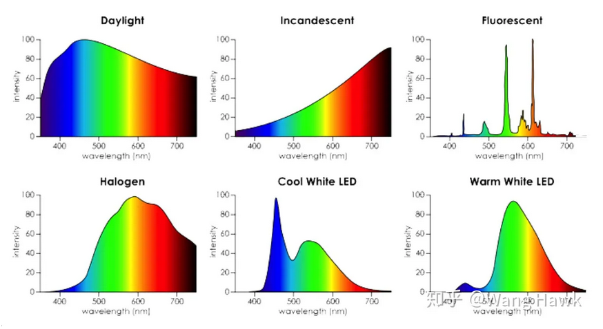

而传感器对不同波长的入射光线会有不同的敏感度，使用**光谱敏感度函数（SSF）**来描述。实际上我们在之前所说的MOS光敏元响应函数就是入射光SPD和传感器自身SSF乘积对入射光波长的积分
$$
R=\int_\lambda \Phi(\lambda) f(\lambda) d\lambda
$$
人眼也是如此。人眼视网膜上的视锥细胞有三种，分别对可见光的RGB波段敏感；而负责在暗光环境下感光的视柱细胞对绿色最为敏感。**拜尔阵列是对人眼感光的模拟，因此它选用了RGGB排布**。实际上色彩空间也可以由CYYM或RYYB来描述，这些颜色在光谱上覆盖范围更广，允许更多光线通过传感器，但处理起来相对复杂，所以没有大面积普及。

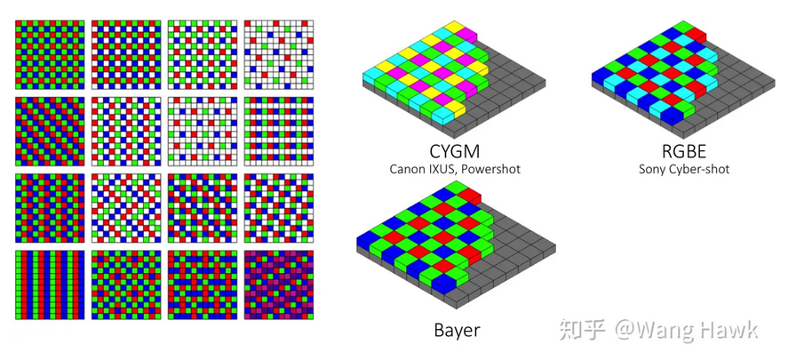

> 其实每个型号的CMOS传感器的SSF都可能不同，这是因为厂商都在追求“看得最舒服的颜色”而进行调色

这样的传感器已经能够用不同颜色的亮度值（灰度值）来表述三原色RGB了，但很显然原始图像（所谓的RAW格式）是完全不能看的，它并不能直接显示出颜色，即使通过**去马赛克算法**获得彩色图像，也会因CMOS的固定噪声和低灵敏度呈现出模糊的暗斑和亮点，这就需要通过ISP（Image Signal Processor，图像信号处理器）对原始数据进行处理，这会在后面的部分介绍

让我们回到CMOS传感器。理想情况下经过颜色滤光片，每个像素都只能感受对应颜色的光，但在追求光敏单元高密度的过程中，难免出现“像素间串扰”，这也是同时困扰CCD和CMOS的问题。

> 串扰（Cross Talk）被定义为：单个像素不能完全被一个颜色通道的光所激发的情况

我们使用另一种MEMS工艺来解决这个问题：**微透镜阵列**（Micro Lens）

通过在光敏元和颜色滤镜上再覆盖一层球状凸透镜阵列，可以让照射光敏元边沿的入射光折射回光敏元中央，从而让电荷包能够收集到所有光线

于是我们就得到了CMOS图像传感器*曾经*常见的堆叠结构：**正照**式（FSI）CMOS

很明显，正照式CMOS存在缺点：在每个像素位置，需要占用一定的面积来用作处理电路，因此CMOS的开口率远不如几乎能100%开口率的CCD。而为了提高开口率、增加感光面积，又需要挤占信号处理单元的空间，在老式CMOS传感器电路中，甚至只用一个BJT或MOS来做放大器，这就导致非常差的一致性，固定模式噪声严重；同时，像素尺寸的小型化也受到信号处理电路的限制，相同数量的像素需要更大的面积来布局

为了解决正照式的缺点，**背照**式（BSI）CMOS应运而生。它把感光像素与金属互联放置在硅片的两端来解决问题。正照式的微透镜让光线穿过硅片上方的多层Metal聚焦到硅片上的栅极，这需要让像素相隔很大距离才能实现；而背照式的光电二极管栅极可以紧密排布，透镜尺寸也可以缩小

在背照式传感器中，像素*背面*的整个面积都可以用来接受光线，因此开口率也和CCD传感器一样接近100%了。而CMOS传感器独有的信号处理电路放在像素正面一层。这样每个像素的信号处理电路相对不受面积制约，也能够获得更多金属层以支持更复杂电路的布线，因此可以做成比较复杂的放大器，比如带负反馈的差分运放，一致性会大大提高从而降低固定模式噪声。

不过背照式传感器对工艺提出了更高要求：常规半导体的厚度约为100微米左右；但背照式CMOS传感器厚度仅有3~4微米。正照式CMOS只需要保证受光面平整即可，对背面的均一性并无特殊要求；但背照式CMOS必须严格保证正反两面均极其平整

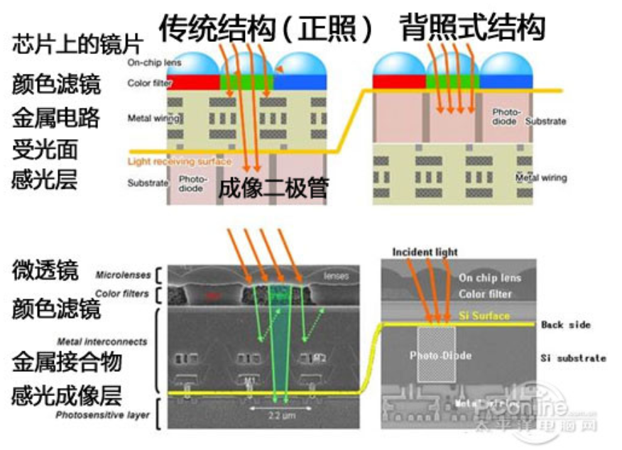

目前最新的设计是**堆栈式**照明（Stacked Illumination）CMOS。它将旁置的信号处理电路放到了底部支持基板上，实现在小尺寸传感器上集成更多的像素。由于像素部分和电路部分独立，像素部分可针对高画质优化，电路部分可针对高性能优化，甚至采用不同制成来获得更高性能和密度

### 模拟前端

现在我们终于从光电传感器来到了更熟悉（？）的数模混合电路。是时候讲讲模拟前端三大组件了。

首先我们能看到从传感器输出的所有信号会统一串行经过一个精密运放，这就是增益调节（**Gain**）。增益调节通常等效为对光圈的设置，这是很容易理解的

放大后的模拟信号会由一个精密高速**ADC**转换成通常是10bits~16bits的数字信号。这一部分是优秀CMOS设计的关键，SAR ADC和Σ-Δ ADC是最常见的两种，前者具有更高的采样速率、后者则具有极高的精度

最后，数字信号会通过查找表（**LUT**），它用于在一定的范围内修正传感器响应的非线性，同时还可以修复一些损坏的像素的输出

最后，经过修复的数字信号再进入接口控制器，就可以以DVP或者MIPI或者RAW格式输出给ISP器件了

## ISP和后处理

### ISP

**利用工具加载和解析RAW格式图像及元数据。****处理黑电平和饱和值，得到有意义的线性图像信息****根据元数据中包括的相机校正信息进行数据校正****白平衡，特别是如何利用相机记录的信息进行白平衡校正****去马赛克，我会特别提到不同类型的去马赛克方式****颜色空间转换。我们会看到如何将图像中记录的颜色信息从相机的原始颜色空间转换到标准的sRGB颜色空间。这里面需要用到相机的颜色校正矩阵，它们通常存储在RAW文件的元数据之中。****Gamma校正，将图像变为人眼看起来美观的图像。****压缩和保存**
