# 三维重建1【计算摄影基础】

本系列博文旨在构建从底层CMOS传感器硬件到顶层算法的三维重建全栈知识架构，但重点在于图像信号处理和三维重建算法。希望能记录自己在学习三维重建过程中学到的知识，并为各位读者指明学习方向，抛砖引玉。

主要框架参考[Yvon Shong](https://www.zhihu.com/people/yvonshong/posts)和[Wang Hawk](https://www.zhihu.com/people/hawk.wang/columns)的博文撰写，其他参考资料包括《智能传感技术课程PPT》、冈萨雷斯《数字图像处理》

让我们从基础知识开始，首先来看看现代数码相机是怎样获得一张照片的

## 计算摄影概览

现在一个相机可以大致分成三个部分：**镜头**、**传感器**、**控制电路**。物体上传来的入射光穿越相机镜头进入传感器，传感器集成了读出电路，可以把光信号转化的电信号发送到主控SoC，最后交给相机内的图像处理系统转换成最终的RGB图像，并存储起来或者显示在LCD上

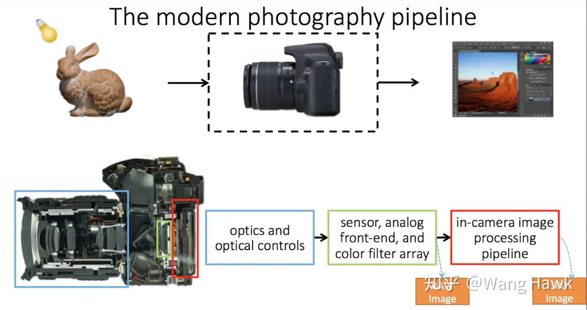

**镜头**是一个独立的大部件，它可以和相机机身分开，镜头处理光学部分，机身处理光电混合及电学部分。因此这里先抛开镜头，来看看电信号是怎样被采集、传输、转换的

照相机的基本工作原理是**小孔成像**，经过放缩的物体的实像被投射到光电传感器平面，光信号首先进入下图绿色框表示的**CCD**或**CMOS**光电传感器，转换成电信号，通过内部集成的模拟前端采集后以**RAW**格式输出。RAW图像只给出了每个像素点的亮度信息，需要使用下图红色框表示的**ISP**（Image Signal Process，数字信号处理）算法来进行处理才能得到人眼可辨别的图像。

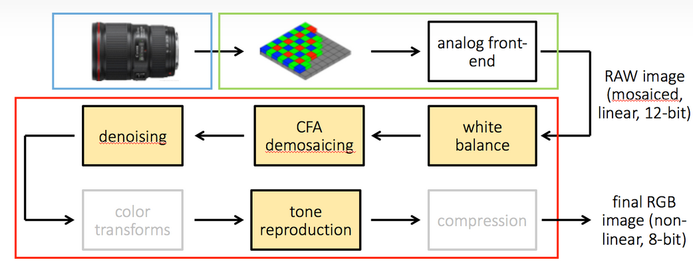

第一步是进行**白平衡**（WB）处理，它的作用是让人眼感知为白色的物体在最终的成像中也为白色，即对图像的颜色进行矫正。接下来是**去马赛克**（Demosaicing），这一步的目的是将RAW格式图像（每个像素都是单通道，只包含亮度信息，但其位置排布包含了不同的颜色信息）恢复成带有颜色信息的RGB/YUV格式图像（每个像素都是三通道，包含RGB或YUV三种信息，也是我们日常生活所能看到的带颜色的图片）。然后对图像进行**去噪**（denoising）。未经处理的图像通常会包含很多噪声，表现为图片上的黑点，这一步就是要让图像变得“平滑好看”。下一步是对图像进行**色调重建**（Tone reproduction），这步也叫做**Gamma矫正**。传感器对入射光强的响应是线性函数，人眼对输入光的响应也是线性的；但人的感觉却是非线性，且对暗光会更加敏感，可以用Gamma函数来近似描述人对输入光强的感觉；而显示设备相对输入图像的明暗信息响应也是非线性的，且对亮光信息更加敏感。在三者的共同作用下，就需要在相机内部对图像做一次Gamma校正来让图片看上去更加“舒服”。

经过上面的步骤，我们就能得到RGB/YUV格式的图像了。如果设备是照相机，完成这些处理以后就可以把照片压缩成JPEG格式或者以其他高级的媒体压缩格式保存到存储器中，或者直接将图像显示在LCD上。

以上所有内容就是照相机或者说摄像头的全部工作流程。其中涉及到光学、光电传感器、数模混合电路、高速数字电路、图像处理和人工智能算法等复杂的知识，本系列博文要着重强调的还是其中涉及电路和算法的部分，本篇的剩下几章主要是对光学、传感器部分进行介绍，并对ISP所需要做的工作做概括性描述。

## 摄影光学基础

看完了照相机的工作过程，我们回到之前没有提的光学部分，看看光线进入照相机的第一步

### 小孔成像

摄像头或者说摄像机的基本原理就是小孔成像，用到的各种光学镜头也都是为了弥补小孔成像的不足。

> 笔者觉得自己的讲述实在不如原文来得好，这里直接放上来自https://zhuanlan.zhihu.com/p/95059112的文段

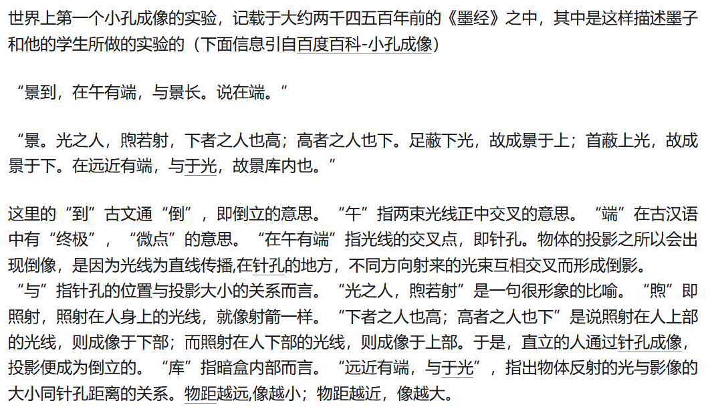

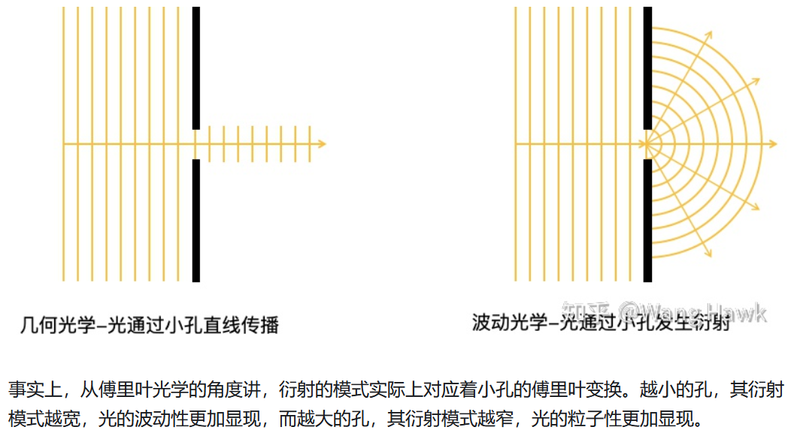

> 好的，原文就放到这里。原文后面还有大量关于小孔成像一般性原理的介绍，笔者决定讲其修改后放到后面的部分介绍

### 镜头

理想的小孔可以很好地成像，但通过上面的介绍我们已经知道，具有一定尺寸的真实世界的小孔会产生产生光的衍射（小孔太小）或同一个像点的光会来自于多个物点（小孔太大），二者都会导致成像模糊，让图像噪声很大。因此只有在两者之间某个平衡的尺寸，才能让成像既比较清晰，又具有较低的噪声。

我们可以用**薄透镜模型**来改进小孔模型。薄透镜模型是一种简化的镜头模型，它是现实中设计非常良好的镜头组的模拟。它有两个关键的假设：

* **穿过光心的光线会直线传输**
* **平行光穿过镜头后，会汇聚到焦平面上的一点上**

如果一个物点发出了一束光穿过薄透镜，那么

* 穿过光心的光线会直线传播
* 其他光线会汇聚到焦平面的一点（焦点）

如果是从一个平行于镜头的平面上发出的光线穿过薄透镜，那么

* 所有光线汇聚在同一个平面

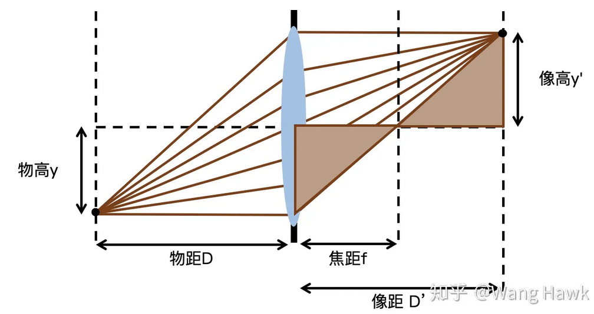

于是有薄透镜成像公式
$$
m=\frac{f}{D'-f}
$$
且
$$
\frac{1}{D'}+\frac{1}{D}=\frac{1}{f}
$$
其中m是*放大倍数*

> 特别地，当f=D‘时，又m=D=∞，这意味着无穷远处的物体通过透镜后会在焦点处成像，即**平行光通过凸透镜汇聚在焦点**；而当f=D/2时，有m=1，此时成的像和物体大小一致
>
> 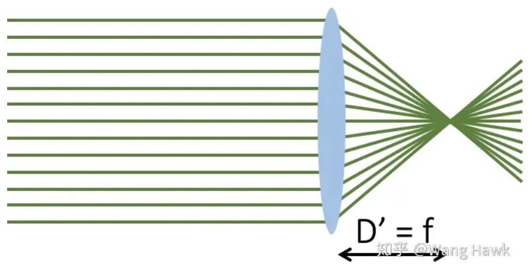
>
> 

上面讨论的是一维视角下的情形，而实际上相机会把三维物体映射为二维影像，我们这里考虑三维物体的一个二维面。从物体上一点发出的光线通过透镜后在像平面上会变成一个二维投影，镜头是圆形的，那么这个投影就是圆形的——这才是真实世界发生的情况，如下图所示

我们通常称这个投影为**弥散圆**（Circle of  Confusion）：**当恰好对焦时，弥散圆的直径为0，我们才能看到一个成像点**，这和一维情形一致；但当像平面不动，物点逐渐偏离可以恰好对焦的平面时，我们就会观察到像点逐渐变成了一个圆（也不一定是圆形，这和透镜的形状有关，获得的像总是和透镜外形一致的投影）。由于人眼感知能力有限，当弥散圆直径还没有超过某个阈值时，我们还认为投影是一个点，即成像还是清晰的，只有超过这个阈值时，成像才会变得模糊，这个阈值被称为最大**允许弥散圆**（Permissible Circle of Confusion），*其直径用δ表示*

因此在一定的像距下，要让一个物体清晰成像，物距必须处在一定范围内，这个范围称为**景深**；如果物距不在景深区间内，成像就会模糊。景深是相对的，不是绝对的，且与弥散圆直径的取值大小有着直接关系

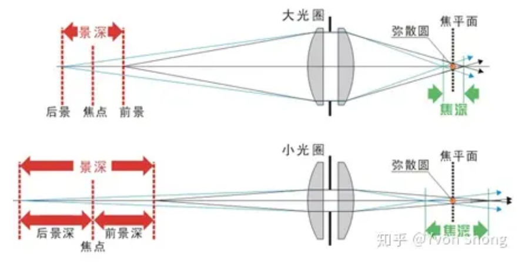

景深随镜头的焦距、*光圈*、物距的不同而变化。景深和焦距的平方成反比：焦距越大，景深越小。景深和光圈值成线性关系，光圈值越小，景深越小。景深和物距成二次方关系，物距越远，景深越大

> *光圈*的含义会在后面曝光三要素一节介绍

我们可以用下列公式描述**前景深**
$$
\Delta L_1 =\frac{F\delta L^2}{f^2 +F\delta L}
$$
**后景深**
$$
\Delta L_2 =\frac{F\delta L^2}{f^2 -F\delta L}
$$
**景深**
$$
\Delta L=\Delta L_1 +\Delta L_2 =\frac{F\delta L^2}{f^2 +F\delta L} +\frac{F\delta L^2}{f^2 -F\delta L} =\frac{2f^2 \delta L^2}{\frac{f^4}{F} - \delta^2 L^2 F}
$$
对其进行近似可以得到
$$
\Delta L \approx \frac{2 F \delta L^2}{f^2}
$$
其中F是光圈值（镜头的焦距除以光圈口径），δ表示最大弥散圆直径，L表示物距，f表示焦距

> 存在一个被称为“超焦距”的特殊情况
>
> 当镜头对焦在无穷远时，景深前界（离镜头最近的一侧景深边界值）到镜头的距离称为**超焦距**。从超焦距点到相机一半的距离开始到无穷远都是清晰的
>
> 此时景深前界
> $$
> L-\Delta L_1 =\frac{d}{2}
> $$

现在我们可以用薄透镜模型来替代小孔模型了，它是能够在现实世界实现的——但模型终究是模型，两个基础假设就要求*透镜没有厚度*，事实上是不可能的。因此为了让真实的透镜像薄透镜一样，一般是需要把多个镜头组合到一起，互相补充，从而形成一个透镜组。我们通过不同的凹凸透镜组合、距离调整，就得到不同的**镜头组**。

常见的镜头组如下图所示

1. **长焦**镜头：长焦镜头的焦距比较长，要比感光器件的对角线大得多，可以把远处的景物拍得较大。

    目前常见的焦距有135mm、150mm、200mm 、250mm 、300mm、500mm、1000mm等，可分为中长焦镜头（焦距150mm以内，视场角在20°左右）、长焦镜头（焦距150mm到300mm之间，视场角在10°左右）、超长焦镜头（焦距300mm以上，视场角在8°以内）三种

    **由于焦距越大，景深越浅，长焦镜头看到的图像背景更加的模糊**

2. **标准**镜头：标准镜头的视场角从40°到55°，常见的焦距为45mm、50mm、55mm、58mm等。

3. **广角**镜头：广角镜头焦距一般大于25mm，视场角在90°以内；超广角镜头的焦距在16~25mm之间，视场角在 90°~180°之间

4. **鱼眼**镜头：当焦距小于16mm，视场角超过180°，则称为鱼眼镜头

    > 目前世界上最大的鱼眼镜头视场角可达220°，这种镜头的第一片透镜像鱼眼一样突出在外面，形状像金鱼眼睛

5. **微距**镜头：为了对距离极近的被摄物也能正确对焦而设计的镜头，其镜片被拉伸得更长，从而让光学中心尽可能远离感光元件。微距镜头的外形细长，像一根笔杆一样

6. **移轴**镜头：能通过改变镜头组相对于成像平面的光轴，来改变观察到景物的透视关系的镜头

7. **折返**镜头：用来实现非常超长焦距的镜头。光线入射后会经过一次或者几次反射再到达成像元件从而减小镜筒长度

8. **变焦**镜头：可以动态改变焦距的镜头，现在大多数单反相机的镜头都是变焦镜头。只不过变焦镜头只能在有限的范围内变焦，所以在设计时还需要单独确定镜头属于长焦、标准还是广角。变焦镜头比定焦镜头外观上多了一个变焦环

> 补充一下**视场角**的概念：视场角是从像平面看所能观察到景物的范围。对同一个镜头，当物体离镜头更近时就要增大像距才能对焦，此时视场角会减小；如果是变焦镜头，扩大焦距时，需要增大像距才能对焦，此时视场角也会减小
>
> *不同焦距的镜头视场角是不一样的*，这就是用焦距和视场角来区分镜头类型的原因

尽管能够通过镜头组来得到理想薄透镜的效果，但还是存在一些成像误差

* **色差**

    由于**镜头对不同波长的光线具有不同的折射率**，就会产生色差。色差主要有两种：一种叫**纵向色差**，这是由于光线穿过透镜后无法对焦到同一平面上导致的

    > 一般的镜头对短波光折射率大，长波光折射率小

    

    将两片不同材质、不同折射率的镜头组合到一起组成对称结构，能一定程度减弱这种现象，但无法完全消除

    

    还一种是**横向色差**（也叫**倍率色差**）。透镜的放大倍数也随光的波长而变化，不同波长的光也可能会聚焦在像平面的不同点，从而在它们之间出现彩虹一样的色带（尤其是高对比对区域）。倍率色差是折射率与视场的函数，可以通过移动孔径位置或者透镜间距的方式校正，通常使用折射率不同的透镜组成对称结构来进行修正，但同样只能减弱而无法杜绝

* **球差**

    薄透镜模型要求平行于光轴的所有光线穿过镜头后就汇聚到焦点，这其实是要求镜头的剖面是一个双曲线。但实际镜头并非双曲面，大多数是球面的，因此光线穿过后并非对焦到同一点，这就会导致画面的模糊

* **场曲**

    

    在透镜组中，常常会发生成像平面变成一个以主轴为对称的弯曲表面的情况（像平面为一曲面），这时候就会出现场曲误差。这会导致当调焦至画面中央处的影像清晰时，画面四周的影像模糊；而当调焦至画面四周处的影像清晰时，画面中央处的影像又开始模糊。

    场曲与孔径大小无关，所以缩小光圈无法去除，但可以在单个透镜前面再加一个透镜，二者方向对称，从而有效减小场曲

* **慧差**和**像散**

    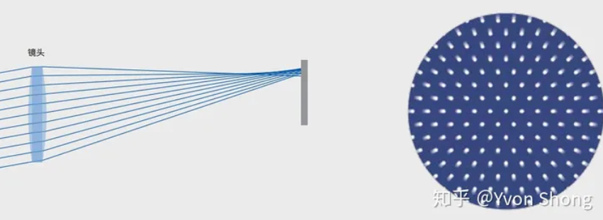

    受到工艺限制，透镜不同位置的折射能力总会存在差异。因此即使理想的平行光入射后，也无法聚焦到焦点，在垂轴方向也不与主光线相交，即相对主光轴失去对称性。因此会导致光线在理想像平面处不能成清晰的点，而是映射为一个彗星状的不对称光斑。这种情况被称为*慧差*

    慧差是光学孔径和视场的函数，与透镜形状息息相关，一般可以通过组合使用对称结构的正负透镜来矫正

    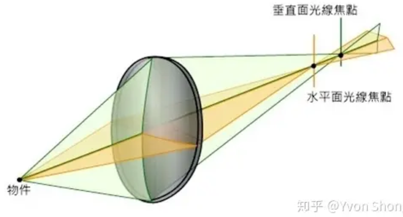

    进一步地，在二维情况下，物体上某点发出的光经折射后可能会出现水平和垂直方向的焦点不一致的情况，这时就会成一个模糊的光斑实像。此时水平和垂直方向的焦距之差被称为*像散距离*

    像散是视场角、透镜形状、孔径位置的函数，与孔径大小无关，同样可以使用对称结构的正负透镜来校正

    场曲、慧差、像散的出现都是由于透镜工艺限制无法实现连续一致的折射率

* **畸变**

    平面物体主轴外的直线经光学系统成像后变为曲线，则此光学系统的成像误差称为畸变。畸变只影响成像的几何形状，而不影响清晰度，这与球差、场曲、慧差、像散有着根本区别。

    畸变可以分成**桶形畸变**和**枕形畸变**

    

    **桶形畸变**：图像放大倍率随距光轴的距离而减小，导致镜头外围成像的点向边缘弯曲（看起来被压缩）。

    **枕形畸变**：图像放大倍率随距光轴的距离而增加，导致镜头外围成像的点向中心弯曲（看起来被张开）。

* **波差**

    从波动光学的角度看透镜，一个物体的像就是一个复杂的艾里斑。由于像差，经透镜组形成的衍射波组成波面不再是规则的球面，从而导致入射光波和衍射光波会形成一个光程差，这被称为波像差，简称波差

    

### 光的度量

**光通量Φ**：单位时间内由光源所发出或由被照射物体所吸收的光能，单位是流明lm

亮度L：光源在给定方向上单位面积单位立体角内的光通量，单位坎德拉每平方米cd/m^2

**光强I**：光源在给定方向上单位立体角内的光通量，单位坎德拉cd。亮度对发光面积分就可以得到光强

**照度E**：每单位面积吸收可见光的光通量，单位勒克斯lx。可以用入射光通量除以被照射物体的受光面积得到（E=Φ/S）

**曝光量H**：像平面的照度与曝光时间的乘积，即照度对时间积分，H=∫Edt。曝光量的倒数**S**=1/H被称为**感光度**

很明显，当底片或者说光电传感器吸收的光强越大、时间越长即曝光量越大，得到的图片色彩就更亮

### 曝光三要素

相机传感器的三个重要参数：**光圈**、**快门**、**ISO**决定了曝光量和成像效果，它们被称为”曝光三要素“

首先来介绍**光圈**，这个概念在前文也有出现，它指的是照相机镜头中控制光线的叶片装置。如下图

光圈就相当于小孔成像中的小孔，只不过实际的光圈通常不是圆形的，而是机械结构导致的多边形。可以调整光圈大小来调节透镜的通光量，光圈中心开口的大小代表光圈的数值，用F系数表示。**光圈数值F越小，孔的开口越大，有更多光能通过镜头，因此曝光量越大**

> 通常在拍摄时所说的“开大光圈”是指把光圈的数值调小、让光孔开大

**光圈的值通常是$\sqrt{2}$的倍数**（公比为1.4的等比数列），比如f1、f1.4、f2、f2.8、f4、f5.6、f8、f11、f16、f22、f32。当光圈半径呈$\sqrt{2}$倍关系时，面积就会呈2倍关系，通光量也呈2倍关系

> 在后文中可以了解到，在现代的CMOS图像传感器中，光圈也可以通过人工设置一个增益值Gain，将所有像素值都乘一倍数来设置（光圈可以部分看成镜头成像明暗的参考量）

下面是**快门**。快门用于控制入射光照射到传感器上的时间，光圈控制H=∫Edt公式中的E，而快门就控制了dt。我们可以通过调节快门开闭时间长短和开启的空隙大小来调节曝光量

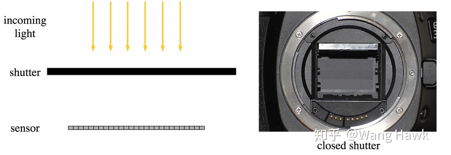

上图展示了快门关闭时的样子，它实际就是挡在底片或传感器上方的遮光帘。

快门参数基于速度标定，如1/4、1/8、1/15、1/30 、1/60、1/125等。它们之间是倍数关系，指的是几分之一秒的曝光时间，因此通过快门的曝光量也呈倍数关系

快门根据开启的方式分为**全局快门**和**卷帘快门**，上图就展示了一个典型的卷帘快门。全局快门不容易使用机械结构制造，一般来说只能通过电路让感光元件上所有的感光小单元同时感光来实现，制作工艺要求高，一般只用在CCD传感器或高端的CMOS传感器上。不过随着近年来半导体技术提升，已经有越来越多的图像传感器可以使用高速全局快门了

卷帘快门是让感光单元从上至下逐行曝光，开启时就如下图所示，CMOS图像传感器之间暴露在外界，接受曝光

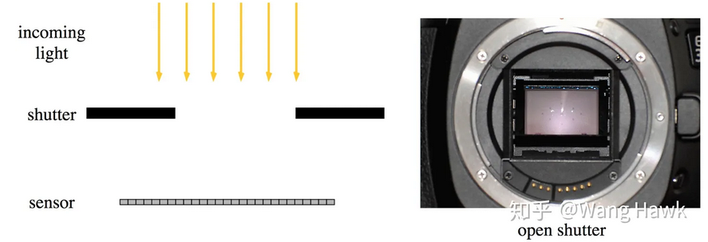

卷帘快门在慢速快门和高速快门下，工作方式是不一样的：快门**慢速工作**状态下，机械快门有前后两个帘幕，后帘幕靠近图像传感器，曝光时它从下至上先打开，接着靠近镜头一侧的前帘幕从上至下再打开，此时光线从上至下照进传感器。再接着后帘幕从上至下关闭，光线也从上至下慢慢消失，前帘幕再关闭，结束曝光。以上步骤可以使传感器曝光非常均匀，照片不会产生太大的形变。**高速工作**状态下，不能依靠两个帘幕分别开关来工作——很耽误时间——于是用固定缝隙扫过感光元件的办法来实现等效“曝光时间”。高速的卷帘快门控制一个曝光条从上至下依次扫过感光元件，让感光元件的总曝光时间一定，但曝光区域的位置一直在变化，其中一帧如下图所示

快门速度越高，就让曝光条越窄、扫过感光元件的速度越快，这样曝光时间就越短。

过慢的快门速度会导致一张照片中从上到下反应的其实并不是同一个时刻时的景物状态，引起被称为**果冻效应**的图像失真（使用全局快门可以直接消除这个问题，再慢的快门速度也不会导致果冻效应）。当相机以较慢的速度逐行扫描图像传感器时，如果在曝光过程中被拍摄物体相对于相机发生了高速运动或快速振动，就会导致图像出现不稳定的情况，比如倾斜、摇摆不定或明暗不等

> 在拍摄高速运动的物体时，如果快门速度不够快拍摄的图像会模糊、拖尾，而横向运动的物体
>
> 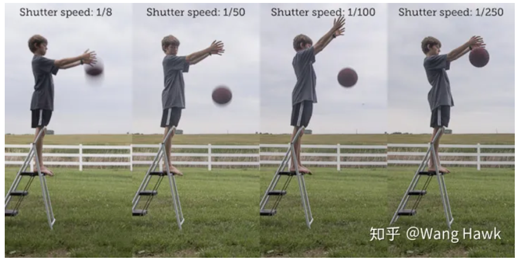

卷帘快门的另一个问题就是会导致**难以实现闪光同步**以及**频闪**现象

闪光同步指相机的快门速度至少应该能保证在闪光灯工作的时间段内感光元件都接受到曝光，但当快门速度高于临界快门速度时，成像元件不能全部同时接收光线，照片的曝光严重不均匀（因为闪光灯的脉冲时间非常短，在1/200 s~1/500 s之间，亮度随时间迅速变化），这就使得照片上只有一个窄条曝光正常，其余部分因为没有接收到足够的曝光而显得很暗，只有当相机的快门速度低于这个临界速度的时候，闪光灯才能和相机快门同步，保证成像元件的各个部分同时曝光

至于频闪现象，笔者在这里推荐读者直接观看[影视飓风的科普视频](https://www.bilibili.com/video/BV1ua4y127pk/)，可以发现它和闪光同步的原理类似，都是由于照片曝光时亮度不均匀导致的问题

三要素中，除了光圈、快门，还有一个要素是成像元件的感光度，在摄影中我们用感光度的国际标准**ISO**指代。

*感光度是从老式胶卷继承而来的概念*。ISO数值越高就说明胶卷感光材料的感光能力越强，在目标曝光量一定的条件下，感光度越高，对光强、曝光时间的要求就越低——更低的光强能激发更大的曝光量，通俗一点说ISO就是衡量胶卷需要多少光线才能完成准确曝光的数值。ISO数值越大，胶卷对光线的敏感程度就越高，ISO 200胶卷所需的曝光时间是ISO 100胶卷的一半；但使用高ISO的胶卷带来的噪点也相对的大（受到暗光影响更显著）

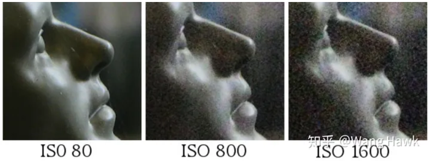

对于现在的CCD/CMOS光电传感器，也存在感光灵敏度高低，只不过**本质上是模拟放大电路给到信号的增益**，详细的电路内容会在后文中叙述，这里只需要简单理解即可：ISO描述了最小需要多少曝光量才能使得传感器的光敏单元被激活。CMOS/CCD厂商为了方便数码相机使用者理解，一般**将传感器的感光度等效转换为传统胶卷的感光度值**，然后可以通过调节传感器的增益控制寄存器来调节ISO

CMOS传感器的感光元件比较特殊，存在*暗电流*，这会导致在没有光线照射传感器时也会出现输出，因此厂商在普通模式下设置了截止电流来防止干扰；但当环境光线暗时，CMOS感光元件的输出电平会处在较低水平，需要使用一个数控放大器按照对应ISO数值提供增益，把输出电平抬高到便于采集的区间；但同时，暗电流导致的噪声也会被放大，这反映到图像上就是随机的**噪点**

> 暗电流会在后文中介绍

虽然高ISO的传感器在噪点方面存在问题，但为了获得更高的快门速度和更明亮的画面，这也算是一种不增加成本的折中解决方法：低ISO适合营造清晰、柔和的图片，而高的ISO值却可以补偿灯光不足的环境

曝光三要素共同作用下才可以对传感器的曝光量进行控制，光圈大小控制曝光的**孔径**；快门速度控制**曝光时间**；ISO则控制曝光的**感光度**。**三者可以通过不同的组合来得到相同的曝光量**，比如同一个ISO下，光圈F8、快门速度1/30得到的曝光量，和光圈F5.6、快门速度1/60，以及光圈F11、快门速度1/15三者得到的曝光量是相同的。这样，摄影师可以根据自己的目的来选择光圈、快门速度和ISO

不过三者各自还有不同的特点：

* 光圈越大，曝光孔径越大，进光量越多，景深越小
* 快门越慢，曝光时间越长，进光量越多，越容易引起果冻效应，运动的景物更容易模糊
* ISO越高，传感器在暗光下的效果越好，但噪点越多

现在的传感器一般都会带有自动曝光功能，这就是让相机根据用户的预设，在自动曝光算法的控制下自动控制曝光三要素的值，从而让用户无需关心繁琐的调节过程，常见的预设如下图所示

## CMOS和CCD传感器基础

> 美国科学家威拉德·博伊尔和乔治·史密斯1969年共同发明了CCD图像传感器。二人在2009年被共同授予诺贝尔物理学奖。CCD自1970年问世以来，因其独特的性能而发展迅速，开创了数字影像时代

CCD是最早一代图像传感器结构，其造价相对高、成像效果相对好。以前高端设备会采用CCD，而中低端产品才会采用CMOS；而现在的CMOS工艺传感器已经和CCD传感器有相当的性能了，同时造价低廉，因此大多数消费级和工业摄像机已经采用了CMOS传感器（虽然在有特殊要求的高端领域还是需要使用CCD）

CCD传感器的结构和CMOS传感器大同小异，二者最主要的区别还是在于工艺，就让我们从CCD开始讲起

### CCD

电荷耦合器件（Charge Couple Device，**CCD**）是一种基于MOS的大规模集成电路光电器件，其基本结构如下图

其由大量**MOS光敏源**构成，实际上就是在单个NMOS或PMOS的基础上将沟道拉长、尺寸做宽并以矩阵形式构造密集排布的栅极Contact，每个栅极小岛由独立的Metal层引出（引出方式在后面讨论）。每个金属-氧化物-半导体接触都相互独立，但又靠的足够近以至于耗尽区边缘相邻，这样的排布会带来特殊的反型层（或者说耗尽区），如下图所示

每个耗尽区对带负电的电子而言都是一个势能很低的区域，称为**势阱**。以基于PMOS的CCD为例，半导体内的少子（在这里是电子）就会被吸引到MOS栅氧接触界面，让耗尽区带负电，这样的势阱被称为**表面势阱**。

当光照射在硅片上时（光子穿过硅结构），光电效应导致半导体硅产生光生电子空穴对，其中光生电子会被附近的势阱吸收，空穴则会被排斥出耗尽区，且**势阱内吸收的光生电子数量与入射到该势阱附近的光强成正比**。存储了电荷的势阱被称为**电荷包**

对于MOS光敏元，我们通常用**量子效率**衡量其光电转化性能，即转换的电子数量与入射的光子数量的比值。当不断改变入射光的强度时，MOS光敏元转换出的电子数量也会发生改变这就构成了**响应函数**——在正常工作状态下，它通常是一个**线性**函数。电荷包的最大容量被称为**满阱容量**。由于硅晶体声子只能与有限数量、固定波长的光子发生吸收碰撞来让电子跃迁，**满阱容量基本上是像素面积而不是体积的函数**，这正好能用来反映入射光的强度信息。不难联想到，当MOS光敏元转换出的电荷让电荷包达到满阱容量时，势阱会饱和，吸收更多光子转换出的电荷会让表面势阱发生扩散，这被称为**过曝**；而在没有光线入射或入射光非常少时，MOS光敏元不会在其下方势阱中积累电荷，但是P衬底中的电子分布是动态且随温度变化的（况且硅晶体中总会出现缺陷导致电子空穴对不均衡的情况），因此总会有部分电子进入到势阱中，就相当于入射光信号被*噪声*淹没了，我们使用**暗电流**来评估电荷产生的电流强度。因此，在光线过强或光线过暗的情况下，**势阱饱和与暗电流导致响应函数不再线性**。

> 在后面会由ISP努力修正这些问题

容易理解，这样的CCD就成矩阵地构造了大量MOS光敏源，每个光敏源就能够表示一个像素的信息。当大量MOS光敏源被排列起来，就可以采集入射光成像的信息了

> 请注意，两个有源区之间的沟道长度和器件宽度是有极限的，因此需要排列大量上述结构组成CCD。其实最简单的方法就是构造由三个或四个独立栅极构成的CCD光敏元，再将其排列起来，这样虽然会损失一些面积（光敏元之间需要隔开并构造有源区），但会让接收到的光信号质量最好

实际上除了上面所说的**光注入法**，还可以通过**电注入法**来产生二维排列信息。在下图中，在第一个栅极旁扩散N区，这就形成了一个PN结，当在N区加正向偏压时，PN结耗尽区的电子会经耗尽层边沿进入Φ1势阱，并通过表面势阱相邻的边沿向Φ2、Φ3扩散。如果施加的只是一个时间极短的正脉冲IGΔt，那么几乎不会发生扩散，Φ1处存储了IDΔt这么多的电荷

CCD的基础结构带来了一个问题：**其将光信号转换成电荷信号**而不是电压/电流信号，这导致它需要一个**读出电路**来把图像信息从MOS光敏元的一个个电荷包中输出到器件外。我们一般选用读出移位寄存器来“转移图像”，从外界看来就是让CCD输出幅度与电荷包成正比的电脉冲序列

> 这样转移电脉冲序列的控制方法非常类似步进电机，相同地，也被分成两相、三相、四相控制方式，通过向CCD的*栅极组*施加特定的序列电压脉冲，就可以逐次把电荷转移出去。这里以三相控制为例，如下图所示
>
> 
>
> 经过一个时钟脉冲后，电荷从前一级转移到下一级的同号电极下
>
> 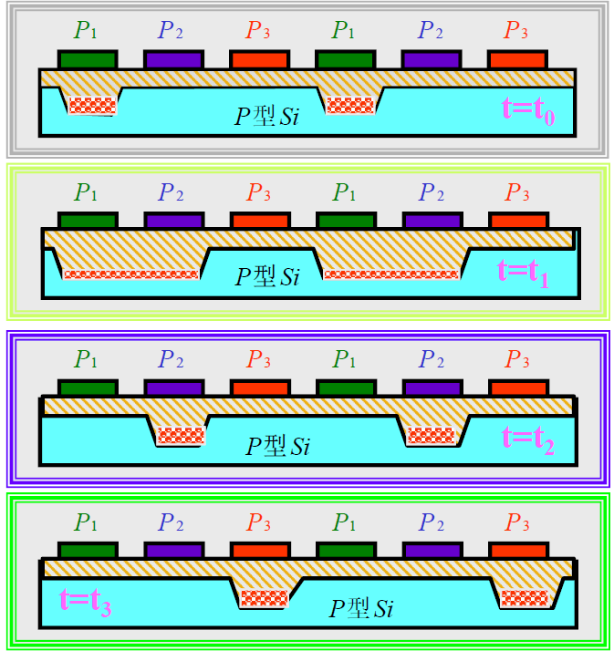
>
> 这样电荷就完成了在CCD内部的转移

移位寄存器也是由MOS工艺制造的，只需要在其表面涂敷遮光材料就可以保证不受光照干扰了

当然，不可能让CCD产生的电荷信号直接输出。如果你学习过电荷型传感器的基本原理就能明白，电荷信号是静态的，需要转换成电流或电压才能被外界获取。因此CCD的输出方式也分成**电流输出型**和**电压输出型**两种

还是以PMOS衬底的CCD为例，通过在衬底上扩散N有源区就可以形成PN结，我们可以构造下列结构

其中OG是CCD单个光敏元最外层的一个栅极，当在其上加正向偏压形成沟道，再往PN结的N区施加高电势（PN结反偏），就会在N区下形成深势阱，远比电荷包的势阱强度大，而OG下方的沟道则会直接导通，让电荷从通路形成电流从而再负载电阻RL上输出与电荷成正比的电压。

把MOS光敏源阵列、移位寄存器、输出电路制造在同一个P/N衬底上，这就是**CCD固态图像传感器**了（下面统称为CCD），其中MOS光敏源被统称感光部分，负责将入射光的空间分布转换成与光强成正比、大小不等的电荷包空间分布；移位寄存器和输出电路把电荷包依次转移出来并对外输出成电脉冲序列

### CCD的分类

根据光敏元排列不同，CCD可以分成**线型**和**面型**两种；根据结构不同，又可以分成单沟道CCD、双沟道CCD、帧转移结构CCD、行间转移结构CCD等。

**单行**线型CCD结构如下图所示，MOS光敏元直线排列，移位寄存器和光敏元间有一个**转移控制栅**。每次采集结束后，转移控制栅会让电荷包向对应的移位寄存器转移，同时以高频率在移位寄存器上施加脉冲，就可以把电荷信号串行输出了。此外还有**双行**结构的线型CCD，原理大同小异，只不过一次可以转移两行电荷数据；同理也可以构造出多行结构的CCD

线型CCD需要用逐行扫描的方式才能获得一幅二维图像，因此主要用于**光学扫描**和测试领域，在工控领域（尤其是工厂产品质量检测）也有应用，

面型CCD就会更复杂一点。

线转移的面型CCD由一个两相驱动的行扫描信号发生器控制。光敏元排布成二维阵列感光区，在信号采集完毕后按行依次输出，每行的输出方式都和线型CCD一样，只不过在行扫描信号发生器的控制下，每行的数据会被依次读出

> 比如一个5行5列的感光区，首先5个脉冲信号是第一行的所有电荷输出；第5~10个脉冲信号是第二行所有电荷输出，以此类推

其特点是有效感光面积大、转移速度快，但每行电路都比较复杂，在读出时难免会产生电荷损失，引起图像模糊

帧转移型CCD加入了一个存储器阵列，用于将每帧二维图像的输出暂存，所有曝光后，光敏元产生的信号被统一转移到存储器阵列中，这样避免了行扫描发生器的复杂设计，还提高了光敏元密度，但仍不能解决图像模糊的问题

**行间转移**CCD则是目前应用最多的结构，面阵CCD和CMOS大都采用该结构。光敏单元和垂直转移寄存器交替排列，转移控制栅可以受到统一控制也可以分开受控，每一列转移控制栅被施加高电压后，就相当于对应一列的MOS光敏元信息被保存，也就是曝光结束，这样可以形成“卷帘快门”和“全局快门”的效果。当对应列的信号采集结束后，垂直转移寄存器内会填充满光生电荷包对应信号，再被依次输出。

这个结构导致感光单元密度下降、设计复杂，但图像更加清晰

面型图像传感器主要用于获取二维的图像信息，大量用于**可见/不可见光图像采集**和处理

所有CCD电荷信号被变成电压/电流信号输出后，对应每个像素信号都不足以被外部电路按照标准电压进行变换处理，**需要在输出端口串联精密放大器进行放大处理**，尤其要保证放大器的带宽（为了保障在曝光时间间隔能够完成对图像的读出，读出电路的时钟信号频率要比曝光频率高得多）和噪声（防止图像产生色偏）都要非常小，这使得整个传感器的**功耗大**、**面积大**。此外，在制造过程中，只要出现一个像素结构的异常就会导致传感器感光单元全部报废，因此**CCD良品率始终不高**

一个经典行间转移面型CCD芯片的全局结构如下图所示，可以看到在光敏单元输出部分串接了运放

在图中左侧部分，增益调节（Gain）和ADC被统称为**模拟前端**（Analog Front End，**AFE**），在CMOS传感器中也有类似的结构，我们会在下面讨论。而Line Driver则是CCD传感器的数字部分，它负责将传感器的输出信号整理成标准电平和时序以适应统一的图像传感器协议（比如DVP、MIPI等），或者让采集到的原始数据直接以串行输出（RAW）

### CMOS

见文知意，CMOS之所以叫CMOS，就是因为它是基于CMOS（互补金属氧化物半导体）工艺制造的。其采集光信号再转变成电荷包的过程和CCD一模一样，使用的也是MOS光敏元，但在这里它可以采用被称为**光电二极管**的标准单元设计，因此非常容易加入CMOS大规模集成电路中。

光电二极管看起来很像CCD部分介绍的电注入法结构，由一个栅极和一个N有源区构成。版图上光电二极管的尺寸会做的很小，这就导致每个光敏元产生的电荷都非常微小，还会由于沟道长度和单元间距产生漏电问题，需要搭配外部供电才能很好地工作，因此CMOS的基本像素单位被称为**有源像素传感器**（Active Pixel Sensor，**APS**）。结构如下图所示

在曝光前，先对光电二极管进行**充电**：在栅极施加反向偏压，让P衬底中的多子（空穴）集中在势阱；随后进行**感光**，让晶格吸收光子产生电子和空穴进行配对，形成光电流；完成感光后，光生电荷就等于初始状态的电荷减去当前势阱内容纳的电荷，由于栅极电容不变，也就等于初始状态的电压减去当前电压，这就建立了从电荷到电压的映射关系。这时候只需要让光电二极管**放电**，把电压信号输出，让后续电路处理即可。因为是电压信号，每个APS信号输出就不能使用沟道了，必须使用*模拟开关*（实际上就是一个工作在线性区的且经过设计放大倍数接近1的CMOS三态门）才行

由于每个APS产生的电信号都比CCD的MOS光敏元产生的信号更加微小，因此**每个像素都被分配了独立的信号放大器**。这样的结构就让像素信号在输出前就被放大到了可以接受的程度（CCD受到结构限制，无法采用类似的方法来减小对精密放大器的依赖），这又让放大器的**带宽要求降低**了。同时，由于信号被放大，还有多个行列开关同步控制，CMOS图像传感器的**读出速度**要比CCD**快**很多。同时，CMOS工艺还能受到摩尔定律带来的红利，让CMOS传感器的**集成度变高**、工艺要求下降，**成本**也就**低**了不少。

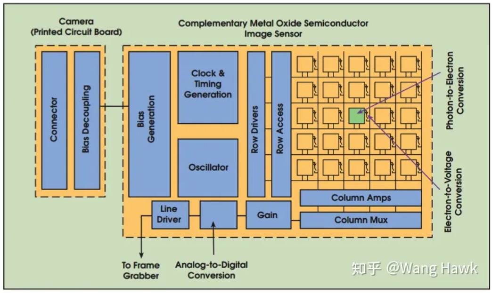

然而，CMOS有一个致命的缺点：**固定噪声大**。CCD传感器使用统一的运放，“一夫当关”导致所有输出信号的噪声都是相同的，一致性很好；CMOS采用每个像素独立的运放，这就让每个像素输出信号的噪声依赖于对应运放的噪声——读者可以考虑这样一个情形：每个电阻的噪声都是1ppm，100个串联电阻带来的噪声会是多少呢？图像的信息是连续的（虽然人眼不一定能区分得出来），每个像素和相邻像素的噪声都可以视为“串联的结果”

答案是100ppm。不难想象，各个放大器不一致会带来**大固定噪声**。这便是当前CMOS还没有完全替代CCD工艺的主要原因

此外，CMOS的感光部件面积也被APS外围器件和放大电路挤占了，同时受到CMOS工艺的影响，光电二极管不会被给出太大的片上面积，**受光率**要远远**小**于CCD

> 除此之外，CMOS和CCD还有区别：
>
> * CCD制造全局快门的成本很低，只需要使用单一信号控制的转移控制栅在同时对光敏元信号读出即可；而CMOS每个光敏单元都需要使用独立的外部供电管和模拟开关管理信号读出，因此主要以卷帘快门为曝光方式，**全局快门的面积开销更大**。
> * CCD的读出电路需要外加12/18V的高电压才能驱动电荷移动，其耗电量为CMOS的8到10倍，高驱动电压还要求更精密的电源线路设计和耐压强度，这对整个器件的设计都有影响；但CMOS采用主动采集，且传输电压信号，这让其**整体功耗低得多**

在CCD作为主流的年代，生产成本高、集成度差、能耗高是其三大弊端；随着CMOS技术的兴起，固定噪声、低灵敏度则一直困扰着它。不过随着半导体技术的发展（摩尔定律），CMOS特征线宽越来越小，同样面积上能做的电路越来越多，这样留给APS的面积也就越来越大，比例越来越高

> CMOS是典型的模拟混合电路，也正是于此原由

总的来说，CMOS替代CCD已经是业界趋势，随着CMOS工艺的发展，其弊端也能够被更好地抑制。不过目前几乎所有的线型图像传感器都采用**单行或双行CCD架构**；面阵型图像传感器则采用**行间转移CMOS架构**，可见CCD还不是那么容易退出市场，CCD工艺的基础设计思想则已经贯彻在了现代CMOS器件之中。

而随着半导体技术的发展，更多新设计被应用在CCD和CMOS上，这让二者的固有问题都得到了部分缓解，下面介绍一些能够在现代图像传感器上被广泛使用的设计

### MEMS构件和堆叠设计

CCD和CMOS都依赖MOS光敏元或者说光电二极管，它在感光的状态下只能输出表示当前位置光强（灰度值）的信息，并不能输出彩色信号，怎样才能获得彩色信号呢？

目前最普遍的方法就是**拜尔阵列**（Bayer）：这是由四个APS构成的排列，每个APS只负责处理一种颜色的光，通过在上面覆盖**MEMS滤光片**可以很好地实现这一需求，四个滤光片按“红绿绿蓝”（RGGB）组成的2x2单元格排列起来。于是整个感光单元的排布就像下图

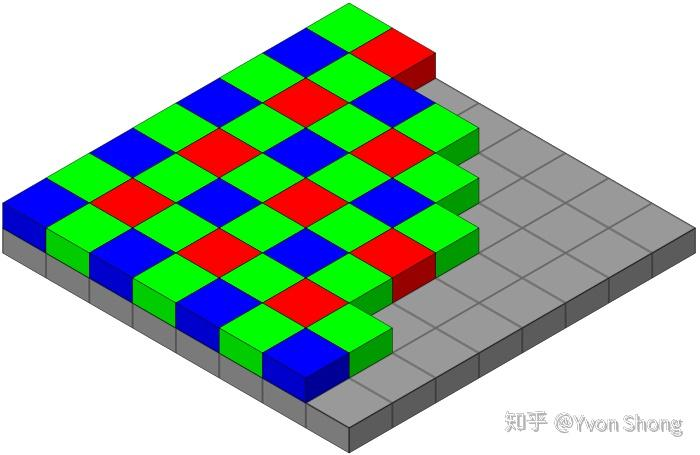

这样我们便能得到传感器对不同颜色光的响应情况。至于为什么拜尔阵列使用RGGB排布，这就要先从人眼对光线的敏感度特征说起

通常的光源都由多个波长的光组成，每种光的功率都不一样。如果画出每种波长的功率和它的波长之间的关系，我们可以得到光源的**功率谱分布（SPD）**

而传感器对不同波长的入射光线会有不同的敏感度，使用**光谱敏感度函数（SSF）**来描述。实际上我们在之前所说的MOS光敏元响应函数就是入射光SPD和传感器自身SSF乘积对入射光波长的积分
$$
R=\int_\lambda \Phi(\lambda) f(\lambda) d\lambda
$$
人眼也是如此。人眼视网膜上的视锥细胞有三种，分别对可见光的RGB波段敏感；而负责在暗光环境下感光的视柱细胞对绿色最为敏感。**拜尔阵列是对人眼感光的模拟，因此它选用了RGGB排布**。实际上色彩空间也可以由CYYM或RYYB来描述，这些颜色在光谱上覆盖范围更广，允许更多光线通过传感器，但处理起来相对复杂，所以没有大面积普及。

> 其实每个型号的CMOS传感器的SSF都可能不同，这是因为厂商都在追求“看得最舒服的颜色”而进行调色

这样的传感器已经能够用不同颜色的亮度值（灰度值）来表述三原色RGB了，但很显然原始图像（所谓的RAW格式）是完全不能看的，它并不能直接显示出颜色，即使通过**去马赛克算法**获得彩色图像，也会因CMOS的固定噪声和低灵敏度呈现出模糊的暗斑和亮点，这就需要通过ISP（Image Signal Processor，图像信号处理器）对原始数据进行处理，这会在后面的部分介绍

让我们回到CMOS传感器。理想情况下经过颜色滤光片，每个像素都只能感受对应颜色的光，但在追求光敏单元高密度的过程中，难免出现“像素间串扰”，这也是同时困扰CCD和CMOS的问题。

> 串扰（Cross Talk）被定义为：单个像素不能完全被一个颜色通道的光所激发的情况

我们使用另一种MEMS工艺来解决这个问题：**微透镜阵列**（Micro Lens）

通过在光敏元和颜色滤镜上再覆盖一层球状凸透镜阵列，可以让照射光敏元边沿的入射光折射回光敏元中央，从而让电荷包能够收集到所有光线

于是我们就得到了CMOS图像传感器*曾经*常见的堆叠结构：**正照**式（FSI）CMOS

很明显，正照式CMOS存在缺点：在每个像素位置，需要占用一定的面积来用作处理电路，因此CMOS的开口率远不如几乎能100%开口率的CCD。而为了提高开口率、增加感光面积，又需要挤占信号处理单元的空间，在老式CMOS传感器电路中，甚至只用一个BJT或MOS来做放大器，这就导致非常差的一致性，固定模式噪声严重；同时，像素尺寸的小型化也受到信号处理电路的限制，相同数量的像素需要更大的面积来布局

为了解决正照式的缺点，**背照**式（BSI）CMOS应运而生。它把感光像素与金属互联放置在硅片的两端来解决问题。正照式的微透镜让光线穿过硅片上方的多层Metal聚焦到硅片上的栅极，这需要让像素相隔很大距离才能实现；而背照式的光电二极管栅极可以紧密排布，透镜尺寸也可以缩小

在背照式传感器中，像素*背面*的整个面积都可以用来接受光线，因此开口率也和CCD传感器一样接近100%了。而CMOS传感器独有的信号处理电路放在像素正面一层。这样每个像素的信号处理电路相对不受面积制约，也能够获得更多金属层以支持更复杂电路的布线，因此可以做成比较复杂的放大器，比如带负反馈的差分运放，一致性会大大提高从而降低固定模式噪声。

不过背照式传感器对工艺提出了更高要求：常规半导体的厚度约为100微米左右；但背照式CMOS传感器厚度仅有3~4微米。正照式CMOS只需要保证受光面平整即可，对背面的均一性并无特殊要求；但背照式CMOS必须严格保证正反两面均极其平整

目前最新的设计是**堆栈式**照明（Stacked Illumination）CMOS。它将旁置的信号处理电路放到了底部支持基板上，实现在小尺寸传感器上集成更多的像素。由于像素部分和电路部分独立，像素部分可针对高画质优化，电路部分可针对高性能优化，甚至采用不同制成来获得更高性能和密度

### 模拟前端

现在我们终于从光电传感器来到了更熟悉（？）的数模混合电路。是时候讲讲模拟前端三大组件了。

首先我们能看到从传感器输出的所有信号会统一串行经过一个精密运放，这就是增益调节（**Gain**）。增益调节通常等效为对光圈的设置，这是很容易理解的

放大后的模拟信号会由一个精密高速**ADC**转换成通常是10bits~16bits的数字信号。这一部分是优秀CMOS设计的关键，SAR ADC和Σ-Δ ADC是最常见的两种，前者具有更高的采样速率、后者则具有极高的精度

最后，数字信号会通过查找表（**LUT**），它用于在一定的范围内修正传感器响应的非线性，同时还可以修复一些损坏的像素的输出

最后，经过修复的数字信号再进入接口控制器，就可以以DVP或者MIPI或者RAW格式输出给ISP器件了

## ISP和后处理

**图像信号处理器**（Image Signal Processor，**ISP**）是相机成像的核心环节，它负责接收图像传感器（Sensor）的RAW数据，并对其进行处理，主要包括线性纠正、噪声去除、坏点去除、去马赛克、内插、白平衡、自动曝光控制等算法。摄像头的成像质量很大程度上取决于ISP算法

传统的ISP芯片是独立的ASIC，但目前很多SoC也都集成了ISP。ISP一般需要一个**固件**（调优参数表）来设置算法逻辑和参数，同时还包含一些外设来接收传感器的RAW图像输出，并控制镜头和传感器的状态

> ISP需要同时控制传感器和镜头才能完成自动光圈AE、自动曝光AF、自动白平衡AWB等功能

一个ISP的固件包含三部分，一部分是内部各个算法IP的控制和参数库，一部分是AE/AWB/AF算法库，还有一部分是图像传感器控制库。通过预先对ISP进行参数调优获得一个参数表，将其固化到ISP内，即可实现大部分ISP功能；为了实现AE/AWB/AF功能，传感器控制库向ISP算法库注册回调函数从而适配不同的传感器和镜头

一个典型的ISP整体工作流程如下图所示，下面来逐步说明

### 读入RAW格式元数据

目前主流的CMOS传感器（下统称**Sensor**）都采用RGGB的RAW数据格式，常见的RAW精度有8/10/12/14bit等规格。

> 安防监控行业较多使用10/12bit精度的sensor，医疗行业则主要使用12bit以上精度的sensor，单反和广播电视行业则主要使用14bit精度sensor

对一些带宽和存储资源特别紧张的场合，有些sensor会支持压缩表示以节约带宽，但是这就需要ISP能够支持相应的压缩格式。4K分辨率的图像有800万像素，RAW格式则至少会占1600万字节（按8bit精度计算），YUV422格式占1200万字节，因此支持4K以上的芯片都会设计一个压缩算法并进行放缩和裁剪（Crop/Resize）

一般sensor和ISP通过MIPI总线（大数据量）或DVP总线（小数据量）进行连接，RAW数据通过这些协议传输到ISP的缓存区（帧缓存或行缓存，分别对应两种数据读入方式）

使用ISP处理图像数据时有两种常用的数据读入方式：

- **在线模式**（Online）：Sensor实时产生的像素数据和时序控制信号以行为单位送入。Online具备低延迟的优点，一帧图像的第一个像素数据流出sensor后马上就可以进入ISP流水线开始处理。
- **离线模式**（Offline）：待处理的图像以帧为单位存储在系统内存，处理时由控制逻辑通过DMA从内存中读取数据，并添加模拟sensor行为的时序控制信号，一起送给ISP进行处理。其优点在于吞吐量很大，一次能够完成一帧图像的处理；但ISP通常需要等到一帧图像的最后一个像素数据到齐之后才开始启动处理。

### 黑电平校正

BLC， Black Level Correction

Black Level 是用来定义图像数据为 0  时对应的信号电平。由于暗电流的影响，传感器出来的实际原始数据并不是我们需要的黑平衡（数据不为0）。所以，为减少暗电流对图像信号的影响，可以采用的有效的方法是从已获得的图像信号中减去参考暗电流信号，那么就可以将黑电平矫正过来。

### 镜头阴影校正

LSC， Lens Shade Correction

用于消除图像周边和图片中心的不一致性，包含亮度和色度两方面。ISP 需要借助 OTP 中的校准数据完成 LSC 功能。 

由于相机在成像距离较远时，随着视场角慢慢增大，能够通过照相机镜头的斜光束将慢慢减少，从而使得获得的图像中间比较亮，边缘比较暗，这个现象就是光学系统中的渐晕。由于渐晕现象带来的图像亮度不均会影响后续处理的准确性。因此从图像传感器输出的数字信号必须先经过镜头矫正功能块来消除渐晕给图像带来的影响。同时由于对于不同波长的光线透镜的折射率并不相同，因此在图像边缘的地方，其R、G、B的值也会出现偏差，导致CA(chroma aberration)的出现，因此在矫正渐晕的同时也要考虑各个颜色通道的差异性。 

常用的镜头矫正的具体实现方法是：首先确定图像中间亮度比较均匀的区域，该区域的像素不需要做矫正；以这个区域为中心，计算出各点由于衰减带来的图像变暗的速度，这样就可以计算出相应R、G、B通道的补偿因子(即增益)。实际项目中，可以把镜头对准白色物体，检查图像四周是否有暗角。  

镜头阴影有两种表现形式，分别是

Luma shading，又称vignetting，指由于镜头通光量从中心向边缘逐渐衰减导致画面边缘亮度变暗的现象。

Chroma shading，指由于镜头对不同波长的光线折射率不同引起焦平面位置分离导致图像出现伪彩的现象。

- Luma shading

画面边缘镜头能量衰减，由于镜头中都会存在多处光阑，当入射光线偏离光轴角度较大时，部分光线就会被光阑遮挡而不能参与成像，因此越靠近sensor边缘的像素接收到的曝光量就越低。

边缘像素微透镜焦点和感光面的错位，这个问题在手机sensor 上通常会更严重一些，因此设计手机sensor 的厂家会采取一些特定的方法去缓解这个问题。

找到中心点后，以中心点为原心，向周围以圆为单位补Gain，离中心点越远，补的越大。

一种常用的方法是在微透镜上做文章，即从中心像素开始，微透镜的尺寸略小于感光面的面积一点点，这样越往边缘微透镜与感光面之间的错位就越大，刚好可以补偿入射光线角度增大导致的焦点偏移，使光线可以更好地聚焦到感光面上。

不过深入研究会发现，这个补偿办法其实也是有局限的，如果sensor采用的是下图左所示的FSI工艺（前照式），从像素微观结构来看，当入射光线角度比较大时，会有较多光线与像素中的金属布线层发生吸收、散射从而产生损失，单纯移动微透镜的位置并不能有效解决这个问题。但是，如果像素采用的是背照式工艺，因为布线层在硅片的另外一侧，所以光线损失会少，补偿效果更加有效。

Vigetting是由镜头引起的现象，所以LSC校正也是针对特定镜头的。若果产品的适配镜头发生变化，原则上需要重新进行LSC校正。另外，Vigetting现象在sensor靶面较大、镜头焦距较短时表现更加明显。采用非球面镜头通常可以改善vignetting。

Chromatic Aberration Correction， Chromatic Dispersion，色差，色散

光学上透镜无法将各种波长的色光都聚焦在同一点上的现象。它的产生是因为透镜对不同波长的色光有不同的折射率（色散现象）。对于波长较长的色光，透镜的折射率较低。在成像上，色散表现为高光区与低光区交界上呈现出带有颜色的“边缘”，这是由于透镜的焦距与折射率有关，从而光谱上的每一种颜色无法聚焦在光轴上的同一点。色差可以是纵向的，由于不同波长的色光的焦距各不相同，从而它们各自聚焦在距离透镜远近不同的点上；色差也可以是横向或平行排列的，由于透镜的放大倍数也与折射率有关，此时它们会各自聚焦在焦平面上不同的位置。

除了再镜头设计时通过采用具有相同色散特性而方向相反的不同光学材料组成成对的镜片组等手段来控制色差，在ISP过程中也能处理色差，对于横向色差，通常在图像全局上进项校正，将红绿蓝三  个颜色通道调整到相同的放大倍数，一般通过标定三个颜色平面的增益来修正，为了控制标定表格的存储空间，通常只标定MxN个关键点，任意位置处的像素增益可以使用相邻四个标定关键点通过双线性插值的方法动态计算得到。这对于固定的光学镜头比较有效，但是对变焦镜头则难以适用。

### 坏点校正

DPC， Defect Pixel Correction， Bad Point Correction

所谓坏点，是指像素阵列中与周围像素点的变化表现出明显不同的像素，因为图像传感器是成千上万的元件工作在一起，因此出现坏点的概率很大。一般来讲，坏点分为三类：第一类是死点，即一直表现为最暗值的点；第二类是亮点，即一直表现为最亮值的点：第三类是漂移点，就是变化规律与周围像素明显不同的像素点。由于图像传感器中CFA的应用，每个像素只能得到一种颜色信息，缺失的两种颜色信息需要从周围像素中得到。如果图像中存在坏点的话，那么坏点会随着颜色插补的过程往外扩散，直到影响整幅图像。因此必须在**颜色插补之前**进行坏点的消除。 

由于Sensor是物理器件，有坏点是难以避免的；而且使用时间长了坏点会越来越多。通过在全黑环境下观察输出的彩点和亮点，或在白色物体下观察输出的彩点和黑点，就可以看到无规律的散落在各处的坏点。 

1. 检测坏点。在RGB域上做5x5的评估，如果某个点和周围的点偏离度超过阈值的点为坏点。为了防止误判，还需要更复杂的逻辑，如连续评估N帧。 
2. 纠正坏点。对找到的坏点做中值滤波，替换原来的值即可。 

### 绿平衡

GB， Green Balance

由于感光器件制造工艺和电路问题，Gr,Gb数值存在差异,将出现格子迷宫现象可使用均值算法处理Gr,Gb通道存在的差异,同时保留高频信息。 

还有一个说法是：  Sensor芯片的Gr，Gb通道获取的能量或者是输出的数据不一致，造成这种情况的原因之一是Gr，GB通道的半导体制造工艺方面存在差异，另一方面是Microlens的存在，特别是sensor边缘区域，GB，Gr因为有角度差异，导致接收到的光能不一致。如果两者差异比较大，就会出现类似迷宫格子情况。 

### RAW去噪

Denoise， Noise Reduction

研究发现，噪声在ISP流水线各模块中会不断产生、传播、放大、改变统计特性，对图像质量的影响会越来越大，而且越来越不容易控制。因此处理噪声的基本原则是越早越好，随时产生随时处理，尽可能将问题消灭在萌芽状态。

目前主流的ISP产品中一般会选择在RAW域、RGB域、YUV域等多个环节设置降噪模块以控制不同类型和特性的噪声。在YUV域降噪的方法已经得到了广泛的研究并且出现了很多非常有效的算法，但是在RAW域进行降噪则因为RAW数据本身的一些特点而受到不少限制。主要的限制是RAW图像中相邻的像素点分别隶属于不同的颜色通道，所以相邻像素之间的相关性较弱，不具备传统意义上的像素平滑性，所以很多基于灰度图像的降噪算法都不能直接使用。又因为RAW数据每个像素点只含有一个颜色通道的信息，所以很多针对彩色图像的降噪算法也不适用。

- **RAW域降噪**

Sensor输出的RAW图像本身是携带了噪声的，光照程度和传感器问题，包括热噪声、光散粒噪声、读出噪声、固定模式噪声，是生成图像中大量噪声的主要因素。当sensor温度较高、增益较大、环境较暗的情况下各种噪声会变得更加明显，成为影响图像质量的主要因素。

FPN（Fix Pattern Noise）：固定模式噪声。由于CMOS每个感光二极体旁都搭配一个ADC 放大器，如果以百万像素计，那么就需要百万个以上的  ADC  放大器，但是每个像素结构中的光电二极管的尺寸、掺杂浓度、生产过程中的沾污以及MOS场效应管的参数的偏差等都会造成像素输出信号的变化。对于给定的单个像素它是固定的。通常消除固定模式噪声采用“双采样降噪”方法，这是CMOS  感光器件特有的一种降噪方式。在光线较暗的环境下使用时，画面会有明显的噪声，这时通过对景物进行两次不同曝光率和敏感度的采样，然后将两次采样的结果进行综合处理，就可以有效解决低照度下的图像噪声问题。

Senor的感光器件包含模拟部分，所以信号中的噪声很难避免。同时， 当信号经过 ADC 时， 又会引入其他一些噪声。 另外，当光线较暗时，camera  需要提高增益才能使画面达到正常亮度，同时也放大了噪声，图像出现明显的噪点。我们在看没有经过降噪处理的图片时，会感觉到图片上浮了一层彩色雪花点。 

这些噪声会使图像整体变得模糊， 而且丢失很多细节， 所以需要对图像进行去噪处理。和很多图像处理算法一样，降噪即可以在空域(spatial  domain)上实现，也可以在频域(frequency  domain)上实现，比较有常用频域方法有傅里叶变换，离散余弦变换(DCT)，小波变换，多尺度几何分析等。随着人工智能技术的发展，近些年来还涌现了一批基于深度学习技术实现的降噪算法。后面提到的这些方法虽然都有不错的性能，但是对算力要求都比较高，并不一定适合处理高分辨率的实时视频流，所以在ISP产品中应用的并不广泛，目前适合ISP应用的降噪算法还是以经典低通滤波器的改进版本更为常见。

目前在RAW域降噪基本都需要将RAW图像按照颜色分成四个通道(R,Gr,Gb,B)，然后在各个通道上分别应用滤波器进行平滑，根据滤波器的特点和复杂度大致可以分成以下几类：

- 经典低通滤波器：如均值滤波、中值滤波、高斯滤波、维纳滤波等。这类方法的优点是比较简单，占用资源少，速度快，缺点是滤波器是各向同性的，容易破坏图像中的边缘。另外由于没有考虑颜色通道之间的相关性所以也容易引入伪彩等噪声，而人眼对这种颜色噪声是比较敏感的。
- 非线性去噪算法： 一般的高斯滤波在进行采样时主要考虑了像素间的空间距离关系， 并没有考虑像素值之间的相似程度， 因此这样得到的模糊结果通常是整张图片一团模糊。  为了避免图像变模糊，就需要保持图像的边缘，这时，就还要考虑相邻像素和本像素的相似程度，对于相似度高的像素给予更高的权重，一般采用非线性去噪算法， 例如Eplison滤波、双边滤波器， 在采样时不仅考虑像素在空间距离上的关系， 同时加入了像素间的相似程度考虑，  增加了阈值检测用于区分同类像素和异类像素，同类像素分配较大的滤波权重，异类像素则权重很小因而基本不参与滤波。因而可以保持原始图像的大体分块，  有效地保护图像边缘，复杂度增加也不大，其它特点与经典滤波器基本相同。
- 引导滤波器：由何凯明博士早期提出的一种算法，引入了引导图像的概念。对于任一颜色通道的图像，以当前位置像素为中心，在一个固定大小的滤波窗口内的所有邻近像素计算权重，计算权重的方法是以某个引导图像作为参考，在引导图像的对应滤波窗口内，凡是与像素性质“类似”的像素都得到较大的权重，与*I*(x,y)性质“相反”的像素则得到较小的权重。这种方法的基本假设是图像各通道的颜色梯度分布与引导图像是一致的，如果假设不成立，则从引导图像计算出的权重反而容易破坏其它通道中的边缘。
- 基于块匹配的滤波算法：利用图像的自相似特性，在以当前像素为中心的一个滤波窗口内找到与当前块最相似的几个块，当前像素的滤波值即等于几个相似块的中心像素的加权平均值。此类算法以非局部均值滤波(Non-Local Means)和BM3D(Block Matching  3D)算法为代表，它们的优点是平滑性能和边缘保持性能很好，缺点是计算量很大，资源消耗大，不太适合处理实时视频。

除了空域上滤波，也可以结合时域进行滤波，3DNR 是结合空域滤波和时域滤波的一种降噪算法。大概思路是检测视频的运动水平，更具运动水平的大小对图像像素进行空域滤波和时域滤波的加权，之后输出滤波之后的图像

除了Sensor图像本身携带的噪声之外，图像每次会经过ISP模块的处理之后都会引入一些新的噪声，或者对原有噪声进行了放大。

以LSC模块为例，LSC校正的实质是在输入图像上乘以一个与像素位置有关的增益系数以补偿光信号的衰减，而补偿的规律是越远离图像中心的地方增益越大。根据噪声传播的基本原理，当增益系数大于1时，图像中的噪声是与信号一起被同步被放大的。另外，由于ISP所用乘法器的精度是有限的，每做一次乘法就会重新引入一次截断误差，这是新增的噪声来源，所以经LSC处理后图像的整体噪声水平会有所增加，而且在图像的边缘处表现会更加明显。

Shading固然是不好的，需要校正，但是为了校正shading而给图像引入噪声同样也不好的，所以人们需要权衡在多大程度上校正shading能够收到满意的效果。这是在主观图像质量调试阶段需要考虑的问题之一。

- **YUV域**

我们可以把这些 YUV Image Noise再分为Luminance Noise 跟Chroma Noise  二类，影像放到不同的色空间来看，就很明确分别出差异了。一张RGB空间的影像转换到YUV，我们在Y domain 下看到的即是 Luminance Noise，在UV domain 下看的就是Chroma Noise。

Chroma  Noise 跟 Color Noise 是有一定差异的。Color Noise  里所形容的color，并不是单纯指影像的色彩杂讯，而是已包含亮度资讯的色彩，所以Color Noise应可以广义形容为Image Noise。而 Chroma Noise 较能明确指出chroma(彩色)部份的Noise。因此严格说来Color Noise不等于 Chroma  Noise。

Chroma Noise 量化方式：

- 市面相机量化步骤：把灰卡以不同ISO值拍摄，假设以ISO100为基准，ISO值提高一倍时，快门时间也缩短一倍，以维持影像的灰度。
- 工程模式量化步骤：把灰卡以一定的曝光线数及1倍gain(Again*Dgain)的设定拍摄，并以此为基准，而后gain提高1倍时，曝光线数也随之降低1倍，以维持影像的灰度。

极短的快门时间配上高ISO或极短的曝光时间配上高倍数的gain后，便会产生较多的Noise，依不同设定所拍摄下影像的标准差倾向，即可分析出差异。

### 自动白平衡

Color Temp 

所谓色温，简而言之，就是定量地以开尔文温度（K）来表示色彩。英国著名物理学家开尔文认为，假定某一黑体物质，能够将落在其上的所有热量吸收，而没有损失，同时又能够将热量生成的能量全部以“光”的形式释放出来的话，它便会因受到热力的高低而变成不同的颜色。

黑体，是一个理想化了的物体，它能够在任何温度下，吸收外来的任何波的电磁辐射，并且不会有任何的反射与透射。

在700K之下的黑体所放出来的辐射能量很小且辐射波长在可见光范围之外，看起来是黑色的。若黑体的温度高过上述的温度的话，它会开始变成红色，并且随着温度的升高，而分别有橘色、黄色、白色等颜色出现，温度越高，光色越偏蓝。当温度超过1600K时开始发白色和蓝色。当黑体变为白色的时候，它同时会放出大量的紫外线。 

即黑体吸收和放出电磁波的过程遵循了光谱，其轨迹为普朗克轨迹（或称为黑体轨迹）。黑体辐射实际上是黑体的热辐射。在黑体的光谱中，由于高温引起高频率即短波长，因此较高温度的黑体靠近光谱结尾的蓝色区域而较低温度的黑体靠近红色区域。 

由于人眼具有独特的适应性，使我们有的时候不能发现色温的变化。比如在钨丝灯下呆久了，并不会觉得钨丝灯下的白纸偏红，如果突然把日光灯改为钨丝灯照明，就会觉查到白纸的颜色偏红了，但这种感觉也只能够持续一会儿。 

相机的传感器并不能像人眼那样具有适应性，所以如果摄像机的色彩调整同景物照明的色温不一致就会发生偏色。白平衡就是为了避免偏色的出现。

AWB， Automatic White Balance

白平衡。白平衡与色温相关，用于衡量图像的色彩真实性和准确性。ISP需要实现 AWB 功能，力求在各种复杂场景下都能精确的还原物体本来的颜色。 

人类视觉系统具有颜色恒常性的特点，不会受到光源颜色的影响。实际生活中，不论是晴天、阴天、室内白炽灯或日光灯下，人们所看到的白色物体总是是白色的，这就是视觉修正的结果。人脑对物体的颜色有一定先验知识，可识别物体并且更正这种色差。 因此人类对事物的观察可以不受到光源颜色的影响。

但是图像传感器本身并不具有这种颜色恒常性的特点，获取的图像容易受到光源颜色的影响。 如白炽灯照明下拍出的照片易偏黄；而在户外日光充足则拍摄出来景物也会偏蓝。  因此，其在不同光线下拍摄到的图像，会受到光源颜色的影响而发生变化。例如在晴朗的天空下拍摄到的图像可能偏蓝，而在烛光下拍摄到的物体颜色会偏红。因此，为了消除光源颜色对于图像传感器成像的影响，自动白平衡功能就是模拟了人类视觉系统的颜色恒常性特点来消除光源颜色对图像的影响，让不同色温光线条件下白色物体，Sensor的输出都转换为更接近白色。  它会通过摄像机内部的电路调整，改变蓝、绿、红三个通道电平的平衡关系，使反射到镜头里的光线都呈现为消色。如果以偏红的色光来调整白平衡，那么该色光的影像就为消色，而其他色彩的景物就会偏蓝（补色关系）。  

白平衡与色温相关，用于衡量图像的色彩真实性和准确性。简单的说，就是通过图像调整，使在各种光学条件下拍摄出的照片色彩和人眼所看到的景物色彩完全相同。 

白平衡就是调整R/B增益，达到R、G、B 相等。 比较常用的AWB算法有灰度世界、完美反射法等。 灰度世界（Gray World）算法基于一个假设：平均来讲，世界是灰色的。

完美反射法基于一个假设：白色是反射率最高的颜色，直方图上RGB响应最右边的部分就代表着白色的响应。所以把RGB响应的直方图拉齐了，也就实现了白平衡。完美反射法确实听起来很完美，但是，如果图像里没有白色或者存在比较强的噪声，这个方法就不好用了。

白平衡调整在前期设备上一般有三种方式：自动白平衡，分档设定白平衡，精确设定白平衡（手动设定模式）。

- 自动白平衡：依赖数码相机里的测色温系统，测出红光和蓝光的相对比例。再依据次数据调整曝光，产生红、绿、蓝电信号的增益。自动白平衡有3个步骤： 

1. 检测色温，如果手工调节，就知道图像中什么位置是白色物体了，色温容易检测；如果是自动调节，就需要估计出（猜出）图像中的白色位置，这是最重要的一环；  实际计算中为了实时操作，减少计算量，通常选取某个特定区域(如图像中央)像素进行计算。但若图像颜色较为单一或选定区域正好落入大的色块（红光下的白墙），以上算法求得的色温会非常不准确。为此，必须根据一定的约束条件，挑选出白色像素来计算色差。 
2. 计算增益，计算R和B要调整的增益；调整增益将Cb和Cr调整到0 (或接近0)的两个系数，即R=G=B。 
3. 色温矫正，根据增益调整整幅图片的色温。 

- 分档设定白平衡：按光源种类分和色温值分两类。相机上分别设有日光、阴天、日光灯、白炽灯、闪光灯的图标档位。拍摄时只需将拍摄时的光源种类和相机上的白平衡档位相吻合就可拍出较为准确的色彩。按色温分类的白平衡，理论上讲其精度要高于按光源种类分档。但它要求使用者要记住各种光源的色温值，这就给使用者带来极大的麻烦。
- 精确白平衡（手动设定模式）：在拍摄现场光的条件下，用白纸或白色物体充满镜头视野进行白平衡调节。经过这样的调试再拍摄，记录的色彩将是非常准确的这是目前最准确的白平衡调节方式。

### 去马赛克

Demosaic是 ISP 的主要功能之一。sensor 的像素点上覆盖着  CFA（彩色滤色矩阵，Color Filter Array），光线通过 CFA 后照射到像素上。CFA 由 R、G、B  三种颜色的遮光罩组成，每种遮光罩只允许一种颜色通过，因此每个像素输出的信号只包含 R、G、B 三者中的一种颜色信息。sensor  输出的这种数据就是 BAYER 数据，即通常所说的 RAW 数据。显而易见，RAW 数据所反映的颜色信息不是真实的颜色信息。DEMOSAIC  就是通过插值算法将将每个像素所代表的真实颜色计算出来。

目前最常用的插补算法是利用该像素点周围像素的平均值来计算该点的插补值。

光线中主要包含三种颜色信息，即R、G、B。但是由于像素只能感应光的亮度，不能感应光的颜色，同时为了减小硬件和资源的消耗，必须要使用一个滤光层，使得每个像素点只能感应到一种颜色的光。目前主要应用的滤光层是bayer GRBG格式。

经过滤色板的作用之后，每个像素点只能感应到一种颜色。必须要找到一种方法来复原该像素点其它两个通道的信息，寻找该点另外两个通道的值的过程就是颜色插补的过程。由于图像是连续变化的，因此一个像素点的R、G、B的值应该是与周围的像素点相联系的，因此可以利用其周围像素点的值来获得该点其它两个通道的值。目前最常用的插补算法是利用该像素点周围像素的平均值来计算该点的插补值。

Demosaic  算法的主要难点在于，RAW域的任何一个像点（photosite）只包含一个真实的采样值，而构成像素（R,G,B）的其它两个值需要从周围像点中预测得到。既然是预测，就一定会发生预测不准的情况，这是不可避免的，而预测不准会带来多种负面影响，包括拉链效应（zipper  artifacts），边缘模糊，颜色误差等。而由于彩色插值“推测式”算法，R+B时最容易推测出来的——就是Magenta洋红，就是拍照时紫边的主色。

### RGB降噪

### 串扰校正

### 颜色校正

### 宽动态范围

### Gamma校正

### RGB2YUV颜色空间转换

### 边缘增强

### 明度对比度控制

### 色调饱和度控制

### 放缩和裁剪

### 编码

### 输出

