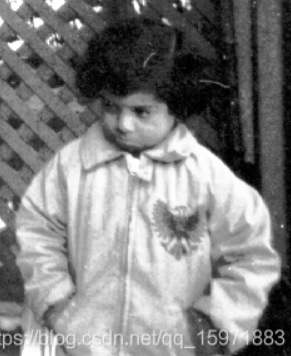
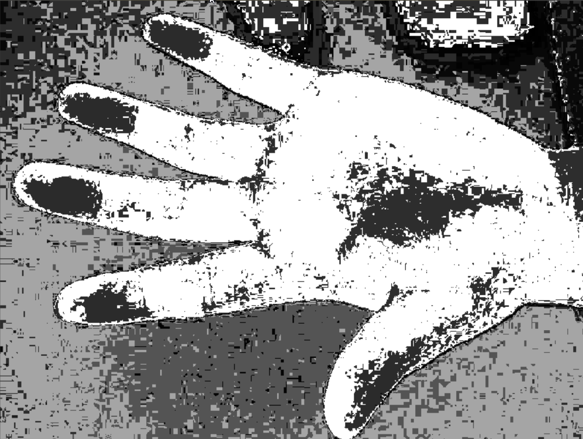
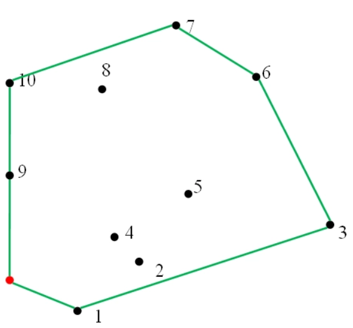
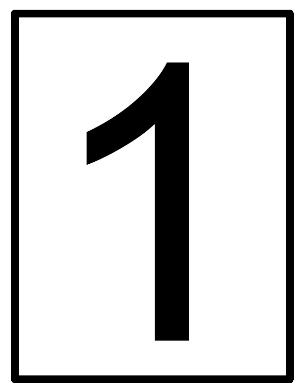
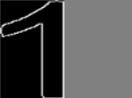

# 图像处理算法的典型应用

本博客参考《OpenCV3编程入门》（*毛星云* 冷雪飞 电子工业出版社）写成（还有来自毛星云dalao在csdn写成的系列博文），本篇内容旨在总结*嵌入式设备*中常用（基础）的机器视觉算法（上面书籍的后四章），代码主要使用OpenCV实现，部分代码可以直接在OpenMV或类似的嵌入式平台上部署

> 悼念浅默大佬，感谢他为我们带来的技术博客和教程

## 直方图及其应用

**直方图**（**Histogram**）是对数据进行统计的一种方法，通过一个二维的统计图表，其横坐标是统计样本，纵坐标是样本对应某个属性的度量。图像处理中，使用**图像直方图**表示数字图像中像素数据分布统计。下面将以灰度和RGB直方图作为引入，但是任何能够有效描述图像的特征数据都能作为直方图的统计量。

### 灰度和RGB直方图

假设有一副5*5像素的灰度图像，其像素分布如下：

> 1,2,3,2,1,
>
> 3,4,5,2,4,
>
> 5,6,1,5,2,
>
> 1,3,4,6,5,
>
> 8,5,9,1,4
>
> 这里作为举例只列举了个位数值，实际图像的像素值可能是0~255的任何数

我们将图像像素的灰度值作为横坐标，将每个灰度值对应的像素个数作为纵坐标，就能得到一副直方图

0：0个像素；1：5个像素；2：4个像素；3：3个像素；4：4个像素；5：5个像素；6：2个像素；7：0个像素；8：1个像素；9：1个像素；......；254：0个像素；255：0个像素

我们把它画成一幅图：


使用下面的代码生成（基于matplotlib数学库而不是opencv）

```python
import matplotlib.pyplot as plt

data = [
    1, 2, 3, 2, 1, 3, 4, 5, 2, 4, 5, 6, 1, 5, 2, 1, 3, 4, 6, 5, 8, 5, 9, 1, 4
]

plt.hist(data, bins=256, range=(0, 255), density=False)
# bins:直方图条数
# range:直方图横坐标范围
# density:当值为False时绘制频数直方图,否则绘制频率直方图
plt.show()
```

也就不难理解直方图的含义：按照灰度值（0~255的int8范围）依次统计图像中对应值像素的数量

我们在图像直方图中定义下面这些概念：

* **bin/bins**：直方图的组距，其数值是从数据中计算出的特征统计量。这也就是直观意义上的直方图横坐标
* **range**：每个特征空间的取值范围。也就是直观意义上直方图横坐标值的集合（“定义域”）
* **dims**：需要统计特征的数目。在灰度图像直方图中，dims=1；在rgb图像直方图中，dims=3。这就是直观意义上直方图统计过程中要考虑的特征元素数目

再给出一个RGB直方图的例子：


使用OpenMV（给没做过硬件的老哥科普下这是一个可编程的摄像头，基于stm32（微控制器，ARM Cortex-M内核）开发，内置了很多机器视觉算法，官方开发了一套IDE方便进行机器视觉相关应用的开发）就可以在IDE里面采集到这样的图像，下面的直方图就是RGB直方图了。和灰度直方图类似，它分别统计了R、G、B三种颜色像素值在图像中的数目，也就是所谓的三个**通道**。

我们这就可以知道如果需要用直方图法获取图像信息，只需要把图像相关元素数据值作为横坐标，然后统计图像每个与之相关像素的数目，将其作为对应纵坐标，就可以绘制直方图了。不仅仅是RGB颜色，HSV颜色、YCbCr颜色，甚至梯度、方向等信息都可以作为横坐标

### 直方图计算

OpenCV中提供了计算和绘制直方图的函数，如下所示：

```c++
void cv::calcHist(const cv::Mat *images, 
                  int nimages, //输入图像的个数
                  const int *channels, //dims的索引
                  cv::InputArray mask,
                  cv::OutputArray hist, //输出一个二维的直方图
                  int dims, //需要统计的dims数量，或者说需要直方图的通道数
                  const int *histSize, //存放每个维度直方图尺寸的数组
                  const float **ranges, //直方图横坐标范围
                  bool uniform = true, //默认直方图均匀
                  bool accumulate = false //默认直方图在配置阶段清零
                 )
```

需要注意：这里输入的image要求具有相同的深度（CV_8U或CV_32F）和相同的尺寸

如果mask非空，那么它必须是8位且和images具有相同尺寸，这个参数用于标记统计直方图的数组元素数据

dims参数不能大于CV_MAX_DIMS（OpenCV3中设置为32）

OpenCV还提供了一些用于处理直方图的函数

* 寻找最小值和最大值

    下面的函数从输入数组src中找出其中的最小值（最小值位置）和最大值（最大值位置）的指针，兼容一维的数组和二维的图像数据

    ```c++
    void cv::minMaxLoc(cv::InputArray src, 
                       double *minVal, 
                       double *maxVal = (double *)0, 
                       cv::Point *minLoc = (cv::Point *)0, 
                       cv::Point *maxLoc = (cv::Point *)0, 
                       cv::InputArray mask = noArray()
                      )
    ```

* 比较直方图

    下面的函数可以通过相关性、卡方统计量、直方图香蕉、Bhattacharyya距离四种方法对两个直方图进行比较

    ```c++
    double cv::compareHist(cv::InputArray H1, //直方图1
                           cv::InputArray H2, //直方图2
                           int method) //比较算法
    ```

    method参数可以选择

    * CV_COMP_CORREL：相关统计
    * CV_COMP_CHISQR：卡方
    * CV_COMP_INTERSECT：相交
    * CV_COMP_BHATTACHARYYA：Bhattacharyya距离，也可以使用CV_COMP_HELLINGER参数‘

    函数会输出匹配度

### 直方图均衡

有些情况下，图片的对比度很低，呈现雾蒙蒙的状态，如下所示（下面先讨论灰度图像，也就是颜色数据通道为1的情况）：


我们通过一些方法提高它的对比度，就能得到更清晰的图像（锐化图像）：

> **对比度**是画面黑与白的比值，也就是从黑到白的渐变层次。比值越大，从黑到白的渐变层次就越多，色彩表现就越丰富


还有些情况下，图片呈现很亮或者很暗的状态，如下图所示：


此时也可以通过一种算法提高其亮度：



以上两种情况都可以使用**直方图均衡化**算法来实现，同时该算法还能用在图像去雾等领域

这两种情况都有一个共性：图像的直方图集中在了同一个区域。未经均衡化的图像往往都具有这样的特性：直方图集中在某个范围，就比如上面的示例，所有像素值都集中在了0~10区间


直方图均衡化的主要思想是**把原始图像的直方图从比较集中的某个区间变成在全部范围内“均匀”的分布**。通过对图像进行非线性拉伸，重新分配图像像素值，就能让一定范围内的像素数量大致相同

如果一副图像的像素占有很多的灰度级而且分布均匀，那么这样的图像往往有高对比度和多变的灰度色调；对于RGB图像也是类似的，均匀分布的RGB值往往具有更高的对比度，同时图像明暗处的亮度也偏向平均，因此直方图均衡化对于背景和前景都太亮或者太暗的图像非常有用

作为传统的图像增强算法，直方图均衡化的一个主要优势是它是一个相当直观的技术并且是可逆操作，如果已知均衡化函数，那么就可以恢复原始的直方图，并且计算量也不大；缺点则是它对处理的数据不加选择，可能会增加背景杂讯的对比度并且降低有用信号的对比度；变换后图像的灰度级/色度减少，某些细节消失；在直方图有尖锐高峰情况下，经处理后会出现对比度不自然的过分增强。

直方图均衡化的目标就是仅靠输入图像直方图信息自动达到增强图像效果，一般的实现思路是*对图像中像素个数多的值进行展宽，对图像中像素个数少的值进行压缩*

需要注意：**已经进行均衡化的图片再次均衡化将不会有任何变化**

OpenCV中提供了equalizeHist()函数来执行直方图均衡化

```c++
void cv::equalizeHist(cv::InputArray src, //输入图像
                      cv::OutputArray dst //输出均衡化后的图像
                     )
```

内部采用如下算法：

1. 计算输入的直方图

2. 进行直方图归一化，将直方图组距和设置为255

3. 计算直方图积分
    $$
    H'(i)=\sum_{0\le j \le i} H(j)
    $$

4. 以H'作为查询表进行图像变换
    $$
    dst(x,y)=H' (src(x,y))
    $$

### 反向投影

直方图的一个重要应用就是将图像问题转换成统计问题。直方图本质上是对图片中像素特征这“个”统计量的描述，因此可以利用各种统计理论分析图片来对图片中的特征进行检测。

**如果一幅图中显示了某种特殊的结构纹理或某种独特的物体，那么这个区域的直方图可以看作一个概率函数，描述某个像素属于该纹理或物体的概率分布**

反向投影法就是利用上述结论的运算方法，首先计算某一特征的直方图模型，再计算目标图像的直方图模型，得到**给定图像中的所有像素点对应属于特征区域的概率**。因此利用反向投影法，我们可以先计算出特征的直方图，再使用模型去寻找目标图像中存在的对应特征。

> 反向投影法类似于利用直方图进行更细节的图像二值化，只不过比起直接分割低于阈值的像素和高于阈值的像素，反向投影法能够做到更细节的“切分”——利用反向投影法可以根据bins将图像分成层次不同的范围，从而实现小色块的检测。
>
> 二值化调节的是实实在在的比大小阈值；反向投影法中可供调节的就是用于分割的bins值和筛选出来的概率值。

反向投影算法的步骤如下：

> 这里使用到浅墨大佬书中的例子进行介绍

1. 统计已知图像某个特征（要检测特征）的**色度直方图**，通常用**色度-饱和度**（Hue-Saturation，H-S）**直方图**来统计二维直方图，并把直方图表示为概率的形式

    在这一步骤中，应该先把RGB图片转换成HSV格式，HSV颜色空间定义可以参考之前的博文和其他教程，这里不再赘述。提取出其中的H-S特征得到直方图

    下图是要检测的原图，需要检测其中的**肤色**特征（注意，这里指的是肤色。反向投影算法的检测对象偏重于颜色而不是形态），由于手部的肤色特征往往是相近的，因此可以通过突出相同肤色来间接检测人手

    

    下面是进行转换的代码片段

    ```c++
    g_srcImage = imread("1.jpg", 1); //得到待测图片
    if(!g_srcImage.data)
    { 
        printf("读取图片错误，请确定目录下是否有imread函数指定图片存在\n");
        return false; 
    } 
    cvtColor(g_srcImage, g_hsvImage, COLOR_BGR2HSV); //将图片转换成HSV格式
    
    //分离Hue颜色通道，也就是HSV中的H
    g_hueImage.create(g_hsvImage.size(), g_hsvImage.depth());
    int ch[ ] = { 0, 0 };
    mixChannels(&g_hsvImage, 1, &g_hueImage, 1, ch, 1);
    ```

    其中函数`mixChannels()`原型如下

    ```c++
    void cv::mixChannels(const cv::Mat *src, //输入数组（描述矩阵的数组）
                         size_t nsrcs, //输入数组的数目（输入矩阵数）
                         cv::Mat *dst, //输出数组
                         size_t ndsts, //输出数组的数目（输出矩阵数）
                         const int *fromTo, //对指定通道进行复制的数组索引
                         size_t npairs //fromTo参数的索引数
                        )
    //它也有一个用于单输入的原型，没有nsrcs和ndsts输入，只支持单幅图像输入
    ```

    这个函数专门用于重排图像通道，这是`split()`、`merge()`、`cvtColor()`函数的综合拓展

    > 浅墨大佬还给出了一个示例用于将4通道RGBA图像转化成3通道BGR图像和一个单独的Alpha通道图像
    >
    > ```c++
    > Mat rgba(100, 100, CV_8UC4,Scalar(1, 2, 3, 4));
    > Mat bgr(rgba.rows, rgba.cols, CV_8UC3);
    > Mat alpha(rgba.rows, rgba.cols, CV_8U1);
    > 
    > Mat out[] = {bgr, alpha};
    > //这里如下拆分：
    > //rgba[0] -> bgr[2] R通道
    > //rgba[1] -> bgr[1] G通道
    > //rgba[2] -> bgr[0] B通道
    > //rgba[3] -> alpha[0] Alpha通道
    > int from_to[] = {0, 2, 1, 1, 2, 0, 3, 3};
    > mixChannels(&rgba, 1, out, 2, from_to, 4);
    > ```

    随后要计算整幅图片的直方图，代码如下

    ```c++
    MatND hist;
    int histSize = MAX( g_bins, 2 ); //g_bins表示直方图的组距，设置为可调节量
    float hue_range[] = { 0, 180 }; //H通道范围映射
    const float* ranges = { hue_range }; //直方图横坐标范围
    
    calcHist(&g_hueImage, //输入图像：H通道图像
             1, //输入图像数量
             0, //通道数量
             Mat(), //掩码
             hist, //输出直方图
             1, //输出直方图数量
             &histSize, //直方图的组距，也就是bins
             &ranges, //直方图横坐标范围
             true, //默认直方图均匀
             false //默认直方图在配置阶段清零
            );
    //计算后得到的直方图纵坐标范围在0~255，不能直接作为概率密度使用
    //要对直方图归一化
    normalize(hist, hist, 0, 255, NORM_MINMAX, -1, Mat());
    ```

    这样就得到了概率形式（经过归一化）的H-S直方图了

2. 将得到的直方图用反向投影法计算出待求特征的像素概率密度分布，再根据模型计算目标图上每个像素属于待求特征的概率，并将结果存储在反射投影图像（必须是单通道（灰度）的图像）中用来显示

    OpenCV提供了用于反向投影算法的函数，如下所示

    ```c++
    void cv::calcBackProject(const cv::Mat *images, //输入数组
                             int nimages, //输入数组的个数
                             const int *channels, //需要统计的通道（dim）索引
                             cv::InputArray hist, //输入的直方图
                             cv::OutputArray backProject, //目标反向投影数组/矩阵
                             const float **ranges, 
                             //每个维度数组每一维的边界阵列，也就是每个维度的取值范围
                             double scale = (1.0), //默认为1，输出方向投影的缩放因子 
                             bool uniform = true //默认为true，指示直方图是否均匀
                            )
    ```

    这个函数能直接完成上面所说步骤，使用代码如下：

    ```c++
    MatND backproj;
    calcBackProject(&g_hueImage, 1, 0, hist, backproj, &ranges, 1, true);
    imshow("反向投影图", backproj);
    ```

    最终会得到下面这样的反向投影图

    

    调节组距g_bins=10可以得到类似二值化的图像，如下

    

    这样就能够把人手特征分离出来了

    此时的直方图是这样的：

    

    可以看到bins很小，分出来的直方图也很粗略。之前那个花里胡哨的图案的直方图（bins=154）是这样的：

    

    随着bins的增大，分出来的区间就越来越密集，反映在反向投影图中就是灰度变化更细了

    这个函数的内部机制如下：

    * 遍历图像中的所有像素，获取对应像素的色调数据并找到色调在直方图中的位置，根据输入的图像直方图得到对应bin的数值
    * 将该值存储在新的反射投影图像中
    * 重复上面的步骤，就可以得到反射投影图像了

    不难理解，**这就是对直方图统计的逆运算**，只不过受到bin和输入图像的制约

实际应用中，反向投影法常常能够解决**大面积相似色块的识别问题**，比如大面积颜色识别、车牌识别等。但是这种基于统计的方法会受到光线、物体形状等多方面制约，因此只适合在简单的工业场合应用

> 在神经网络的降维打击下，识别效果拉跨的反向投影法识别物体已经基本没人用了，不过这种算法思路常常与新的图像算法结合

### 模板匹配

**模板匹配**：在一幅大图像中搜寻查找模板图像位置的图像处理算法，属于基本且相对常用的模式识别方法

模板匹配的实现思路非常简单：在输入图像上滑动要检测特征的图像块，利用匹配算法计算匹配度，从而筛选出最相近的图像特征。模板匹配算法中并没有直接使用到直方图，但某些用于计算匹配度的算法会采用直方图的统计形式进行运算

模板匹配具有自身的局限性：特征图像只能进行平行移动，**若原图像中的匹配目标发生旋转或大小变化，该算法效果会非常差，接近无效**

常见的印刷体数字识别可以使用模板匹配算法实现，在光照均一的环境下效果很好且运算速度较快。

OpenCV提供了`matchTemplate()`函数用来进行模板匹配，函数原型如下：

```c++
void cv::matchTemplate(cv::InputArray image, //待搜索图像，应该是8位或32位浮点型图像
                       cv::InputArray templ, //搜索模板，要求与源图像数据类型相同
                       cv::OutputArray result, //匹配结果映射图像
                       int method, //匹配方法
                       cv::InputArray mask = noArray() //图像掩膜
                      )
```

该函数会输出一个匹配结果映射图像，如果源图像尺寸为`W*H`，搜索模板图像尺寸为`w*h`，那么得到结果图像大小就是`(W-w+1)*(H-h+1)`。这个图像长宽计算公式很像图像卷积公式：
$$
N=\frac{W-F+2P}{S}+1
$$
其中W是输入图片的长或宽，F为卷积核的长或宽，P为Padding的像素数，S为步长

可以发现，令$W=W=H,F=w=h,S=1,P=0$时，会有结果图片宽
$$
N_W=W-w+1
$$
图片高
$$
N_H=H-h+1
$$
相乘就得到图片大小
$$
N_W \times N_H = (W-w+1)(H-h+1)
$$
就是上面的公式。

所以说*模板匹配算法可以理解成执行了一遍Padding为0，步长为1，以特征图片为卷积核的卷积运算，卷积的权重则由使用到的匹配算法决定*

OpenCV提供了六种匹配算法：

* 平方差匹配`TM_SQDIFF`
    $$
    R(x,y)=\sum_{x',y'} (T(x',y')-I(x+x',y+y'))^2
    $$
    基于两图像对应像素平方差得到匹配度，值越小越好，理想最优为0

* 归一化平方差匹配`TM_SQDIFF_NORMED`
    $$
    R(x,y)=\frac{\sum_{x',y'} (T(x',y')-I(x+x',y+y'))^2}{\sqrt{\sum_{x',y'} T(x',y')^2 \cdot \sum_{x',y'} I(x+x',y+y')^2}}
    $$
    基于归一化的平方差，和上面的普通平方差类似

* 相关匹配法`TM_CCORR`
    $$
    R(x,y)=\sum_{x',y'} (T(x',y')I(x+x',y+y'))
    $$
    将模板和图像对应像素相乘，数越大匹配程度越高，最差结果为0

* 归一化相关匹配法`TM_CCORR_NORMED`
    $$
    R(x,y)=\frac{\sum_{x',y'} (T(x',y')I(x+x',y+y'))}{\sqrt{\sum_{x',y'} T(x',y')^2 \cdot \sum_{x',y'} I(x+x',y+y')^2}}
    $$
    上面算法归一化后的计算

* 系数匹配法`TM_CCOEFF`
    $$
    R(x,y)=\sum_{x',y'} (T'(x',y')I'(x+x',y+y'))
    $$
    其中的T'值
    $$
    T'(x',y')=T(x',y') - \frac{1}{w \cdot h} \sum_{x'',y''}T(x'',y'')
    $$
    其中的I'值
    $$
    I'(x+x',y+y')=I(x+x',y+y') - \frac{1}{w \cdot h} \sum_{x'',y''}I(x+x'',y+y'')
    $$
    将模板关于其均值的相对值与图像关于其均值的相对值进行匹配，值从-1到1之间变化，1表示最好匹配，-1表示最差匹配，0则表示二者没有任何相关性

* 归一化相关系数匹配法`TM_CCOEFF_NORMED`
    $$
    R(x,y)=\frac{\sum_{x',y'} (T'(x',y')I'(x+x',y+y'))}{\sqrt{\sum_{x',y'} T'(x',y')^2 \cdot \sum_{x',y'} I'(x+x',y+y')^2}}
    $$
    上面算法的归一化版本，在分母上加了归一化算子

这六个参数在OpenCV2中可以加上`CV_`前缀。从上到下，六个算法的计算量增大，精确度也增大，应用中要根据需要确定

具体的应用在后面的印刷体数字识别案例中给出

## 轮廓检测与应用

图像中的一个轮廓就是一系列点的集合，或者说图像中的一条曲线。OpenCV中提供了一些基于梯度和基于分水岭算法的轮廓处理函数

### 寻找轮廓

以Canny为代表的边缘检测算法可以检测出轮廓像素，但它只是将轮廓上的像素一个一个找出来，并不是将轮廓作为一个整体考虑，在实际问题比如物体检测中，我们常常需要寻找物体的具体轮廓形状，这时候就必须把轮廓作为一整个实体或者说一条封闭/半封闭的曲线考虑。

OpenCV提供以下算法用于在二值图像中寻找轮廓

```c++
void cv::findContours(cv::InputArray image, //输入图像，要求是8位单通道图像
                      cv::OutputArrayOfArrays contours, 
                      //检测到的轮廓结果，每个轮廓存储为一个点向量
                      cv::OutputArray hierarchy, 
                      //可选的输出向量，包含图像拓扑信息，作为轮廓数量的表示
                      int mode, //轮廓检索模式 
                      int method, //轮廓近似办法
                      cv::Point offset = cv::Point() 
                      //每个轮廓点的可选偏移量，用于分析在ROI中找出的轮廓
                     )
```

可选以下的轮廓检索模式

* **RETR_EXTERNAL**：只检测最外层轮廓，检测到的所有轮廓设置hierarchy\[i\]\[2\]\=\=hierarchy\[i\]\[3\]\=\=-1
* **RETR_LIST**：提取所有轮廓，放置在list中，检测到的轮廓不建立等级关系
* **RETR_CCOMP**：提取所有轮廓，将其组织为双层结构，顶层为连通域的外边界，次层为孔的内边界
* **RETR_TREE**：提取所有轮廓并建立树状轮廓结构

可选以下的轮廓近似办法

* **CHAIN_APPROX_NONE**：获取每个轮廓上所有像素，相邻两个点的像素位置差不超过1
* **CHAIN_APPROX_SIMPLE**：压缩水平、垂直、对角线方向的元素，只保留该方向的顶点坐标
* **CHAIN_APPROX_TC89_L1**：使用Tech-Chinl链逼近算法中的L1算法
* **CHAIN_APPROX_TC89_KCOS**：使用Tech-Chinl链逼近算法中的KCOS算法

OpenCV还提供了`drawCountours()`函数用于绘制检测出的轮廓，二者配合使用。

```c++
void cv::drawContours(cv::InputOutputArray image, //输入图像
                      cv::InputArrayOfArrays contours, //输入轮廓
                      int contourIdx, //轮廓绘制指示变量
                      const cv::Scalar &color, //轮廓颜色
                      int thickness = 1, //轮廓线条粗细
                      int lineType = 8, //轮廓线条类型，有8连通、4连通和LINE_AA抗锯齿型
                      cv::InputArray hierarchy = noArray(), //层次结构信息
                      int maxLevel = 2147483647, //绘制轮廓的最大等级
                      cv::Point offset = cv::Point() //每个轮廓点的可选偏移量
                     )
```

### 寻找凸包

**凸包**（Convex Hull）：对于给定二维平面上的点集，凸包是将最外层的点连接起来构成的凸多边形。一个典型的凸包如下所示



利用凸包计算其凸缺陷从而获取物体轮廓是一种经典的算法，OpenCV提供了`convexHull()`函数来寻找图像点集中的凸包

```c++
void cv::convexHull(cv::InputArray points, 
                    cv::OutputArray hull, 
                    bool clockwise = false, //当为true时，输出顺时针方向的凸包；否则输出逆时针
                    bool returnPoints = true //当为true时返回凸包的各个点，否则返回各点的指数
                   )
```

基于凸包，OpenCV还提供了将检测出的**轮廓用最小包围图形表示**的函数

```c++
cv::Rect cv::boundingRect(cv::InputArray array); //计算点集最外面（right-up）的边界矩形
cv::RotatedRect cv::minAreaRect(cv::InputArray points); //寻找最小包围矩形
void cv::minEnclosingCircle(cv::InputArray points, 
                            cv::Point2f &center, //圆心
                            float &radius //半径
                           ); //寻找最小面积包围圆形
cv::RotatedRect cv::fitEllipse(cv::InputArray points); //用椭圆拟合二维点集
void approxPolyDP(cv::InputArray curve, //点集 
                  cv::OutputArray approxCurve, //输出结果曲线
                  double epsilon, //逼近精度
                  bool closed //生成曲线是否封闭
                 ); //用多边形曲线拟合点集
```

使用这些函数，我们可以得到检测到图形的近似。**非常不建议直接在原始图像上应用轮廓检测和拟合函数，因为效果极差**（如果不理解可以跑一下浅墨大佬书里的示例程序）

### 图像轮廓矩

为了更好地处理轮廓，CV中引入**矩函数**，通过矩集来描述图像形状的全局特征，并提供关于该图像不同类型几何特征信息——**一阶矩描述形状**，**二阶矩描述曲线围绕直线平均值的扩展程度**，**三阶矩描述平均值对称性的测量**

由二阶矩和三阶矩可以导出7个**不变矩**，用于处理图像的统计特性，满足平移、伸缩、旋转的不变性

简而言之，应用矩函数就可以求出轮廓的面积或长度的数值解

OpenCV中提供了`moments()`函数用于计算轮廓矩

```c++
cv::Moments cv::moments(cv::InputArray array, //输入图像
                        bool binaryImage = false //是否将非零像素置为1
                       ); //用于求多边形和光栅形状的一阶、二阶、三阶矩
```

得到轮廓矩，就可以计算轮廓长度和面积了

```c++
double cv::contourArea(cv::InputArray contour, //输入轮廓
                       bool oriented = false //是否使用正负号表示轮廓方向
                      ); //计算轮廓包围的面积
double cv::arcLength(cv::InputArray curve, //输入轮廓
                     bool closed //轮廓曲线是否封闭
                    ); //计算轮廓长度
```

### 分水岭算法

分水岭算法是一种基于拓扑理论的图像分割方法。我们将图像看成一个凹凸不平的地貌，每一点的像素的灰度值就表示该点的海拔高度（如果是RGB图像，那么会有RGB三个通道的对应“地貌”），局部极小值是集水盆（盆地），集水盆的边界就形成分水岭。通过找到图像中的分水岭，我们就能直接按照图像边缘把图片分割成很多山谷形成的小图片。

最经典的计算方法分两步：

1. 排序

    将每个像素的灰度从低到高排列，计算其中每点的梯度

2. 浸没

    **按照用户指定或算法得到的点**，对“盆地注水”，也就是用相同的指标判断连在一起的盆地，并将这些区域合并到一起

3. 重复以上步骤，直到图像被填充

利用分水岭算法，我们就可以有针对性地（按照指定像素点或某个范围）进行图像分割

函数`watershed()`提供了分水岭算法的实现

```c++
void cv::watershed(cv::InputArray image, cv::InputOutputArray markers)
```

### 图像修补API

OpenCV还基于边缘检测和运算，提供了图像修补算法的现成API

```c++
void cv::inpaint(cv::InputArray src, //输入图像
                 cv::InputArray inpaintMask, //修复掩膜 
                 cv::OutputArray dst, //输出图像
                 double inpaintRadius, //需要修补的每个点的圆形邻域
                 int flags //修补算法选择，可以使用INPAINT_NS算法和INPAINT_TELEA算法
                );
```

## 特征检测

OpenCV中的特征检测、角点检测等算法由xfeature2d库提供，这是一个第三方库，需要额外配置才能使用。如果需要成熟的算法实现，应使用OpenCV2中的feature2d组件

## 综合应用示例

下面来介绍几个经典的传统机器视觉算法（基于OpenCV-python）应用。源码都是基于OpenCV的，但是如果能使`imutils`等图像库，可以更简单地实现应用。如果使用嵌入式的OpenMV等设备，还可以直接使用micro-python图形库

### 印刷体数字识别

这里先介绍一个最经典的模板匹配示例：印刷体数字识别

> 这个应用在2021年电赛控制题（小车题）中出现，但这个场景其实做了一定程度的简化。字符周围是空白的，并且有黑色框框出，因此模板匹配的效果是不错的；但实际上印刷体数字常常在纸质资料里出现，较小且往往与其他字符混在一起，需要对背景进行处理且需要进行字符分割，因此不容易识别。商用的OCR算法一般都很复杂
>
> 这里仅对电赛赛题里面的印刷体数字识别方法进行介绍

印刷体数字的识别相对简单，主要用到模板匹配的算法，只要制作好合适的模板，在预处理时候将字符边框筛选出来就可以完成任意印刷体数字的识别了

模板可以通过PS或者其他图片处理工具制作。一般推荐在简单的任务中使用灰度图片作为模板，目标图片也要处理成为灰度格式，这样速度会快很多。这里使用一套已经制作好的0~8数字模板，笔者使用OpenMV对数字拍照后用PS将其二值化并缩小到合适的尺度（大小为2KB），放置在`template`目录下，使用glob库遍历路径来加载

```python
templates_path = glob.glob(r'template\*.pgm') # 加载模板

for template in templates_path:
    if "one" in template:
        template_one = cv2.imread(template)
    elif "two" in template:
        template_two = cv2.imread(template)
    elif "three" in template:
        template_three = cv2.imread(template)
    elif "four" in template:
        template_four = cv2.imread(template)
    elif "five" in template:
        template_five = cv2.imread(template)
    elif "six" in template:
        template_six = cv2.imread(template)
    elif "seven" in template:
        template_seven = cv2.imread(template)
    elif "eight" in template:
        template_eight = cv2.imread(template)
```

下面开始处理要识别的图片，首先读入图像并将其二值化

```python
if __name__=='__main__':
    image = cv2.imread("example.jpg")
    image = cv2.resize(image,(120,160)) ## QQVGA = 120x160
    gray = cv2.cvtColor(image, cv2.COLOR_BGR2GRAY) # 转换为灰度
    blurred = cv2.GaussianBlur(gray, (5, 5), 0) # 高斯模糊滤波
    edged = cv2.Canny(blurred, 50, 200, 255) # 边缘检测
    simple_show(edged)
```

其中`simple_show`函数如下，仅仅用于展示图片结果

```python
def simple_show(img):
    cv2.imshow("temp",img)
    cv2.waitKey(0)
```

这里使用下面的图像作为识别目标



变换之后得到：


这里的Canny边缘检测其实可以去掉，因为下一步还会对图片进行轮廓检测，不过这里还是加入Canny算子来保证准确。这里创建了一个空图片，用它存储检测到的轮廓，调用`findContours`函数来获取轮廓并取得其中对应数字的轮廓，在下面的`drawContours`中绘制出来。**number_contour需要手动调参**，因为并不确定哪个轮廓对应数字。

```python
empty_img = new_background(image.shape,np.uint8)
contours = cv2.findContours(edged.copy(), cv2.RETR_TREE, cv2.CHAIN_APPROX_SIMPLE)
contour = contours[0]
number_contour = 4
cv2.drawContours(empty_img, contour,contourIdx=number_contour,color=(0, 255, 0), thickness=2)
simple_show(empty_img)
```

这里`new_background`函数实际上调用了numpy来生成一个指定大小的矩阵

```python
def new_background(shape,dtype):
    return np.zeros(shape,dtype)
```

下面就是用这个结果获取ROI

```python
x, y, w, h = cv2.boundingRect(contour[number_contour])
roi = cv2.resize(edged[y:y+h, x:x+w], (57, 88))
simple_show(roi)
```

得到




### 颜色识别


### 车牌识别

车牌识别和一般的印刷体数字识别有相似之处：字符都比较规整且要求识别速度相对较快。但车牌识别场景下，数字是连在一起的，因此需要先进行字符分割，在得到独立字符的基础上再进行印刷体数字识别。同时车牌中还含有24字母和汉字，这些字符也都需要一一识别，因此预先制作模板的过程也需要注意。示例中使用了下面的图片作为车牌识别的输入

车牌识别的过程可以分成：预处理、车牌定位、去除边框、字符分割、模板匹配、字符识别这几个过程，下面来依次介绍

#### 预处理


#### 车牌定位


#### 去除边框


#### 字符分割


#### 模板匹配


#### 字符识别


首先要调用opencv库，这里为了方便顺便加载了imshow函数

```python
import cv2
from cv2 import imshow
```

读入图像并将其二值化

```python
image = cv2.imread(input_image_path, 0)  # 读取为灰度图
_, image = cv2.threshold(image, 50, 255, cv2.THRESH_BINARY)  # 二值化
```

这样就能得到黑白二色的图像，如下图所示 


之后就是执行图像分割了。


下面是全部程序

```python
import cv2
from cv2 import imshow

def CharDivide(input_image_path):
    """一个印刷体数字的图像分割算法"""
    kernel1 = cv2.getStructuringElement(cv2.MORPH_RECT, (7, 7))
    kernel2 = cv2.getStructuringElement(cv2.MORPH_RECT, (5, 5))

    image = cv2.imread(input_image_path, 0)  # 读取为灰度图
    _, image = cv2.threshold(image, 50, 255, cv2.THRESH_BINARY)  # 二值化
    image = cv2.erode(image, kernel=kernel1)  # 腐蚀
    image = cv2.dilate(image, kernel=kernel2)  # 膨胀
    imshow("test",image)
    h, w = image.shape  # 原图的高和宽

    list1 = []  # 列和
    list2 = []  # 行和
    img_list = []  # 分割数字图片存储列表
    temp = []  # 存储某一个数字的所有行索引值
    n = 0  # 数字图片数量

    # 裁剪字符区域
    for i in range(w):
        list1.append(1 if image[:, i].sum() != 0 else 0)  # 列求和,不为0置1
    for i in range(h):
        list2.append(1 if image[i, :].sum() != 0 else 0)  # 行求和,不为0置1
    # 求行的范围
    flag = 0
    for i, e in enumerate(list1):
        if e != 0:
            if flag == 0:  # 第一个不为0的位置记录
                start_w = i
                flag = 1
            else:  # 最后一个不为0的位置
                end_w = i
    # 求列的范围
    flag = 0
    for i, e in enumerate(list2):
        if e != 0:
            if flag == 0:  # 第一个不为0的位置记录
                start_h = i
                flag = 1
            else:  # 最后一个不为0的位置
                end_h = i
    l = ([i for i, e in enumerate(list1) if e != 0])  # 列和列表中不为0的索引
    for x in l:
        temp.append(x)
        if x + 1 not in l:  # 索引不连续的情况
            if len(temp) != 1:
                start_w = min(temp)  # 索引最小值
                end_w = max(temp)  # 索引最大值
                img_list.append(image[start_h:end_h,
                                      start_w:end_w])  # 对该索引包括数字切片
                n += 1
            temp = []
    n = 0
    for img in img_list:
        cv2.imshow('image', img)
        n += 1
        cv2.imwrite('data/' + str(n) + '.jpg', img)
        cv2.waitKey(0)

if __name__ == '__main__':
    CharDivide('demo.jpg')
```


### 小车巡线

小车视觉巡线的主要思路就是让小车获取到图片中线的位置始终处在图片规定的中心点。这个过程分为两步——**获取图片中线的位置**和**改变小车位置**，前者一般只要二值化处理图片以后用腐蚀膨胀（或者说顶帽）来去除无关背景就能够获取线的位置了；后者需要使用PID或者其他回归算法（比如最小二乘回归）控制小车方向，需要反复调参。和CV相关的内容主要是前者，所以这里只介绍获取图片中线的位置这一算法

```python
import cv2
import numpy as np

standard_center = 320 # 标准中心位置
read_center = 320 # 实际中心位置

if __name__=='__main__':
    cap = cv2.VideoCapture(0)
    while True:
        ret, frame = cap.read()
        frame = cv2.resize(frame,(640,480))
        frame = cv2.cvtColor(frame, cv2.COLOR_BGR2GRAY) # 转换为灰度
        retval, dst = cv2.threshold(frame, 0, 255, cv2.THRESH_OTSU) # 最大方差阈值化
        dst = cv2.dilate(dst, None, iterations=2) # 膨胀
        dst = cv2.erode(dst, None, iterations=6) # 腐蚀

        line_target = dst[400] # 取出第400行的像素值用于获取线的位置
        try:
            white_count = np.sum(line_target == 0) # 找到黑色像素点的个数
            white_index = np.where(line_target == 0) # 找到对应索引
            if white_count == 0:
                white_count = 1
            
            # 用黑色边缘的位置和黑色的中央位置计算出实际中心点与标准中心点的偏移量
            read_center = (white_index[0][white_count - 1] + white_index[0][0]) / 2
            direction = read_center - standard_center
            print(direction)
        except:
            continue
        cv2.imshow("trail", dst)
        if cv2.waitKey(1) & 0xFF == ord('q'):
            break
```

> 简单说明一下后面的操作：如果得到结果大于或小于规定的阈值（上面程序设定为70），就要让车左右转向，如果加入PID，需要额外调节P和I参数，D参数可以设置为0（前提是车速不太快）

这个算法比较简单，适用于大多数单线的场景，但是如果出现了十字交叉的线，就需要使用额外的代码来判定是否需要转弯


### 距离检测


# 参考资料

https://zhuanlan.zhihu.com/p/114185254

https://blog.csdn.net/qq_15971883/article/details/88699218

https://blog.csdn.net/weixin_40802676/article/details/88379409

https://www.jb51.net/article/208679.htm

https://blog.csdn.net/weixin_46085748/article/details/124705704

https://zhuanlan.zhihu.com/p/438448791
