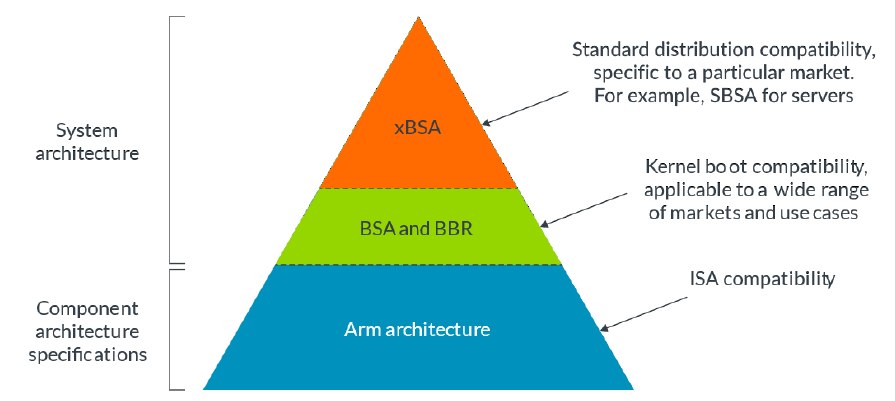
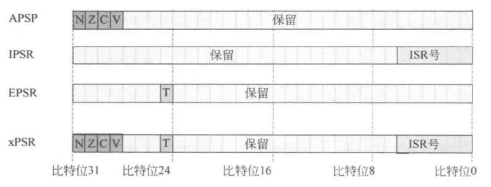

# Cortex-M0解读1【内核结构】

本系列博文旨在以计算机体系结构的角度剖析嵌入式应用中较常见的ARM Cortex-M0微架构，由于CM0是相对先进且*简单*的内核，所以选择了CM0作为切入点而不是常见的CM3/CM4

部分资料来源：何宾《ARM Cortex-M0全可编程SoC》、Joseph Yiu著 吴常玉 张淑 吴卫东等译《ARM Cortex-M0与Cortex-M0+权威指南》、ARM官方资料《AT510-BU-98000-r1p0-00rel0》（cortexm0_designstart工具包）、《DDI0432C-cortex_m0_r0p0_trm》（ARM Cortex-M0官方手册）

整套博文应当在读者具有计算机体系结构基础知识的情况下阅读，否则不容易形成连贯的感知。推荐没有计组基础的读者先去阅读胡伟武老师的[《计算机体系结构》](https://github.com/foxsen/archbase)。辅助阅读材料：Patterson、Hennessy的《计算机组成与设计：硬件/软件接口》

## 架构和微架构

在讨论ARM Cortex-M0之前，我们先回顾一下处理器架构、微架构的概念

> ARM处理器纷繁复杂，如果不提前说明讨论的是架构规定还是微架构实现，很容易造成误区

当使用处理器**架构**（Architecture）一词时，我们指的是处理器的功能规范：架构规定了处理器的行为方式，架构可以被理解为硬件和软件之间的接口（Interface）。它描述硬件应当为软件提供哪些功能实现，软件又应该怎样使用硬件。

一个处理器的架构往往在说下面这些事：

* 指令集如何编码：每条指令都应该怎样以二进制编码的形式存储在内存中
* 寄存器组织形态：处理器中有哪些寄存器，它们的功能和初始状态是什么
* 异常处理流程：处理器能够以什么权限怎样处理哪些异常，处理异常和从异常返回时会发生什么
* 存储器层次和存储模型：内存地址怎样分区，是否有Cache，它如何运行，软件如何维护这些内存
* 调试、追踪和性能评估：如何设置并触发断点，跟踪工具可以捕获哪些信息，采用什么格式存储或回报这些信息

其中最核心的就是*指令集如何编码*，我们称之为**指令集架构**（Instruction Set Architecture）或者说指令集体系结构

### 系统架构



如上图所示，**系统架构**（System Architecture）是一个比处理器架构（或者说处理器体系结构）更广泛的概念。处理器的架构位于系统架构的最底层，它提供了硬件和软件之间的接口规范，按照这个规范制造硬件意味着可以编写与之匹配的软件，换句话说软件可以在符合这个规范的硬件上运行。处理器架构通过ISA为软件提供通用的编程模型。

但这还远远不够。

我们期望操作系统能够运行在CPU上，从而简化用户操作，这需要确定**基本系统架构**（Base System Architecture，BSA）。BSA规范描述了操作系统软件可以使用的硬件结构，涵盖了中断控制器、定时器和操作系统需要的其他常用设备。而在一些复杂的应用中，操作系统需要一套固件（Firmware）以及Bootloader来进行加载，这又需要用到**基本启动要求**（Base Boot Requirements，BBR），它涵盖了固件接口要求和Bootloader软件要求。操作系统和上层程序可以直接使用这些要求规定的软硬件，比如PSCI、SMCCC、UEFI、ACPI、SMBIOS等。

基于BSA和BBR，可以针对不同的市场需求提供不同的标准化接口，比如SBBR/SBSA、EBBR/EBSA、LBBR/LBSA等

> 服务器基础系统架构（Server BSA，SBSA）是针对服务器的BSA，描述了服务器操作系统的硬件和功能要求；SBBR则制定了用于启动通用操作系统和管理程序的UEFI、ACPI、SMBIOS要求。想要让Windows、Ubuntu、VMware、RHEL这些操作系统运行在设备上就需要遵循这些标准并调用它们提供的接口

### 微架构

处理器架构是一个“软性的约定”，它只说明了如果想要设计一款处理器，让支持这个体系结构的机器码运行在处理器上需要满足的条件，并不说明处理器应该如何制造或如何工作——这些是**微架构**（Micro-Architecture）应当做的

事实上，我们所说的ARM Cortex-M0/M0+处理器是指这种微架构，它遵循的架构是ARMv6-M，并在其上做了一些变化

> 事实上不完全遵循架构的处理器也可能运行对应架构的代码，只需要考虑软件编程、编译、过程调用时出现的违例情况并加以处理即可

微架构讨论的是：

* 处理器的内核结构：遵循架构规范的内核寄存器设计，处理器流水线级数、是否具有超标量结构等
* 处理器包含Cache的层级、数量和大小：处理器是否包含Cache，包含几层Cache，每层Cache大小、结构、访问方式等
* 单独指令的执行时间：对应ISA中每条指令的执行流程和执行周期数是多少
* 处理器内还实现了哪些可选功能：是否包含FPU、DSP、MPU、MMU、安全模块等架构中说明自行选择的电路结构和功能

在下面以及后续的《CM0解读》博文中，笔者会着重着墨于CM0/0+的微架构，并穿插介绍ARMv6-M架构的设计。如果读者期望更多有关内核架构和其他处理器微架构的内容，推荐阅读ARM官网提供的规范手册，也可以先从[ARM提供的快速入门档案](https://developer.arm.com/documentation/102404/0201/?lang=en)开始

> [ARM架构学习指南界面](https://www.arm.com/zh-TW/architecture/learn-the-architecture/)包含了更多入门内容

## 内核结构概述

Cortex-M0处理器是ARM Cortex-M系列里面结构和功能最简单的处理器，基于32位**ARMv6-M架构**，**三级流水**（取指-译码-执行）；使用**冯诺依曼架构**（指令数据共享TCM）；支持绝大部分的16位**Thumb-1**指令和部分32位**Thumb-2**指令，一共包含**56条指令**；支持Cotrex-M系列内核常见的32位中断，并且支持**NMI**（不可屏蔽中断），提供低功耗休眠模式

> 下面所有内容中的Cortex-M0简写为CM0

CM0内核中包含**处理器核**、嵌套向量中断控制器（Nested Vector Interrupt Controller，**NVIC**）、调试子系统（**DAP**）、唤醒中断控制器（Wakeup Interrupt Controller，**WIC**）、**AHB-Lite**接口及**内核总线**


CM0内核包含三级流水线、寄存器组和特殊控制寄存器。官方只开源了寄存器组、特殊控制寄存器的代码还有一套标准的外设RTL，关于内核的三级流水是使用了门级网表开源，打开RTL文件后只能看到一坨经过混淆的逻辑门表达式，不过我们还是能从官方文档、第三方描述中推断出不少内核特征。

> CM0+内核则具有两级流水线，分别是取指+预译码级和后译码+执行级

NVIC用于管理外部中断，并向处理器核发出中断请求信号，可以用于处理32个中断请求，并额外处理一个NMI中断。NVIC能够自动处理嵌套中断（比较中断请求之间的优先级以及当前中断的优先级）。

总线系统用于处理内核内部握手交互，并连接了AHB-Lite接口单元，总线宽度固定为32位，总线系统还直接连接JTAG调试口，能够满足CoreSight调试架构的需求。DAP调试子系统提供调试控制、程序断点、数据监控点的功能，在产生调试事件时，它会将处理器核阻塞，开发者可以在此时调用查看处理器状态。

WIC唤醒中断用于低功耗应用，通过设置寄存器中的指定位来控制，启用后会将外设时钟关断、电源下电，当检测到发生中断后，WIC再通知PMU（电源管理单元）给系统上电，并恢复外设时钟，处理器恢复正常状态

### Register File寄存器组

CM0的RegFile结构如下所示


如上图所示，R0\~R12是**通用寄存器**。其中R0\~R7为低寄存器，这些寄存器可以被任何指令访问；R8~R12为高寄存器，一些Thumb指令不可以访问这些寄存器

R13寄存器是**堆栈指针**（**SP**，Stack Pointer）。堆栈中的**栈**（Stack）是内存中的一片固定区域，CM0的栈结构从高地址区域向低地址区域生长。当进行子程序跳转的时候，使用堆栈来保存上下文（现场保护、恢复现场）。SP用于记录当前栈顶的地址。入栈过程中，每有一个寄存器的数据被放入当前SP位置，SP都会随之**-4**；出栈中，每有一个寄存器数据被弹出，SP会随之**+4**


堆栈结构中的另一部分是**堆**（heap），这是在栈更高地址的一片区域，一般由用户程序或操作系统自行分配，堆是按照内存地址从低向高生长的。CM0为堆栈都预留了内存区域，在上面的内存映射部分已经提过

CM0中SP分为**MSP**（Main Stack Pointer，主堆栈指针）和**PSP**（Process Stack Pointer，进程堆栈指针）。MSP用于应用程序的特权访问（privilege access），一般来说嵌入式程序直接使用MSP而不使用PSP，MSP可以访问操作系统内核和异常句柄等关键区域；PSP不能执行异常句柄的跳转，这个指针在使用操作系统的情况下会应用于一般用户程序代码

> ARMv6-M架构有两个访问等级：特权和非特权。特权访问等级可以访问处理器内的所有资源，而非特权等级则存在一些存储器区域是无法访问的，并且有些操作无法执行。CM0没有非特权访问等级，所有操作都是特权的（CM0+中的非特权等级是可选的）

R15是**程序计数器PC**（Program Counter），记录了**当前运行的指令代码的地址**。在取指阶段，每个时钟周期PC自动+4（32位指令的情况）或+2（16位指令的情况）。在执行分支跳转指令的情况下，会将PC指向所要跳转到的地址，同时将当前PC值保存到**链接寄存器LR**（Link Register）中

R14就是链接寄存器，专门保存子程序或程序调用的返回地址。当程序调用结束后，LR中的值会被加载到PC。在后面的分支跳转部分会详细叙述这一过程

### SFR特殊控制寄存器（Special Function Register）

SFR有三个寄存器：xPSR、PRIMASK、CONTROL


xPSR是组合程序状态寄存器，实质上是三个寄存器，但CM0中可以通过相同的地址调用三个寄存器中的不同位——三个寄存器被映射到了同一个32位地址上

> 需要注意：这三个寄存器真的被映射成了同一个寄存器——xPSR在压栈时是作为一个整体进入栈的，返回时也会作为一个整体传回到三个寄存器对应位中
>
> CM0的官方实现中采用了如下代码
>
> ```verilog
> assign cm0_xpsr = {vis_apsr[3:0],3'd0,vis_tbit,18'd0,vis_ipsr[5:0]};
> ```
>
> 直接把这三个寄存器给合并成了一个
>
> 不过在内核中，它们就是三个寄存器，下面是官方实现进行例化的部分（例化的是内核模块）
>
> ```verilog
>   .vis_apsr_o           (vis_apsr[3:0]),
>   .vis_tbit_o           (vis_tbit),
>   .vis_ipsr_o           (vis_ipsr[5:0]),
> ```



三个寄存器分别是**APSR**应用程序状态寄存器、**IPSR**中断程序状态寄存器、**EPSR**执行程序状态寄存器

APSR（Application Program Status Register）用于指示ALU的关键计算结果，其中包含NZCV四个标志位

* **N**：**N**egtive负数指示。当ALU按有符号数字运算结果为负数时，该位置1；运算结果为正时，该位置0
* **Z**：**Z**ero零标志。当ALU运算结果等于0时，该位置1；运算结果不为0时，该位置0；如果两个数经比较后相等也会把该位置为1
* **C**：**C**arry进位标志。当无符号数加法产生无符号溢出情况下，该位置1；当无符号减法计算产生借位时，该位为借位输出状态取反
* **V**：o**V**erflow溢出标志。当有符号数加减法产生有符号溢出时，该位置1；否则置0

*几乎所有数据处理指令（R型指令）都会更改APSR，不过有些指令不会修改V、C标志位*，具体情况可以查看指令集资料

IPSR（Interrupt Program Status Register）用于保存当前正在执行中断服务程序（ISR）的**中断号**。CM0中每个异常都有自己的中断号，通过查看IPSR，调试时候可以知道正在执行的是哪一个中断

EPSR（Execution Program Status Register）中的T标志位用于指示是否处于Thumb状态。**CM0只支持Thumb状态，因此该寄存器中的T标志位恒为1**


PRIMASK寄存器又称为**IMSR中断屏蔽特殊寄存器**（Interrupt Mask Special Register），CM0中只有最低位PRIMASK标志位可用，**当该位置为1时，内核会屏蔽除了NMI不可屏蔽中断和HardFault硬件异常外的其他所有中断**

CONTROL寄存器中包含了一位用于定义堆栈的控制标志位，即`CONTROL[1]`，该位置1时，使用PSP进程堆栈指针；置0时，使用MSP主堆栈指针

> 如果你熟悉ARM的其他CPU，就会发现CONTROL寄存器里面好多位都消失了，这就是ARM为了简化和兼容所做的设计

### 取指

CM0的取指部分比较简单，因为只有少数几个B类（Branch分支跳转）指令可以在执行阶段影响PC，其他指令都需要经过3个机器周期（一个流水线时间）才能改变PC的值

因此PC=PC+4是最基础的结构，如果有跳转指令情况下，写回数据线会通过一个多路选择器连回PC

由于取值部分电路逻辑很简单，笔者猜测ARM应该会将一部分译码逻辑也放在了取指部分——一些比较容易分辨的指令，比如运算指令和访存指令，应该都会在这一阶段完成初步译码，从而平衡流水线长度

> CM0/CM0+处理器的取指有一个特殊点：一个周期内可以取到最多两条指令。因为Thumb指令集字长16位，PC为32位，正好可以容纳两条指令，这又在访存上提供了更优化的性能
>
> CM0/CM0+一般都通过AMBA协议规定的AHB总线发起访存（这里以访问程序存储器为例），AHB总线通过数据通道的HRDATA[31:0]传输数据，在第一个周期，CPU从AHB上取下HRDATA[31:16]作为指令，同时AHB总线挂起，不再访问内存；第二个周期，CPU从AHB上取下HRDATA[15:0]作为指令，AHB总线再次对内存发起传输。如此，可以节省一个周期的访存消耗

### 译码

由于CM0的RTL源码进行了混淆，因此很难通过官方手册推断出译码和执行两阶段的硬件实现

其中一段源码是这样的：

```verilog
assign X0w675 = (X6b775 ? vis_r2_o[7] : Z31775);
assign Q0w675 = (X6b775 ? vis_r2_o[1] : Lp0775);
assign J0w675 = (X6b775 ? vis_r2_o[0] : G41775);
assign C0w675 = (E7b775 ? vis_r3_o[31] : J21775);
assign Vzv675 = (E7b775 ? vis_r3_o[28] : C21775);
assign Ozv675 = (E7b775 ? vis_r3_o[7] : Z31775);
assign Hzv675 = (E7b775 ? vis_r3_o[1] : Lp0775);
assign Azv675 = (E7b775 ? vis_r3_o[0] : G41775);
assign Tyv675 = (L7b775 ? vis_r8_o[31] : J21775);
```

基本都是门级网表。CM0的译码阶段实际包含了**译码和预执行**

### 执行

根据推测，CM0的执行阶段包含了**后执行和访存**

> 在CM0+中，对流水线进行了修改，CM0和CM3的流水线都是3级，而CM0+的流水线是2级，从而降低CPU内部振荡器的数量，从而减少动态功耗
>
> 长流水带来的一个问题在于执行分支跳转指令时，分支跳转指令后面的一条乃至多条指令已经被取指、译码，在分支跳转指令执行为跳转时，将带来流水线冲刷从而影响性能，同样也会带来功耗增加
>
> 五级流水MIPS采用经典的分支延迟槽避免这个问题，超标量处理器使用完善的分支预测算法试图从根源上解决问题；低功耗ARM，也就是CM0+采用缩短流水的方式，用更低的频率为代价换取更低的功耗

### 操作模式和状态

ARMv6-M架构规定了两个操作模式和两个状态，同时还具有**特权**和**非特权**两种访问等级

为了区分应用程序代码和异常服务程序代码，ARMv6-M规定了**处理器模式**（Handler Mode）和**线程模式**（Thread Mode）。当CPU在线程模式下运行时，表明此时执行的程序是主应用程序，而CPU处于处理器模式，表示当前执行的是异常服务程序。

**当处理器在线程模式，它的访问等级可以是特权级也可以是非特权级；但线程模式下CPU必须拥有特权级访问**。特权级下，CPU能够访问所有范围的存储器（如果有MPU，还是需要满足MPU规定的访问域），并能够执行所有指令。显而易见，特权级下CPU拥有对片上资源的所有权限；但非特权级下，CPU的访存会受限。

> 这里隐含了一个特点：CM0如果从线程模式进入处理器模式，无论线程模式下拥有何种访问等级，都会临时地拥有特权等级，直到异常服务程序代码执行完毕，从处理器模式退出，这时CPU再切换原先的访问等级
>
> 结合之前说过的特权级下CPU可以任意修改CONTROL寄存器，我们不难发现可以利用这个特性让CPU在特权级和非特权级之间转换

从特权级切换到非特权级非常简单：只需要修改CPU的CONTROL寄存器；但线程模式非特权级下，CPU不允许访问CONTROL寄存器，因此需要更加繁琐的切换方式：CPU首先执行一条SVC系统调用，触发SVC异常，然后由操作系统接管的SVC异常服务程序进行判断，如果操作系统确认当前状态适合切换到特权等级，那么异常服务程序就会修改CONTROL寄存器，等到程序返回到线程模式，CPU就会重新拥有特权级的访问权限

> 这里隐含了另一个条件：需要操作系统介入。在裸机情况下并不需要切换CPU访问等级：访问等级主要是为了给操作系统的内核态和用户态提供分开的内存区域，防止用户态的程序对操作系统自身造成影响

容易理解，**异常是从非特权级切换到特权级的唯一途径**。

在一般程序执行时，处理器会采用**Thumb状态**，在这个状态下，处理器能够同时译码执行16位的Thumb指令和32位的ARM指令；对于更早的ARM7或ARM9处理器，需要使用CONTROL寄存器里的Thumb位来在Thumb状态和ARM状态进行切换，而ARMv6-M处理器不需要。ARMv6-M还支持**调试状态**，方便与调试组件对接。

我们上面一直在说ARMv6-M架构的情况，那么对CM0微架构是什么样的情况呢？答案是CM0只支持特权等级

## Memory存储器

### 端序

**端序**（Endian）是保存在存储器中的字节顺序，也称为字节序。一般分为大端（Big Endian）和小端（Little Endian）。**小端序是低址低字节，高址高字节**；**大端序是低址高字节，高址低字节**

二者差别如下图所示


每个字节内部都是从右往左的第0位到第7位

CM0同时提供了小端存储和大端存储的支持，并支持在软件层次上的端序虚拟化，也就是在软件上不需要考虑大小端这个概念

### 栈

CM0的栈结构是典型的**向下生长栈**：入栈过程中，每有一个寄存器的数据被放入当前SP位置，SP都会随之**-4**；出栈中，每有一个寄存器数据被弹出，SP会随之**+4**。栈从内存的高地址向低地址增加，因此我们吗往往将栈指针初始化到SRAM的上边界，最常见的初始化范围就是从`0x2000_0000`到`0x2000_7FFF`的空间，我们将栈指针初始化到`0x2000_8000`，第一次PUSH入栈后，地址变为`0x2000_7FFC`也就是SRAM区域的最高字

在一般的嵌入式软件中，我们会首先在bootloader开头设置MSP的初值（PSP初值未定义，只能由软件初始化），随后可以在C启动代码执行期间（main函数内）设置SP，利用这样的机制，我们可以让系统在启动时让SP先指向SRAM的一小片区域，之后再外部存储器初始化完成后在为栈定义更大的外部存储器空间

### 寻址模式

在指令集中用于指示内存地址并让寄存器能够对应地址访存的技术称为**寻址模式**。CM0的指令集支持以下寻址模式：

* 寄存器直接寻址：向指令传入两个寄存器，一个寄存器保存的数据作为寻址地址，访存得到的数据保存到另一个寄存器中
* 寄存器间接寻址：向指令传入三个寄存器，一个寄存器保存的数据作为基地址，一个寄存器保存数据作为偏移地址，二者相加得到访存地址，访存得到的数据保存到第三个寄存器中
* 立即数偏移量寻址：给指令传入两个寄存器和一个立即数，将其中一个寄存器中的数据作为基地址，立即数作为偏移地址，对`基地址+偏移地址`访存，得到数据存入另一个寄存器
* 变址寻址：使用有符号的立即数，将两个寄存器和一个立即数传入，其中一个寄存器中的数据作为基地址，立即数作为偏移地址，对`基地址+偏移地址`访存，得到数据存入另一个寄存器，访存后作为基地址的寄存器中的内容会被修改为`基地址+偏移地址`的值

### 存储器空间映射

CM0是典型的32位CPU，提供了4GB的存储器寻址空间，分配如下图所示

> 虽然ARM规定了寻址空间分配，但用户可以根据具体要求灵活定义存储器映射，在软件上加以修改即可
>
> 不过并不推荐这样做，因为大多数上层软件都是基于ARM推荐的寻址空间分配设计，如果硬要修改可能会面临兼容性问题


我们从下往上（低地址到高地址）说。

最下面是**代码段**，用于保存程序代码，也常用于存储静态数据。这一部分的存储设备由ITCM、片上Flash等非易失存储器（NVM，Non-Volatile Memory）组成，但也可以存储数据，大小为512MB。**SRAM段**顾名思义，由DTCM、片上SRAM、SDRAM等易失性存储器承担，用于保存程序运行时数据。*堆栈就在这一段内*。该段大小也为512MB。**外设段**用于外设访问，一般MCU的片上外设寄存器都会被映射到这个区域内，大小为512MB，CPU通过AHB/AHB-Lite、APB总线来访问外设（需要注意：CM0不支持AXI总线，当然支持了也没啥用，CPU主频太低根本用不着高性能总线），该段的数据不允许被当作指令执行。**外部RAM段**的大小为1GB，可以用于保存大的数据块作为存储器高速缓存——这部分的物理设备一般由片外的SDRAM、DDR、Flash承担，但是也不排除有些特殊需求的设备在片上集成这些东西作为L2 Cache使用。访问外部RAM段一般需要消耗较长时间，因为这部分存储器（也称为片外存储器*Off-chip Memory*）需要借助AHB总线进行访存，甚至要通过板级总线连接到遥远的另一个芯片。此段还能够用于LCD显示，也就是我们常说的“显存”，当然这需要片上外设的支持。**外部设备段**同样有1GB的空间用于映射片外的设备，最常见的用途就是连接SD卡或者eMMC，这一段数据不允许执行，这是与外部RAM段最大的差别。**私有外设总线**（PPB，Internal Private Peripheral Bus）**段**专用于内核，大小仅为1MB，并且这段内的数据不能被执行。CPU核通过PPB连接到内核外设，PPB有一套独立的存储空间，被称为**SCS系统控制空间**，只有内核能够访问，外设（DMA等）是不能读取的，不过地址确实被映射到了图示位置。这一段分类比较细，我们挨个说。

该部分地址被细致地分出了不少*保留段*，这些部分地址通常被用于跳转指令或是其他特殊指令的触发。除了保留段外，首先能看到用于调试的*断点单元*和*数据监视点单元*，这两个部分都是给系统DAP提供。*ROM表*也是用于调试的组件，它提供了外设是否挂载到内核的依据。详细内容可以参考https://www.cnblogs.com/dac1bw2zkx3/p/10466562.html。SCS中映射了*NVIC*和*SysTick内核定时器*的寄存器地址，这两个是CM系列内核必备的东西，不多赘述，后面的异常处理和面向RTOS部分会涉及到这两个关键内核外设。**SCB系统控制块**则是内核编程中最重要的部分，相当于CPU的配置寄存器，更改SCB可以调整CPU的工作状态

处于寻址空间顶部的是**保留存储器空间**，大小511MB，这段空间为某些CPU状态控制和片上电路状态控制提供便利。
