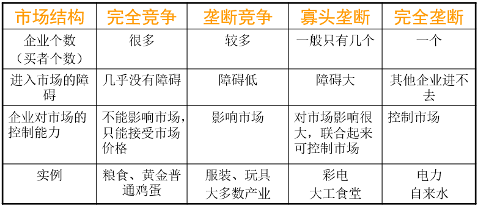
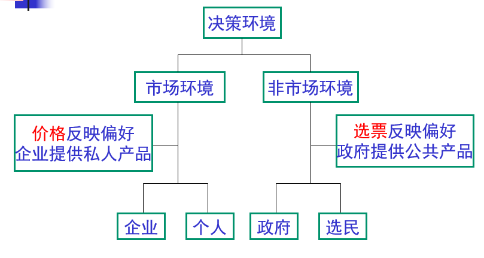

# 西方经济学基础4【市场失灵和宏观调控】

根据福利经济学理论，存在两个基本定理：

**福利经济学第一定律**：经济主体的偏好被良好定义的条件下，带有再分配的价格均衡都是帕累托最优的。作为其中的特例，任意的市场竞争均衡都是帕累托最优的。

**福利经济学第二定律**：在完全竞争的市场条件下，政府所要做的事情是改变个人之间禀赋的初始分配状态，其余的一切都可以由市场来解决。

第一定律说明市场竞争可以使得贸易利益达到最大，也就是说**竞争市场是有效的**；第二定律则说明**每一种具有帕累托效率的资源配置都可以通过市场机制实现**。两个定律都是在描述“*市场是一只看不见的手*”的理论

在开始这一部分前，先要介绍几个基本概念

* 消费者剩余：消费者愿意支付的价格与实际支付的价格（市场价格）的差额
* 生产者剩余：市场价格与生产者愿意接受的价格的差额
* **社会福利**（Social Welfare）：产者剩余与消费者剩余之和
* **市场失灵**（Market Failure）：市场对资源的配置没有达到帕累托最优

## 市场失灵

当满足*发生垄断与不完全竞争*、*外部性*、*公共物品*、*信息不对称*这四点中某一点或某几点时，市场失灵就很容易发生。市场不是万能的，政府管制是必要的——**“看不见的手”必须与“看得见的手”相结合**

下面将分别介绍

### 垄断

垄断指的是市场上只有一个厂商；不完全竞争包含两种情况：寡头垄断和垄断竞争，二者都描述了这样的状态：少数一些厂商由于将生产资源牢牢占有，导致其具有一定控制价格的能力，也就是俗称的“店大欺客”现象，而在垄断的情况中，厂商将有能力完全掌握产品的市场价格

下图展示了垄断的分类

垄断常常在下面这些条件下产生：、政府特许经营、政府许可证制度、唯一的一个企业拥有并控制了某种矿藏或资源的供给、公司掌控了某个独有的专利、对生产某些产品的特殊技术的控制、控制行业标准、规模经济导致的自然垄断（由一家企业提供某种产品的成本要低于多家企业提供，电力、煤气、水）

垄断带来的问题

1. **导致社会福利损失**
2. 损害消费者自由
3. 内部效率低下
4. 缺乏竞争压力，进行技术创新的激励不足

其中第四点在某种程度上也可以转变为“有较高的利润进行技术研发”的优点，不过这种优点不常发生

总体上讲垄断是利大于弊的，因此政府需要设置反垄断法律法规来防止垄断扰乱市场秩序

### 外部性

**外部性**：没有在正常的价格中反映的一个经济活动者对其他活动者的影响

外部性分为正外部性和负外部性，环境保护就是一个正外部性的体现；污染则是负外部性的体现。市场配置资源有效性的一个*假定是经济主体承担自身行为带来的所有成本并享有其创造的所有收益*，当这一条件不能满足（即存在外部性）时，市场就会失灵

**正外部性往往会引起供给不足，负外部性则会引起过量供给**

*征税*、*最优权交易*、*产权界定*、*规制(强制手段)*这四点就是最常用来解决外部性的手段，以污染这个负外部性为例，征收污染治理税、界定排污处产权都可以让企业因为利益受损而放弃排污，从而将因为排污而多获取的产品利润削减掉；最优排放和排污权交易可以让企业之间自行解决排污带来的过量供给；规制则表示对排污过量的企业（及其法人代表、股东等）进行罚款、刑罚，从而让企业的管理人员重视排污问题

**征税的实质是加大企业的边际成本，使它等于社会的边际成本，从而降低产量**，政府在这个过程中负责确定税率，严格征税

最优权交易是指**政府确定一个社会最优的排污水平（这个水平是环境自净能力可以承受的），将允许排放的污染量（排污权）分配给每个企业；污染少的企业可以将这个权利转卖出去，污染多的企业可从其他企业手中购买排污权，形成排污权交易市场**，这样每个企业都有减少污染的激励，因为可以通过转卖排污权获取收益或者节省购买排污权的资金，将激烈的外部矛盾转化为缓和的内部矛盾，从而消解排污带来的种种问题。政府需要在这个过程中负责确定最优排放量，分配排污权（可以拍卖），严格执行最优排污量

根据**科斯定理**：在没有交易成本的情况下，一旦产权得以配置，市场可以在没有政府直接干预的情况下解决外部性问题，**产权明确界定能保证有效率的结果出现**

> 科斯定理的另一种表述：没有交易成本时，只要产权界定清晰，潜在使用者之间的讨价还价将确保有效率的结果。因此能解决外部性问题
>
> 科斯定理隐含了两重意思：
>
> 1. 产权分配给谁对效率没有影响，但对财富分配有影响
> 2. 当交易成本不为零时，最初产权给谁很重要
>
> 在实际情形中，交易成本总是存在的，**政府应该将产权给予合适的人，才能实现有效率的结果**

在这个过程中，政府应负责*清晰界定产权*、*将产权分配给合适的人*、*通过公正、透明的司法维护产权神圣不可侵犯*

**公共物品：政府（公共部门）提供的供所有人共同消费的产品和服务**，它们存在两种区别于一般商品的不同性质：

**非竞争性**：一般的商品具有稀缺性——数量有限，如果想要的人增多，将出现竞争，价格被抬高；但公共物品不具有这一情况——即使需求人数再多，政府公共部门会保障物品的供应，不会出现“供不应求”的状况

**非排他性**：个人购买商品的行为等效于所有权的转让，其他人不再具有商品的所有权——私有财产神圣不可侵犯；但在一个人没有被驱逐出国家社会之前，总能够获取公共物品，谁都无法排除——公共财产的所有权归属于每个国家公民

但是不同公共物品非竞争性和非排他性的程度不一

> 一般的公路具有非排他性，当发生拥挤时，具有竞争性
>
> 收费的高速公路具有排他性，在没出现拥挤之前，具有非竞争性

公共产品的非排他性导致“搭便车”困难，人们会压低显示其真实的支付意愿，因而公共物品不能采用通常的市场机制获得有效配置

我们可以得到三个结论：

1. “搭便车”问题存在时，需要政府公共部门提供公共物品

    公共物品由政府供给，但不一定由政府自己（国有企业）生产，政府可以购买私营企业的产品；准公共物品可以由政府和私营企业联合提供，比如收费的高速公路，此时政府的目的是维护公共利益，私营企业的目的是获取利润

2. 政府的特征是具有强制性权力，因而有可能超越“搭便车”困难

    政府提供公共物品带来的市场失灵问题必须由政府的政策解决

3. 向社会有效提供公共物品是政府公共部门的一个基本职责

    利用政府采购私营企业产品或者联合提供公共产品的方式有利于解决政府财政资金不足的问题，增加公共物品的供给

**信息不完全：交易中的一方或双方并不掌握有关商品质量或价格的全部信息**

**信息不对称：交易双方对于交易对象的信息掌握和了解程度不同**

在商品市场上消费者和厂商完全了解他们各自偏好和效用函数、成本函数以及市场价格信息，或者可以不费任何成本获得这些信息；完全信息条件使得市场参与主体总是能够寻找到对他们最有利的交易对象和交易条件，因而保证了竞争的完全性。但**实际经济生活中存在不同程度的信息不完全和不对称情况**，这就会导致市场失灵

信息不对称或不完全将会导致两种结果：

1. **逆向选择**

    保险公司通过提高保险价格，筛选出富有的、驾驶技术和可靠度高的人群购买其保险，从而降低自己亏损的几率；二手市场上“劣币驱逐良币”的情况都属于逆向选择

2. **道德风险**

    保险公司面临着人们松懈责任，采取“不道德”的行为而引致损失的风险，这被称为道德风险。利用消费者对产品的无知进行欺骗、政府官员腐败、经理人员挥霍企业钱财等情况也都属于道德风险

    与逆向选择不同，*信息不对称*、*责任不对等*、*激励不相容（目标不一致）*都会导致道德风险

**诚信是市场经济的基石**，市场经济是平等主体之间的交易，是制订并执行契约的过程。制订和执行契约要发生**交易成本**，包括信息搜寻成本、谈判成本、缔约成本、监督成本以及处理违约行为发生的成本。而交易成本过高将限制交易的进行；反之，交易成本低，则交易活跃，一方面有利于交易双方从交易中共同获益；另一方面有利于资源迅速流动，经济效率不断提高，促进经济增长。在这之中的诚信就是向交易的另一方始终提供真实的信息，从而让对方认为与你进行交易的“道德风险”较低，收集信息、谈判、监督的成本低，违约可能性小，总之交易成本较低，因此更愿意与你进行交易

**诚信的市场环境降低所有企业的交易成本，有利于经济增长**

政府在管理信息不对称问题中需要尽到*促进信息披露*，*降低收集信息的成本*的义务。通过以下几种方式可以一定程度上建立诚信市场：

1. 建立信息披露制度
2. 政府披露市场信息
3. 打击虚假广告等不真实信息
4. 建立企业和个人信用档案，降低企业收集信息的成本

## 宏观调控

由于市场不是万能的，政府需要尽到规范市场、防止市场失灵的责任，因此引入政府的**微观管制**

微观管制即**以效率为目标纠正市场失灵、以公平为目标再分配收入、以稳定为目标进行宏观调控**

政府可以选择下面几种方式及其组合进行微观管制：

1. 采取直接行动——国有化、购买企业自己生产
2. 为私人部门提供激励——补贴企业（直接补贴或税收优惠）、征税
3. 强令私人部门

不过政府也不是万能的，在下面的情况中往往会发生**政府失灵**

* 不完全信息
* 激励问题
* 市场和私人部门的反应难以预料

### 避免寻租

**寻租**是个人或利益集团为了牟取自身经济利益对公共决策或政府官员施加影响的活动。这是一种非生产性的活动，经济学家们把寻租行为称为人类社会的“负和游戏”，即一场就社会整体而言损失大于得益的游戏。从整个社会来看，寻租成本并不能通过租金收益得到补偿，也称之为“**租金消散**”。

政府或政府官员利用行政干预的办法来增加私人企业的利润，人为地创造租金，诱使企业向他们支付报酬来作为得到这种租金的条件 ，称为“**政治创租**” 。政府官员故意提出某项会使私人企业利益受损的政策作为威胁，迫使私人企业割舍一部分既得利益与政府官员分享 ，称为“**抽租**” 。

寻租是一种很不利于市场自由和国家经济发展的行为，需要尽力避免。**民主政治、公众参与**这两种方式可以减少寻租

在西方政治制度中，存在下面的逻辑关系

### 宏观调控

